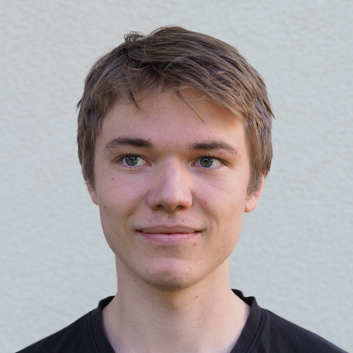

## R u Ready? Reproduzierbare Datenaufbereitung und -analyse mit R

HS 2026<br><br><br> **Seminarleitung**: Dr. Sandra Grinschgl<br> **Leitung beider Seminargruppen:** MSc. Laura Hirt<br> **Tutor**: BSc. Jan-Pierre Pahnke<br><br><br>**1. Einheit**, 16.09.2026

{fig-align="center" width="306"}

<br>

------------------------------------------------------------------------

## Programm heute

**Leitfrage:** Wie komme ich von einer Forschungsfrage zu einem reproduzierbaren Ergebnis in R?

<br>

1.  Kennenlernen & Organisatorisches

2.  Ziel und Aufbau des Seminars

3.  Unser gemeinsames Forschungsprojekt

4.  Der Datenanalyse-Workflow

5.  R, RStudio & erste Coding Basics

6.  Hands-on

7.  Bedarfsanalyse & Ausblick

------------------------------------------------------------------------

## Seminarleitung

::::: columns
::: {.column width="70%"}
### *Dr. Sandra Grinschgl*

-   Seminarleitung

-   Arbeitsbereich Psychologie der Digitalisierung

-   Fabrikstrasse 8, Raum D 262

-   sandra.grinschgl\@unibe.ch

-   Sprechstunde nach Vereinbarung
:::

::: {.column width="30%"}
{fig-align="center" width="200"}
:::
:::::

------------------------------------------------------------------------

## Leitung beider Seminargruppen

::::: columns
::: {.column width="70%"}
### *Laura Hirt, MSc. Psychologie*

-   Lehrassistenz R you Ready

-   Methodenberatung

-   Fabrikstrasse 8, Raum A 263

-   Sprechstunde/Methodenberatung nach Vereinbarung

-   laura.hirt\@unibe.ch
:::

::: {.column width="30%"}
{fig-align="center" width="332"}
:::
:::::

------------------------------------------------------------------------

## Tutor

::::: columns
::: {.column width="75%"}
### *Jan-Pierre Pahnke, BSc. Psychologie*

-   Tutor R you Ready

-   Unterstützung bei Hands-on-Übungen

-   Fabrikstrasse 8, D266

-   Sprechstunde nach Vereinbarung

-   jan-pierre.pahnke\@unibe.ch
:::

::: {.column width="25%"}
{fig-align="center" width="240"}
:::
:::::

------------------------------------------------------------------------

## Kurze Vorstellungsrunde

**Wenn ihr mögt...**

-   Name

-   Wo stehst du ungefähr im Master/Schwerpunkt?

-   Warum hast du dieses Seminar gewählt?

-   Was würdest du am Ende dieses Seminars gerne selbstständig können?

-   Wie würdest du deine aktuelle Beziehung zu R in einem Wort beschreiben?

-\> Ihr entscheidet selbst, wie viel ihr erzählen möchtet!

::: notes
Namensschilder austeilen, welche sie mit ihrem Vornamen (oder so, wie wir sie nennen sollen) beschriften sollen. Diese sollen sie jeweils am Ende der Stunde wieder bei uns abgeben, damit sie sie nicht jedes Mal mitnehmen müssen. So machen wir auch direkt die Anwesenheitskontrolle.

Wir machen einmal eine kurze Runde, damit wir zumindest schon Namen und Gesichter ein bisschen zuordnen können. Ihr müsst natürlich nicht alle Fragen beantworten - sagt einfach so viel, wie ihr möchtet. Wir werden später im Semester noch genug Zeit haben, uns beim gemeinsamen Arbeiten besser kennenzulernen. Auch werdet ihr ab nächster Woche oft in Zweier-Teams arbeiten.
:::

------------------------------------------------------------------------

## Barrierefreiheit!

Bitte melde dich auf einem für dich passenden Weg bei uns, wenn dir in dieser Lehrveranstaltung Barrieren begegnen, die auszugleichen sind.

[{fig-align="center"}](https://www.unibe.ch/unibe/portal/content/e1006/e1061/e106351/e1427734/UniBE_Icon_001_ger.png)

------------------------------------------------------------------------

## Miteinander im Seminar

Bitte gebt uns auch Bescheid, falls wir euch falsch ansprechen!

{fig-align="center" width="45%"}

Wir hoffen es ist für alle in Ordnung, wenn wir uns Duzen!

------------------------------------------------------------------------

## Organisatorisches

-   📅 **14 Termine**, immer mittwochs

-   🕝 Gruppe 1: **10:15 (Raum B 102)**

-   🕝 Gruppe 2: **16:15 (Raum B 101)**

-   💻 Eigener Laptop mit RStudio erforderlich

-   📚 Materialien auf Kurswebseite & ILIAS

-   🛫 Maximal 2 unentschuldigte Fehltermine

::: notes
Keine Pause - Selbstständig wenn nötig.
:::

------------------------------------------------------------------------

## Wo finde ich was?

**Kurswebseite**

-   Präsentationen

    -   Auch als PDF verfügbar (PDF-Mode -\> Download über "Drucken")

-   Hands-on-Übungen & R-Hausübungen

-   Musterlösungen

-   FAQ / Resultate Muddiest Points

-   Ressourcen & Cheat Sheets

**ILIAS**

-   Downloads

-   Abgaben & Umfragen

-   Peer-Feedback & Forum

------------------------------------------------------------------------

## Worum geht es in diesem Seminar?

<br><br>

**Wir beantworten eine empirische Forschungsfrage reproduzierbar - von der Planung über die Rohdaten bis zum berichteten Ergebnis.**

<br>

{fig-align="center"}

R ist unser Werkzeug; der Forschungsprozess gibt die Struktur vor.

::: notes
Warum diese Perspektive?

Was macht Datenanalyse oft schwierig? Nicht unbedingt nur die Statistik. Häufiger sind Fragen wie:

-   Wo beginne ich?

-   Was muss ich mit meinen Rohdaten machen?

-   Welche Variable brauche ich für meine Fragestellung?

-   Wo gehört welcher Code hin?

-   Wie weiss ich, ob meine Daten jetzt wirklich analysebereit sind?

-   Welchen Schritt mache ich als nächstes?

-\> Wir arbeiten in diesem Seminar mit einem vollständigen Projektworkflow.
:::

------------------------------------------------------------------------

## Unser Weg durch das Semester: Überblick

Ein Forschungsprojekt, sechs Phasen:

<br>

{width="65%" fig-align="center"}

**Reproduzierbarkeit** begleitet uns durch alle Phasen!

------------------------------------------------------------------------

## Unser Weg durch das Semester: Details

<br>

{width="65%" fig-align="center"}

Diese Übersicht wird uns das ganze Semester begleiten.

::: notes
Wir befinden uns momentan in der ersten Phase der Orientierung. Wir werden heute also noch keine Daten aufbereiten und auch keine ANOVA rechnen.

Heute geht es darum, das Ziel zu kennen, den Workflow zu verstehen, die Arbeitsumgebung kennenzulernen und die ersten Werkzeuge auszuprobieren.
:::

------------------------------------------------------------------------

## Ein Paper begleitet uns durch das Semester

::::: columns
::: {.column width="70%"}
**Grinschgl et al. (2021)**

*From metacognitive beliefs to strategy selection: does fake performance feedback influence cognitive offloading?*

Im Semester werden wir Schritt für Schritt:

-   **ORIENTIEREN:** Fragestellungen & Hypothesen verstehen

-   **PLANEN:** Datenanalyseplan für das Paper erstellen

-   **ORGANISIEREN:** 7 Rohdatensätze; Projektstruktur aufbauen & Codebook erstellen

-   **AUFBEREITEN:** Rohdatensätze importieren, mergen und transformieren

-   **ANALYSIEREN:** Deskriptiv- & Inferenzstatistik

-   **INTEGRIEREN:** Umfassendes Forschungsprojekt
:::

::: {.column width="30%"}
{fig-align="center" width="350"}
:::
:::::

::: notes
Wir machen nicht alles auf einmal. Jede Woche kommt genau der nächste notwendige Schritt hinzu.

Wir arbeiten das ganze Semester hinweg mit denselben Originaldaten dieses Projekts. Dadurch müsst ihr nicht jede Woche gleichzeitig einen neuen Datensatz, eine neue Forschungsfrage, neue Variablen, neue R-Funktionen und eine neue statistische Methode verstehen. Stattdessen haben wir ein Projekt, dass wir Schritt für Schritt weiterentwickeln. Das hilft euch dann, bei eurer Masterarbeit genau gleich vorzugehen.
:::

------------------------------------------------------------------------

## Wo wollen wir am Semesterende sein?

**Am Ende des Seminars...**

erhaltet ihr individuell simulierte Rohdatensätze zur Grinschgl-Studie.

Dann führt ihr selbstständig den Workflow durch, den wir im Seminar Schritt für Schritt gemeinsam erarbeiten:

-   Forschungsfragen & Datenanalyseplan nutzen

-   Projektstruktur & Codebook führen

-   Rohdaten importieren, zusammenführen & aufbereiten

-   Analysevariablen erzeugen & Daten prüfen

-   Daten beschreiben & visualisieren

-   geplante Analysen durchführen & interpretieren

-   Ergebnisse reproduzierbar dokumentieren

<br>

**Ihr sollt nicht alles auswenig wissen, sondern den Analyseprozess selbstständig und systematisch durchführen können.**

------------------------------------------------------------------------

## Was das Seminar nicht leisten kann

-   Keine vollständige Wiederholung der Statistikvorlesungen

-   Kein "Kochbuch" für jede mögliche Masterarbeit

-   Keine vollständige Abdeckung aller R-Funktionen & statistischen Modelle

<br>

**Aber:**

Wir wollen euch einen stabilen Workflow und Werkzeugkasten geben, mit dem ihr neue Herausforderungen wesentlich selbstständiger angehen könnt.

------------------------------------------------------------------------

## So läuft eine typische Einheit ab

<br>

::::: columns
::: {.column width="50%"}
#### 💬 Input (ca. 45 Minuten)

Einen Schritt im Forschungsprozess verstehen:

-   Wo stehen wir?

-   Was fehlt unserem Projekt?

-   Was lernen wir heute?

-   Welches Konzept oder R-Werkzeug brauchen wir dafür?
:::

::: {.column width="50%"}
#### 💻 Hands-on in R (ca. 45 Minuten)

Das Gelernte direkt anwenden:

-   Übungen am Datensatz

-   Gemeinsam ausprobieren & im Team arbeiten

-   Fragen stellen

-   Ergebnisse prüfen & besprechen
:::
:::::

\
**Das Seminar ist interaktiv:** Mitdenken, Mitmachen & Fragen stellen sind ausdrücklich erwünscht!

------------------------------------------------------------------------

## Semesterplan

::: {style="width:100%; height:80vh; background:#777; padding:20px; box-sizing:border-box; border-radius:10px; overflow:auto; "}
```{=html}
<embed
    src="../../PDFs/Semesterplan_HS26.pdf#view=FitH&navpanes=0&toolbar=0"
    type="application/pdf"
    style="width:100%; height:220vh; border:0; display:block; background:white;"
  >
```
:::

------------------------------------------------------------------------

## Leistungsbeurteilung

-   **Mitarbeit:** 14 Punkte

-   **Begleitende Hausübungen:** 8 Abgaben; insgesamt 32 Punkte

-   **Abschlussprojekt:** 54 Punkte

    **-\> Total 100 Punkte**

-   Genauere Informationen zum Leistungsnachweis hier: [Webseite](https://r-you-ready.github.io/Webseite_HS26_Seminar/scripts/04_misc/leistungsnachweis.html)

<br>

**Arbeitsaufwand**

5 ECTS

≈ 125 Stunden

≈ 9 Stunden/Woche

**-\> Kontinuierliche Arbeit während des Semesters!**

::: notes
Das hört sich erstmals nach sehr viel Aufwand an. Zu diesen 9 Stunden gehören aber die Präsenzzeit, individuelle Vor- und Nachbereitungen, Hands-on Übungen, die Hausübungen und die Abschlussarbeit.

Aus meinen Erfahrungen und aus Erfahrungen von letztem Semester aber berichten, dass diese Zahl sehr hoch ist und 4 Stunden realistischer sind.
:::

------------------------------------------------------------------------

## Leistungsnachweis: Mitarbeit (14 Punkte)

... kann unterschiedlich ausfallen, zum Beispiel:

-   Wortmeldungen im Plenum

-   Aktive Teilnahme an den Hands-on Sessions

-   Beteiligung am Online-Forum & Error Hunt

**Punktevergabe:**

-   7 Punkte durch Seminarleitung

-   7 Punkte durch Selbstevaluation am Ende des Semesters

------------------------------------------------------------------------

## Leistungsnachweis: Hausübungen (32 Punkte)

-   8 Hausübungen (je 4 Punkte)

-   Bewertungsrelevant: Auseinandersetzung mit dem Stoff/den aufgetragenen Aufgaben

-   Korrektheit zweitrangig

::: notes
Bei Problemen die ihr nicht lösen könnt und keine Ressourcen findet, könnt ihr euch auch ans Forum wenden und eure Frage posten.
:::

------------------------------------------------------------------------

## Leistungsnachweis: Abschlussprojekt (54 Punkte)

-   Reproduktion zentraler Analysen von Grinschgl et al. (2021) mit individuell simulierten Rohdatensätzen

-   Datenanalyseplan überarbeiten/ergänzen

-   Kontinuierliche Führung/Überarbeitung eines Codebooks

-   Reproduzierbare Datenaufbereitung und Analyse mit Quarto

**Abgabe:** Datenanalyseplan, Codebook, Datenfiles, Analyseskripte nach vorgegebener Ordnerstruktur

**Deadline: 10.01.2027**

-\> Weitere Informationen im Verlauf des Semesters

------------------------------------------------------------------------

## Warum R?

**Warum arbeiten wir mit R?**

-   kostenlos & Open Source

-   weit verbreitet in Forschung & Data Science

-   **reproduzierbar:** dieselben Schritte können erneut ausgeführt werden

-   **transparent:** Analyseschritte sind im Code sichtbar

-   **flexibel:** Datenaufbereitung, Statistik & Visualisierung in einer Umgebung

-   **automatisierbar:** wiederkehrende Schritte müssen nicht manuell durchgeführt werden

<br>

**-\> R macht unseren Analyseweg nachvollziehbar & reproduzierbar!**

------------------------------------------------------------------------

## Fehlerkultur: Trial & Error gehört dazu

**Beim Arbeiten mit R werden wir...**

-   Fehlermeldungen bekommen und Code schreiben, der nicht sofort funktioniert

-   Dinge ausprobieren, verändern und erneut testen

-   Nachschlagen und Hilfe suchen

-   Fragen stellen und voneinander lernen

<br>

**Das ist normal - und Teil des Lernprozesses!**

::: notes
Wir sind hier, um Fehler zu machen. Auch bei uns ist vieles Trial-und-Error.

Das darf und soll auch so sein! Auch wir kennen nicht jeden R-Befehl auswendig und müssen regelmässig nachschlagen oder verschiedene Lösungen ausprobieren.

Bei den Hausübungen sind Fehler erlaubt. Entscheidend ist, dass ihr euch aktiv mit den Aufgaben, Materialien und eurem Code auseinandersetzt. Ist dies ersichtlich, erhaltet ihr trotzdem die Punkte!
:::

------------------------------------------------------------------------

## Unterstützung im Semester

**Wenn ihr nicht weiterkommt...**

<br>

::::: columns
::: {.column width="50%"}
**Selbst prüfen**

-   Fehlermeldungen lesen

-   Code schrittweise ausführen

-   Unterlagen/Cheat Sheets nutzen

<br>

**Ressourcen nutzen**

-   Kurswebseite

-   Bachelor-Unterlagen

-   Online-Ressourcen/KI
:::

::: {.column width="50%"}
**Andere fragen**

-   Peer-Partner:in & Online-Forum

-   Sprechstunde für "R Troubles" mit Jan-Pierre

    -   vor/während/nach den Einheiten + bei Bedarf

<br>

**Unsicherheiten sichtbar machen**

-   3x Muddiest Points während des Semesters

-   Sprechstunde/Methodenberatung
:::
:::::

------------------------------------------------------------------------

## Hands-on: Erste Schritte in R (1)

Heute geht es bewusst nur um die Grundlagen:

1.  R & RStudio installieren und ggf. updaten

2.  RStudio öffnen & die Oberfläche kennenlernen

3.  Skript erstellen

4.  Einfache Rechnungen ausführen

5.  Objekte erzeugen

6.  Funktionen anwenden

7.  Vektoren erstellen

8.  Erste Daten anschauen

**Wichtig:** Die Übungen müssen heute nicht fertig sein! Wir arbeiten immer 2 Wochen an denselben Übungen weiter.

-\> Die Übung ist auf der [Webseite](https://r-you-ready.github.io/Webseite_HS26_Seminar/scripts/02_excercises/loesung_1.html) zu finden

::: notes
Wichtig ist, dass niemand heute "R können" muss! Ziel ist es, dass R und RStudio heute bei allen installiert sind und laufen und RStudio am Ende der Sitzung weniger fremd aussieht als am Anfang.
:::

------------------------------------------------------------------------

## Hands-on: Erste Schritte in R (2)

**So arbeiten wir:**

-   Im eigenen Tempo, nicht stressen lassen

-   Code selbst ausführen

-   Ausprobieren

-   Fehlermeldungen lesen

-   Sitznachbar:innen fragen

-   Jan-Pierre & Laura jederzeit fragen

**Für Schnellere:**

-   Zusatzaufgaben

-   Bedarfsanalyse beginnen (ILIAS, Einheit 1)

-   Code verändern und beobachten, was passiert

------------------------------------------------------------------------

## Bedarfsanalyse

**Damit wir wissen, wo ihr startet...**

Bitte reflektiert:

-   Wie sicher fühle ich mich aktuell mit R/RStudio?

-   Welche Schritte der Datenaufbereitung/ -analyse kenne ich bereits?

-   Wo verliere ich den Überblick & was bereitet mir Mühe?

-   Welche Unterstützung hilft mir beim Lernen?

Die Bedarfsanalyse dient dazu:

-   Vorkenntnisse zu erfassen

-   Unterstützungsbedarf zu erkennen

-   Schwerpunkte & Wiederholungen anzupassen

-   Peer-Pairing vorzubereiten

-\> Umfrage in ILIAS, Deadline: **Sonntag 20.09.26, 23:55**

------------------------------------------------------------------------

## Heute & nächste Woche

**Heute**

Wir haben...

-   den Gesamtworkflow kennengelernt,

-   das gemeinsame Forschungsprojekt eingeordnet,

-   gesehen, wie das Semester aufgebaut ist,

-   erste Schritte in R gemacht.

<br>

**Nächste Woche:**

Bevor wir mit den Daten arbeiten, müssen wir wissen, welche Frage wir beantworten wollen.

-\> Open Science, Forschungsfragen, Hypothesen & Datenanalyseplan

------------------------------------------------------------------------

## Bis nächste Woche!

-   Bedarfsanalyse auf ILIAS (Sitzung 1) bis So, 20.09., 23:55 ausfüllen

-   Paper von Grinschgl et al. (2021) lesen/überfliegen

    {width="268"}

------------------------------------------------------------------------

## Methodenberatung

[Methodenberatung](https://www.dig.psy.unibe.ch/tools__services/methodenberatung_psychologie/index_ger.html)

{fig-align="center"}
