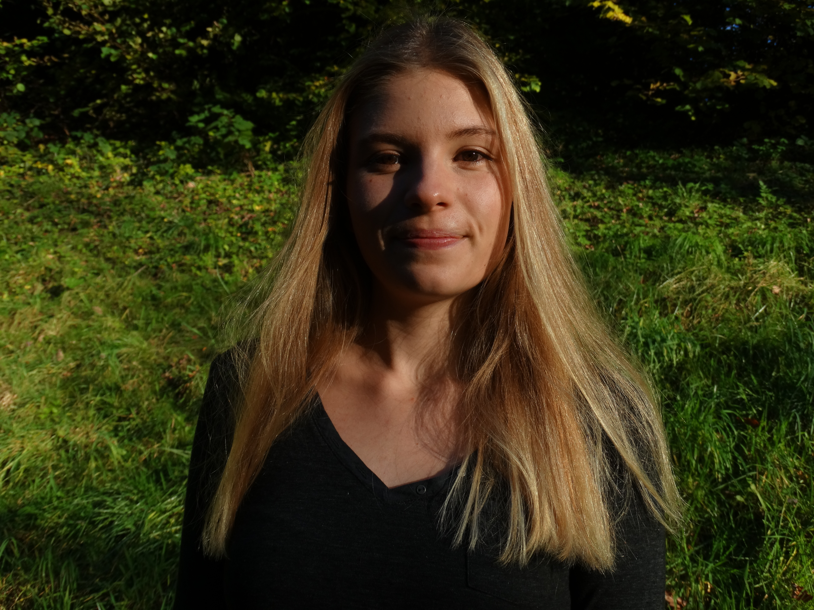
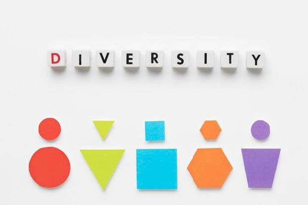
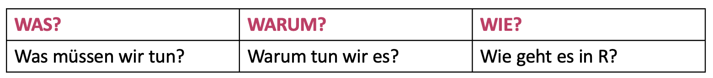
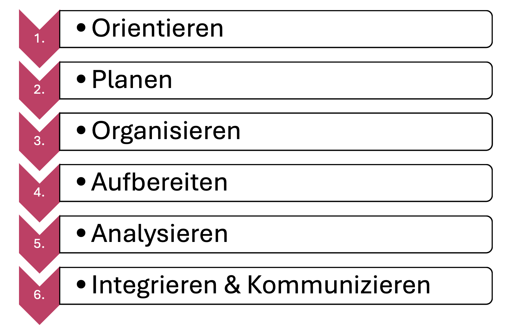
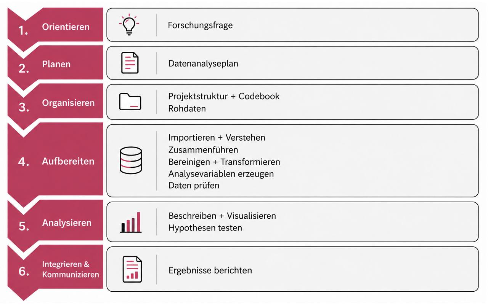
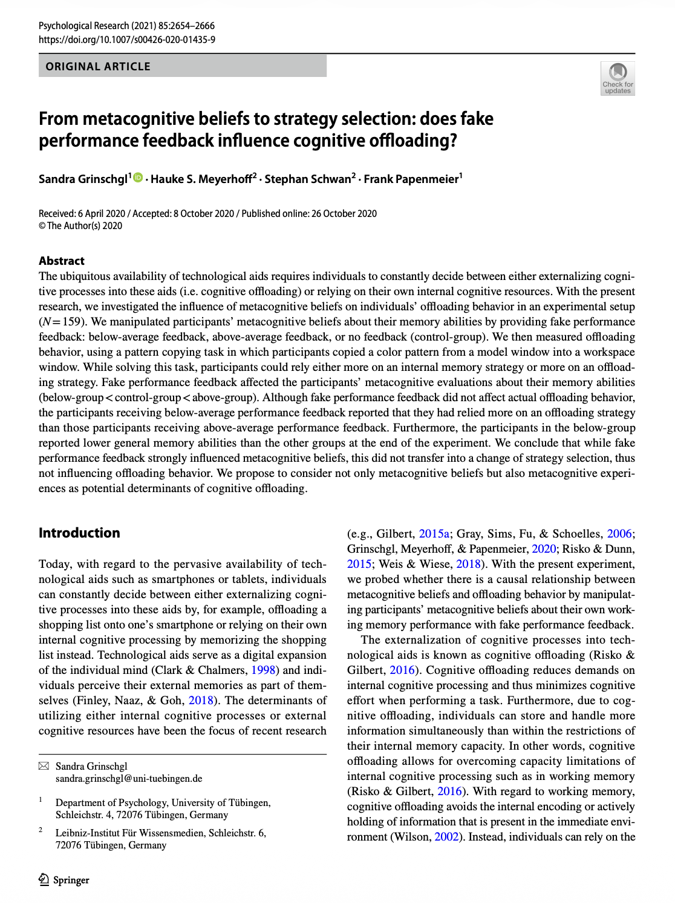
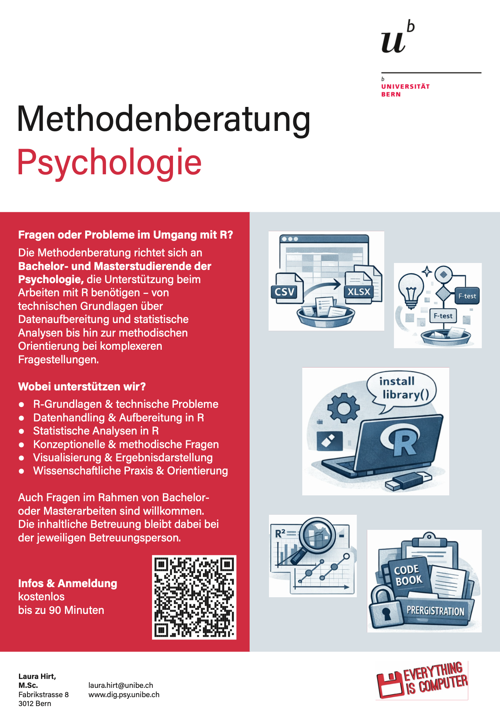

## R u Ready? Reproduzierbare Datenaufbereitung und -analyse mit R

HS 2026<br><br><br> **Seminarleitung**: Dr. Sandra Grinschgl<br> **Leitung beider Seminargruppen:** MSc. Laura Hirt<br> **Tutor**: BSc. Jan-Pierre Pahnke<br><br><br>**1. Einheit**, 16.09.2026

{fig-align="center" width="306"}

<br>

------------------------------------------------------------------------

## Programm heute

**Leitfrage:** Wie komme ich von einer Forschungsfrage zu einem reproduzierbaren Ergebnis in R?

<br>

1.  Kennenlernen & Organisatorisches

2.  Ziel und Aufbau des Seminars

3.  Unser gemeinsames Forschungsprojekt

4.  Der Datenanalyse-Workflow

5.  R, RStudio & erste Coding Basics

6.  Hands-on

7.  Bedarfsanalyse & Ausblick

------------------------------------------------------------------------

## Seminarleitung

::::: columns
::: {.column width="70%"}
### *Dr. Sandra Grinschgl*

-   Seminarleitung

-   Arbeitsbereich Psychologie der Digitalisierung

-   Fabrikstrasse 8, Raum D 262

-   sandra.grinschgl\@unibe.ch

-   Sprechstunde nach Vereinbarung
:::

::: {.column width="30%"}
{fig-align="center" width="200"}
:::
:::::

------------------------------------------------------------------------

## Leitung beider Seminargruppen

::::: columns
::: {.column width="70%"}
### *Laura Hirt, MSc. Psychologie*

-   Lehrassistenz R you Ready

-   Methodenberatung

-   Fabrikstrasse 8, Raum A 263

-   Sprechstunde/Methodenberatung nach Vereinbarung

-   laura.hirt\@unibe.ch
:::

::: {.column width="30%"}
{fig-align="center" width="332"}
:::
:::::

------------------------------------------------------------------------

## Tutor

::::: columns
::: {.column width="70%"}
### *Jan-Pierre Pahnke, BSc. Psychologie*

-   Tutor R you Ready

-   Unterstützung bei Hands-on-Übungen

-   Fabrikstrasse 8, D266

-   Sprechstunde nach Vereinbarung

-   jan-pierre.pahnke\@unibe.ch
:::

::: {.column width="30%"}
{fig-align="center" width="267"}
:::
:::::

------------------------------------------------------------------------

## Barrierefreiheit!

Bitte melde dich auf einem für dich passenden Weg bei uns, wenn dir in dieser Lehrveranstaltung Barrieren begegnen, die auszugleichen sind.

[{fig-align="center"}](https://www.unibe.ch/unibe/portal/content/e1006/e1061/e106351/e1427734/UniBE_Icon_001_ger.png)

------------------------------------------------------------------------

## Miteinander im Seminar

Bitte gebt uns auch Bescheid, falls wir euch falsch ansprechen!

{fig-align="center" width="45%"}

Wir hoffen es ist für alle in Ordnung, wenn wir uns Duzen!

------------------------------------------------------------------------

## Organisatorisches

-   📅 **14 Termine**, immer mittwochs

-   🕝 Gruppe 1: **10:15 (Raum B 102)**

-   🕝 Gruppe 2: **16:15 (Raum B 101)**

-   💻 Eigener Laptop mit RStudio erforderlich

-   📚 Materialien auf Kurswebseite & ILIAS

-   🛫 Maximal 2 unentschuldigte Fehltermine

::: notes
Keine Pause - Selbstständig wenn nötig.
:::

------------------------------------------------------------------------

## Wo finde ich was?

**Kurswebseite**

-   Präsentationen

    -   Auch als PDF verfügbar (PDF-Mode -\> Download über "Drucken")

-   Hands-on-Übungen & R-Hausübungen

-   Musterlösungen

-   FAQ / Resultate Muddiest Points

-   Ressourcen & Cheat Sheets

**ILIAS**

-   Downloads

-   Abgaben & Umfragen

-   Peer-Feedback

-   Forum

------------------------------------------------------------------------

## Worum geht es in diesem Seminar?

<br><br>

**Wir beantworten eine empirische Forschungsfrage reproduzierbar - von der Planung über die Rohdaten bis zum berichteten Ergebnis.**

<br>

{fig-align="center"}

R ist unser Werkzeug; der Forschungsprozess gibt die Struktur vor.

::: notes
Warum diese Perspektive?

Was macht Datenanalyse oft schwierig? Nicht unbedingt nur die Statistik. Häufiger sind Fragen wie:

-   Wo beginne ich?

-   Was muss ich mit meinen Rohdaten machen?

-   Welche Variable brauche ich für meine Fragestellung?

-   Wo gehört welcher Code hin?

-   Wie weiss ich, ob meine Daten jetzt wirklich analysebereit sind?

-   Welchen Schritt mache ich als nächstes?

-\> Wir arbeiten in diesem Seminar mit einem vollständigen Projektworkflow.
:::

------------------------------------------------------------------------

## Unser Weg durch das Semester: Überblick

Ein Forschungsprojekt, sechs Phasen:

<br>

{width="65%" fig-align="center"}

**Reproduzierbarkeit** begleitet uns durch alle Phasen!

------------------------------------------------------------------------

## Unser Weg durch das Semester: Details

<br>

{width="65%" fig-align="center"}

Diese Übersicht wird uns das ganze Semester begleiten.

::: notes
Wir befinden uns momentan in der ersten Phase der Orientierung. Wir werden heute also noch keine Daten aufbereiten und auch keine ANOVA rechnen.

Heute geht es darum, das Ziel zu kennen, den Workflow zu verstehen, die Arbeitsumgebung kennenzulernen und die ersten Werkzeuge auszuprobieren.
:::

------------------------------------------------------------------------

## Ein Paper begleitet uns durch das Semester

::::: columns
::: {.column width="70%"}
**Grinschgl et al. (2021)**

*From metacognitive beliefs to strategy selection: does fake performance feedback influence cognitive offloading?*

Im Semester werden wir Schritt für Schritt:

-   **ORIENTIEREN:** Fragestellungen & Hypothesen verstehen

-   **PLANEN:** Datenanalyseplan für das Paper erstellen

-   **ORGANISIEREN:** 7 Rohdatensätze; Projektstruktur aufbauen & Codebook erstellen

-   **AUFBEREITEN:** Rohdatensätze importieren, mergen und transformieren

-   **ANALYSIEREN:** Deskriptiv- & Inferenzstatistik

-   **INTEGRIEREN:** Umfassendes Forschungsprojekt
:::

::: {.column width="30%"}
{fig-align="center" width="350"}
:::
:::::

::: notes
Wir machen nicht alles auf einmal. Jede Woche kommt genau der nächste notwendige Schritt hinzu.

Wir arbeiten das ganze Semester hinweg mit denselben Originaldaten dieses Projekts. Dadurch müsst ihr nicht jede Woche gleichzeitig einen neuen Datensatz, eine neue Forschungsfrage, neue Variablen, neue R-Funktionen und eine neue statistische Methode verstehen. Stattdessen haben wir ein Projekt, dass wir Schritt für Schritt weiterentwickeln. Das hilft euch dann, bei eurer Masterarbeit genau gleich vorzugehen.
:::

------------------------------------------------------------------------

## Wo wollen wir am Semesterende sein?

**Am Ende des Seminars...**

erhaltet ihr individuell simulierte Rohdatensätze zur Grinschgl-Studie.

Dann führt ihr selbstständig den Workflow durch, den wir im Seminar Schritt für Schritt gemeinsam erarbeiten:

-   Forschungsfragen & Datenanalyseplan nutzen

-   Projektstruktur & Codebook führen

-   Rohdaten importieren, zusammenführen & aufbereiten

-   Analysevariablen erzeugen & Daten prüfen

-   Daten beschreiben & visualisieren

-   geplante Analysen durchführen & interpretieren

-   Ergebnisse reproduzierbar dokumentieren

<br>

**Ihr sollt nicht alles auswenig wissen, sondern den Analyseprozess selbstständig und systematisch durchführen können.**

------------------------------------------------------------------------

## Was das Seminar nicht leisten kann

-   Keine vollständige Wiederholung der Statistikvorlesungen

-   Kein "Kochbuch" für jede mögliche Masterarbeit

-   Keine vollständige Einführung in sämtliche R-Funktionen

-   Keine Behandlung aller möglichen statistischen Modelle

<br>

**Aber:**

Wir wollen euch einen stabilen Workflow und Werkzeugkasten geben, mit dem ihr neue Herausforderungen wesentlich selbstständiger angehen könnt.

------------------------------------------------------------------------

## Aufbau der 14 Einheiten

Kombination aus Input und Übung

Folie noch gestalten!!!!!

------------------------------------------------------------------------

## Semesterplan

::: {style="width:100%; height:80vh; background:#777; padding:20px; box-sizing:border-box; border-radius:10px; overflow:auto; "}
```{=html}
<embed
    src="../../PDFs/Semesterplan_HS26.pdf#view=FitH&navpanes=0&toolbar=0"
    type="application/pdf"
    style="width:100%; height:220vh; border:0; display:block; background:white;"
  >
```
:::

------------------------------------------------------------------------

## Leistungsbeurteilung

-   **Mitarbeit:** 14 Punkte

-   **Regelmässige Hausübungen:** 8 Abgaben; insgesamt 32 Punkte

-   **Abschlussprojekt:** 54 Punkte

    -\> Total 100 Punkte

-   Genauere Informationen zum Leistungsnachweis hier: Hier Link aktuelle Webseite

    –\> Update im Laufe des Semesters

-   **Kontinuierliche Arbeit während dem Semester!**

-   **Aufwand**: 5ECTS für erfolgreichen Abschluss des Seminars -\> +- 9h pro Woche

    ```{r}
    #| echo: TRUE

    ECTS <- 25 

    Wochen_semester <- 14

    aufwand_semester <- 5*ECTS

    aufwand_pro_woche <- mean(aufwand_semester/Wochen_semester)

    aufwand_pro_woche

    ```

------------------------------------------------------------------------

## Leistungsnachweis: Mitarbeit (14 Punkte)

... kann unterschiedlich ausfallen zum Beispiel:

-   Wortmeldungen im Plenum

-   Aktive Teilnahme an den Hands On Sessions

-   Beteiligung an Online-Foren & Error Hunt

**Punktevergabe:**

-   7 Punkte durch LV-Leitung

-   7 Punkte durch Selbstevaluation

------------------------------------------------------------------------

## Leistungsnachweis: Hausübungen (32 Punkte)

-   8 Hausübungen - 4 oder 8 Punkte pro Hausübung

-   Bewertungsrelevant: Auseinandersetzung mit dem Stoff/den aufgetragenen Aufgaben.

-   Korrektheit zweitrangig.

::: notes
Bei Problemen die ihr nicht lösen könnt und keine Ressourcen findet, könnt ihr euch auch ans Forum wenden und eure Frage posten.
:::

------------------------------------------------------------------------

## Leistungsnachweis: Abschlussprojekt (54 Punkte)

-   Vorgegebenes Paper aber individuelle, simulierte Datensätze

-   Datenanalyseplan überarbeiten/ergänzen

-   Kontinuierliche Führung/Überarbeitung eines Codebooks

-   Reproduzierbare Datenaufbereitung und Analyse mit Quarto

Abgabe: Datenanalyseplan, Codebook, Datenfiles, Analyseskript(e) nach vorgegebener Ordnerstruktur

**Deadline: 14.06.2026**

-\> Weitere Informationen im Verlauf des Semesters

------------------------------------------------------------------------

## Fehlerkultur

<br>

*"Ich verliere nie. Entweder ich gewinne oder ich lerne"* - Nelson Mandela

<br>

*"Auch Umwege erweitern unseren Horizont"* - Ernst Ferstl

<br>

*"Wege entstehen dadurch dass wir sie gehen"* - Franz Kafka

<br>

*"Failure is not the opposite of success, its part of it"* - Karamo Brown in Queer Eye

<br>

*"Den grössten Fehler, den man im Leben machen kann, ist, immer Angst zu haben einen Fehler zu machen"* - Dietrich Bonhoeffer

::: notes
Wir sind hier um Fehler zu machen; auch bei uns ist vieles Trial-und-Error. Das darf und soll auch so sein! Bei Hausübungen sind Fehler erlaubt! Es geht ums das Mitarbeiten und sich bemühen, dann kriegt man auch mit Fehlern die Punkte Klar machen, dass man laufend dran sein muss um zu Lernen & HÜs wichtig sind Auch ich selbst weiß vieles nicht auswendig, muss googlen…
:::

------------------------------------------------------------------------

## Syllabus

::: {style="width:100%; height:80vh; background:#777; padding:20px; box-sizing:border-box; border-radius:10px; overflow:auto; "}
```{=html}
<embed
    src="../../PDFs/Syllabus.pdf#view=FitH&navpanes=0&toolbar=0"
    type="application/pdf"
    style="width:100%; height:220vh; border:0; display:block; background:white;"
  >
```
:::

------------------------------------------------------------------------

## Begleitende Literatur

-   [Kurswebsite: FAQ und weitere Informationen](https://r-you-ready.quarto.pub)

-   Wickham, H., Cetinkaya-Rundel, & Grolemund, G., &. (2023). R for Data Science. O’Reilly Media. <https://r4ds.hadley.nz/>

-   Ellis, A., & Mayer, B. (2024). Einführung in R. <https://methodenlehre.github.io/einfuehrung-in-R/>

-   Weitere nützliche Ressourcen:

    -   Tidyverse cheat sheets <https://posit.co/resources/cheatsheets/>

    -   Luhmann, M. (2020). R für Einsteiger. Beltz.

------------------------------------------------------------------------

## Unterstützungsangebote

-   Mit vorhanden Ressourcen arbeiten: Unterlagen aus dem Bachelor + Online-Ressourcen (auch LLMs)

-   Online-Forum für Peer-to-Peer und Peer-to-Teacher Fragen; Mitarbeitspunkte für Code-Error-Hunt

-   Sprechstunde für «R Troubles» mit Lars –\> vor/nach/während den Einheiten + bei Bedarf

-   Erhebung & Besprechung der «Muddiest Points»

-   Musterlösungen zu Übungen werden blockweise auf der Kurswebsite ergänzt

------------------------------------------------------------------------

## Anwesenheit prüfen / Kennenlernen

::: notes
Ja/Nein Fragen - bei Ja aufstehen:

-   Ich hatte schon mal Angst vor Statistik.

-   Ich habe schon einmal R geöffnet.

-   Ich glaube, ich bin „nicht der Programmier-Typ“.

-   Ich vertraue KI bei methodischen Fragen.

-   Ich freue mich auf dieses Seminar.

    2te Runde:

-   Namen sagen

-   Wo im Master (zb schon an Masterarbeit)
:::

------------------------------------------------------------------------

## Warum R?

-   Es gibt viele Gründe die für R sprechen:

    -   R kann mehr

    -   R ist aktuell

    -   R ist ansprechbar

    -   R schläft nicht

    -   R ist nachgefragt

    -   R ist Open Source & somit kostenlos

    Quelle: Luhmann, 2019.

::: notes
-   R bietet viele funktionen die in programmen nicht vorhanden ist
-   R wird auch ständig weiterentwicklet, auch mit funktionen die erst jahre später in andere programme übernommmen werden
-   R die programmierer einzelner packages sind oft erreichbar und antworten auch auf fragen usw.
-   R R nutzer auf der ganzen welt, auch in sozialen medien unterwegs (z.B auch R-Ladies https://rladies.org/about-us/mission/)
-   R ist nachgefragt, eröffnet jobmöglichkeiten in und ausserhalb der wissenschaft

R erhöhrt auch die transparenz!! --\> Open science Block nächste Woche
:::

------------------------------------------------------------------------

## Jetzt: Hands On!

**Übungen auf der [Website](https://r-you-ready.github.io/Webseite_FS26_Seminar/scripts/02_excercises/hands_on_1.html)!**

-   In eigenem Tempo arbeiten, nicht stressen lassen!

-   Helft euren Sitznachbar:innen

-   Meldet euch bei uns!

-   Für die sehr schnellen Personen —\> Bedarfsanalyse auf ILIAS (siehe Sitzung 1).

::: notes
Mit Block anfangen; Lars und ich gehen rum, und beantworten Fragen. Wenn ihr nicht fertig werdet ist das kein Problem.
:::

------------------------------------------------------------------------

## Bedarfsanalyse

Bitte reflektiere das im Bachelor erworbene Wissen und überlege wo Aufholbedarf im Bezug auf die Datenaufbereitung und -analyse mit R besteht. Du kannst die zentralen Unterlagen des Bachelor-Studiums (z.B. zu den Statistikvorlesungen) im Ilias Kurs "Masterarbeit Psychologie" einsehen.

**Anonyme Umfrage um**

-   Präferenz für das Peer-Pairing zu erfragen

-   Vorkenntnisse zu erfassen

-   Bedarf an R-Unterstützung zu erfassen

Umfrage in ILIAS, Deadline **Sonntag 22.02., 23:55**

------------------------------------------------------------------------

## Heute haben wir...

-   R bzw. RStudio und wichtige Pakte darin installiert

-   Uns mit der Oberfläche von R-Studio bekannt gemacht

-   Erste Operationen in R ausgeführt:

    -   Einfache Rechnungen

    -   Erste Zuweisungen mit `<-`

    -   Vektoren erstellt

-   Erste Funktionen aufgerufen ( z.b. `sum()`

-\> Fortsetzung in EH 2

------------------------------------------------------------------------

## Methodenberatung

[Methodenberatung](https://www.dig.psy.unibe.ch/tools__services/methodenberatung_psychologie/index_ger.html)

{fig-align="center"}

------------------------------------------------------------------------

## Bis nächste Woche!

-   Bedarfsanalyse auf ILIAS (Sitzung 1) bis Sonntag ausfüllen!

    {width="268"}
