## R u Ready? Reprodzierbare Datenaufbereitung und -analyse mit R

FS 2026<br><br><br> **LV-Leitung**: Dr. Sandra Grinschgl / MSc. Laura Hirt<br> **Tutor**: BSc. Lars Schilling<br><br><br>**2. Einheit**, 25.02.2026

{fig-align="center" width="306"}

::: notes
Check Ilias Forum - frage wer weiss wo R u Ready Logo herkommt
:::

------------------------------------------------------------------------

## Syllabus

::: {style="width:100%; height:80vh; background:#777; padding:20px; box-sizing:border-box; border-radius:10px; overflow:auto; "}
```{=html}
<embed
    src="../../PDFs/Syllabus.pdf#view=FitH&navpanes=0&toolbar=0"
    type="application/pdf"
    style="width:100%; height:220vh; border:0; display:block; background:white;"
  >
```
:::

::: notes
Gibt es Fragen, die sich nach letzter Woche aufgetan haben?
:::

------------------------------------------------------------------------

## Ergebnisse der Bedarfsanalyse (1)

***Wie würdest du aktuell deine R-Kenntnisse einschätzen?***

**12:15 (*N* = 19)**

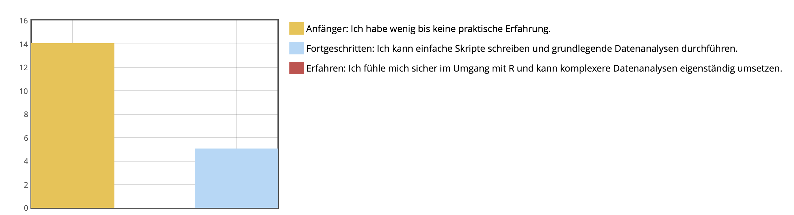{fig-align="left" width="600"}

**16:15 (*N* = 19)**

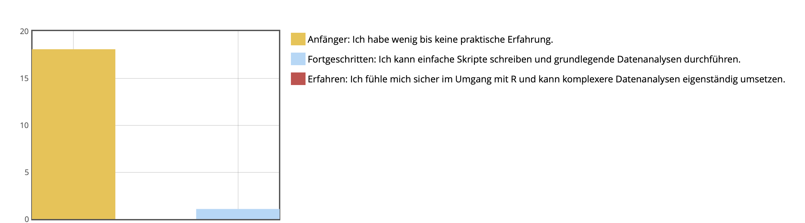{fig-align="left" width="600"}

------------------------------------------------------------------------

## Ergebnisse der Bedarfsanalyse (2)

***Wie häufig hast du R bisher verwendet?***

**12:15**

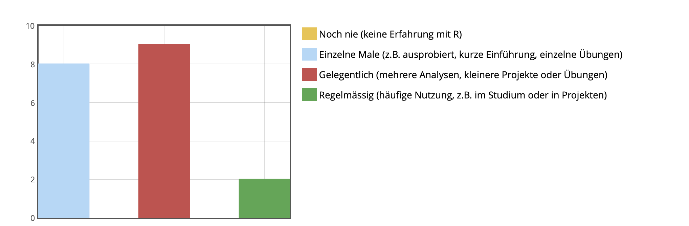

------------------------------------------------------------------------

***Wie häufig hast du R bisher verwendet?***

**16:15**

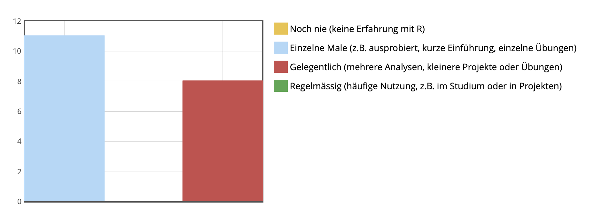

------------------------------------------------------------------------

## Ergebnisse der Bedarfsanalyse (3)

**Wie sicher fühlst du dich im Umgang mit den folgenden Themen?**

**12:15**

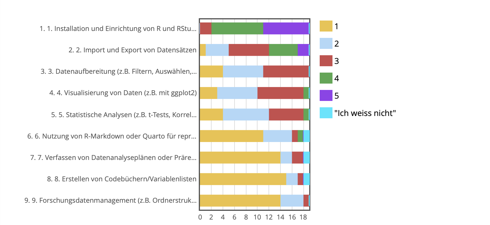{fig-align="center"}

------------------------------------------------------------------------

**Wie sicher fühlst du dich im Umgang mit den folgenden Themen?**

**16:15**

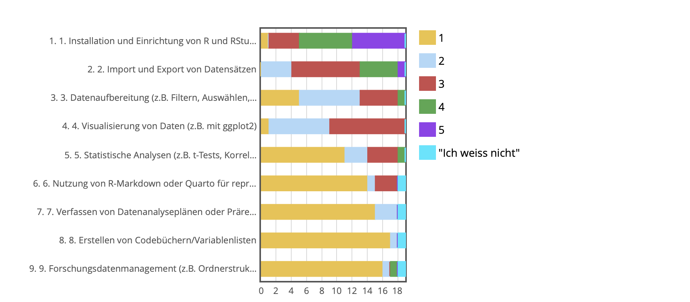{fig-align="center"}

------------------------------------------------------------------------

## Ergebnisse der Bedarfsanalyse (4)

**Welche weiteren Schritte bereiten dir Schwierigkeiten in R?**

-   Grundlegende Schritte und Befehle über eine Veranstaltung hinaus behalten

-   Wissen, in welchem Fall welcher Code relevant ist (Wann brauche ich was?)

-   Der Weg vom Datensatz zur Analyse

-   R immer nur punktuell für spezifische Analysen verwendet

-   Nicht wissen, was Code macht und warum

-   Einlesen, Aufbereiten & Interpretieren von Daten

-   Ganzheitliches Verständnis von Code -\> Reihenfolge von Argumenten in Befehlen

-   Verständnis & Beheben von Fehlermeldungen

::: notes
Unsicherheit welche Pakete für welche Analysen

Oft nur codes kopieren, mühe logik oder reihenfolge nachzuvollziehen

Unsicherheit welche schritte nötig sind, (umwandenlen und strukturieren von daten)

Auswahl passender Tests

--\> Allgemeine Überforderung, stark auf extrene Hilfe angewiesen.
:::

------------------------------------------------------------------------

## Ergebnisse der Bedarfsanalyse (5)

**Bei welchen Schritten in R fühlst du dich sicher, wenn du auch daran denkst, die im Bachelor erworbenen Unterlagen zu Hilfe zu ziehen?**

-   Basics (z.B. Vektoren zuweisen)

-   Datenimport & -aufbereitung

-   Deskriptive Statistiken & einfache Analysen

-   Visualisierung mit ggplot2

-   Vorgegebene Analysen mit bereits aufbereiteten Daten

-   Interpretation von Output einfacher Modelle

-   Allgemeine Unsicherheit ➡️ mit Unterlagen, KI, oder Schritt für Schritt Anweisungen funktioniert bereits einiges

::: notes
Wir werden versuchen unser "Programm" auf eure Needs abzustimmen - bitte gebt uns laufend Feedback dazu.
:::

------------------------------------------------------------------------

## Ergebnisse der Bedarfsanalyse (6)

**Was würdest du gerne in diesem Methodenseminar lernen?**

-   Grundlagen und Verständnis festigen ➡️ Sicherheit gewinnen

-   Vom ursprünglichen Datensatz zum fertigen Analyse-Skript

    -   Import, Aufbereitung, Analyse & Interpretation

    -   Wann brauche ich welche Tests ➡️ Leider kann keine grundlegende Statistik-Auffrischung angeboten werden, aber kommt bei Fragen auf uns zu!

    -   Was hoffentlich hilft: Strukturiertes Vorgehen z.B. Datenanalyseplan.

-   Visualisierung und Dokumentation

-   Eigenständiger werden & Problemlöseskills (Routine erlangen)

-   Motivation und Sicherheit!

    ::: notes
    Unser Motto: Üben, üben, üben
    :::

------------------------------------------------------------------------

## Ergebnisse der Bedarfsanalyse (7)

**Welche Unterstützung um die Datenaufbereitung und -analyse in R würdest du dir innerhalb dieses Seminars wünschen?**

-   offene Fehlerkultur

-   Schritt-für-Schritt-Anleitungen im individuellen Tempo ➡️ **Musterlösungen**

-   Üben und Praxis ➡️ **Hands-on!**

-   Niederschwellige Hilfe ➡️ **Tutor, Sprechstunden**

-   Verknüpfung von „Warum“ und „Wie“ ➡️ **konzeptionelle und praktische Kompetenz**

------------------------------------------------------------------------

## Peer-Pairing:

**12:15**

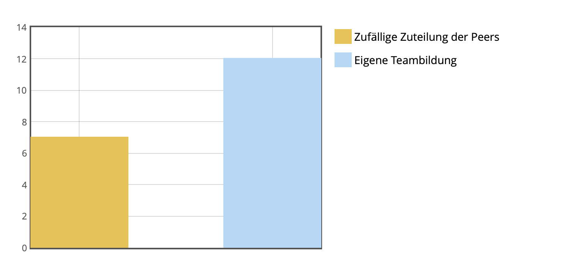{width="350"}

**16:15**

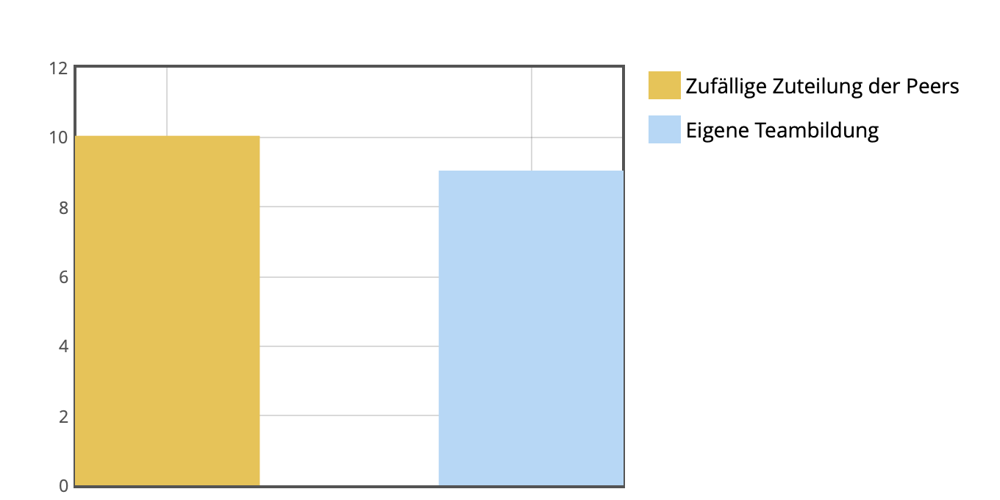{width="350"}

------------------------------------------------------------------------

## Peer-Pairing:

-   Wofür: Feedback bei ausgewählten Einheiten, und sonstiges gegenseitiges Unterstützen wenn erwünscht

-   Vorgehen: Melden bis **Sonntag, 01.03.** **(ILIAS Forum**, siehe EH2) mit Namen des 2er Teams

-   Ansonsten: Zufällige Zuteilung am Montag - Kennenlernen in der nächsten Einheit \<3

[{fig-align="center"}](https://img.freepik.com/vektoren-kostenlos/partner-die-grosse-puzzleteile-halten_74855-5278.jpg)

------------------------------------------------------------------------

## Open Science - Menti

{fig-align="center" width="403"}

::: notes
Was verbindest du mit Open Science?

Menti nach Vormittagseinheit zurücksetzen
:::

------------------------------------------------------------------------

## Replikationskrise

::::: columns
::: {.column width="70%"}
-   Ausgangspunkt: 9 Studien, die darauf hinweisen, dass Personen «in die Zukunft sehen können» (Bem , 2011)

-   Etablierte psychologische Messmethoden (z.B. Priming)

-   Ein Ergebnis: Primes, die nach der Antwort präsentiert werden, beeinflussen Bewertung der Antwort

-   Starke Kritik v.a. was Methodik betrifft; gerade kontroverse,„unwahrscheinliche“ Hypothesen sollten durch strikte, konfirmatorische Analysen überprüft werden (Francis, 2012; LeBel & Peters, 2011; Wagenmakers et al., 2011)

-   Diverse gescheiterte Replikationsversuche (Galak et al., 2012; Ritchie et al., 2012; Robinson, 2011)
:::

::: {.column width="30%"}
{fig-align="right"}
:::
:::::

::: notes
Weitere studien von bem unter anderem: erotic image detection –\> teilnehmende errieten die position von erotischen bildern signifikant öfter hinter einem vorhang - bevor die bilder überhaupt positioniert wurden.
:::

------------------------------------------------------------------------

## Replizierbarkeit und Reproduzierbarkeit

{fig-align="center"}

::: notes
-   Reproduzierbarkeit = gleiche Daten, gleiche Analyse, gleiche Ergebnisse.

-   Replizierbarkeit = neue Daten, gleiche Methode, ähnliche Ergebnisse.

--\> Aufgrund von Bem haben sich Forschende das Ziel gesetzt, die Replizierbarkeit von etablierten Befunden zu prüfen.
:::

------------------------------------------------------------------------

## Open Science Collaboration (2015)

Gemeinsames Projekt von 270 Autor:innen, mit dem Ziel, 100 Studien aus drei verschiedenen Journals zu replizieren.

{fig-align="center" width="400"}

------------------------------------------------------------------------

## Open Science Collaboration (2015)

-   ::: {style="color: green"}
    Signifikante Ergebnisse in den Original-Studien: **97%**
    :::

-   Wie viel % der Effekte liessen sich replizieren - was glaubt ihr?

{fig-align="center" width="400"}

------------------------------------------------------------------------

## Open Science Collaboration (2015)

:::: incremental
::: {style="color:red"}
-   Signifikante Ergebnisse in den Replikationsstudien: **36%**
-   Ausserdem sind die Effektgrössen in den Replikationsstudien im Schnitt halb so gross!

{fig-align="center" width="400"}
:::
::::

------------------------------------------------------------------------

## Replikationskrise in anderen Fächern

{fig-align="center"}

\*Bei Wirtschaft geht es um Reproduzierbarkeit.

Siehe auch: <https://www.youtube.com/watch?v=FpCrY7x5nEE&ab_channel=TED-Ed>

------------------------------------------------------------------------

## Warum?

::: notes
Sammlung im Plenum von möglichen Gründen für diese Replikationskrise
:::

------------------------------------------------------------------------

## Gründe für die Replikationskrise, z. B.:

-   **Akademisches Umfeld:**

    -   Quantität \> Qualität

    -   "publish or perish"

    {width="113"}

-   **Questionable Research Practices, z.B.:**

    -   Selektive Berichterstattung -\> 63.4% Lebenzeit-Prävalenz (John et al., 2012)

    -   Optionales Stoppen –\> 55.9% Lebenszeit-Prävalenz

    -   Salami Slicing

    -   *p*-hacking -\> 22.0% Lebenszeit Prävalenz

    -   Extremfall: Betrug
    
------------------------------------------------------------------------

## Gründe für die Replikationskrise, z. B.:

-   **Biases:**

    -   Small Study Bias

    -   Confirmation Bias

    -   Publication Bias & File Drawer Problem

"If you torture data long enough, it will confess to anything" - Ronald Coase

(Spielt natürlich auch eine Rolle: Versuchsmethoden und Zufallsbefunde)

::: notes

:::

------------------------------------------------------------------------

## Gründe für die Replikationskrise:

Chambers, C. (2017). The seven deadly sins of psychology: A manifesto for reforming the culture of scientific practice. Princeton University Press. <https://doi.org/10.1515/9781400884940>

------------------------------------------------------------------------

## Aktuelle Fälle:

[**Top German psychologist fabricated data, investigation finds**](https://www.science.org/content/article/top-german-psychologist-fabricated-data-investigation-finds)

-   Der bekannte Psychologe Hans-Ulrich Wittchen soll in einer millionenschweren Studie Daten gefälscht und Whistleblower unter Druck gesetzt haben, was nun zu strafrechtlichen Ermittlungen und möglichen Sanktionen führt.

[**“Here’s the Unsealed Report Showing How Harvard Concluded That a Dishonesty Expert Committed Misconduct”**](https://statmodeling.stat.columbia.edu/2024/03/14/heres-the-unsealed-report-showing-how-harvard-concluded-that-a-dishonesty-expert-committed-misconduct/)

-   Die Forscherin Francesca Gino wird beschuldigt, Daten in mehreren Studien manipuliert zu haben, bestreitet jedoch die Vorwürfe und führt sie auf mögliche Fehler oder andere Personen zurück.

[**A Scandal in Alzheimer’s Research Shows How Science Can Go Astray**](https://www.chronicle.com/article/a-scandal-in-alzheimers-research-shows-how-science-can-go-astray)

-   Eine Untersuchung legt nahe, dass eine einflussreiche Alzheimer-Studie von 2006 manipulierte Bilder enthielt, was Zweifel an jahrelanger Forschung und der wissenschaftlichen Integrität aufwirft.

::: notes
Aktueller Stand:

Hans-Ulrich Wittchen ist wegen Datenfälschung bei einer großen Studie angeklagt; sein Vertrag an der LMU wurde suspendiert, weitere Ermittlungen laufen.

Francesca Gino Harvard entließ sie 2025 und entzog ihr die Tenure wegen nachgewiesenem Forschungs­fehlverhalten; ihre Klagen gegen Harvard laufen, Teile davon wurden bereits abgewiesen.

Sylvain Lesné Sein zentraler Alzheimer-Artikel von 2006 wurde 2024 aus Nature zurückgezogen; er trat 2025 von seiner Professur in Minnesota zurück, Untersuchungen dauern an. Seine Forschung beinflusste grosse teile des Forschungsbereiches und ist eines der meistzitierten Papers die bis heute retracted wurden.
:::

------------------------------------------------------------------------

## Retraction Watch Leaderboard

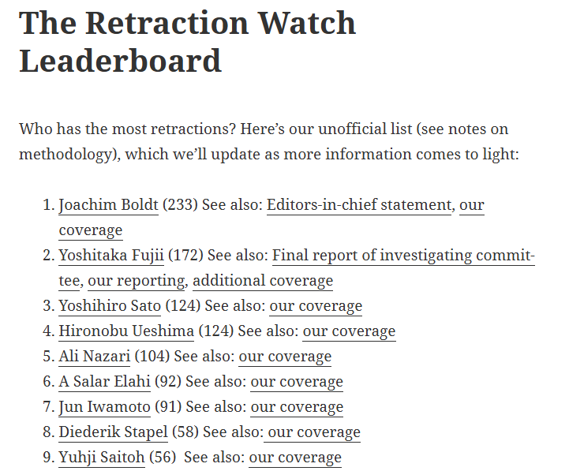{fig-align="center"}

::: notes
An Stelle 8 ist Diederik Stapel - bekannter Fall aus der Psychologie

Wall of Shame der Wissenschaftler
:::

------------------------------------------------------------------------

## THE END IS NEAR

{width="450"}

::: incremental
-   **Oder?**

-   *„Science is never perfect, but what this crisis has shown is that there is never a shortage of scientists who will keep trying to make it better.”* (Maki Naro)
:::

------------------------------------------------------------------------

## Lösungsansätze - Open Science statt Closed Research

{fig-align="center"}

Auch wichtig: Registered Reports und Replikations/Reproduzierbarkeitsstudien; Open Acces Publikationen, Open Peer Review, Educational Practices

------------------------------------------------------------------------

## Lösungsansätze - Open Science (2)

Präregistrierung

-   Festlegung der zentralen Aspekte der Studie (z.B. Hypothesen, Stichprobe, Analyse) vor ihrer Umsetzung (d.h. **vor der Datenerhebung**)

-   ::: {style="color:red"}
    Auch möglich **vor der Datenanalyse** —\> Datenanalyseplan
    :::

-   Präregistrierung wird veröffentlicht, erhält einen Zeitstempel und ist schreibgeschützt

    -   www.osf.io
    -   [Verschiedene Templates](https://help.osf.io/article/229-select-a-registration-template)

-   In der Medizin längst Standard (Clinical Trial Registration)

    ::: notes
    
    :::

------------------------------------------------------------------------

## Lösungsansätze - Open Science (2)

Open Material, Data & Code

-   **Open Material:** Untersuchungsmaterial (Fragebogen, Stimuli, usw.) wird online zur Verfügung gestellt

-   **Open Data:** Daten werden in **anonymisierter** Form veröffentlicht

-   **Open Code:** Reproduzierbare Analyseskripte und **Codebooks** werden zur Verfügung gestellt

Badges: [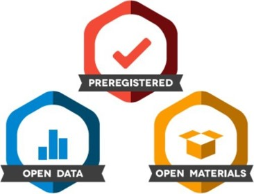{width="320"}](www.osf.io)

::: {style="color: red"}
Erlaubt Ergebnisse zu überprüfen; erhöht die Glaubwürdigkeit an Forschung; stärkt die gefundenen Ergebnisse
:::

------------------------------------------------------------------------

## Lösungsansätze - Open Science (3)

-   Preprints:

    -   Version des Manuskripts vor Peer-Review

    -   Postprint: Version des Manuskripts nach Peer Review.

        {width="200"}

------------------------------------------------------------------------

## Open Science = Gute wissenschaftliche Praxis

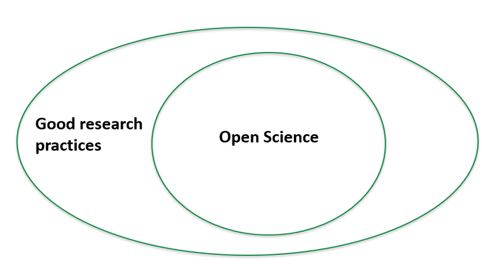{fig-align="center"}

------------------------------------------------------------------------

## Weitere Ressourcen:

-   Pennington, C. R. (2023). A student’s guide to open science: Using the replication crisis to reform psychology. McGraw Hill​.

-   Open Science an der Universität Bern: <https://www.ub.unibe.ch/service/open_science/index_ger.html> ​

-   Blogs über aktuelle Themen: <https://datacolada.org>

-   Journal Club: <https://reproducibilitea.org>

-   Comic: <https://thenib.com/repeat-after-me/?utm_campaign=web-share-links&utm_medium=social&utm_source=link>

-   Lehrveranstaltungen der Abteilung „Psychologie der Digitalisierung“- Meta-Wissenschaft <https://www.dig.psy.unibe.ch/studium/lehrveranstaltungen/index_ger.html>

-   „Spellchecker“ für Statistik <https://michelenuijten.shinyapps.io/statcheck-web/>

------------------------------------------------------------------------

## Was bedeutet dies nun für uns?

-   Festhalten der Analysen in Datenanalyseplänen -\> reproduzierbare und vertrauenswürdige Forschung!

-   Analyse reproduzierbar gestalten ➡️ durch Kommentierung von Code, Codebook etc.

-   Idealerweise: auch bei der Masterarbeit Präregistrierung oder Datenanalyseplan etc. (Unterstützung dafür bietet auch die Methodensprechstunde bei Laura)

-   Regt eure Betreuer:innen an!

{fig-align="center" width="304"}

------------------------------------------------------------------------

## Präregistrierung/Datenanalysepläne

-   Vorteile, u.a.:

    -   kann davor festhalten, was ich erwarte und wie ich es analysiere = erhöhte Transparenz

    -   verringerte Möglichkeiten von p-hacking, HARKing, und Biases

    -   z.B. Stichprobengröße wird festgeschrieben und muss begründet werden

    -   Unterscheidung konfirmatorischer und explorativer Forschung

        -   konfirmatorisch: eine vorab festgelegte Theorie & Hypothese testen

        -   explorativ: neue Zusammenhänge/Unterschiede entdecken; keine Annahmen vorab

    **"Its a plan, not a prison" (Pennington, 2023)**

------------------------------------------------------------------------

## Konzeptionelle Kompetenz: Was muss ich warum bei der Datenaufbereitung tun?

-   **Welche Hypothesen möchte ich testen?**

-   Stichprobe (inkl. Poweranalyse)

-   Berechnung der abhängigen Variablen

-   Datenausschluss

-   Umgang mit fehlenden Daten, Umgang mit Ausreissern

-   **Wie (d.h. mit welchem statistischen Modell) teste ich meine Hypothesen?**\
    Welche **Voraussetzungen** sind dabei zu beachten und wie gehe ich bei Verletzungen dieser vor?\
    Welche **Inferenz-Kriterien** ziehe ich heran?

-   ➡️ Verringerung der "Researcher Degrees of Freedom"

-   ➡️ Wichtig für alle empirischen Arbeiten! Wenn man diese Punkte vor der Datenerhebung gut durchdenkt, spart man sich bei der Analyse viel Aufwand.

-   ➡️Greift auf eure Statistik-Kenntnisse und die Unterlagen aus dem Bachelor zurück!

------------------------------------------------------------------------

## Präregistrierung/Datenanalysepläne

**Nachteile?**

::: notes
-   Keine Garantie für Qualität

-   Ist auch "hackable" –\> PARKing (Preregisitreing after Results are known)
:::

------------------------------------------------------------------------

## Grundlegender Artikel: Grinschgl et al. (2020)

***From metacognitive beliefs to strategy selection: does fake performance feedback influence cognitive offloading?***

-   3 Gruppen und mehrere Messzeitpunkte

-   between-within Design

-   Hauptanalysen: ANOVAs und t-Tests

-   Verschiedene AVs (z.B. cognitive offloading, Arbeitsgedächtnisfähigkeiten, Selbsteinschätzung)

-   Präregistriert auf OSF <https://osf.io/9hpz5>

    -   ::: {style="color: red"}
        ACHTUNG: Kein optimales Beispiel, an manchen Stellen zu knapp!
        :::

------------------------------------------------------------------------

## Datenanalyseplan

-   Secondary Data Analyses Preregistration (<https://osf.io/x4gzt/>[)](https://help.osf.io/article/229-select-a-registration-template)){.uri}

-   Basierend auf Van den Akker et al. (2021) -\> siehe Paper für eine Anleitung & Youtube Video <https://www.youtube.com/watch?v=fqvJx2_V3zY>

-   Leichte Modifikationen für unser Seminar; Vorlage auf ILIAS unter «Abschlussprojekt» -\> ZIP-Ordner

::: notes
Hier kurz demonstrieren, wo sie die entsprechenden Daten finden auf Ilias im zip-Ordner
:::

------------------------------------------------------------------------

## Datenanalyseplan - (Modifizierte) Fragen

-   Titel
-   Kurzbeschreibung der Studie
-   Forschungsfragen
-   Hypothesen & explorative Fragestellungen
-   Datenzugang
-   Datenerhebung
-   Unabhängige Variablen
-   Abhängige Variablen
-   Fehlende Daten
-   Datenausschluss
-   Vorkenntnisse zu den Daten
-   Statistische Modelle
-   Inferenz-Kriterien

**Diese Fragen sind für die Analysen von Grinschgl et al, (2020) zu beantworten –\> erste HÜ**

------------------------------------------------------------------------

## Datenanalyseplan - Aufgabenstellung

-   Datenanalyseplan für Reproduzierung der Analysen von Grinschgl et al. (2020) erstellen (bis EH 4) ➡️4 Punkte

    -   Paper befindet sich ohne und mit Hinweisen auf ILIAS (Ordner «Abschlussprojekt» ➡️ Zip Ordner)

    -   Kann auf Deutsch oder Englisch erstellt werden

    -   Nicht nur Kopie der Textteile aus dem Paper, sondern in eigene Worte fassen

    -   Es gibt nicht die EINE richtige Lösung

    -   Einfach mal probieren! Korrektheit zweitrangig!

-   Musterlösung & Peer-Review (Zwischen EH 4-5) ➡️ 4 Punkte

-   Abschlussarbeit: überarbeiteten Datenanalyseplan mit abgeben (Basis: Simulierte Daten) ➡️ Teil der 54 Punkte (Abschlussarbeit)

-   FAQ anschauen, Ilias Forum für neue Fragen nutzen

------------------------------------------------------------------------

## Fragen, Wünsche, Anregungen

## {fig-align="center" width="345"}

------------------------------------------------------------------------

## **Hands On! Block 1 fortsetzen**

------------------------------------------------------------------------

## **Heute haben wir:**

-   Den Ursprung und Gründe der Replikationskrise kennengelernt

-   Das Verbessern psychologischer Forschung mittels Open Science Praktiken diskutiert

-   Das Konzept der Präregistrierung und des Datenanalyseplans kennengelernt

-   Weitere Hands-On Übungen zu R Basics bearbeitet

------------------------------------------------------------------------

## Hausübungen:

-   Paper lesen (r_you_ready/Grinschgl2020/reports)
-   Datenanalyseplan auf Basis des Papers erstellen
    -   Abgabe via ILIAS, **Deadline: 11.03.2026**
    -   Weiterleiten an Peer-Partner (EH4)
-   Unterstützende Dokumente:
    -   Artikel Van den Akker et al. (2021)
    -   Forum & Peer Pairing (ab EH3)
    -   FAQ
    -   Fragen zur nächsten Einheit mitbringen
    -   Sprechstunde Lars
-   Hands-On Übungen fertig machen (Musterlösungen nächste Woche)
-   Peer-Pairings melden, **Deadline 01.03.2026**

------------------------------------------------------------------------

## Referenzen:

Bem, D. J. (2011). Feeling the future: Experimental evidence for anomalous retroactive influences on cognition and affect. *Journal of Personality and Social Psychology, 100*, 407–425. <https://doi.org/10.1037/a0021524>

Francis, G. (2012). Too good to be true: Publication bias in two prominent studies from experimental psychology. *Psychonomic Bulletin & Review, 19*, 151–156. <https://doi.org/10.3758/s13423-012-0227-9>

Galak, J., LeBoeuf, R. A., Nelson, L. D., & Simmons, J. P. (2012). Correcting the past: Failures to replicate psi. *Journal of Personality and Social Psychology, 103*(6), 933–948. <http://dx.doi.org/10.1037/a0029709>

Grinschgl, S., Meyerhoff, H. S., Schwan, S., & Papenmeier, F. (2021). From metacognitive beliefs to strategy selection: Does fake performance feedback influence cognitive offloading? *Psychological Research, 85*, 2654–2666. <https://doi.org/10.1007/s00426-020-01435-9>

Hofer, G. (2024, April 23). *Open Science* \[Course presentation\]. University of Graz.

John LK, Loewenstein G, Prelec D (2012). Measuring the prevalence of questionable research practices with incentives for truth telling. Psychol Sci. 2012 May 1;23(5):524-32. <https://doi.org/10.1177/0956797611430953.>

LeBel, E. P., & Peters, K. R. (2011). Fearing the future of empirical psychology: Bem’s (2011) evidence of psi as a case study of deficiencies in modal research practice. *Review of General Psychology, 15*(4), 371–379. <https://doi.org/10.1037/a0025172>

Open Science Collaboration. (2015). Estimating the reproducibility of psychological science. *Science, 349*(6251), Article aac4716. <https://doi.org/10.1126/science.aac4716>

Pennington, C. R. (2023). *A student’s guide to open science: Using the replication crisis to reform psychology*. McGraw Hill.

------------------------------------------------------------------------

Ritchie, S. J., Wiseman, R., & French, C. C. (2012). Failing the future: Three unsuccessful attempts to replicate Bem’s ‘Retroactive Facilitation of Recall’ effect. *PloS One, 7*(3), Article e33423. <https://doi.org/10.1371/journal.pone.0033423>

Robinson, E. (2011). Not feeling the future: A failed replication of retroactive facilitation of memory recall. *Journal of the Society for Psychical Research, 75*, 142–147.

Schönbrodt, F. (2023). *Open Science: An overview and first easy steps*. <https://osf.io/nf2rg>

Stefan, A. M., Schönbrodt, F., & Schiestel, L. (2023). *An introduction to Open Science*. <https://osf.io/vza25>

Wagenmakers, E.-J., Wetzels, R., Borsboom, D., & van der Maas, H. L. J. (2011). Why psychologists must change the way they analyze their data: The case of psi: Comment on Bem (2011). *Journal of Personality and Social Psychology, 100*(3), 426–432. <https://doi.org/10.1037/a0022790>

Van Den Akker, O. R., Weston, S., Campbell, L., Chopik, B., Damian, R., Davis-Kean, P., Hall, A., Kosie, J., Kruse, E., Olsen, J., Ritchie, S., Valentine, K., Van ’T Veer, A., & Bakker, M. (2021). Preregistration of secondary data analysis: A template and tutorial. *Meta-Psychology, 5*. <https://doi.org/10.15626/MP.2020.2625>

------------------------------------------------------------------------
