## R u Ready? Reprodzierbare Datenaufbereitung und -analyse mit R

HS 2026<br><br><br> **Seminarleitung**: Dr. Sandra Grinschgl<br> **Leitung beider Seminargruppen:** MSc. Laura Hirt<br> **Tutor**: BSc. Jan-Pierre Pahnke<br><br><br>**2. Einheit**, 23.09.2026

{fig-align="center" width="306"}

------------------------------------------------------------------------

## Semesterplan

::: {style="width:100%; height:80vh; background:#777; padding:20px; box-sizing:border-box; border-radius:10px; overflow:auto; "}
```{=html}
<embed
    src="../../PDFs/Semesterplan_HS26.pdf#view=FitH&navpanes=0&toolbar=0"
    type="application/pdf"
    style="width:100%; height:220vh; border:0; display:block; background:white;"
  >
```
:::

------------------------------------------------------------------------

## Wo befinden wir uns?

**ORIENTIEREN -\> PLANEN**

<br>

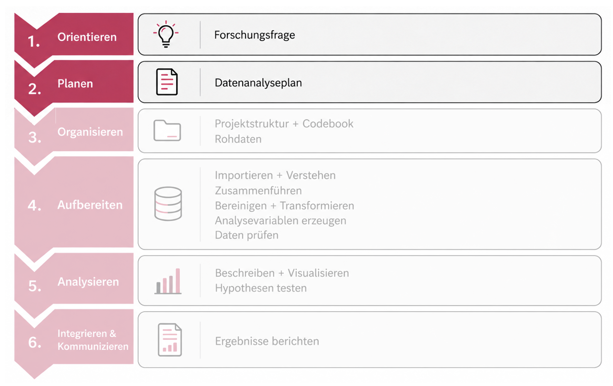{width="65%" fig-align="center"}

<br>

Heute bewegen wir uns von der inhaltlichen Orientierung zur konkreten Analyseplanung.

::: notes
ORIENTIEREN

Was untersucht die Studie? Welche Forschungsfragen und Hypothesen gibt es?

PLANEN

Welche Daten, Variablen und Analysen brauchen wir, um diese Fragen zu beantworten?

Bevor wir eine Analyse planen können, müssen wir verstehen, was überhaupt untersucht werden soll.

Explizit sagen, dass sie das Paper bisher nur überflogen haben. Die Orientierungsphase ist deshalb nicht abgeschlossen. Heute wird das Paper mit einem neuen Zweck gelesen: nicht nur "Was steht drin?", sondern "Welche Informationen brauche ich für meine spätere Analyse?".
:::

------------------------------------------------------------------------

## Heute

**Wie planen wir eine Datenanalyse so, dass unsere Entscheidungen nachvollziehbar und reproduzierbar sind?**

<br>

**WARUM?**

Replikationskrise → Warum Transparenz und Planung wichtig sind

**WAS?**

Open Science → Präregistrierung → Datenanalyseplan

**WIE?**

Grinschgl et al. verstehen → Reanalyse planen → Datenanalyseplan erstellen

------------------------------------------------------------------------

## Ergebnisse der Bedarfsanalyse (1)

**Was würdest du gerne in diesem Methodenseminar lernen?**

Hier sollen die zentralen genannten Punkte der Bedarfsanalyse betreffend dieser Frage zusammengefasst werden!

Dies erfolgt am Montag, wenn die Ergebnisse vorliegen.

Wenn möglich hier aus den genannten Punkte die Verbindung zwischen "Warum" und "Wie" mit dem Datenanalyseplan herstellen.

::: notes
Die Studierenden darauf hinweisen, dass Feedback gerne erwünscht ist! Sie können uns jederzeit rückmelden, wie gut es uns gelingt, unser Programm auf ihre Bedürfnisse und Wünsche abzustimmen.
:::

------------------------------------------------------------------------

## Ergebnisse der Bedarfsanalyse (2)

**Peer-Pairing**

::::: columns
::: {.column width="50%"}
**10:15 (n = 23)**

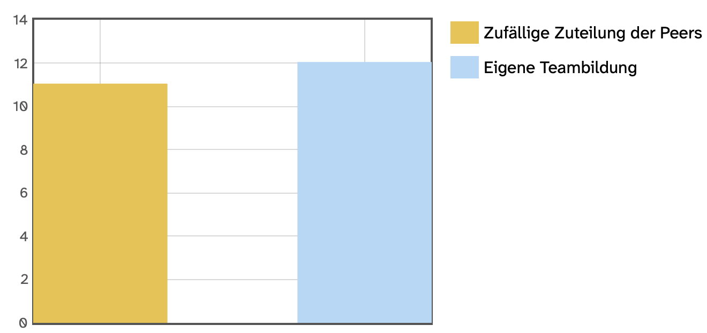{fig-align="right"}
:::

::: {.column width="50%"}
**16:15 (n = 17)**

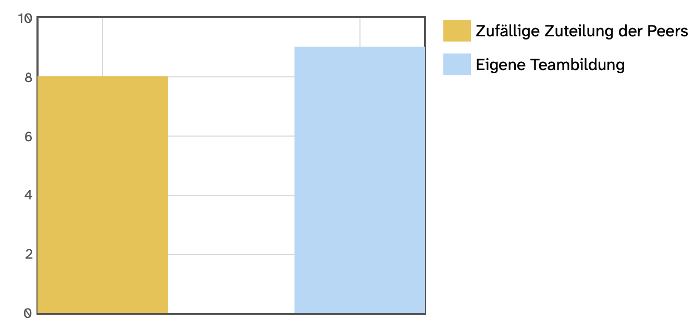{fig-align="right"}
:::
:::::

------------------------------------------------------------------------

## Peer-Pairing: Feedback & Austausch

<br>

**Wofür:** Gegenseitiges Feedback bei ausgewählten Aufgaben; weiterer Austausch und gegenseitige Unterstützung nach Bedarf.

**Vorgehen:** Bis Sonntag, 27.09. in ILIAS (Forum 2.Sitzung) beide Namen eurer 2er-Gruppe eintragen. Ein Eintrag pro Gruppe reicht.

Wer sich bis Sonntag nicht eingetragen hat, wird von uns zufällig einer 2er-Gruppe zugeteilt.

[{fig-align="center"}](https://img.freepik.com/vektoren-kostenlos/partner-die-grosse-puzzleteile-halten_74855-5278.jpg)

::: notes
Ihr arbeitet während des Semesters in einer festen 2er-Gruppe zusammen.

Während des Semesters gebt ihr euch dreimal gegenseitig bewertetes Feedback zu einer bestimmten zuvor abgegebenen Hausübung.

Euer Peer-Pair darf auch darüber hinaus eure feste Ansprechperson sein. Ihr könnt Fragen gemeinsam besprechen, Lösungen vergleichen, euch zusätzliches Feedback geben oder euch bei Unsicherheiten unterstützen. Ihr dürft euch also deutlich öfter als dreimal austauschen, müsst dies aber nicht!

Was jedoch wichtig ist, ist, dass die Abschlussarbeit eine Einzelleistung ist und individuell bewertet wird!
:::

# Warum Open Science? {.transition-slide}

<br>

**Die Replikationskrise als Motivation**

------------------------------------------------------------------------

## Interaktiver Einsteig: Menti

**Wann vertraut ihr einer wissenschaftlichen Studie?**

<br>

{fig-align="center" width="403"}

::: notes
Was braucht es aus eurer Sicht, damit wissenschaftliche Ergebnisse nachvollziehbar und überprüfbar sind? Wann vertraut ihr einer Studie?

Woran würdet ihr erkennen, dass ein Forschungsergebnis vertrauenswürdig und nachvollziehbar zustande gekommen ist?

**Überleitung:** Viele dieser Punkte werden uns heute wieder begegnen. Bevor wir uns anschauen, welche Lösungen die Forschung dafür entwickelt hat, schauen wir uns zunächst an, warum diese Fragen überhaupt so wichtig geworden sind.
:::

------------------------------------------------------------------------

## Replikationskrise: Prominenter Ausgangspunkt

::::: columns
::: {.column width="70%"}
-   Ausgangspunkt: 9 Studien, die darauf hinweisen, dass Personen «in die Zukunft sehen können» (Bem, 2011)

-   Etablierte psychologische Messmethoden (z.B. Priming)

-   Ein Ergebnis: Primes, die nach der Antwort präsentiert werden, beeinflussen Bewertung der Antwort

-   Starke Kritik, v.a. was Methodik betrifft; gerade kontroverse, „unwahrscheinliche“ Hypothesen sollten durch strikte, konfirmatorische Analysen überprüft werden (Francis, 2012; LeBel & Peters, 2011; Wagenmakers et al., 2011)

-   Diverse gescheiterte Replikationsversuche (Galak et al., 2012; Ritchie et al., 2012; Robinson, 2011)
:::

::: {.column width="30%"}
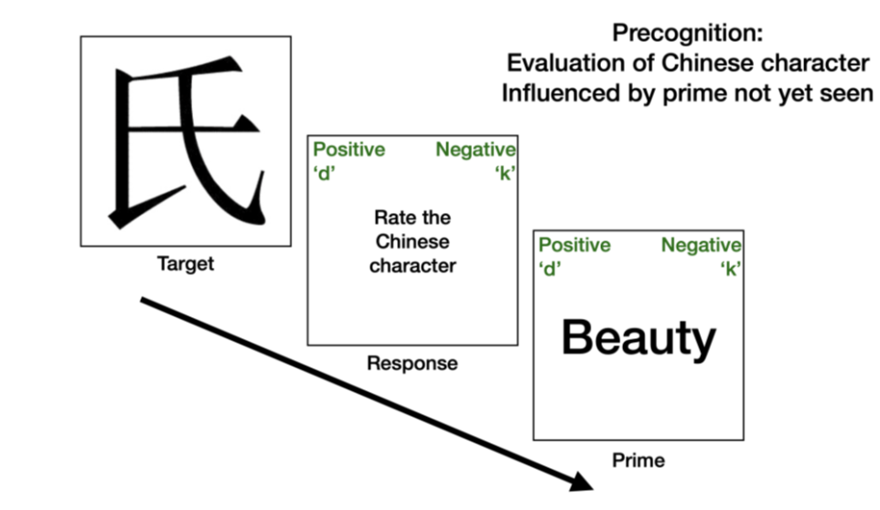{fig-align="right"}
:::
:::::

::: notes
Hier noch Notizen einfügen:

Bem nicht als alleinigen Ursprung der Replikationskrise darstellen. Eher als besonders absurder Fall, der als Katalysator für eine schon länger vorhandene Methodendiskussion diente.
:::

------------------------------------------------------------------------

## Replizierbarkeit & Reproduzierbarkeit

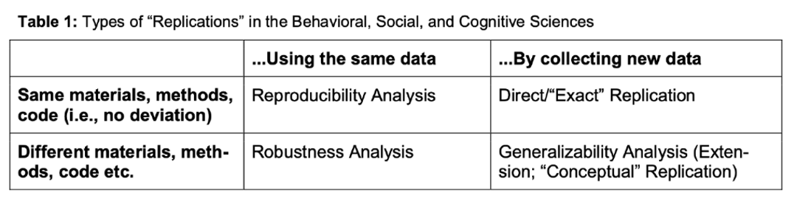{fig-align="center"}

::: notes
-   Reproduzierbarkeit = gleiche Daten, gleiche Analyse, gleiche Ergebnisse.

-   Replizierbarkeit = neue Daten, gleiche Methode, ähnliche Ergebnisse.

-\> Aufgrund von Bem haben sich Forschende das Ziel gesetzt, die Replizierbarkeit von etablierten Befunden zu prüfen.
:::

------------------------------------------------------------------------

## Wie gross ist das Problem?

**Open Science Collaboration (2015)**

Gemeinsames Projekt von 270 Forschenden

**Ziel:** systematische Replikation 100 publizierter Studien aus 3 anerkannten Journals

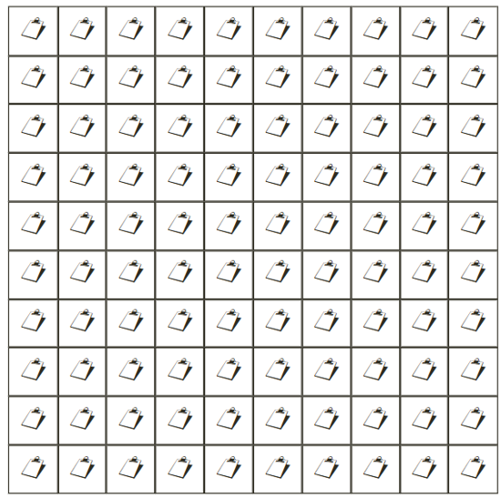{fig-align="center" width="400"}

------------------------------------------------------------------------

## Open Science Collaboration (2015)

-   ::: {style="color: green"}
    **97% der Originalstudien berichteten ein statistisch signifikantes Ergebnis.**
    :::

-   Wie viel % der Effekte liessen sich replizieren - was glaubt ihr?

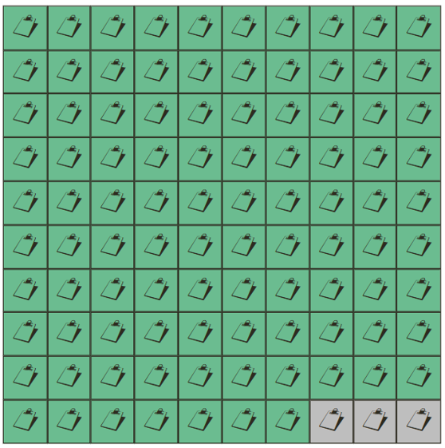{fig-align="center" width="400"}

------------------------------------------------------------------------

## Open Science Collaboration (2015)

:::: incremental
::: {style="color:red"}
-   Signifikante Ergebnisse in den Replikationsstudien: **36%**
-   Auch sind die beobachteten Effektgrössen in den Replikationsstudien im Schnitt halb so gross!

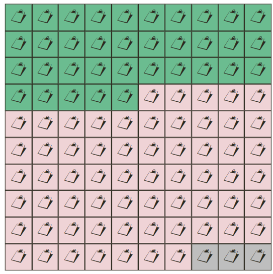{fig-align="center" width="400"}
:::
::::

------------------------------------------------------------------------

## Replikationskrise in anderen Fächern

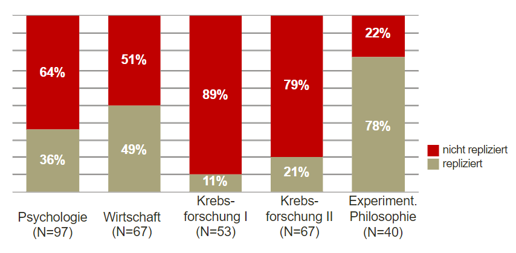{fig-align="center"}

------------------------------------------------------------------------

## Warum?

::: notes
Als kurze Denkpause nutzen.

Fragen: Wie kann es dazu kommen, dass publizierte Befunde bei erneuter Untersuchung so viel weniger stabil ausfallen?
:::

------------------------------------------------------------------------

## Gründe für die Replikationskrise

<br>

:::::: columns
::: {.column width="33%"}
**System & Publikation**

Anreizstrukturen

"publish or perish"

Publication Bias

Präfarenz für Neues
:::

::: {.column width="33%"}
**Studiendesign & Analyse**

kleines N / geringe Power

viele plausible Analysewege

optional stopping

multiple Tests
:::

::: {.column width="33%"}
**Berichten & Interpretieren**

selektive Berichterstattung

HARKing

Confirmation Bias

p-hacking
:::
::::::

<br>

Meist gibt es **nicht den einen Grund** - mehrere Faktoren greifen ineinander.

------------------------------------------------------------------------

## Von Entscheidungsspeilräumen bis zu wissenschaftlichem Fehlverhalten

<br>

:::::: columns
::: {.column width="33%"}
**Legitime Forschungsentscheidungen**

Mehrere fachlich vertretbare Möglichkeiten

*z.B. Transformation, Ausschlussregel, Modellwahl*

→ dokumentieren & begründen
:::

::: {.column width="33%"}
**Fragwürdige Forschungspraktiken**

Entscheidungen können Evidenz verzerren

*z.B. selektive Berichterstattung, HARKing, p-hacking*

→ erhöhtes Verzerrungsrisiko
:::

::: {.column width="33%"}
**Wissenschaftliches Fehlverhalten**

Absichtlicher Verstoss gegen wissenschaftliche Standards

*z.B. Fabrikation, Falsifikation, Manipulation*

→ schwerwiegender Regelverstoss
:::
::::::

<br>

Nicht jede analytische Flexibilität ist problematisch - entscheidend sind Transparenz, Begründung und Dokumentation.

------------------------------------------------------------------------

## **Extrembeispiele wissenschaftlichen Fehlverhaltens**

[**Top German psychologist fabricated data, investigation finds**](https://www.science.org/content/article/top-german-psychologist-fabricated-data-investigation-finds)

-   Der bekannte Psychologe Hans-Ulrich Wittchen soll in einer millionenschweren Studie Daten gefälscht und Whistleblower unter Druck gesetzt haben, was nun zu strafrechtlichen Ermittlungen und möglichen Sanktionen führt.

[**“Here’s the Unsealed Report Showing How Harvard Concluded That a Dishonesty Expert Committed Misconduct”**](https://statmodeling.stat.columbia.edu/2024/03/14/heres-the-unsealed-report-showing-how-harvard-concluded-that-a-dishonesty-expert-committed-misconduct/)

-   Die Forscherin Francesca Gino wird beschuldigt, Daten in mehreren Studien manipuliert zu haben, bestreitet jedoch die Vorwürfe und führt sie auf mögliche Fehler oder andere Personen zurück.

[**A Scandal in Alzheimer’s Research Shows How Science Can Go Astray**](https://www.chronicle.com/article/a-scandal-in-alzheimers-research-shows-how-science-can-go-astray)

-   Eine Untersuchung legt nahe, dass eine einflussreiche Alzheimer-Studie von 2006 manipulierte Bilder enthielt, was Zweifel an jahrelanger Forschung und der wissenschaftlichen Integrität aufwirft.

::: notes
Solche Fälle sind Extrembeispiele. Sie erklären die Replikationskrise nicht allein.

Sie zeigen aber, warum Transparenz, Dokumentation und Überprüfbarkeit zentrale Bestandteile guter Forschung sind.
:::

------------------------------------------------------------------------

## THE END IS NEAR

{width="450"}

::: incremental
-   **Oder?**

-   Die Replikationskrise zeigt nicht nur Probleme - sie hat auch zu zahlreichen Reformen geführt.

-   *„Science is never perfect, but what this crisis has shown is that there is never a shortage of scientists who will keep trying to make it better.”* (Maki Naro)
:::

------------------------------------------------------------------------

## Lösungsansätze - Open Science

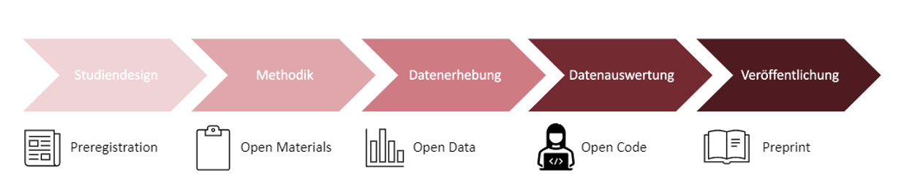{fig-align="center"}

<br>

Open Science ist kein einzelnes Tool, sondern ein Bündel von Praktiken für transparentere und überprüfbarere Forschung.

::: notes
Die detaillierten Folien aus dem letzten Semester streichen und hier einfach mündlich einordnen.

**Präregistrierung:** Die zentralen Aspekte der Studie (Hypothesen, Stichprobe, Analysemethoden) werden vor der Durchführung der Studie festgelegt. Dies ist auch erst vor der Datenanalyse möglich, dass Datenanalyseplan.

Präregistrierung wird veröffentlicht, erhält einen Zeitstempel und ist schreibgeschützt.

-   www.osf.io
-   [Verschiedene Templates](https://help.osf.io/article/229-select-a-registration-template)

**Open Material, Data & Code:** Untersuchungsmaterial (Fragebogen, Stimuli, etc.) wird online zur Verfügung gestellt. Die Daten werden in anonymisierter Form veröffentlicht. Reproduzierbare Analyseskripte und Codebooks werden zur Verfügung gestellt.

**Preprints:** Version des Manuskripts vor Peer-Review, Postprint Version des Manuskripts nach Peer-Review.

-\> Diese Schritte erlauben, Ergebnisse zu überprüfen, erhöhen die Glaubwürdigkeit in Forschung und stärken die gefunden Ergebnisse.
:::

------------------------------------------------------------------------

## Fokus heute: Entscheidungen vor der Analyse festhalten

**Präregistrierung**

-   Zentrale Entscheidungen einer Studie werden festgehalten, bevor sie umgesetzt bzw. anhand der Ergebnisse angepasst werden können.

-   Z.B. Hypothesen, Stichprobe, Ausschlussregeln, Analysen.

-   Erfolgt vor der Datenerhebung.

-   "It's a plan, not a prison".

**Datenanalyseplan**

-   Bei bereits bestehenden Daten.

-   Analyseentscheidungen können vor der geplanten Analyse dokumentiert werden.

::: notes
Hier unbedingt differenzieren: Wie erstellen keine echte Präregistrierung, weil wir das Paper und auch die Resultate bereits kennen. Die Daten wurden bereits erhoben und liegen vor.

Unser Datenanalyseplan ist eine Rekonstruktion und Planung einer Reanalyse.
:::

------------------------------------------------------------------------

## Was bedeutet das nun für uns?

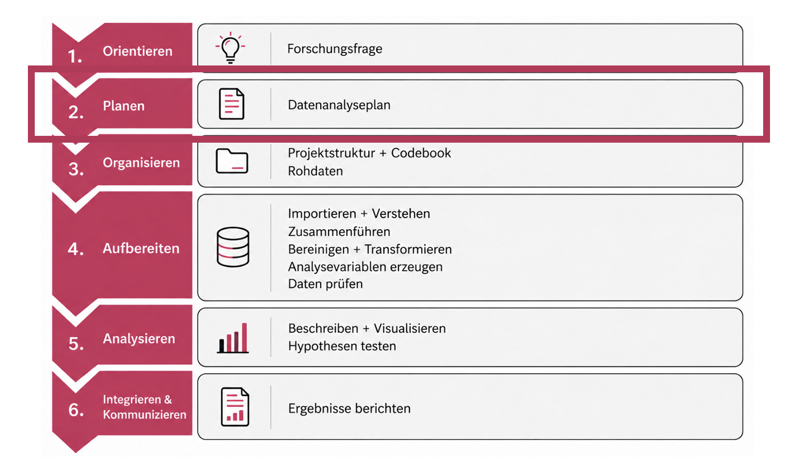{width="450"}

Ein Datenanalyseplan beschreibt möglichst konkret, welche Daten und Variablen wir benötigen, wie wir mit ihnen umgehen und mit welchen Analysen wir unsere Forschungsfragen beantworten wollen.

------------------------------------------------------------------------

## Warum diese Arbeit jetzt - und nicht erst beim Analysieren?

-   **Orientierung:** Was will ich eigentlich beantworten?

-   **Unklarheiten früh erkennen:** Welche Informationen fehlen noch?

-   **Weniger spontane Entscheidungen:** Weniger Raum für ergebnisgetriebene Anpassungen.

-   **Fahrplan für den Code:** Welche Schritte muss mein R-Skript später enthalten?

-   **Kommunikation:** Andere können mein Vorgehen verstehen.

-   **Reproduzierbarkeit:** Entscheidungen bleiben nachvollziehbar.

<br>

**Ein guter Analyseplan kostet zunächst Zeit - und spart später sehr viel Zeit!**

::: notes
Wenn man diese Punkte vor der Datenerhebung gut durchdenkt, spart man sich bei der Analyse viel Aufwand und reduziert die Mehrheit der Probleme!
:::

------------------------------------------------------------------------

## Datenanalyseplan als Brücke zwischen Theorie und Code

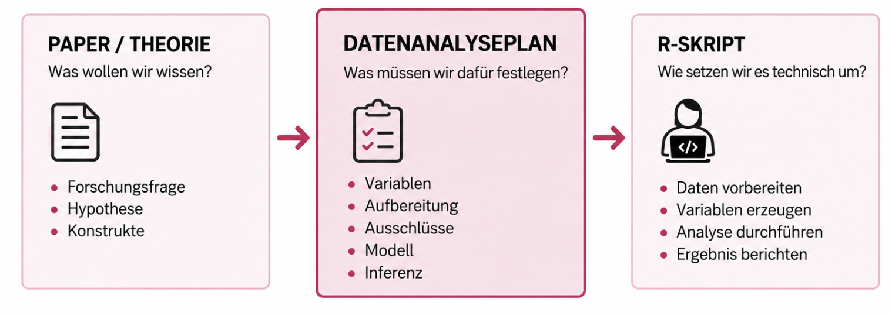{width="450"}

**Der Plan sagt uns nicht nur, welchen Code wir brauchen, sondern *warum* wir ihn brauchen.**

------------------------------------------------------------------------

## Was gehört in einen Datenanalyseplan?

Welche Entscheidungen müssen wir festhalten?

<br>

::::::: columns
::: {.column width="25%"}
**1) Forschungsziel**

-   Kurzbeschreibung

-   Forschungsfragen

-   Hypothesen

-   explorative Fragestellungen
:::

::: {.column width="25%"}
**2) Daten**

-   Datenzugang

-   Stichprobe & Datenerhebung

-   Vorkenntnisse zu den Daten
:::

::: {.column width="25%"}
**3) Aufbereitung**

-   UVs & AVs

-   Missing Data

-   Ausschlussregeln

-   berechnete Variablen
:::

::: {.column width="25%"}
**4) Analysen**

-   statistische Modelle

-   Interaktionen & Post-hoc Tests

-   Inferenzkriterien

-   Effektstärken
:::
:::::::

<br>

**Diese Entscheidungen werden später zu konkreten Arbeitsschritten in R.**

------------------------------------------------------------------------

## Unser Forschungsprojekt: Grinschgl et al. (2020)

***From metacognitive beliefs to strategy selection: does fake performance feedback influence cognitive offloading?***

-   3 Feedbackgruppen

-   N = 159 valide Datensätze

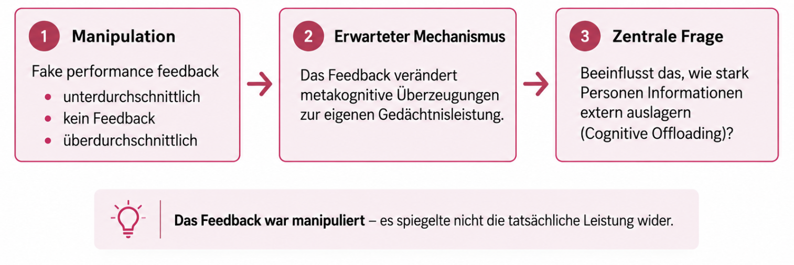{width="450"}

------------------------------------------------------------------------

## Studiendesign: Wie lief die Studie ab?

<br>

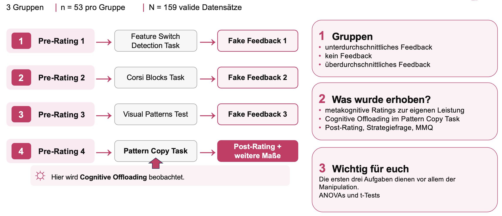{width="450"}

------------------------------------------------------------------------

## Paper + Präregistrierung

Zwei Informationsquellen, die herangezogen werden sollen:

::::: columns
::: {.column width="50%"}
**Paper** 📄

Was wurde begründet, durchgeführt & berichtet?

-   theoretischer Hintergrund

-   Studiendesign & Ablauf

-   Operationalisierung der Variablen

-   berichtete Analysen

-   Ergebnisse

-   zusätzliche explorative Analysen

→ zeigt, was tatsächlich im Artikel dargestellt wurde
:::

::: {.column width="50%"}
**Präregistrierung** 📋

Was war vor der Datenerhebung bereits festgelegt?

-   Forschungsfragen & Hypothesen

-   Stichprobengrösse

-   Ausschlusskriterien

-   unabhängige & abhängige Variablen

-   geplanter Analyseplan

-   Präregistirert auf OSF <https://osf.io/9hpz5>

→ ACHTUNG: Kein optimales Beispiel, an manchen Stellen zu knapp!
:::
:::::

------------------------------------------------------------------------

## Euer Datenanalyseplan

<br>

### Ihr erstellt einen Plan dafür, wie ihr die publizierten Analysen von Grinschgl et al. (2020) reproduzieren würdet.

<br>

**Ihr plant keine neue Studie, sondern rekonstruiert die publizierten Analysen nachvollziehbar.**

**Ziel:** Die Informationen aus Paper und Präregistrierung so zusammenführen, dass daraus ein konkreter und nachvollziehbarer Analysefahrplan wird.

------------------------------------------------------------------------

## Vorhandene Materialien (1)

Alle relevanten Dokumente finden sich auf ILIAS im ZIP-Ordner des Abschlussprojekts:

<br>

1.  ***Grinschgl et al. (2020):*** **Originalversion (ohne Kommentare)**

-   Primäre wissenschaftliche Grundlage

-   Hier findet sich die Mehrheit der benötigten Informationen

<br>

2.  ***Grinschgl et al. (2020):*** **Version mit Kommentaren**

-   Enthält Hinweise, zu welchen Fragen des Datenanalyseplans bestimmte Textstellen gehören

-   Auch Hinweis zu einer Analyse (Offloading strategies), die nicht repliziert werden muss!

------------------------------------------------------------------------

## Vorhandene Materialien (2)

Alle relevanten Dokumente finden sich auf ILIAS im ZIP-Ordner des Abschlussprojekts:

<br>

3.  **Präregistrierung zur Studie (OSF)**

-   Enthält zusätzliche Informationen, die nicht in der Studie enthalten sind

<br>

4.  **Vorlage für den Datenanalyseplan (nach *van den Akker et al., 2021)***

-   Verbindliche Struktur eures Dokuments

-   Kommentare & Anleitungen nicht entfernen, sondern nur die grauen Felder mit den passenden Informationen ergänzen

-   Führt euch Schritt für Schritt durch den Plan

-   Einige Felder lassen mehr Spielraum als andere. Es gibt deshalb nicht die eine perfekte Formulierung!

-   Daumenregel: So lang wie nötig, so kurz wie möglich. Eine andere Person sollte den Analyseplan ohne weitere Informaitonen nachvollziehen und umsetzen können.

------------------------------------------------------------------------

## Offene Fragen?

{width="450" fig-align="center"}

------------------------------------------------------------------------

## **Hands-on Block 1 fortsetzen**

[Link zu den Übungen](https://r-you-ready.github.io/Webseite_HS26_Seminar/scripts/02_excercises/loesung_1.html)

------------------------------------------------------------------------

## **Heute haben wir:**

<br>

**WARUM?**

Wissenschaftliche Analysen enthalten viele Entscheidungen.

Transparenz darüber erhöht Nachvollziehbarkeit und Überprüfbarkeit.

**WAS?**

Open Science bietet verschiedene Werkzeuge dafür.

Unser heutiger Schwerpunkt: **Präregistrierung & Datenanalyseplan.**

**WIE?**

Wir übersetzen Informationen aus **Paper + Präregistrierung** in einen konkreten Plan für unsere spätere Analyse.

<br>

Wir wissen jetzt nicht nur, was untersucht wurde, sondern auch, wie wir die späteren Analysen planen.

------------------------------------------------------------------------

## Aufträge & Hausübungen

**Peer-Pairing (bis Sonntag, 27.09.)**

-   2er-Gruppe in ILIAS-Forum eintragen (1x pro Gruppe)

-   übrige Studierende werden zufällig zugeteilt

**Datenanalyseplan (bis Mittwoch, 07.10.)**

-   📖 Paper gründlich lesen

-   🔎 Präregistrierung ansehen

-   📝 mit dem Datenanalyseplan beginnen

**Coding**

-   💻 Hands-on Block 1 fertig bearbeiten

-   Musterlösungen & Download ab 30.09. verfügbar

**Nächste Woche**

ORGANISIEREN: Projektstruktur, Codebook und Rohdaten der Originalstudie

------------------------------------------------------------------------

## Weitere Ressourcen: mehr zu Open Science

-   Pennington, C. R. (2023). A student’s guide to open science: Using the replication crisis to reform psychology. McGraw Hill​.

-   Open Science an der Universität Bern: <https://www.ub.unibe.ch/service/open_science/index_ger.html> ​

-   Blogs über aktuelle Themen: <https://datacolada.org>

-   Journal Club: <https://reproducibilitea.org>

-   Comic: <https://thenib.com/repeat-after-me/?utm_campaign=web-share-links&utm_medium=social&utm_source=link>

-   Lehrveranstaltungen der Abteilung „Psychologie der Digitalisierung“- Meta-Wissenschaft <https://www.dig.psy.unibe.ch/studium/lehrveranstaltungen/index_ger.html>

-   „Spellchecker“ für Statistik <https://michelenuijten.shinyapps.io/statcheck-web/>

------------------------------------------------------------------------

## Referenzen:

Bem, D. J. (2011). Feeling the future: Experimental evidence for anomalous retroactive influences on cognition and affect. *Journal of Personality and Social Psychology, 100*, 407–425. <https://doi.org/10.1037/a0021524>

Francis, G. (2012). Too good to be true: Publication bias in two prominent studies from experimental psychology. *Psychonomic Bulletin & Review, 19*, 151–156. <https://doi.org/10.3758/s13423-012-0227-9>

Galak, J., LeBoeuf, R. A., Nelson, L. D., & Simmons, J. P. (2012). Correcting the past: Failures to replicate psi. *Journal of Personality and Social Psychology, 103*(6), 933–948. <http://dx.doi.org/10.1037/a0029709>

Grinschgl, S., Meyerhoff, H. S., Schwan, S., & Papenmeier, F. (2021). From metacognitive beliefs to strategy selection: Does fake performance feedback influence cognitive offloading? *Psychological Research, 85*, 2654–2666. <https://doi.org/10.1007/s00426-020-01435-9>

Hofer, G. (2024, April 23). *Open Science* \[Course presentation\]. University of Graz.

John LK, Loewenstein G, Prelec D (2012). Measuring the prevalence of questionable research practices with incentives for truth telling. Psychol Sci. 2012 May 1;23(5):524-32. <https://doi.org/10.1177/0956797611430953.>

LeBel, E. P., & Peters, K. R. (2011). Fearing the future of empirical psychology: Bem’s (2011) evidence of psi as a case study of deficiencies in modal research practice. *Review of General Psychology, 15*(4), 371–379. <https://doi.org/10.1037/a0025172>

Open Science Collaboration. (2015). Estimating the reproducibility of psychological science. *Science, 349*(6251), Article aac4716. <https://doi.org/10.1126/science.aac4716>

Pennington, C. R. (2023). *A student’s guide to open science: Using the replication crisis to reform psychology*. McGraw Hill.

------------------------------------------------------------------------

Ritchie, S. J., Wiseman, R., & French, C. C. (2012). Failing the future: Three unsuccessful attempts to replicate Bem’s ‘Retroactive Facilitation of Recall’ effect. *PloS One, 7*(3), Article e33423. <https://doi.org/10.1371/journal.pone.0033423>

Robinson, E. (2011). Not feeling the future: A failed replication of retroactive facilitation of memory recall. *Journal of the Society for Psychical Research, 75*, 142–147.

Schönbrodt, F. (2023). *Open Science: An overview and first easy steps*. <https://osf.io/nf2rg>

Stefan, A. M., Schönbrodt, F., & Schiestel, L. (2023). *An introduction to Open Science*. <https://osf.io/vza25>

Wagenmakers, E.-J., Wetzels, R., Borsboom, D., & van der Maas, H. L. J. (2011). Why psychologists must change the way they analyze their data: The case of psi: Comment on Bem (2011). *Journal of Personality and Social Psychology, 100*(3), 426–432. <https://doi.org/10.1037/a0022790>

Van Den Akker, O. R., Weston, S., Campbell, L., Chopik, B., Damian, R., Davis-Kean, P., Hall, A., Kosie, J., Kruse, E., Olsen, J., Ritchie, S., Valentine, K., Van ’T Veer, A., & Bakker, M. (2021). Preregistration of secondary data analysis: A template and tutorial. *Meta-Psychology, 5*. <https://doi.org/10.15626/MP.2020.2625>
