## R u Ready? Reproduzierbare Datenaufbereitung und -analyse mit R

HS 2026<br><br><br> **Seminarleitung**: Dr. Sandra Grinschgl<br> **Leitung beider Seminargruppen:** MSc. Laura Hirt<br> **Tutor**: BSc. Jan-Pierre Pahnke<br><br><br>**3. Einheit**, 30.09.2026

{fig-align="center" width="306"}

------------------------------------------------------------------------

## Fragen zum Datenanalyseplan?

{fig-align="center" width="306"}

::: notes
Hier den Studierenden Platz lassen, um offene Fragen zum Datenanalyseplan zu stellen.

Evtl. anmerken, dass die Instruktionen auf der Vorlage noch etwas überarbeitet wurden. Erneuter Download evtl. nötig.

Auch aufzeigen, dass auf der Homepage die detaillierten Instruktionen zu finden sind.

Auch sagen, dass auf ILIAS der Abgabeordner eingerichtet ist und Abgaben auch vorher schon möglich sind.
:::

------------------------------------------------------------------------

## Fragen zu Hands-on Block 1?

-   Was hat euch Schwierigkeiten bereitet?

-   Welche Aufgabe sollen wir gemeinsam anschauen?

-   Gibt es noch Unklarheiten?

-   **Musterlösungen ab jetzt online.**

    ::: notes
    Kurz auf Webseite die Musterlösungen zeigen.

    Auch zeigen, wie sie diese herunterladen können.
    :::

------------------------------------------------------------------------

## Peer-Pairings 10:15

Liste auch auf ILIAS

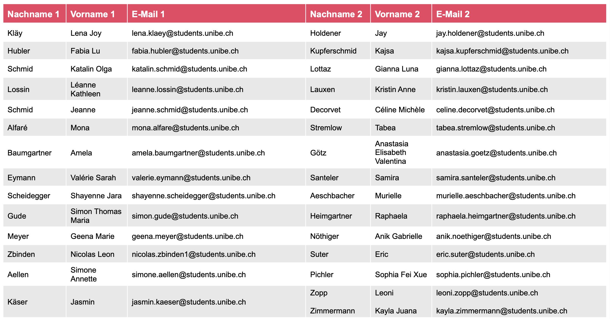

::: notes
Hier seht ihr die Gruppenzuteilung für das Peer-Feedback.

Jeweils auch die Email-Adresse angegeben, da ihr eure Abgaben einerseits auf ILIAS hochladet und andererseits diese eurem Peer-Partner oder eurer Peer-Partnerin auch per Mail zukommen lasst.

Da wir hier eine ungrade Anzahl an Personen sind, gibt es eine Dreiergruppe.
:::

------------------------------------------------------------------------

## Peer-Pairings 16:15

Liste auch auf ILIAS

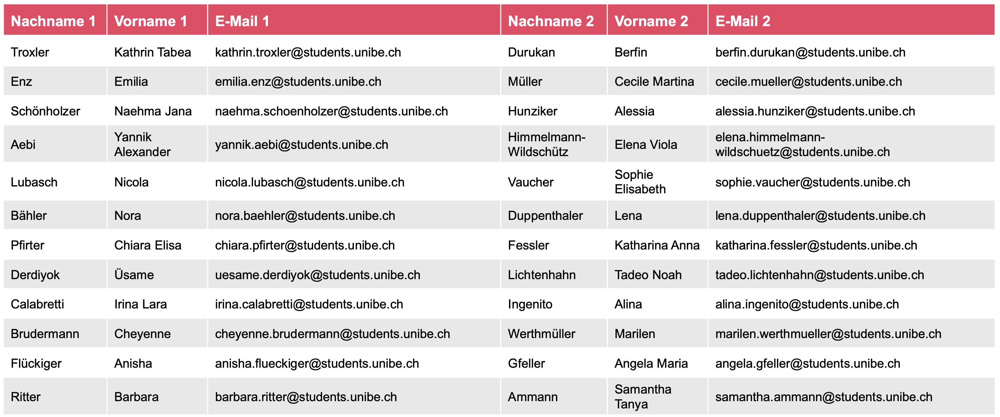

::: notes
Damit sind nun die organisatorischen Punkte geklärt. Wir gehen nun zurück zu unserem Forschungsprojekt.
:::

------------------------------------------------------------------------

## Semesterplan

Wird evtl. noch angepasst und aktualisiert!

::: {style="width:100%; height:80vh; background:#777; padding:20px; box-sizing:border-box; border-radius:10px; overflow:auto; "}
```{=html}
<embed
    src="../../PDFs/Semesterplan_HS26.pdf#view=FitH&navpanes=0&toolbar=0"
    type="application/pdf"
    style="width:100%; height:220vh; border:0; display:block; background:white;"
  >
```
:::

------------------------------------------------------------------------

## Wo befinden wir uns?

**PLANEN -\> ORGANISIEREN**

<br>

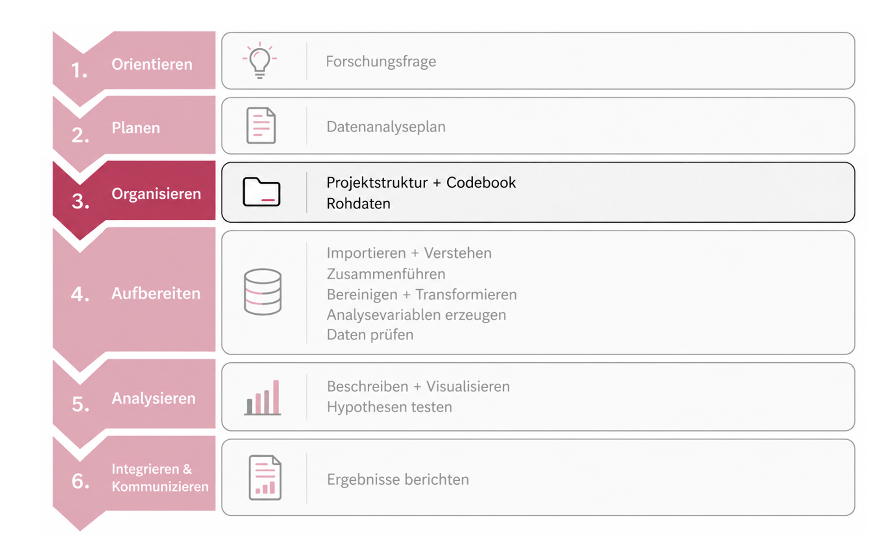{width="65%" fig-align="center"}

<br>

Heute schaffen wir die Struktur, in der wir unser Forschungsprojekt reproduzierbar bearbeiten können.

::: notes
Auch heute möchte ich uns zunächst im Gesamtprozess verorten. In der ersten Einheit haben wir uns orientiert und unser Forschungsprojekt kennengelernt. Letzte Woche haben wir geplant: Welche Fragen wollen wir beantworten, welche Variablen brauchen wir und welche Analysen sind dafür vorgesehen?

Jetzt gehen wir einen Schritt weiter. Bevor wir anfangen können, die Rohdaten tatsächlich zu bearbeiten, müssen wir dafür sorgen, dass Daten, Code und Dokumentation sinnvoll organisiert sind. Wir wechseln deshalb heute in die Phase ORGANISIEREN.

Das klingt vielleicht zunächst weniger spannend als Daten zu analysieren - ist aber die Voraussetzung dafür, dass wir später überhaupt nachvollziehen können, was wir mit unseren Daten gemacht haben.
:::

------------------------------------------------------------------------

## Heute

**Wie organisieren wir ein Forschungsprojekt so, dass Daten, Code und Entscheidungen nachvollziehbar und reproduzierbar bleiben?**

<br>

**WARUM?**

Forschungsdatenmanagement → Warum gute Organisation Teil guter Forschung ist

**WIE ORGANISIEREN?**

FAIR → Psych-DS → unser vorbereitetes Forschungsprojekt

**WIE DOKUMENTIEREN?**

R-Projekt & Quarto → Processing und Analysis reproduzierbar festhalten

**WAS BESCHREIBEN?**

Codebook → Daten und Variablen verständlich dokumentieren

------------------------------------------------------------------------

## Vom Analyseplan zum arbeitsfähigen Forschungsprojekt

**Der Plan steht - aber damit können wir noch keine Analyse ausführen.**

<br>

:::::: columns
::: {.column width="33%"}
📄 **Datenanalyseplan**
:::

::: {.column width="33%"}
**Brückenbausteine**

-   📁 Projektstruktur

-   📦 Daten

-   📝 Dokumentation

-   💻 Code
:::

::: {.column width="33%"}
📊 **Reproduzierbares Ergebnis**
:::
::::::

<br>

**Erst wenn diese vier Dinge zusammenspielen, wird aus einem Plan ein ausführbares und reproduzierbares Projekt.**

::: notes
Letzte Woche haben wir mit dem Datenanalyseplan sehr präzise festgelegt, was wir untersuchen wollen, welche Variablen wir brauchen, wie wir sie aufbereiten möchten und welche Analysen wir rechnen wollen.

Aber ein guter Analyseplan ist noch keine ausführbare Analyse.

Zwischen Plan und Ergebnis liegt noch ein ganzes Stück Arbeit. Wir brauchen erstens eine klare Projektstruktur, zweitens die eigentlichen Daten, drittens eine saubere Dokumentation und viertens reproduzierbaren Code.

Und entschiedend ist: Diese vier Dinge dürfen nicht nebeneinander her existieren, sondern müssen zusammenpassen.

Genau diese Verbindung schauen wir uns heute an. Und genau darum geht es beim Forschungsdatenmanagement.
:::

------------------------------------------------------------------------

## Forschungsdatenmanagement

***Planung, Organisation, Speicherung, Dokumentation und Archivierung von Daten über den gesamten Forschungsprozess***

<br>

::::: columns
::: {.column width="70%"}
**Ziele von Datenmanagement:**

-   Qualität sichern

-   Nachvollziehbarkeit ermöglichen

-   Datenverlust und Fehlversionen vermeiden

-   Reproduzierbarkeit & Wiederverwendung ermöglichen

    -\> gute wissenschaftliche Praxis
:::

::: {.column width="30%"}
[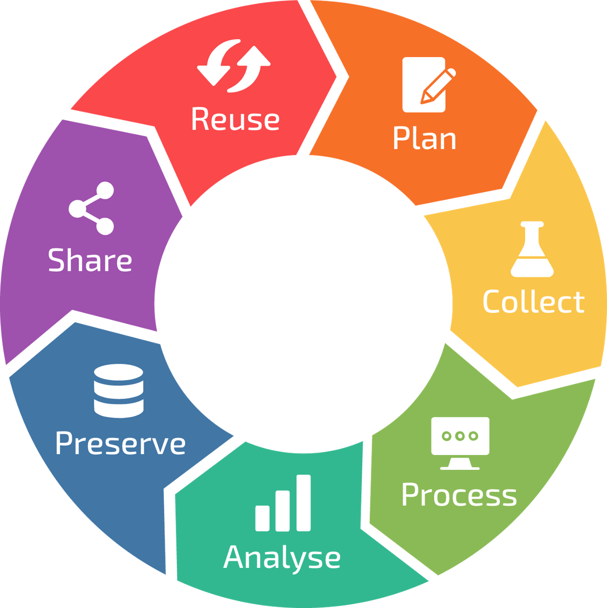](Quellen:%20https://www.unilu.ch/forschung/open-science/forschungsdatenmanagement/)
:::
:::::

<br>

**Gutes Datenmanagement macht den Forschungsprozess nachvollziehbar - nicht nur die Endergebnisse.**

::: notes
Forschungsdatenmanagement klingt zunächst etwas administrativ. Gemeint ist aber etwas sehr Praktisches: Wie gehen wir über den gesamten Forschungsprozess hinweg mit unseren Daten um? Wo liegen sie? Welche Version ist aktuell? Was wurde verändert? Wie dokumentieren wir diese Veränderungen? Und kann jemand anderes später noch nachvollziehen, wie wir von den Rohdaten zu unseren Ergebnissen gekommen sind?

Genau deshalb geht es nicht nur ums Abspeichern von Dateien. Gutes Datenmanagement hilft uns, Qualität zu sichern, Entscheidungen nachvollziehbar zu machen und den gesamten Prozess reproduzierbar zu halten.
:::

------------------------------------------------------------------------

## FAIR: eine Leitidee für gut nutzbare Forschungsdaten

::::: columns
::: {.column width="55%"}
**FAIR bedeutet:**

-   **F:** Daten und Metadaten sollen auffindbar sein

-   **A:** sie sollen zugänglich sein

-   **I:** sie sollen mit anderen Systemen und Standards zusammenarbeiten können

-   **R:** sie sollen verständlich dokumentiert und wiederverwendbar sein
:::

::: {.column width="45%"}
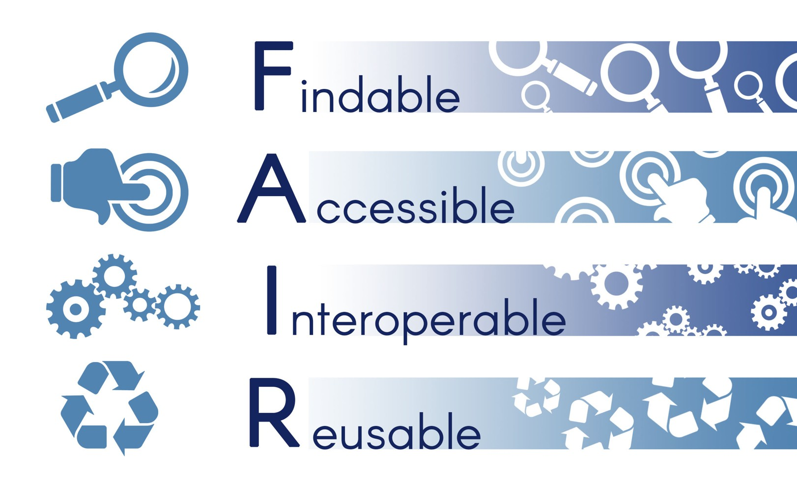{fig-alt="https://www.go-fair.org/fair-principles/" width="100%"}
:::
:::::

<br>

**Für unser Seminar:** Wir übernehmen vor allem die Grundidee - klare Struktur, gute Dokumentation und nachvollziehbarer Code.

::: notes
Ein sehr verbreitetes Leitprinzip für Forschungsdaten sind die sogenannten FAIR-Prinzipien. FAIR steht für Findable, Accessible, Interoperable und Reusable.

Wir müssen heute nicht die einzelnen formalen Unterregeln lernen. Für uns ist vor allem die Grundidee wichtig: Forschungsdaten sollten so organisiert und dokumentiert sein, dass sie gefunden, verstanden und später wiederverwendet werden können.

Und genau das setzen wir in unserem Projekt praktisch um: durch eine klare Ordnerstruktur, nachvollziehbare Dokumentation und reproduzierbaren Code.

**Übergang:** FAIR sagt uns also eher, welche Eigenschaften gut organisierte Forschungsdaten haben sollten. Die nächste Frage ist: Wie kann so eine Struktur in einem psychologischen Forschungsprojekt konkret aussehen? Dafür schauen wir uns jetzt Psych-DS an.
:::

------------------------------------------------------------------------

## Psych-DS: Struktur für Forschungsprojekte

**FAIR beschreibt Prinzipien, Psych-DS macht die Organisation konkret.**

<br>

::::: columns
::: {.column width="50%"}
-   Standardisierte Projektstruktur

-   Daten, Code und Dokumentation erhalten feste Orte

-   erleichtert Zusammenarbeit und Reproduzierbarkeit
:::

::: {.column width="50%"}
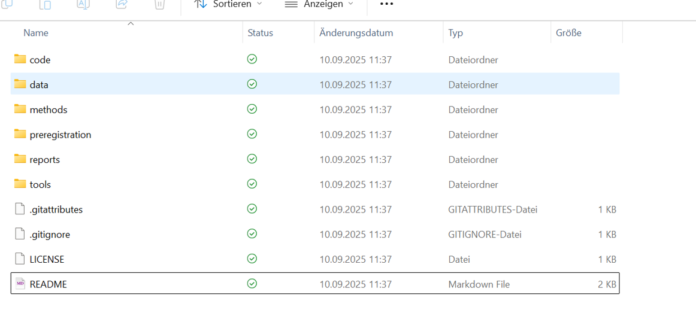
:::
:::::

<br>

**Ein Standard von mehreren möglichen Standards.**

::: notes
FAIR hat uns gerade eher beschrieben, welche Eigenschaften gut organisierte Forschungsdaten haben sollten. Es sagt uns aber noch nicht konkret, wie ein Forschungsprojekt auf unserem Computer aussehen soll.

Genau hier wird Psych-DS konkreter. Psych-DS schlägt für pschologische Forschungsprojekte eine standardisierte Struktur vor, in der Daten, Code und weitere Studiendokumente feste Orte bekommen.

Dadurch muss man nicht bei jedem Projekt neu entscheiden, wo etwas gespeichert wird, und auch andere Personen können sich leichter orientieren.

Wichtig ist aber: Psych-DS ist nicht die einzig mögliche richtige Struktur. Es ist ein Standard von mehreren möglichen Standards. Für unser Seminar verwenden wir eine leicht angepasste Version davon.

-\> Und wie sieht diese angepasste Version konkret aus? Genau das schauen wir uns jetzt in eurem tatsächlichen Projekt an.
:::

------------------------------------------------------------------------

## Für unser Seminar: Die Projektstruktur ist bereits vorgegeben

**Ihr müsst die Struktur nicht selbst erstellen - ihr müsst lernen, sie korrekt zu nutzen.**

<br>

::::: columns
::: {.column width="50%"}
#### **Wir stellen bereit**

📁 **Projektgerüst:** R-Projekt & Psych-DS-Ordnerstruktur

📦 **Daten & Metadaten:** Rohdaten, Dateninformationen, Codebook-Vorlage

📄 **Forschungsdokumente:** Paper, Präregisitrierung, unterstützende Dokumente

💻 **Arbeitsvorlagen:** `processing.qmd` & `analysis.qmd`
:::

::: {.column width="50%"}
#### **Eure Aufgabe**

**Orientieren:** wissen, wo was hingehört

**Sauber arbeiten:** Rohdaten unverändert lassen und Dateien am vorgesehenen Ort verwenden

**Dokumentieren:** Daten und Verarbeitung nachvollziehbar beschreiben

**Reproduzierbar arbeiten:** den Weg von den Rohdaten bis zum Ergebnis durch Code abbilden
:::
:::::

::: notes
Bevor wir uns diese Struktur gleich konkret anschauen, ist mir eine Sache wichtig: ihr müsst dieses Projektgerüst nicht selbst erstellen.

Ihr habt von uns ein vorbereitetes R-Projekt mit einer klaren Ordnerstruktur, den Rohdaten, den benötigten Studiendokumenten, einer Codebook-Vorlage und bereits angelegten Quarto-Dateien für Datenaufbereitung und -analyse erhalten.

Die eigentliche Kompetenz besteht also nicht darin, Ordner anzulegen. Ihr sollt verstehen, warum diese Struktur so aufgebaut ist und lernen, sie konsequent zu nutzen.
:::

------------------------------------------------------------------------

## Live-Tour: Unser Forschungsprojekt

<br>

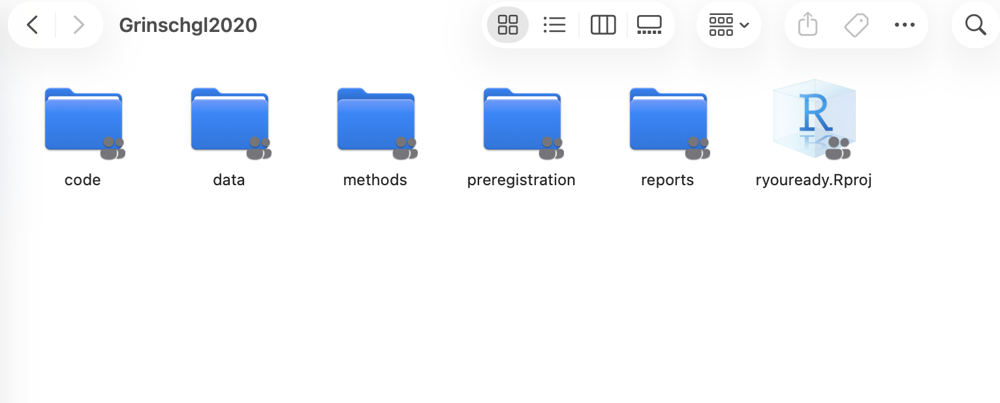

::: notes
**Schritt 1: Das Projekt über .Rproj öffnen**

Zunächst den entpackten Ordner zeigen und dann das Projekt öffnen.

Dadurch öffnet sich R-Studio. Kurz oben rechts zeigen, dass das Projekt geöffnet ist.

Sagen: Wenn ihr mit diesem Projekt arbeitet, öffnet ihr nicht einfach irgendwo RStudio und such anschliessend nach euren Dateien. Ihr startet über diese .Rproj-Datei. Damit weiss RStudio, zu welchem Projekt unsere Daten, unser Code und unsere Dokumente gehören.

Was ein r-Projekt genau macht und warum uns das bei Dateipfaden hilft, schauen wir uns gleich noch genauer an.

**Schritt 2: Zuerst die oberste Ebene zeigen**

Sagen: Hier sehen wir jetzt die Psych-DS-Logik, die wir gerade abstarkt kennengelernt haben, in unserem tatsächlichen Projekt. Unterschiedliche Arten von Projektbestandteilen bekommen unterschiedliche Orte.

Einzelne Ordner wie "methods" werden für unser Seminar keine zentrale Rolle spielen. Wir konzentrieren uns auf diejenigen Bereiche, mit denen wir tatsächlich arbeiten.

**Schritt 3 - `reports`: Woher kommt unsere Forschungsfrage**

Sagen: Hierdrin liegen die beiden Paper-Versionen. Diese kennen wir bereits aus den ersten beiden Terminen. Von hier kommen unsere Forschungsfragen, das Studiendesign und ein grosser Teil der Informationen darüber, was überhaupt erhoben wurde.

Das ist also eine unserer inhaltlichen Informationsquellen.

**Schritt 4 - `preregistration`: Von der Forschungsfrage zum Plan**

Sagen: Direkt daneben liegt die Planungsebene. Hier finden wir die ursprüngliche Präregistrierung und die Vorlage für den Datenanalyseplan, mit dem ihr gerade arbeitet.

**Schritt 5 - `data`: der wichtigste Teil der heutigen Tour**

Sagen: Dieser Ordner wird uns in den nächsten Wochen sehr häufig beschäftigen. Und hier sehr ihr bereits eine wichtige Trennung.

**data/raw**

Hier liegen die sieben ursprünglichen Rohdatensätze der Studie. Genau diese Dateien sind unser Ausgangspunkt.

Wichtig: Diese Dateien werden von uns nicht manuell verändert! Wenn später eine Variable umbenannt, rekodiert oder berechnet werden muss, öffnen wir nicht Excel und speichern eine veränderte Version über die Rohdatei. Die Veränderung wird durch Code dokumentiert.

**data/processed**

Sagen: Dieser Ordner ist momentan noch leer. Das ist kein Fehler!

Hier werden später Datensätze landen, die wir aus den Rohdaten reproduzierbar erzeugt haben.

raw bekommt ihr also als Ausgangsmaterial, processed erzeugt ihr selbst durch Code.

**data/outputs**

Sagen: Noch weiter hinten im Prozess liegen die Outputs. Wenn wir später Abbildungen oder andere Ergebnisse erzeugen und abspeichern, haben auch diese ihren festen Ort.

Heute sind diese Ordner natürlich noch leer, da wir ja noch nichts analysiert haben.

**data/Excel-Dateien**

Sagen: Neben den Daten liegen hier zwei Dokumente, die uns helfen, die Daten zu verstehen und zu dokumentieren.

-   Informationen_zu_Daten.xlsx: Diese Datei enthält zusätzliche Informationen zu den bereitgestellten Daten. Sie wird eine wichtige Informationsquelle sein, wenn wir später verstehen wollen, was bestimmte Variablen bedeuten.

-   Codebook: Und hier liegt bereits eure Codebook-Vorlage. Auch diese müsst ihr nicht selbst strukturieren. Ihr werdet sie mit den Informationen über unseren späteren dat_full füllen.

-   Auf das Codebook kommen wir heute noch ausführlicher zurück.

**Schritt 6 - `code`: Hier entsteht der reproduzierbare Weg**

Sagen: Jetzt kommen wir zu einem besonders wichtigen Teil. Hier liegt unser Code.

Ihr seht, dass bereits zwei Dateien vorbereitet sind: processing und analysis.

-   Im processing dokumentieren wir später alles, was aus unseren Rohdaten analysebereite Daten macht. Also etwa Importieren, Zusammenführen, Rekodieren, Skalen berechnen oder Daten umstrukturieren.

-   In analysis arbeiten wir später mit den fertigen Daten und erzeugen daraus Deskriptivstatistiken, Abbildungen und statistische Analysen.

-   Warum diese Dateien .qmd statt .R heissen, schauen wir uns gleich beim Thema Quarto genauer an.

**Schritt 7: Unterstützende Dokumente nur kurz zeigen**

Sagen: Ausserhalb des eigentlichen Forschungsprojekts haben wir euch zusätzlich unterstützende Materialien bereitgestellt. Diese gehören nicht zum Datensatz oder zur Analyse selbst, sondern sind Hilfsmittel.
:::

------------------------------------------------------------------------

## Unser Projekt auf einen Blick

<br>

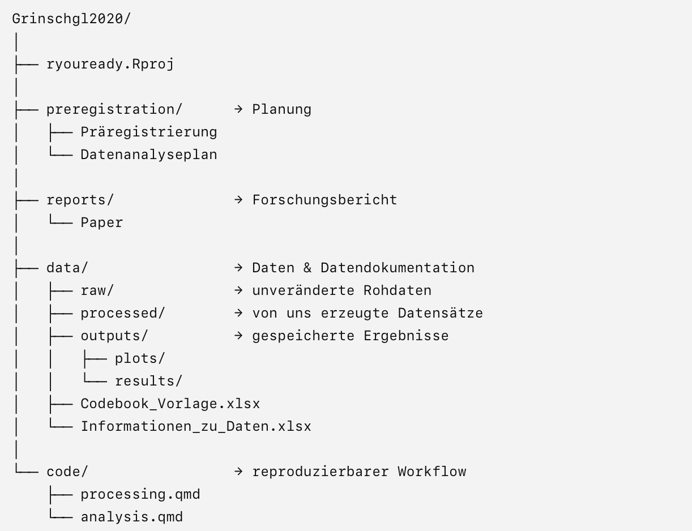

**Planung →** **Daten** → **Verarbeitung** → **Analyse** → **Ergebnisse**

------------------------------------------------------------------------

## Von R-Skripten zu reproduzierbaren Analysen

::::: columns
::: {.column width="50%"}
**Bisher: `.R`**

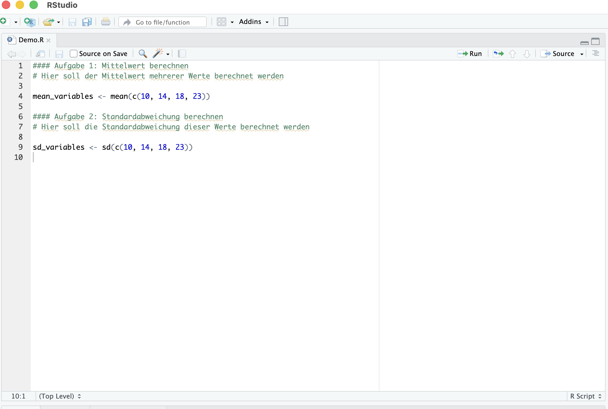
:::

::: {.column width="50%"}
**Ab jetzt: `.qmd`**

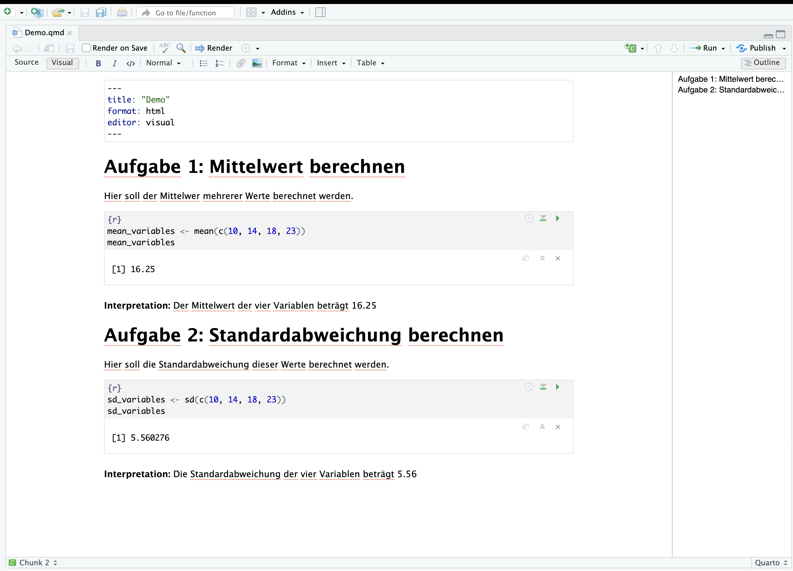
:::
:::::

<br>

**Quarto verbindet Text, Code und Ergebnisse**

::: notes
In den ersten beiden Wochen haben wir bewusst mit einfachen R-Skripten gearbeitet, damit wir uns zunächst auf die Grundlagen des Codierens konzentrieren konnten. Für unser eigentliches Forschungsprojekt brauchen wir nun aber mehr als bloss Code. Wir wollen gleichzeitig dokumentieren, was wir tun, warum wir es tun und welche Ergebnisse dabei entstehen. Deshalb verwenden wir von nund an Quarto-Dokumente anstelle von einfachen R-Skripten.

Quarto ist kein neues Statistikprogramm. Wir programmieren weiterhin in R. Quarto ist vielmehr das Dokument, in dem wir Erklärung, Code und Ergebnisse zusammenbringen.

Die praktische Bedienung über wir im Hands-on.
:::

------------------------------------------------------------------------

## Zwei Quarto-Dateien, zwei Aufgaben

<br>

::::: columns
::: {.column width="50%"}
`processing.qmd`

*Rohdaten →* *analysebereite Daten*

-   Import

-   Merge

-   Bereinigung

-   Variablen erzeugen

-   Recoding

-   Transformationen

-   Speichern verarbeiteter Daten
:::

::: {.column width="50%"}
`analysis.qmd`

*analysebereite Daten → Ergebnisse*

-   Deskriptivstatistik

-   Tabellen

-   Visualisierungen

-   Korrelation/Regression

-   t-Test

-   ANOVA

-   Interpretation
:::
:::::

------------------------------------------------------------------------

## Ein Datensatz erklärt sich nicht selbst

<br>

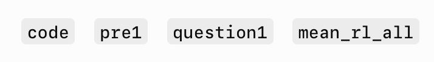{fig-align="center" width="306"}

<br>

**Was bedeuten diese Variablen? Welche Werte können sie annehmen? Wie wurden sie erhoben oder berechnet?**

::: notes
Wenn ich euch nur eine CSV-Datei mit diesen Spalten gebe, könnt ihr manche Dinge vielleicht erraten.

Aber welche Werte sind erlaubt? Was bedeutet eine 0 oder eine 4? Wurde etwas umgepolt?

Ein Wert trägt seine Bedeutung nicht automatisch in sich. Genau deshalb brauchen Daten Metadaten.
:::

------------------------------------------------------------------------

## Codebook übersetzt Daten in Bedeutung

**Ein Wert allein ist noch keine verständliche Information.**

<br>

::::: columns
::: {.column width="50%"}
**Was sehen wir im Datensatz?**

-   Was ist `question9?`

-   Was bedeutet der Wert `2`?

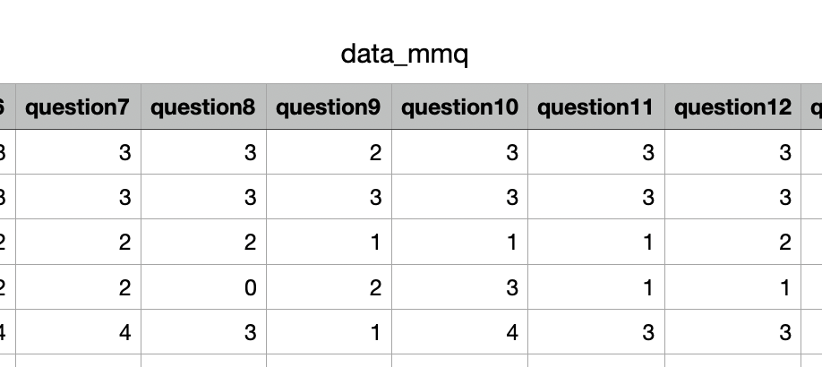{fig-align="left" width="82%"}
:::

::: {.column width="50%"}
**Das Codebook**

-   Strukturierte Dokumentation der Variablen

-   Pro Variable eine Zeile

<br>

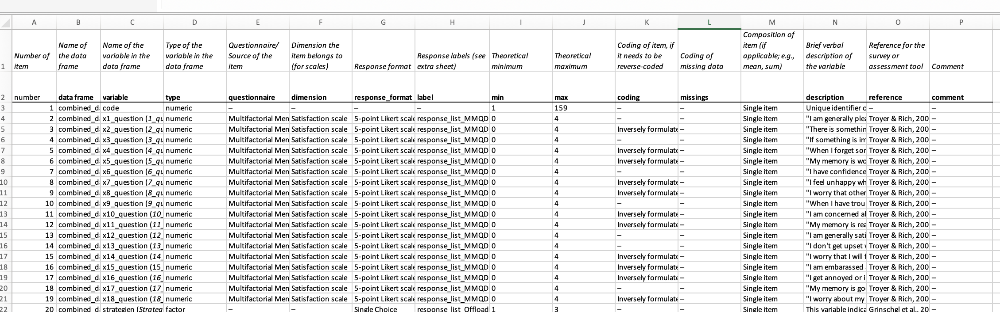{fig-align="left" width="85%"}
:::
:::::

::: notes
Das Codebook ist gewissermassen der Übersetzungsschlüssel zwischen einer Spalte im Datensatz und ihrer wissenschaftlichen Bedeutung.

Ziel ist, dass jemand, der nicht bei der Datenerhabung dabei war, nachvollziehen kann, was eine Variable bedeutet und wie sie codiert wurde.
:::

------------------------------------------------------------------------

## Codebook: unsere Vorlage

::::: columns
::: {.column width="50%"}
-   Notwendig für "gemergten" Datensatz `dat_full` (wird in Hands-on 2 erstellt)

-   Variable muss ausführlich genug beschrieben sein, sodass andere Personen sie nachvollziehen können

-   Variablennamen im Codebook = Variablennamen im Datensatz

-   Vorlage auf Englisch, kann aber auch auf Deutsch ausgefüllt werden (analog zu Datenanalyseplan)

-   Demo & Guidelines in "unterstützende Dokumente"
:::

::: {.column width="50%"}
<br>

<br>

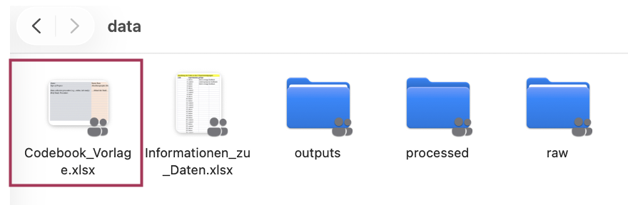{fig-align="center" width="85%"}
:::
:::::

<br>

**Demonstration & Erklärung in EH4**

------------------------------------------------------------------------

## Ein Codebook entsteht aus mehreren Informationsquellen

<br>

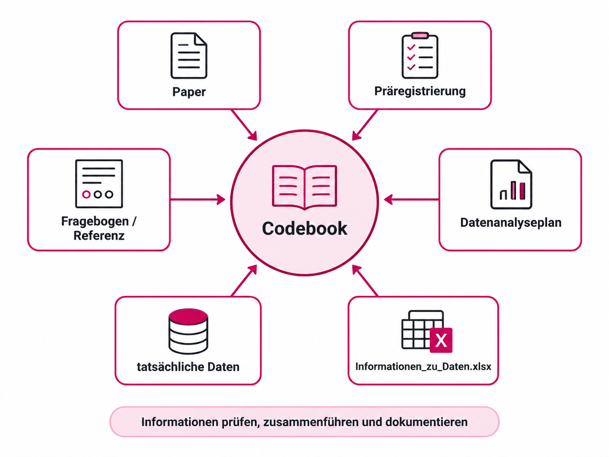{fig-align="center" width="85%"}

::: notes
Ihr werdet relativ schnell merken, dass man das Codebook nicht einfach aus einer einzelnen Datei kopieren kann. Man muss Informationen aus mehreren Quellen zusammenführen und prüfen.
:::

------------------------------------------------------------------------

## Unser Codebook bezieht sich auf `dat_full`

::::: columns
::: {.column width="50%"}
-   7 Rohdatensätze

-   Hands-on 2 & EH4: Importieren + Zusammenführen

-   `dat_full`

-   Codebook
:::

::: {.column width="50%"}
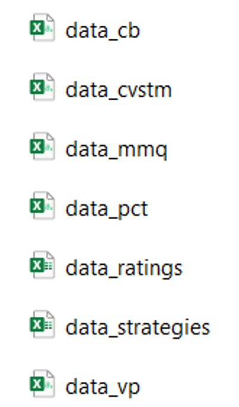{fig-align="center" width="20%"}
:::
:::::

**Abgabe Codebook: 21.10.**

-\> Wichitg: Mehrere Anpassungen im Semester!

::: notes
Heute können wir das Codebook bereits kennenlernen und mit den vorhandenen Informationen arbeiten. Fertigstellen können wir es aber erst sinnvoll, wenn wir wissen, wie unser zusammengeführter Datensatz tatsächlich aussieht.

Deshalb ist der nächste Schritt zwingend: Aus den sieben Rohdateien müssen wir einen zusammengesetzten Datensatz erzeugen.

Auch wichtig ist, dass das Codebook im Verlauf des Semesters mehrmals noch aktualisiert werden muss, wenn bspw. neue Variablen erzeugt oder rekodiert werden.
:::

------------------------------------------------------------------------

## Nun: Arbeit im Hands-on 2

-   Projekte

-   Absolute vs. relative Pfade

-   Rohdatensätze einlesen

-   Schlüsselvariablen

-   Mergen

-   Speichern von `dat_full`

------------------------------------------------------------------------

## Heute haben wir...

... Uns mit den Grundlagen von Forschungsdatenmanagement beschäftigt

... Psych-DS als einen Standard kennengelernt

... die Gründe für und den Aufbau von einem Codebook besprochen

... Datensätze in R importiert

... diese gemerged und exportiert (Fortsetzung in EH 4)

------------------------------------------------------------------------

## Hausübungen

-   Datenanalyseplan bis **Mi, 07.10.2026**

-   Codebook erstellen bis **Mi, 21.10.2026**

------------------------------------------------------------------------

## Literatur:

Horstmann, K. T., Arslan, R. C., & Greiff, S. (2020). Generating Codebooks to Ensure the Independent Use of Research Data: Some Guidelines. *European Journal of Psychological Assessment*, *36*(5), 721–729. https://doi.org/10.1027/1015-5759/a000620

Pennington, C. R. (2023). *A student’s guide to open science: Using the replication crisis to reform psychology*. McGraw Hill.
