## R u Ready? Reproduzierbare Datenaufbereitung und -analyse mit R

HS 2026<br><br><br> **Seminarleitung**: Dr. Sandra Grinschgl<br> **Leitung beider Seminargruppen:** MSc. Laura Hirt<br> **Tutor**: BSc. Jan-Pierre Pahnke<br><br><br>**4. Einheit**, 07.10.2026

{fig-align="center" width="306"}

------------------------------------------------------------------------

## Fragen zum Datenanalyseplan?

**Abgabe heute Abend**

Nutzt die Gelegenheit, letzte Unklarheiten zu Forschungsfragen, Hypothesen, Variablen oder geplanten Analysen zu klären.

{fig-align="center"}

::: notes
Abgabe Datenanalyseplan heute via ILIAS und per Mail an Peer-Partner:in.
:::

------------------------------------------------------------------------

## Semesterplan

::: {style="width:100%; height:80vh; background:#777; padding:20px; box-sizing:border-box; border-radius:10px; overflow:auto; "}
```{=html}
<embed
    src="../../PDFs/Semesterplan_HS26.pdf#view=FitH&navpanes=0&toolbar=0"
    type="application/pdf"
    style="width:100%; height:220vh; border:0; display:block; background:white;"
  >
```
:::

------------------------------------------------------------------------

## Wo befinden wir uns?

**ORGANISIEREN -\> AUFBEREITEN**

<br>

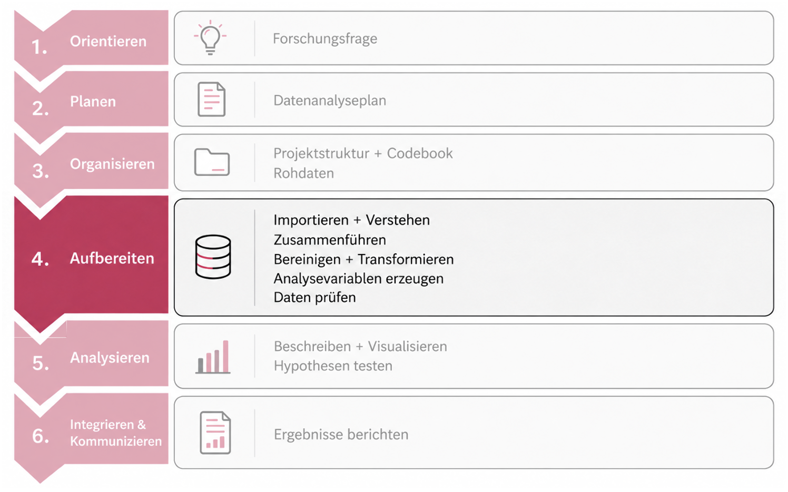{fig-align="center" width="75%"}

<br>

In EH3 haben wir geklärt, **wo** Daten, Code und Dokumentation hingehören.

Heute beginnen wir erstmals, die Rohdaten tatsächlich zu verarbeiten.

------------------------------------------------------------------------

## Unser Ausgangspunkt nach EH3

<br>

::::: columns
::: {.column width="50%"}
**Das haben wir bereits**

✓ Forschungsfrage verstanden

✓ Datenanalyse geplant

✓ Projektstruktur verstanden

✓ Rohdaten lokalisiert

✓ `processing.qmd` und `analysis.qmd` verortet

✓ Codebook-Vorlage kennengelernt
:::

::: {.column width="50%"}
**Das fehlt noch**

○ Rohdaten reproduzierbar einlesen

○ verstehen, welche Informationen zur selben Person gehören

○ sieben Datensätze korrekt zusammenführen

○ Ergebnis kontrollieren

○ `dat_full` speichern
:::
:::::

------------------------------------------------------------------------

## Von Rohdateien zu `dat_full`

**Wie werden aus sieben Rohdateien ein verlässlicher Gesamtdatensatz?**

<br>

::::: columns
::: {.column width="50%"}
**7 Rohdateien**

{fig-align="center" width="35%"}
:::

::: {.column width="50%"}
**Gesamtdatensatz `dat_full` (159 x 36)**

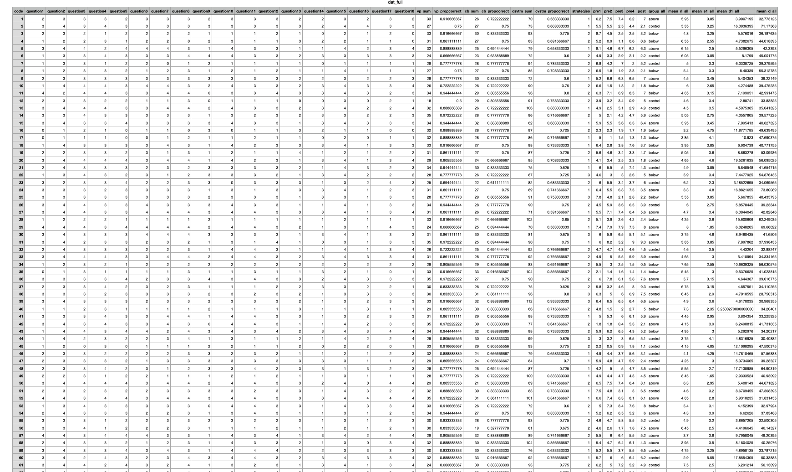{fig-align="center" width="90%"}
:::
:::::

------------------------------------------------------------------------

## Leitfragen

<br>

1.  **Wie lesen wir die Dateien korrekt ein?**

<br>

2.  **Woher weiss R, wo die Dateien liegen?**

<br>

3.  **Woher wissen wir, welche Zeilen zusammengehören?**

<br>

4.  **Wie überprüfen wir, ob das Ergebnis korrekt ist?**

# 1) Von der Rohdatei zum R-Objekt

<br>

**Bevor wir Daten verändern können, müssen wir sie zunächst in R verfügbar machen.**

------------------------------------------------------------------------

## 7 Dateien - 7 Teile derselben Studie

<br>

| Datei                  | Zeilen | Spalten | ID         |
|------------------------|--------|---------|------------|
| `data_cb.csv`          | 159    | 3       | `code`     |
| `data_cvstm.csv`       | 159    | 3       | `code`     |
| `data_mmq.csv`         | 159    | 19      | `code`     |
| `data_pct.csv`         | 159    | 6       | `code_all` |
| `data_vp.csv`          | 159    | 3       | `code`     |
| `data_ratings.xlsx`    | 159    | 6       | `code`     |
| `data_strategies.xlsx` | 159    | 2       | `code`     |

<br>

Die Informationen wurden während der Studie an unterschiedlichen Stellen erhoben und liegen deshalb zunächst getrennt vor.

------------------------------------------------------------------------

## Einlesen verändert die Rohdatei nicht

**Datei ≠ R-Objekt**

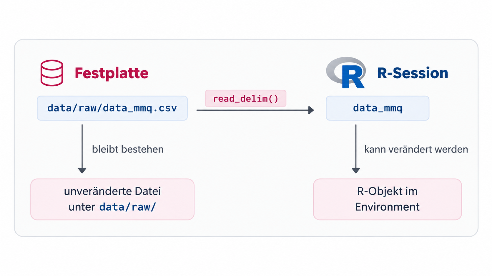{fig-align="center" width="60%"}

Beim Import liest R den Inhalt einer Datei und erzeugt daraus ein **R-Objekt im Arbeitsspeicher**.

Die ursprüngliche Datei unter `data/raw/` wird dadurch **weder verschoben noch verändert oder überschrieben**.

------------------------------------------------------------------------

## Veränderungen in R werden nicht automatisch zurückgeschrieben

<br>

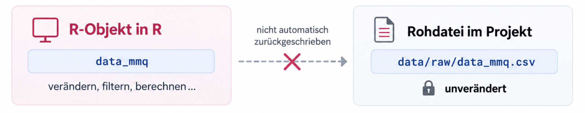{fig-align="center" width="60%"}

<br>

Änderungen an einem R-Objekt exisitieren zunächst nur in der laufenden R-Session.

Wenn ein verarbeiteter Datensatz dauerhaft als Datei vorliegen soll, müssen wir ihn **explizit speichern**.

<br>

{fig-align="center" width="85%"}

# 2) Wie findet R unsere Rohdaten?

<br>

**Zum Einlesen braucht R nicht nur eine Funktion - sondern auch einen Weg zur Datei.**

------------------------------------------------------------------------

## R muss wissen, wo die Datei liegt

<br>

```{r, echo=TRUE, eval=FALSE}
readr::read_delim(
  "???",
  delim = ";"
)
```

<br>

An die Stelle von `???` gehört ein **Dateipfad**.

Ein Dateipfad beschreibt den Weg von einem Ausgangspunkt zu einer Datei.

------------------------------------------------------------------------

## Absoluter Pfad

**Der vollständige Weg auf deinem Computer**

<br>

`C:/Users/Anna/Documents/UniBern/Master/Seminare/Grinschgl2020/data/raw/data_mmq.csv`

und

`/Users/Luca/Documents/Grinschgl2020/data/raw/data_mmq.csv`

<br>

Ein absoluter Pfad beschreibt den vollständigen Speicherort einer Datei auf einem bestimmten Computer.

<br>

**Beide Pfade können korrekt sein - aber jeweils nur auf dem entsprechenden Computer!**

------------------------------------------------------------------------

## Relativer Pfad

**Der Weg innerhalb unseres Projekts**

<br>

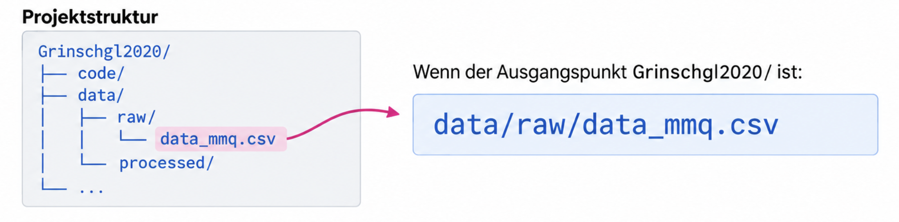{fig-align="center" width="85%"}

Ein relativer Pfad beschreibt nicht, **wo das Projekt auf meinem Computer gespeichert ist**, sondern wo sich eine Datei **relativ zu einem gemeinsamen Ausgangspunkt** befindet.

<br>

Genau hier wird unsere gemeinsame Psych-DS-Struktur nützlich: Die Projektstruktur ist bei allen gleich - deshalb sind auch die relativen Pfade alle gleich!

------------------------------------------------------------------------

## "Relativ" bedeutet immer: relativ wozu?

**Ein relativer Pfad braucht einen Ausgangspunkt**

<br>

::::: columns
::: {.column width="50%"}
**Ausgangspunkt = Projektwurzel**

Interaktives Arbeiten in aktueller R-Session

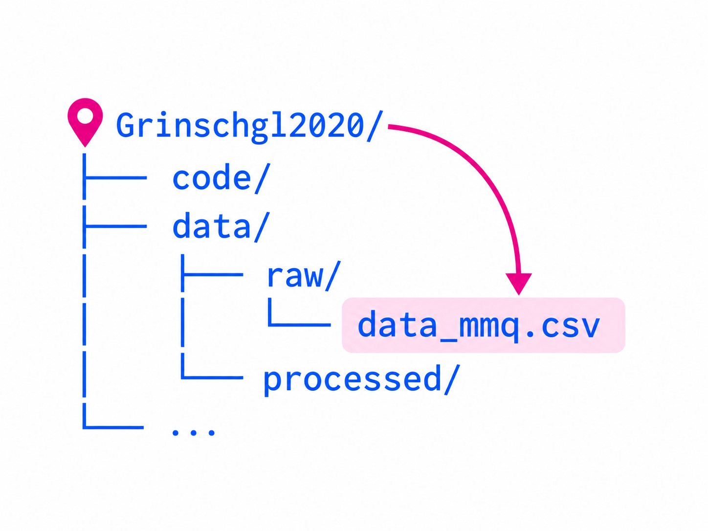{fig-align="center" width="65%"}

✅ `data/raw/data_mmq.csv` funktioniert
:::

::: {.column width="50%"}
**Ausgangspunkt beim Rendern = code**

Beim Rendern von `processing.qmd`

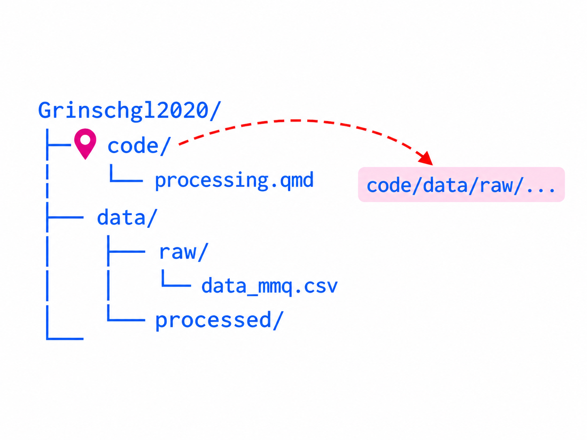{fig-align="center" width="65%"}

❌ sucht nach: `code/data/raw/data_mmq.csv`
:::
:::::

::: notes
Beim interaktiven Arbeiten verwendet eure laufende R-Session nach dem Öffnen des R-Projekts typischerweise die Projektwurzel.

Beim Rendern führt Quarto Code standardmässig relativ zum Ordner der .qmd-Datei aus.
:::

------------------------------------------------------------------------

## Korrekter relativer Pfad: Rendern

**`..` bedeutet: eine Ordnerebene nach oben**

<br>

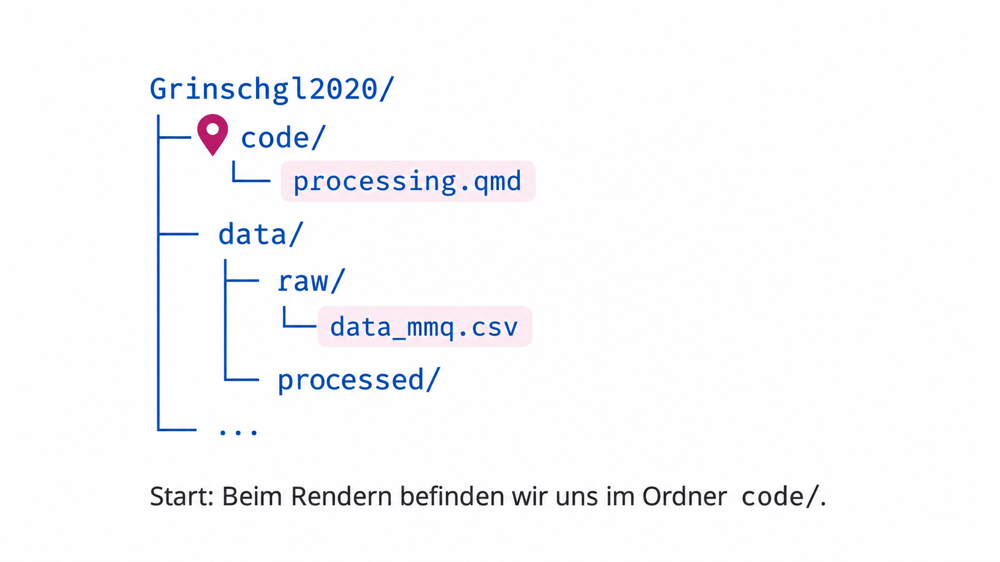{fig-align="center" width="65%"}

Beim Rendern starten wir im Ordner `code/`.

Mit `..` gehen wir zunächst zur Projektwurzel zurück und von dort weiter nach `data/raw/`.

------------------------------------------------------------------------

## Die Alternative: `here()`

**`here()` baut den Pfad von der Projektwurzel aus**

<br>

::::: columns
::: {.column width="50%"}
**Von Hand mit `..`**

```{r, echo=TRUE, eval=FALSE}
data_mmq <- readr::read_delim(
  "../data/raw/data_mmq.csv",
  delim = ";"
)
```
:::

::: {.column width="50%"}
**Mit `here()`**

```{r, echo=TRUE, eval=FALSE}
data_mmq <- readr::read_delim(
  here::here("data", "raw", "data_mmq.csv"),
  delim = ";"
)
```
:::
:::::

<br>

`here()` **verwendet die Projektwurzel als stabilen Bezugspunkt. Dadurch muss unser Code nicht selbst berücksichtigen, ob er gerade interaktiv oder beim Rendern ausgeführt wird.**

<br>

**Beide Varianten sind korrekt!**

------------------------------------------------------------------------

## Unterschiedliche Dateiformate

**Welche Funktion liest welche Datei ein?**

<br>

::::: columns
::: {.column width="50%"}
**📄 CSV/Textdateien**

```{r, echo=TRUE, eval=FALSE}
readr::read_delim(
  "path",
  delim = ";"
)
```
:::

::: {.column width="50%"}
**▦ Excel-Dateien**

```{r, echo=TRUE, eval=FALSE}
readxl::read_excel(
  "path"
)
```
:::
:::::

<br>

-   Unsere fünf `.csv`-Dateien verwenden ein **Semikolon** als Trennzeichen.

-   Die beiden `.xlsx`-Dateien benötigen keinen Delimiter.

------------------------------------------------------------------------

## Keine Fehlermeldung **≠ korrekter Import**

**Eine Datei kann erfolgreich eingelesen werden und trotzdem falsch interpretiert sein.**

<br>

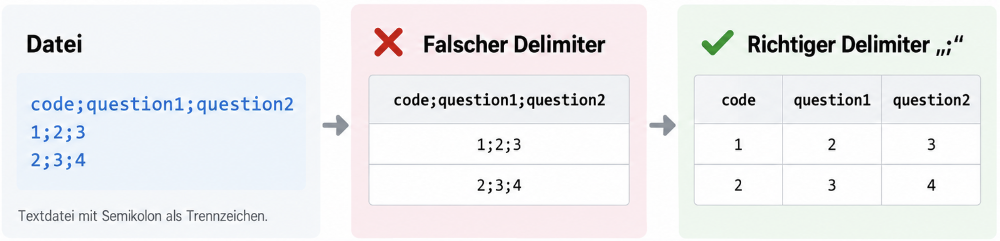{fig-align="center" width="75%"}

**Deshalb gehören Import und Kontrolle des Imports immer zusammen.**

------------------------------------------------------------------------

## Checkpoint: 7 Dateien → 7 R-Objekte

<br>

::::: columns
::: {.column width="60%"}
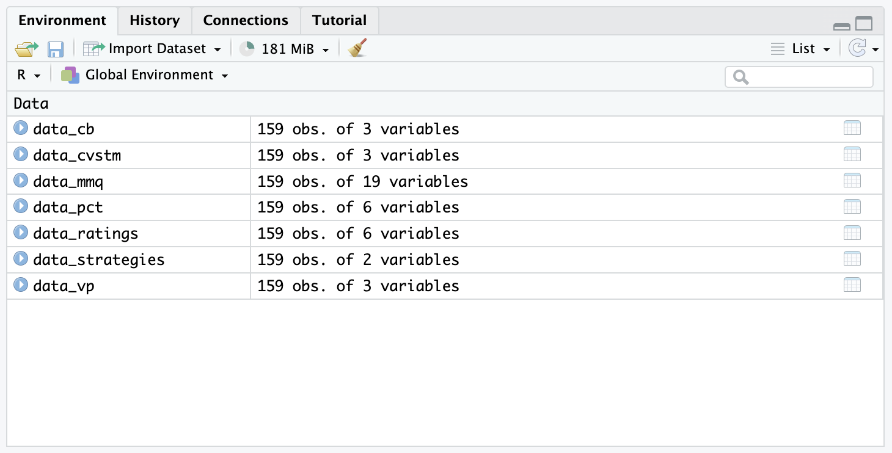{fig-align="center" width="65%"}
:::

::: {.column width="40%"}
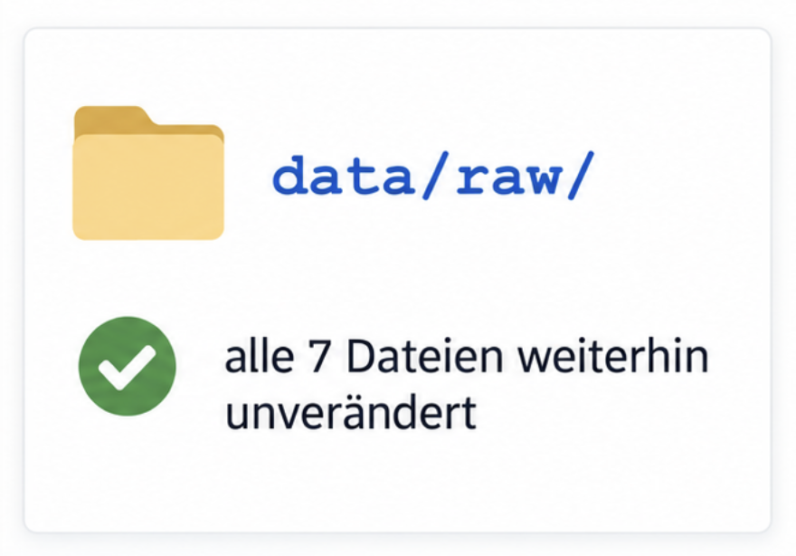{fig-align="center" width="35%"}
:::
:::::

<br>

Die R-Objekte müssen **nicht zusätzlich gespeichert** werden. `processing.qmd` kann sie jederzeit erneut aus den unveränderten Rohdateien erzeugen.

# 3) Welche Informationen gehören zusammen?

<br>

**Sieben R-Objekte sind verfügbar - für die Analyse brauchen wir die Informationen einer Person aber gemeinsam.**

------------------------------------------------------------------------

## Die Informationen derselben Person liegen in verschiedenen Dateien

<br>

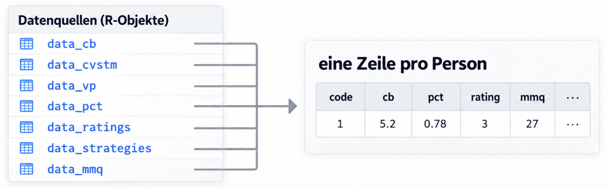{fig-align="center" width="85%"}

<br>

⚠️ Unser Ziel ist nicht einfach, Tabellen nebeneinanderzukleben.

Wir müssen sicherstellen, dass Informationen aus verschiedenen Dateien **derselben Versuchsperson** zugeordnet werden.

------------------------------------------------------------------------

## `cbind()` verbindet Positionen - nicht Personen

<br>

::::: columns
::: {.column width="50%"}
`data_cb`

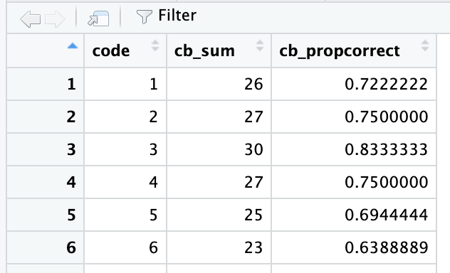{fig-align="center" width="75%"}
:::

::: {.column width="50%"}
`data_pct`

<br>

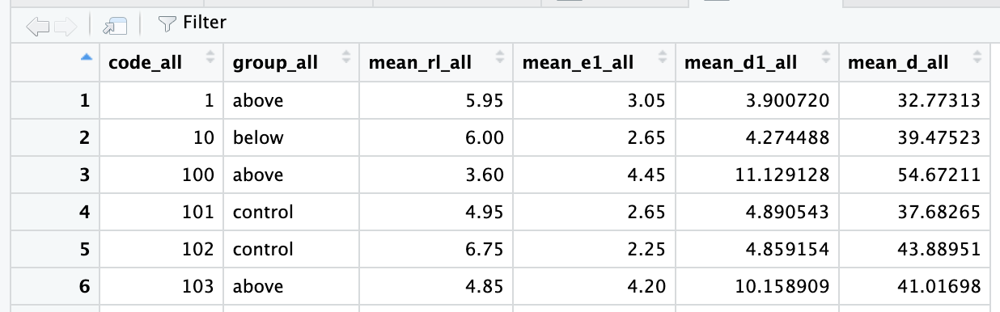{fig-align="center" width="95%"}
:::
:::::

<br>

`cbind()` könnte hier **ohne Fehlermeldung einen inhaltlich falschen Datensatz erzeugen.**

------------------------------------------------------------------------

## Wir verbinden Identitäten statt Zeilenpositionen

Eine **Schlüsselvariable** enthält die Information, anhand derer R erkennt, welche Beobachtungen zusammengehören.

<br>

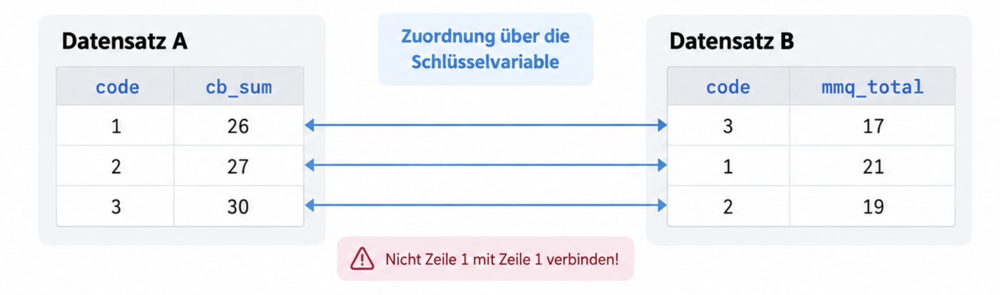{fig-align="center" width="85%"}

<br>

Entscheidend ist also nicht, in welcher Zeile eine Person steht, sondern welcher Wert in der **Schlüsselvariable** steht.

In 6 unserer Datensätze heisst die Personen-ID `code`.

------------------------------------------------------------------------

## `full_join()`: Werte anhand der ID zusammenführen

<br>

::::: columns
::: {.column width="55%"}
{fig-align="left" width="75%"}
:::

::: {.column width="45%"}
<br>

```{r, echo=TRUE, eval=FALSE}
dat_full <- dplyr::full_join(
  data_cb,
  data_cvstm,
  by = "code"
)
```
:::
:::::

`by = "code"` bedeutet: Ordne die Zeilen nicht anhand ihrer Position, sondern anhand desselben `code`-Wertes einander zu.

------------------------------------------------------------------------

## Warum gerade `full_join()`?

**Beim ersten Zusammenführen wollen wir keine Fälle stillschweigend verlieren.**

`full_join()` kombiniert beide Datensätze über die Schlüsselvariable und behält alle IDs aus beiden Tabellen.

<br>

**Beispiel**

```{r echo=TRUE}
df1 <- data.frame(id = c(1, 2, 3),
                  name = c("Anna", "Ben", "Chris"))

df2 <- data.frame(id = c(2, 3, 4),
                  score = c(80, 90, 70))

dplyr::full_join(df1, df2, by = "id")
```

<br>

Wenn IDs nicht zusammenpassen, bleiben diese Fälle als `NA` sichtbar und können kontrolliert werden.

------------------------------------------------------------------------

## Gleiche Bedeutung - unterschiedliche Variablennamen

**In sechs Dateien heisst die Personen-ID `code`, in einer Datei `code_all`.**

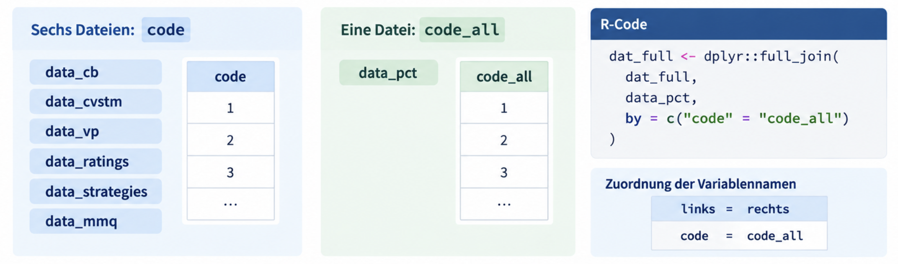{fig-aling="center" width="75%"}

<br>

R kann nicht wissen, dass `code` und `code_all` inhaltlich dieselbe Personen-ID darstellen. Deshalb müssen wir diese Zuordnung ausdrücklich angeben.

------------------------------------------------------------------------

## Andere Joins existieren ebenfalls

**Welche Fälle erhalten bleiben, hängt von der Join-Art ab.**

<br>

::::::: columns
::: {.column width="25%"}
`inner_join()`

{fig-align="left"}
:::

::: {.column width="25%"}
`left_join()`

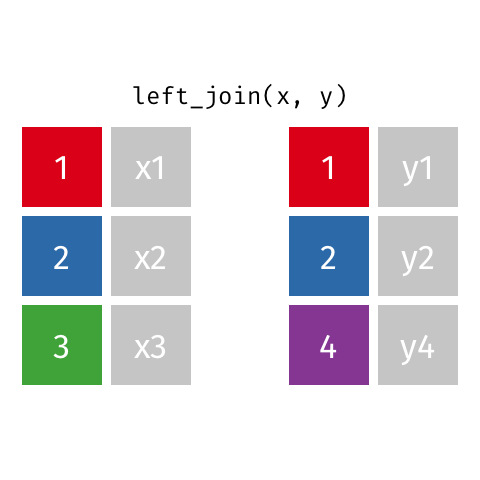{fig-align="left"}
:::

::: {.column width="25%"}
`right_join()`

{fig-align="left"}
:::

::: {.column width="25%"}
`full_join`

<br>

{fig-align="left"}
:::
:::::::

<br>

Für unseren aktuellen Processing-Schritt verwenden wir `full_join()`.

------------------------------------------------------------------------

## So entsteht `dat_full`

**Wir erweitern `dat_full` Schritt für Schritt**

<br>

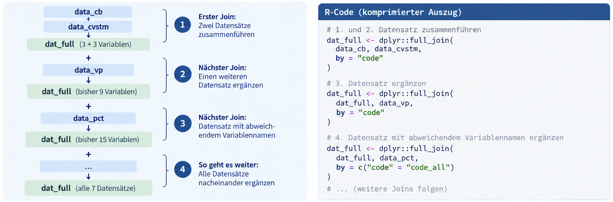{fig-align="center"}

Nach jedem Join enthält `dat_full` den aktuellen Stand der bisher zusammengeführten Informationen.

Deshalb benötigen wir keine Objekte wie `dat_full_1`, `dat_full_2`, `dat_full_3`, ...

# 4) Hat unser Merge wirklich funktioniert?

<br>

**Keine Fehlermeldung** **≠ korrektes Ergebnis**

------------------------------------------------------------------------

## Was müsste ein korrekter `dat_full` enthalten?

**Wir leiten unsere Erwartungen aus dem Paper und den Rohdaten ab.**

{fig-align="center" width="95%"}

**Eine Kontrolle ist nur sinnvoll, wenn wir vorher wissen, was wir erwarten.**

-   Wie viele eindeutige IDs?

-   Wie viele Variablen?

-   Wie viele NAs?

------------------------------------------------------------------------

## Was müsste ein korrekter `dat_full` enthalten?

**Wir leiten unsere Erwartungen aus dem Paper und den Rohdaten ab.**

{fig-align="center" width="95%"}

**Eine Kontrolle ist nur sinnvoll, wenn wir vorher wissen, was wir erwarten.**

-   Wie viele eindeutige IDs? **159**

-   Wie viele Variablen? **36 (da ID-Variable nur einmal)**

-   Wie viele NAs? **Keine**

------------------------------------------------------------------------

## Technischer Merge-Check (1)

**Mit diesen vier einfachen Befehlen prüfen wir, ob `dat_full` die erwartete Struktur hat.**

<br>

```{r, echo=FALSE, eval=TRUE}
dat_full <- readr::read_delim(
  "raw/dat_full.csv",
  delim = ","
)
```

::::: columns
::: {.column width="50%"}
**1) Dimension prüfen**

Anzahl Zeilen und Variablen

<br>

```{r, echo=TRUE, eval=TRUE}
dim(dat_full)
```
:::

::: {.column width="50%"}
**2) Eindeutige IDs prüfen**

Anzahl verschiedener Personen

<br>

```{r, echo=TRUE, eval=TRUE}
length(unique(dat_full$code))
```
:::
:::::

<br>

**Diese Kontrollen beantworten noch nicht, ob jede Variable inhaltlich korrekt codiert ist.**

Das prüfen wir später systematischer.

------------------------------------------------------------------------

## Technischer Merge-Check (2)

**Mit diesen vier einfachen Befehlen prüfen wir, ob `dat_full` die erwartete Struktur hat.**

<br>

::::: columns
::: {.column width="50%"}
**3) Doppelte IDs prüfen**

Sollte keine Duplikate geben

<br>

```{r, echo=TRUE, eval=TRUE}
anyDuplicated(dat_full$code)
```
:::

::: {.column width="50%"}
**4) Fehlende Werte prüfen**

Anzahl NA nach dem Merge

<br>

```{r, echo=TRUE, eval=TRUE}
sum(is.na(dat_full))
```
:::
:::::

<br>

**Diese Kontrollen beantworten noch nicht, ob jede Variable inhaltlich korrekt codiert ist.**

Das prüfen wir später systematischer.

------------------------------------------------------------------------

## Noch ist `dat_full` nur ein R-Objekt

**Wir haben `dat_full` mit R aus den sieben Rohdatensätzen erstellt - bisher existiert es nur in der aktuellen R-Sitzung.**

<br>

::::: columns
::: {.column width="50%"}
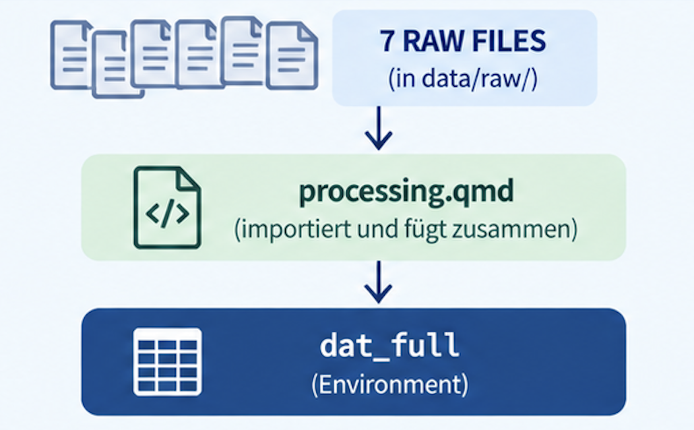{fig-align="center" width="100%"}
:::

::: {.column width="50%"}
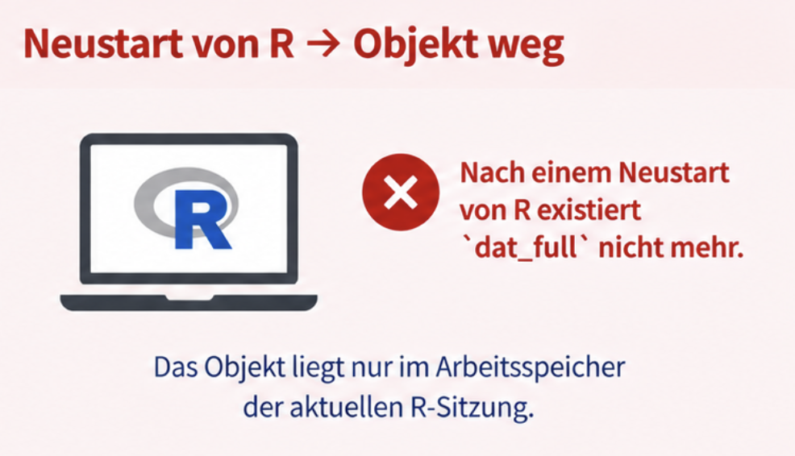{fig-align="center" width="100%"}
:::
:::::

Wenn dieser Verarbeitungsschritt einen dauerhaften Output erzeugen soll, müssen wir diesen **explizit als Datei speichern.**

------------------------------------------------------------------------

## Ein erzeugtes R-Objekt wird erst durch `write_csv()` zu einer Datei

**Mit `write_csv()` speichern wir `dat_full` als CSV-Datei in unserem Projektordner.**

<br>

```{r, echo=TRUE, eval=FALSE}
readr::write_csv(
  dat_full,
  here::here(
    "data",
    "processed",
    "dat_full.csv"
  )
)
```

<br>

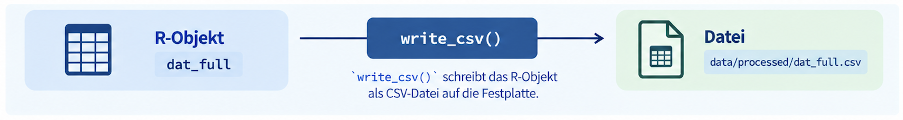{fig-align="center" width="90%"}

**Die Rohdateien bleiben unverändert und werden nicht überschrieben!**

------------------------------------------------------------------------

## Ist `dat_full` jetzt fertig?

::: {.absolute top="30%" left="40%" style="font-size: 3em;"}
**NEIN!**
:::

<br><br><br><br><br><br><br><br>

Wir haben heute den **ersten reproduzierbaren Zustand** von `dat_full` erzeugt: die sieben Rohdateien sind korrekt importiert und zusammengeführt.

------------------------------------------------------------------------

## Nicht die Rohdaten verändern sich - unsere Pipeline wächst

**Unser `processing.qmd` wird im Laufe des Semesters Schritt für Schritt erweitert.**

<br>

::::: columns
::: {.column width="50%"}
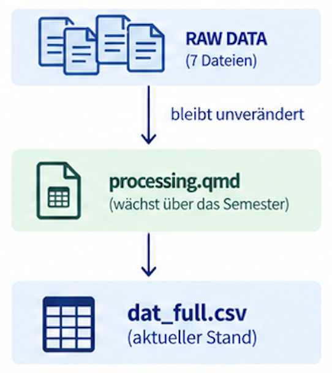{fig-align="center" width="45%"}
:::

::: {.column width="50%"}
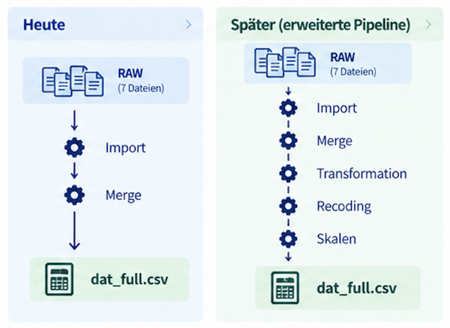{fig-align="center" width="65%"}
:::
:::::

In den kommenden Wochen bearbeiten wir nicht manuell die gespeicherte CSV weiter.

Stattdessen erweitern wir `processing.qmd`. Jeder vollständige Lauf beginnt wieder bei denselben Rohdateien und erzeugt daraus die jeweils aktuelle Version von `dat_full`.

------------------------------------------------------------------------

## Nun: Arbeit im Hands-on 2

-   Projekte

-   Absolute vs. relative Pfade

-   Rohdatensätze einlesen

-   Schlüsselvariablen

-   Mergen

-   Speichern von `dat_full`

------------------------------------------------------------------------

## Heute haben wir...

-   verstanden, was beim Einlesen einer Rohdatei passiert.

-   Dateipfade reproduzierbar innerhalb unseres Projekts formuliert.

-   sieben getrennte Datensätze anhand einer Schlüsselvariable verbunden.

-   überprüft, ob der Merge unseren Erwartungen entspricht.

-   erstmals `data/processed/dat_full.csv` reproduzierbar erzeugt.

------------------------------------------------------------------------

## Hausübungen

-   Muddiest Points I bis **So, 11.10.2026**

    -   Freiwillige, anonyme Umfrage auf ILIAS (Ordner Einheit 4)

<br>

-   Peer-Feedback Datenanalyseplan bis **Mi, 14.10.2026**

    -   Genaue Instruktionen auf der Webseite unter "Hausübungen"
