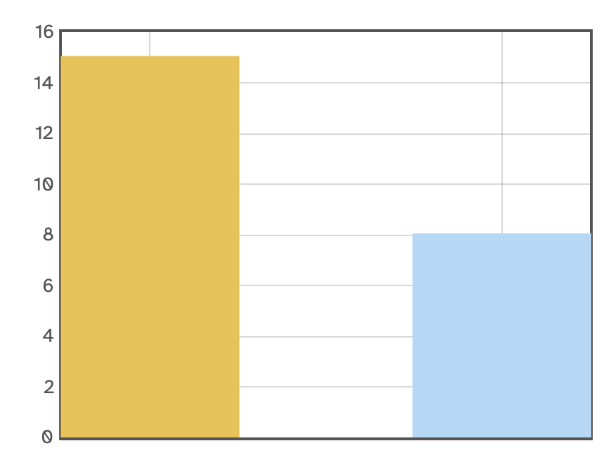
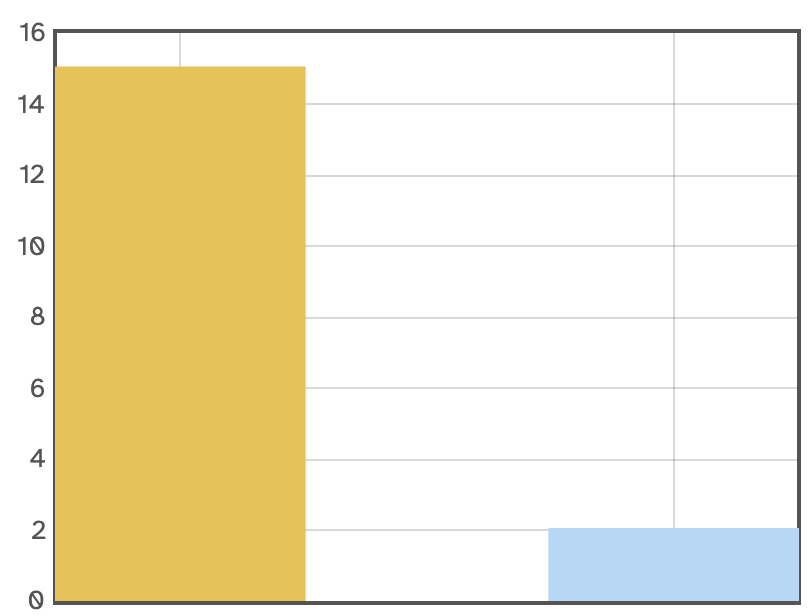
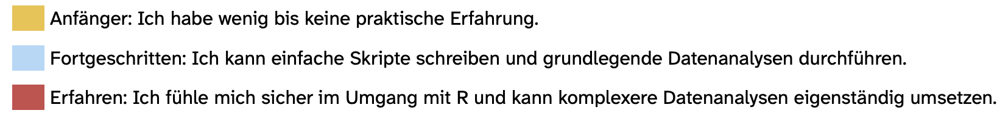

Zu Beginn und am Ende des Semesters führen wir eine kurze Bedarfsanalyse durch. Die erste Erhebung dient dazu, einen Eindruck davon zu gewinnen, mit welchen Vorkenntnissen und Erfahrungen ihr in das Semester startet und in welchen Bereichen ihr euch noch Unterstützung wünscht. Eure Rückmeldungen helfen uns dabei, die Inhalte und Schwerpunkte der Veranstaltung soweit möglich an euren aktuellen Kenntnisstand sowie an eure Wünsche und Bedürfnisse anzupassen.

Die Befragung wird am Ende des Semesters erneut durchgeführt. Dadurch könnt ihr eure Einschätzungen zu Beginn und am Ende des Semesters miteinander vergleichen und nachvollziehen, in welchen Bereichen ihr im Verlauf des Seminars mehr Sicherheit gewonnen, neue Kenntnisse erworben oder euch intensiver mit bestimmten Themen auseinandergesetzt habt.

Die folgenden Ergebnisse geben einen Überblick über den Ausgangspunkt zu Beginn des Semesters. An der Befragung nahmen in der Seminargruppe von **10:15-12:00 Uhr 23 Studierende** und in der Seminargruppe von **16:15-18:00 Uhr 17 Studiernde** teil. Prozentangaben werden jeweils innerhalb der entsprechenden Seminargruppe berechnet.

### Bisherige Erfahrung mit R

Zu Beginn des Seminars wollten wir zunächst wissen, welche Erfahrungen ihr bisher mit R gesammelt habt. Dazu habt ihr eure aktuellen R-Kenntnisse eingeschätzt und angegeben, wie häufig und in welchen Kontexten ihr R bisher verwendet habt. Ausserdem haben wir euch gefragt, mit welchen R-Paketen ihr bereits gearbeitet habt.

**Wie würdest du aktuell deine R-Kenntnisse einschätzen?**

::::: columns
::: {.column width="50%"}
**10:15**

{fig-align="center"}
:::

::: {.column width="50%"}
**16:15**

{fig-align="center"}
:::
:::::

{fig-align="center"}
