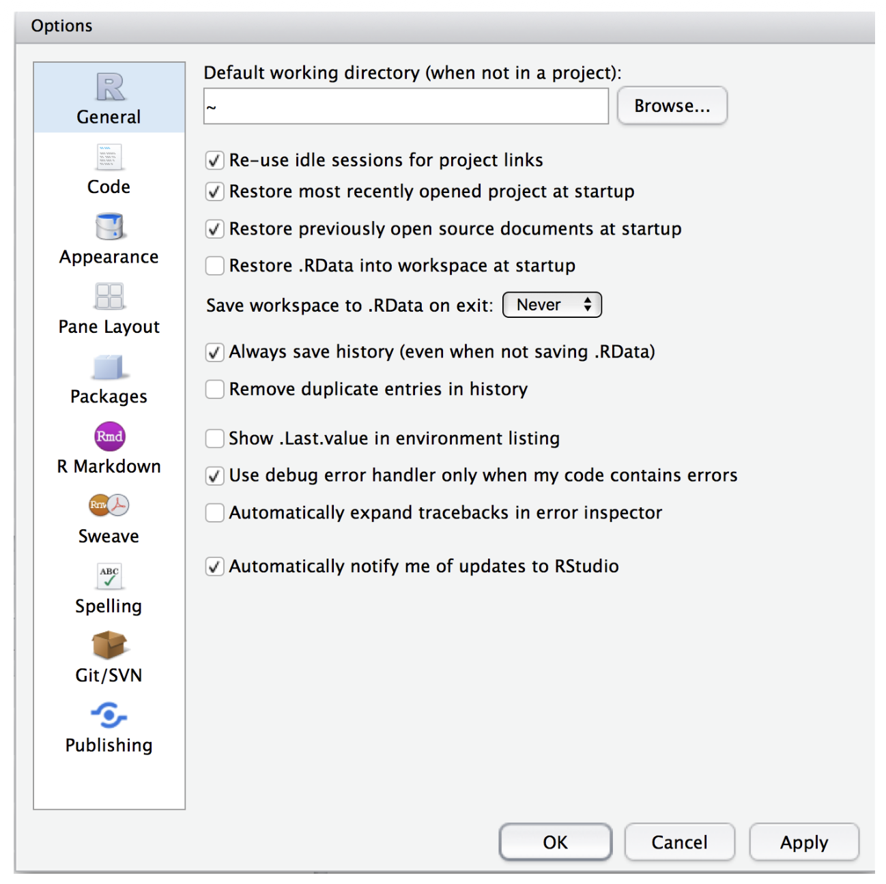
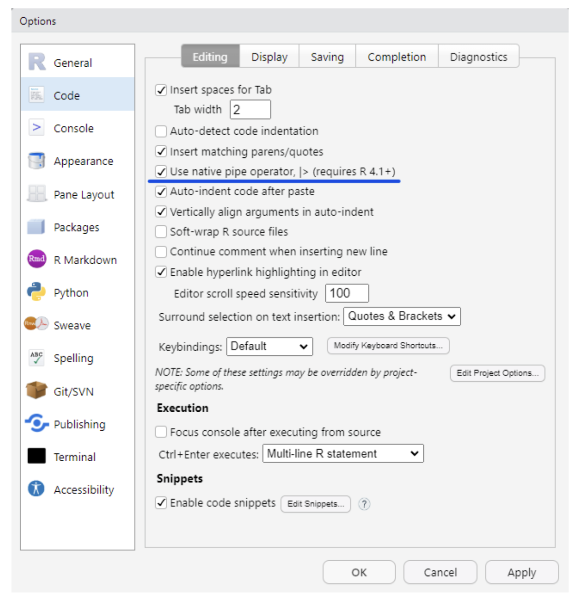
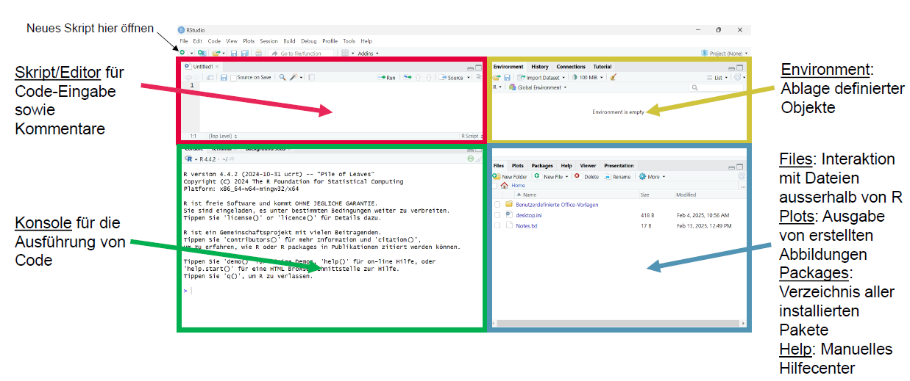
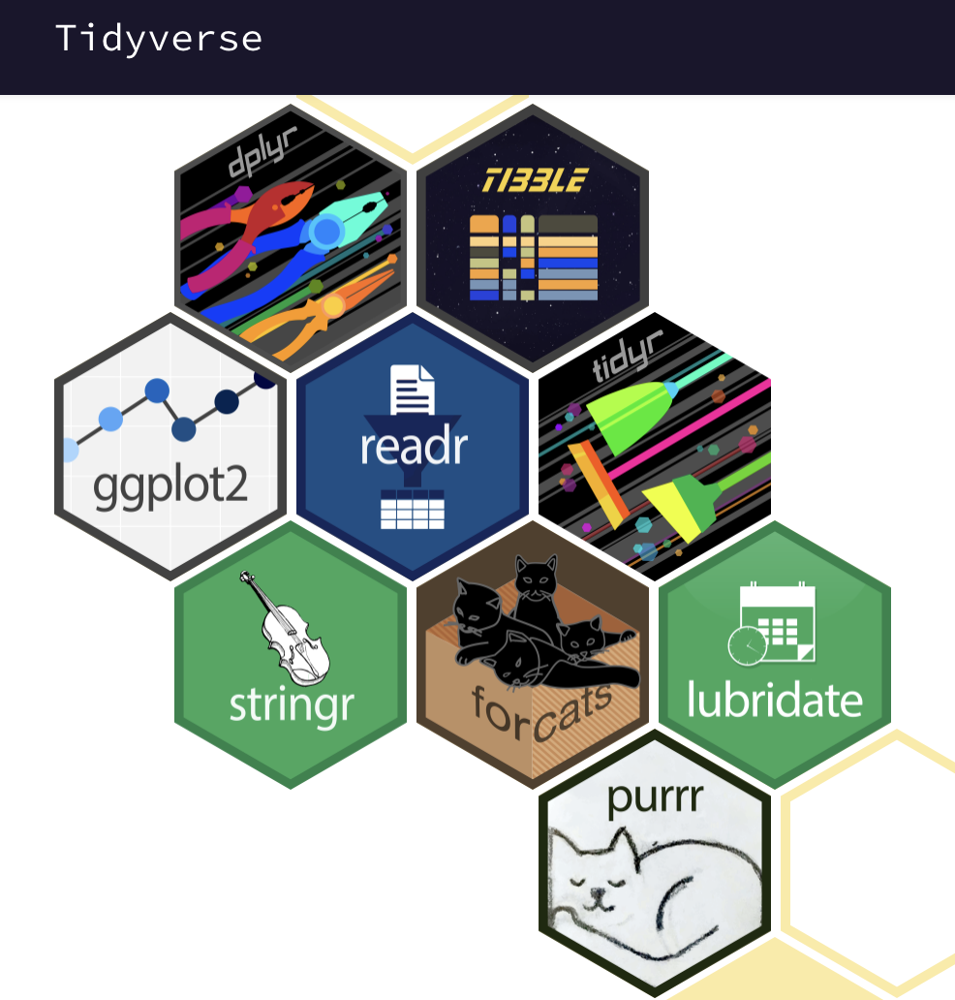

Bei Bedarf finden sich hier nochmal die Slides zur EH1:

::: {=html}
<iframe src="../01_slides/EH_1.html" width="100%" height="500" style="border:0; display:block; margin: 0 0 1.5rem 0;">

</iframe>
:::

Und hier nochmal die Slides zur EH2:

::: {=html}
<iframe src="../01_slides/EH_2.html" width="100%" height="500" style="border:0; display:block; margin: 0 0 1.5rem 0;">

</iframe>
:::

## 🧭 Wo befinden wir uns?

**Projektphase: ORIENTIEREN → PLANEN**

In diesem ersten Hands-on Block lernen wir unsere Arbeitsumgebung kennen und erstellen unser erstes nachvollziehbares R-Skript.

**Einheit 1:** RStudio, Skripte, Pakete, Operatoren, Objekte, Funktionen, Vektoren und grundlegende Datentypen

**Einheit 2:** nachvollziehbarer Code, Fehlersuche und erste Arbeit mit einem Datensatz

## 🎯 Ziel dieses Blocks

Am Ende müsst ihr nicht alle Befehle auswendig können. Ihr sollt:

-   euch in RStudio orientieren können,

-   Code in eurem Skript schreiben, ausführen und speichern,

-   einfache Objekte und Vektoren erstellen,

-   Funktionen anwenden,

-   nachvollziehbaren Code schreiben,

-   bei einfachen Problemen erste Lösungswege selbst ausprobieren,

-   und verstehen, wie Planung und Code später zusammengehören.

# Einheit 1: Erste Schritte in R

## A0 - Technischer Check: R & RStudio

Bevor wir mit dem Programmieren beginnen, stellen wir sicher, dass eure Arbeitsumgebung funktioniert.

### Was ist eigentlich R - und was ist RStudio?

Für dieses Seminar benötigt ihr R und RStudio. Dabei handelt es sich um zwei unterschiedliche Programme mit unterschiedlichen Aufgaben:

-   **R** ist die eigentliche Programmiersprache bzw. Software. R führt unsere Befehle aus und übernimmt die Berechnungen.

-   **RStudio** ist die Benutzeroberfläche bzw. Arbeitsumgebung, über die wir mit R arbeiten. RStudio hilft uns dabei,

    -   Code zu schreiben und zu speichern,

    -   Dateien und Datensätze zu verwalten,

    -   Ergebnisse und Graphiken anzusehen,

    -   Pakete zu verwenden,

    -   und unsere Arbeit übersichtlich zu organisieren.

📌 **Merke:** R erledigt die Berechnungen im Hintergrund, RStudio ist die Arbeitsumgebung, über die wir mit R arbeiten.

### Warum brauchen wir beide Programme?

RStudio greift auf eine installierte R-Version zurück. Deshalb benötigen wir grundsätzlich beide Programme.

Die Reihenfolge bei einer Neuinstallation ist:

1.  R installieren

2.  RStudio installieren

3.  RStudio öffnen und darin mit R arbeiten

❗**Wichtig:** Ein Update von RStudio aktualisiert R nicht automatisch - und umgekehrt. Beide Programme besitzen eigene Versionsnummern und werden unabhängig voneinander aktualisiert.

### ✅ Technischer Check

Bitte prüfe jetzt:

-   R ist installiert

-   RStudio ist installiert

-   RStudio lässt sich problemlos öffnen

-   R ist nicht stark veraltet

-   RStudio ist nicht stark veraltet

Ihr benötigt nicht zwingend die allerneuste Version von R und RStudio.

Für das Seminar empfehlen wir jedoch eine relativ aktuelle Installation, indealerweise aus **2025 oder neuer**. Wenn eure Programme bereits problemlos funktionieren und ungefähr aus diesem Zeitraum stammen, müsst ihr nicht wegen jeder neuen Unterversion sofort aktualisieren.

Bei deutlich älteren Versionen können später jedoch Probleme auftreten, z.B.:

-   Pakete lassen sich nicht installieren oder laden,

-   neuere Funktionen stehen noch nicht zur Verfügung,

-   Code verhält sich anders als in unseren Übungen,

-   oder Fehlermeldugen entstehen aufgrund von Versionsunterschieden.

### Welche Version habe ich?

**R-Version prüfen**

Öffne RStudio und führe in der Konsole aus:

`R.version.string`

**RStudio-Version prüfen**

Die RStudio-Version findest du über:

-   Windows: Help -\> About RStudio

-   Mac: RStudio -\> About RStudio

### 🛟 Installation oder Update nötig?

1.  R installieren/aktualisieren: <https://stat.ethz.ch/CRAN/>

2.  RStudio installieren/aktualisieren: <https://posit.co/download/rstudio-desktop/>

Eine ausführliche Schritt-für-Schritt-Anleitung findet ihr hier: <https://methodenlehre.github.io/einfuehrung-in-R/>

### ✅ Mini-Check: Funktioniert alles?

Öffne RStudio und gib in der Konsole ein:

`1 + 1`

Wenn R anschliessend `[1] 2` ausgibt, funktioniert die grundlegende Verbindung zwischen R und RStudio.

**Als Nächstes:** Wir schauen uns RStudio genauer an und erstellen unser erstes Skript.

## A1 - RStudio einrichten & Oberfläche kennenlernen

Nachdem wir überprüft haben, dass R und RStudio funktionieren, richten wir nun unsere Arbeitsumgebung ein und schauen uns an, wo in RStudio welche Dinge passieren.

**Warum machen wir das?**

RStudio enthält mehrere Bereiche mit unterschiedlichen Aufgaben. Gerade am Anfang kann die Oberfläche deshalb etwas unübersichtlich wirken.

Für das Seminar ist es wichtig, dass ihr zunächst grob wisst:

-   wo ihr Code schreibt,

-   wo R den Code ausführt,

-   wo erzeugte Objekte erscheinen,

-   und wo ihr Dateien, Graphiken, Pakete und Hilfe findet.

📌 **Merke:** Ihr müsst euch nicht sofort jedes Detail von RStudio merken. Wichtig ist zunächst, dass ihr die zentralen Bereiche wiedererkennt und wisst, wofür sie grundsätzlich da sind.

### 🧭 1. Empfohlene Einstellungen vornehmen

Bevor wir beginnen, nehmen wir einige Grundeinstellungen in RStudio vor. Diese Einstellungen müssen normalerweise nur einmal vorgenommen werden und erleichtern uns später das reproduzierbare Arbeiten.

Öffne in RStudio: `Tools → Global Options` und setze die Einstellungen unter `General`so ein wie auf dem folgenden Bild:

{fig-align="center"}

<br>

Zudem solltest du in den Optionen unter `Code` noch die Option `use native pipe operator` aktivieren. Das Bild zeigt dir, wo die Option zu aktivieren ist:

{fig-align="\"center"}

Falls einzelne Menüpunkte bei dir etwas anders aussehen, ist das kein Problem. Je nach Betriebssystem und RStudio-Version können sich kleinere Unterschiede ergeben.

### 🧭 2. Die RStudio-Oberfläche kennenlernen

RStudio ist normalerweise in mehrere Bereiche aufgeteilt.

Schau dir zunächst die folgende Abbildung an und versuche anschliessend, dieselben Bereiche in deinem eigenen RStudio-Fenster wiederzufinden.

{fig-align="center"}

Die vier wichtigsten Bereiche sind:

**Source/Editor**

Hier schreiben und speichern wir unseren Code.

Später werden hier z.B. unsere

-   R-Skripte,

-   Quarto-Dateien,

-   Kommentare,

-   und vollständigen Analyseabläufe

liegen.

Falls der Source-/Editor-Bereich bei dir noch nicht sichtbar ist: Keine Sorge - das ändern wir im nächsten Schritt, indem wir unser erstes Skript öffnen.

**Konsole**

Hier führt R unseren Code tatsächlich aus.

Wenn wir einen Befehl aus dem Skript ausführen, erscheint er in der Konsole und R gibt dort das Ergebnis oder ggf. eine Fehlermeldung aus.

Einzelne Berechnungen können auch direkt in der Konsole ausgeführt werden.

**Environment**

Hier sehen wir Objekte, die wir während unserer aktuellen R-Sitzung erstellt haben.

Z.B. später:

-   Zahlen

-   Vektoren

-   Datensätze,

-   Ergebnisse von Berechnungen.

**Files/Plots/Packages/Help**

Dieser Bereich enthält mehrere Tabs:

-   **Files:** Dateien oder Ordner ansehen

-   **Plots:** erstellte Graphiken anzeigen

-   **Packages:** installierte Pakete verwalten

-   **Help:** Hilfeseiten zu R-Funktionen öffnen

📌 **Merke:** Wir werden diese Bereiche nicht alle heute ausführlich behandeln. Im Laufe des Semesters lernen wir sie immer dann genauer kennen, wenn wir sie für einen konkreten Arbeitsschritt brauchen.

## A2 - Dein erstes R-Skript

Nachdem wir uns in RStudio orientiert haben, erstellen wir nun unseren eigentlichen Arbeitsplatz für den Code.

In diesem Seminar möchten wir nicht einfach Befehle einmalig ausführen. Unsere Arbeitsschritte sollen so dokumentiert sein, dass wir später noch nachvollziehen können:

-   **was** wir gemacht haben,

-   **warum** wir es gemacht haben,

-   **in welcher Reihenfolge** wir vorgegangen sind,

-   und **wie** ein bestimmtes Ergebnis entstanden ist.

Dafür verwenden wir Skripte.

### Was ist ein R-Skript?

Ein R-Skript ist eine Datei, in der wir unseren R-Code **schreiben, strukturieren und speichern**. R-Skripte haben die Dateiendung: `.R`

Der Code im Skript wird nicht automatisch ausgeführt. Wir entscheiden selbst, welche Zeilen R ausführen soll.

📌 **Merke:** Ein Skript ist wie ein Protokoll oder Rezept unserer Analyse. Es dokumentiert die einzelnen Schritte und ermöglicht uns, diese später erneut auszuführen.

Genau das ist eine wichtige Grundlage für reproduzierbares Arbeiten.

### 🧭 1. Ein neues Skript erstellen

Öffne in RStudio:

`File → New File → R Script`

Nun sollte sich im Source-/Editor-Bereich eine neue, leere Datei öffnen.

Vergleiche dies kurz mit der RStudio-Abbildung aus A1.

### 🧭 2. Das Skript direkt speichern

Bevor wir Code schreiben, speichern wir unser Skript.

Wähle: `File→ Save As...` und gib der Datei einen verständlichen Namen, z.B.:

`01_coding_basics.R`

Speichere die Datei an einem Ort, an dem du sie nächste Woche problemlos wiederfindest.

Für diesen ersten Hands-on-Block reicht ein eigener Ordner für das Seminar. Wie wir später komplette Forschungsprojekte und Dateien strukturiert organisieren, behandeln wir ausführlich in einer späteren Einheit.

📌 **Merke:** Gute Dateinamen helfen uns, auch Wochen oder Monate später noch zu erkennen, was eine Datei enthält.

### 🧭 3. Das Skript beschriften

Auch Code soll für Menschen verständlich sein.

In R können wir Kommentare mit `#` schreiben. Alles, was in einer Zeile hinter `#` steht, wird von R nicht als Code ausgeführt.

Schreibe ganz oben in dein Skript:

`# R you Ready - Hands-on Block 1`

`# Name:`

`# Datum:`

Ergänze deinen Namen und das heutige Datum.

💡 Kommentare werden uns später dabei helfen, unsere Datenaufbereitung und Analysen nachvollziehbarer zu strukturieren.

### Konsole oder Skript - was ist der Unterschied?

**Konsole**

Die Konsole führt einen eingegebenen Befehl sofort aus. Sie eignet sich gut, wenn wir etwas:

-   kurz ausprobieren,

-   testen,

-   oder nachschauen möchten.

**Skript**

Im Skript schreiben und speichern wir Code, den wir:

-   später erneut ausführen,

-   nachvollziehen,

-   verändern,

-   oder mit anderen teilen möchten.

📌 Grundsätzlich gilt in diesem Seminar, dass sämtlicher Code im Skript geschrieben und angemessen dokumentiert werden soll.

#### 🧭 **Teste den Unterschied selbst**

1.  Klicke in die Konsole und gib ein:

    -   `2 + 2`

    -   Drücke anschliessend Enter.

    -   R sollte ausgeben: `[1] 4`

    -   Die Berechnung wird sofort ausgeführt.

    -   Aber: Der Befehl ist damit noch nicht sinnvoll in unserem Analysecode dokumentiert und lässt sich nicht einfach zu einem späteren Zeitpunkt erneut ausführen!

2.  Schreibe nun in dein Skript:

    -   `2 + 2`

    -   Beobachte zunächst: Passiert bereits etwas?

    -   Code im Skript wird erst ausgeführt, wenn wir R dazu auffordern.

    -   Setze den Cursor in die entsprechende Zeile und drücke: Ctrl + Enter (Windows) bzw. Cmd + Enter (Mac). Alternativ kannst du oben im Editor auf Run drücken.

📌 Das Skript dokumentiert unseren Arbeitsschritt, die eigentliche Berechnung übernimmt R über die Konsole.

## A3 - Pakete installieren & laden

Bisher haben wir R vor allem als Taschenrechner genutzt und einfache Berechnungen durchgeführt.

Im Laufe des Semesters werden wir jedoch viele weitere Werkzeuge brauchen - z.B. für Datenaufbereitung, Visualisierung und statistische Analysen. Diese zusätzlichen Werkzeuge werden in R über sogenannte Pakete bereitgestellt.

### Was ist ein R-Paket?

Ein Paket ist eine Sammlung von:

-   zusätzlichen R-Funktionen,

-   teilweise Datensätzen,

-   Dokumentationen und Hilfeseiten.

Ihr könnt euch Pakete vereinfacht wie **Erweiterungen für R** vorstellen.

Ein besonders wichtiges Paketbündel für dieses Seminar ist das **tidyverse**. Es enthält mehrere Pakete (sogenanntes Meta-Paket), die uns später unter anderem bei Datenaufbereitung und Visualisierung helfen.

{fig-align="center" width="35%"}

📌 **Merke:** Die grundlegende R-Installation stellt uns die Basis zur Verfügung. Über Pakete können wir R um zusätzliche Werkzeuge erweitern.

### 🧭 1. Pakete installieren

Bevor ein Paket verwendet werden kann, muss es zunächst auf dem Computer installiert werden.

Das ist normalerweise nur einmal notwendig.

Du kannst aber bereits installierte Pakete mithilfe von `update.packages()` regelmässig updaten, damit sie auf dem neusten Stand sind.

Führe dazu diesen Code in der **Konsole** aus:

```{r}
#| eval: false
#| echo: TRUE

install.packages("tidyverse")
```

Je nach Computer und Internetverbindung kann die Installation einen Moment dauern.

### 🧭 2. Pakete laden

Ein installiertes Paket steht in R nicht automatisch in jeder Sitzung zur Verfügung. Nachdem ein Paket installiert wurde, müssen wir es in jeder neuen R-Sitzung zu Beginn laden.

Da dieser Befehl bei jeder neuen Sitzung notwendig ist, gehört der Befehl direkt oben in unser Skript:

```{r}
#| echo: TRUE
#| message: false

# Pakete laden
library(tidyverse)
```

Führe die Zeile nun aus.

📌 **Merke:** Pakete gehören an den Anfang des Skripts! Sie werden dort einmal zentral geladen und müssen nirgendwo sonst im Skript repetiert werden.

## A4 - R als Taschenrechner: Operatoren kennenlernen

Unsere Arbeitsumgebung ist nun eingerichtet. Als Nächstes lernen wir, wie wir R **einfache Rechenanweisungen** geben.

R kann zunächst wie ein sehr leistungsfähiger Taschenrechner verwendet werden.

### Arithmetische Operatoren

Einige Operatoren kennst du bereits aus der Mathematik:

| Zeichen | Bedeutung                   |
|---------|-----------------------------|
| \+      | Addition                    |
| \-      | Subtraktion                 |
| \*      | Multiplikation              |
| /       | Division                    |
| sqrt(x) | Quadratwurzel               |
| abs(x)  | Betrag (absoluter Wert)     |
| x %% y  | Modulo (x mod y) 5 %% 2 = 1 |
| \^      | Potenz                      |

📌 Wenn du die Funktionsweise eines Operators nachschlagen willst, kannst du dazu die Help-Funktion nutzen. Diese zeigt dir jeweils eine kurze Beschreibung, die Funktionsweise, die Argumente sowie Rechenbeispiele pro Operator bzw. Funktion an.

#### 🧭 1. Berechnungen selbst vornehmen

Schreibe die folgenden Aufgaben in dein Skript und führe sie anschliessend aus:

1.  Addiere `123` und `456`

:::: {.content-visible when-meta="show_solutions"}
::: {.callout-note collapse="true" title="Lösung"}
```{r, include = TRUE, eval = TRUE}
123 + 456
```
:::
::::

2.  Subtrahiere `112` von `144`

:::: {.content-visible when-meta="show_solutions"}
::: {.callout-note collapse="true" title="Lösung"}
```{r, include = TRUE, eval = TRUE}
144 - 112
```
:::
::::

3.  Multipliziere `24` mit `17`

:::: {.content-visible when-meta="show_solutions"}
::: {.callout-note collapse="true" title="Lösung"}
```{r, include = TRUE, eval = TRUE}
24 * 17
```
:::
::::

4.  Dividiere `10` durch `3`

:::: {.content-visible when-meta="show_solutions"}
::: {.callout-note collapse="true" title="Lösung"}
```{r, include = TRUE, eval = TRUE}
10/3
```
:::
::::

5.  Quadriere `420`

:::: {.content-visible when-meta="show_solutions"}
::: {.callout-note collapse="true" title="Lösung"}
```{r, include = TRUE, eval = TRUE}
420^2
```
:::
::::

6.  Ziehe die Quadratwurzel aus `146`

:::: {.content-visible when-meta="show_solutions"}
::: {.callout-note collapse="true" title="Lösung"}
```{r, include = TRUE, eval = TRUE}
sqrt(146)
```
:::
::::

7.  Berechne den Rest der Division `10/3` mit dem Modulo Operator: `%%`

:::: {.content-visible when-meta="show_solutions"}
::: {.callout-note collapse="true" title="Lösung"}
```{r, include = TRUE, eval = TRUE}
10 %% 3
```
:::
::::

#### 🧭 **2. Klammern verändern Ergebnisse**

Berechne einmal `2 + 3 * 4` und anschliessend `(2 + 3) * 4`

Was beobachtest du? Warum entstehen unterschiedliche Ergebnisse?

::: {.callout-note collapse="true" title="Vertiefung"}
Auch R beachtet mathematische Rechenregeln!

Mit Klammern können wir explizit festlegen, welche Berechnung zuerst erfolgen soll.
:::

#### 🧭 **3. Eigene Berechnung**

Erstelle selbst einen mathematischen Ausdruck, der:

-   mindestens drei Zahlen,

-   mindestens zwei verschiedene Operatoren

-   und mindestens eine Klammer enthält.

Tausche anschliessend mit einer Person neben dir: Kann die andere Person das Ergebnis vorhersagen, bevor ihr den Code ausführt?

## A5 - Objekte erstellen & Werte zuweisen

Bis jetzt haben wir Ergebnisse berechnet - aber wir haben sie nicht sinnvoll gespeichert.

Bei einer Datenanalyse möchten wir Ergebnisse häufig später wiederverwenden. Dafür verwenden wir in R **Objekte.**

### Was ist ein Objekt?

Ein Objekt ist in R ein Name, unter dem wir Informationen speichern können.

Stell dir ein Objekt wie eine beschriftete Box vor:

-   die Beschriftung ist der Objektname,

-   der Inhalt ist der gespeicherte Wert.

Zum Beispiel:

```{r}
#| echo: TRUE

alter <- 25
```

Hier wird der Wert `25` unter dem Namen `alter` gespeichert.

Schau nun in deinem Environment nach. Ist dort ein neues Objekt erschienen?

Der Operator `<-` heisst **Zuweisungsoperator**. Er weist also einem Objekt einen Wert zu.

📌 **Merke: `<-`** zeigt von rechts nach links: Der Wert auf der rechten Seite wird unter dem Namen auf der linken Seite gespeichert.

Danach können wir das Objekt jederzeit wiederverwenden:

```{r}
#| echo: TRUE

alter
```

oder damit weiterrechnen:

```{r}
#| echo: TRUE

alter + 5
```

#### 🧭 **1. Erstelle eigene Objekte**

Bearbeite folgende Aufgabe in deinem Skript:

1.  Erstelle ein Objekt `zahl_1` und speichere darin den Wert `20`

:::: {.content-visible when-meta="show_solutions"}
::: {.callout-note collapse="true" title="Lösung"}
```{r, include = TRUE, eval = TRUE}
zahl_1 <- 20
```
:::
::::

2.  Erstelle `zahl_2` und speichere darin den Wert `4`

:::: {.content-visible when-meta="show_solutions"}
::: {.callout-note collapse="true" title="Lösung"}
```{r, include = TRUE, eval = TRUE}
zahl_2 <- 4
```
:::
::::

3.  Addiere beide Objekte und speichere das Ergebnis in einem neuen Objekt namens `summe`

:::: {.content-visible when-meta="show_solutions"}
::: {.callout-note collapse="true" title="Lösung"}
```{r, include = TRUE, eval = TRUE}
summe <- zahl_1 + zahl_2
```
:::
::::

4.  Teile `zahl_1` durch `zahl_2` und speichere das Ergebnis unter `quotient`

:::: {.content-visible when-meta="show_solutions"}
::: {.callout-note collapse="true" title="Lösung"}
```{r, include = TRUE, eval = TRUE}
quotient <- zahl_1/zahl_2
```
:::
::::

Am Ende sollten mindestens vier neue Objekte in deinem Environment sichtbar sein.

#### 🧭 **2. Objekte können wiederverwendet werden**

Ändere nun:

```{r}
#| echo: TRUE

zahl_1 <- 40
```

und führe anschliessend erneut aus:

```{r}
#| echo: TRUE

summe
```

Hat sich `summe` dadurch automatisch verändert? Warum bzw. warum nicht?

Führe danach die Zeile erneut aus, mit der du `summe` berechnet hast. Was passiert jetzt?

📌 **Merke:** R speichert in einem Objekt das Ergebnis zum Zeitpunkt der Zuweisung. Wenn sich zugrunde liegende Werte ändern, müssen davon abhängige Berechnungen erneut ausgeführt werden.

Das wird später ein wichtiger Grund dafür sein, Skripte in sinnvoller Reihenfole von oben nach unten auszuführen.

#### 🧭 **3. Objekte können auch Text speichern**

Bisher haben wir in unseren Objekten vor allem Zahlen gespeichert. Objekte können aber auch andere Arten von Informationen enthalten, z.B. Text.

Erstelle:

```{r}
#| echo: TRUE

lieblingsfach <- "Psychologie"
```

Text muss in R in Anführungszeichen gesetzt werden, da R sonst versuchen würde, `Psychologie` als Namen eines bereits existierenden Objekts zu interpretieren.

Führe anschliessend aus:

```{r}
#| echo: TRUE

lieblingsfach
```

R gibt nun den gespeicherten Text aus.

Welche unterschiedlichen Datentypen es in R genau gibt, schauen wir uns später noch systematisch an.

#### 🧭 **4. Jetzt du**

Erstelle zwei weitere Objekte:

```{r}
#| echo: TRUE
#| eval: FALSE

vorname <- "..."
nachname <- "..."
```

Setze passende Werte ein und gib beide Objekte anschliessend in der Konsole aus.

:::: {.content-visible when-meta="show_solutions"}
::: {.callout-note collapse="true" title="Lösung"}
```{r, include = TRUE, eval = TRUE}
# Vorname erstellen & ausgeben lassen
vorname <- "Laura"
vorname

# Nachname erstellen & ausgeben lassen
nachname <- "Hirt"
nachname
```
:::
::::

#### ⭐ **Zusatz:**

Was passiert, wenn du versuchst, mit deinem Objekt `vorname` zu rechnen? Überlege, warum R diese Operation nicht sinnvoll ausführen kann.

:::: {.content-visible when-meta="show_solutions"}
::: {.callout-note collapse="true" title="Lösung"}
```{r, include = TRUE, eval = FALSE}
vorname + 5
```

Wenn `vorname` Text enthält, führt die Berechnung zu einer Fehlermeldung.

Der Grund dafür ist, dass `+` ein mathematischer Operator ist, der numerische Werte erwartet. Der Inhalt von `vorname` ist aber Text und keine Zahl. R kann die beiden Objekte deshalb nicht sinnvoll addieren.

📌 **Merke:** Welche Operationen möglich sind, hängt davon ab, welche Art von Wert in einem Objekt gespeichert ist. Die verschiedenen Datentypen schauen wir uns später noch genauer an.
:::
::::

## A6 - Funktionen & Argumente

Mit Operatoren können wir einfache Berechnungen durchführen. Viele Aufgaben in R sind allerdings komplexer, weswegen wir **Funktionen** brauchen.

### Was ist eine Funktion?

Funktionen sind kleine, bereits vorbereitete Werkzeuge, die eine bestimmte Aufgabe für uns erledigen.

Zum Beispiel kann eine Funktion:

-   eine Quadratwurzel berechnen,

-   einen Mittelwert bestimmen,

-   Text verändern,

-   ein Paket laden,

-   oder einen Datensatz zusammenfassen.

Eine Funktion besteht grundsätzlich aus einem Funktionsnamen und runden Klammern:

```{r}
#| echo: true
#| eval: false

function(...)
```

In die Klammern schreiben wir die Informationen, mit denen die Funktion arbeiten soll. Diese Informationen nennt man **Argumente**.

Ein einfaches Beispiel:

```{r}
#| echo: true
#| eval: false

sqrt(144)
```

Hier ist `sqrt` der Funktionsname und `144` das Argument. Die Funktion `sqrt()` erhält also den Wert `144` und berechnet daraus die Quadratwurzel.

📌 **Merke:** Eine Funktion ist ein Werkzeug. Die Argumente sagen der Funktion, womit oder wie sie arbeiten soll. Je nach Funktion können Argumente unterschiedlich aussehen. Manche sind Zahlen, manche Text und mache bereits vorhandene Objekte.

### Ein nächster Schritt: mehrere Argumente

Manche Funktionen benötigen oder erlauben mehrere Argumente.

Zum Beispiel:

```{r}
#| echo: true
#| eval: false

round(3.14159, digits = 2)
```

#### 🧭 **Was verändert das Argument `digits`?**

Passe den Wert des Arguments `digits` einmal an und beobachte, was sich dadurch verändert.

:::: {.content-visible when-meta="show_solutions"}
::: {.callout-note collapse="true" title="Lösung"}
Das Argument `digits` beschreibt, auf wie viele Stellen die Zahl gerundet werden soll.
:::
::::

### 🧭 Funktionen auf Objekte anwenden

Funktionen können nicht nur direkt auf Werte, sondern auch auf bereits gespeicherte Objekte angewendet werden.

Erstelle:

```{r}
#| echo: true
#| eval: false

negative_zahl <- -42
```

Nutze anschliessend eine Funktion, welche den absoluten Wert davon bestimmt und speichere das Ergebnis in dem Objekt `absolute_zahl`.

:::: {.content-visible when-meta="show_solutions"}
::: {.callout-note collapse="true" title="Lösung"}
```{r, include = TRUE, eval = TRUE}
# Objekt definieren
negative_zahl <- -42

# Ergebnis speichern
absolute_zahl <- abs(negative_zahl)
```
:::
::::

## A7 - Vektoren: mehrere Werte speichern

Bisher haben wir in unseren Objekten meist nur einen einzelnen Wert gespeichert. In R möchten wir aber sehr oft mehrere zusammengehörige Werte gemeinsam speichern.

Dafür verwenden wir sogenannte **Vektoren**.

### Was ist ein Vektor?

Ein Vektor ist eine geordnete Sammlung mehrerer Werte. Die Reihenfolge der Werte bleibt dabei erhalten, sodass wir später gezielt auf einzelne Elemente zugreifen oder Berechnungen auf alle Werte anwenden können.

In R erstellen wir einen Vektor meistens mit der Funktion:

```{r}
#| echo: true
#| eval: false

c()
```

Das `c` steht für combine bzw. concatenate - also dafür, mehrere einzelne Werte zu einer gemeinsamen Struktur zusammenzufassen.

Zum Beispiel können wir mehrere Altersangaben in einem Objekt speichern:

```{r}
#| echo: true

alter <- c(22, 24, 27, 21, 25)
```

Das Objekt `alter` enthält nun nicht mehr nur einen Wert, sondern fünf Werte in einer festgelegten Reihenfolge.

Wenn wir das Objekt ausgeben:

```{r}
#| echo: true

alter
```

sehen wir alle enthaltenen Werte wieder.

📌 **Merke:** Ein Vektor erlaubt uns, mehrere zusammengehörige Werte in einem einzigen Objekt zu speichern. Das ist in R besonders wichtig, weil wir später sehr häufig mit ganzen Reihen von Messwerten arbeiten werden.

### 🧭 1. Eigene Vektoren erstellen

Erstelle:

1.  einen Vektor `scores` mit sieben beliebigen Testwerten (von 0 bis 100 mögliche Punkte)

:::: {.content-visible when-meta="show_solutions"}
::: {.callout-note collapse="true" title="Lösung"}
```{r, include = TRUE, eval = TRUE}

# Es könnten auch andere beliebige Werte gewählt werden
scores <- c(77, 54, 22, 71, 2, 47, 98)
```
:::
::::

2.  einen Vektor `temperaturen` mit fünf beliebigen Temperaturwerten

:::: {.content-visible when-meta="show_solutions"}
::: {.callout-note collapse="true" title="Lösung"}
```{r, include = TRUE, eval = TRUE}

# Auch hier könnten beliebige andere Werte gewählt werden
temperaturen <- c(12.1, 23.4, 10.3, 8.9, 15.6)
```
:::
::::

3.  einen Vektor `namen` mit vier Vornamen

:::: {.content-visible when-meta="show_solutions"}
::: {.callout-note collapse="true" title="Lösung"}
```{r, include = TRUE, eval = TRUE}

# Beliebige Namen möglich
namen <- c("Anna", "Ben", "Jana", "Elina")
```

Hier ist es wichtig, dass die Namen mit " " geschreiben werden, da es sich um Text handelt. Es sind sogenannte character vectors, die wir später noch genauer kennenlernen werden.
:::
::::

4.  einen Vektor `bestanden` mit den Werten TRUE, FALSE, TRUE, TRUE

:::: {.content-visible when-meta="show_solutions"}
::: {.callout-note collapse="true" title="Lösung"}
```{r, include = TRUE, eval = TRUE}

# Objekt definieren
bestanden <- c(TRUE, FALSE, TRUE, TRUE)
```

Hier muss der Text nicht in " " geschreiben werden, da es sich um eine Sonderklasse an Vektoren handelt, nämlich sogenannte logical vectors. Auch diese werden wir zu einem späteren Zeitpunkt noch systematischer kennenlernen.
:::
::::

### 🧭 2. Rechnen mit Vektoren

Nachdem wir nun mehrere Werte gemeinsam in einem Vektor gespeichert haben, können wir diese auch als Ganzes untersuchen und verändern.

Bearbeite die folgenden Aufgaben:

1.  Finde selbstständig heraus, mit welcher R-Funktion du bestimmen kannst, wie viele Elemente im Vektor `temperaturen` vorhanden sind, den du vorhin erstellt hast.

:::: {.content-visible when-meta="show_solutions"}
::: {.callout-note collapse="true" title="Lösung"}
```{r, include = TRUE, eval = TRUE}

# Länge des Vektors temperaturen
length(temperaturen)
```
:::
::::

2.  Addiere einmal den Wert `5` zu deinem `scores`-Vektor von vorhin. Was passiert dabei?

:::: {.content-visible when-meta="show_solutions"}
::: {.callout-note collapse="true" title="Lösung"}
```{r, include = TRUE, eval = TRUE}

# Addition von 5 zum Vektor scores
scores + 5
```
:::

Jedem einzelnen Wert des Vektors `scores` wird der Wert `5` addiert.
::::

3.  Multipliziere den Vektor `scores` nun mit dem Wert `5`. Was beobachtest du?

:::: {.content-visible when-meta="show_solutions"}
::: {.callout-note collapse="true" title="Lösung"}
```{r, include = TRUE, eval = TRUE}

# Multiplikation von scores mit 5
scores * 5
```
:::

Jeder einzelne Wert des Vektors `scores` wird mit `5` multipliziert.
::::

4.  Kannst du daraus eine generelle Regel ableiten, wie R bei mathematischen Operationen mit Vektoren vorgeht?

:::: {.content-visible when-meta="show_solutions"}
::: {.callout-note collapse="true" title="Lösung"}
Viele mathematische Operationen werden in R automatisch **elementweise** auf einen ganzen Vektor angewendet. Die Operationen werden also auf sämtliche Bestandteile des Vektors einzeln angewendet.
:::
::::

### 🧭 3. Einzelne Elemente eines Vektors auswählen

Ein Vektor enthält mehrere Werte in einer bestimmten Reihenfolge. Manchmal möchten wir aber nicht mit dem gesamten Vektor arbeiten, sondern nur einzelne Elemente daraus auswählen.

Dafür verwenden wir in R **eckige Klammern**:

```{r}
#| echo: true
#| eval: false

vektor[position]
```

Die Zahl in den Klammern gibt an, welches Element des Vektors ausgewählt werden soll.

Bitte führe folgende Aufgaben aus:

1.  Was passiert, wenn du `namen[3]` eingibst?

:::: {.content-visible when-meta="show_solutions"}
::: {.callout-note collapse="true" title="Lösung"}
```{r, include = TRUE, eval = TRUE}

namen[3]
```

Es wird das dritte Element des Vektors `namen` angezeigt. In deinem Fall wird dieses Ergebnis wahrscheinlich von unserem abweichen, weil du die Namen selbst bestimmen konntest.
:::
::::

2.  Was musst du eingeben, um an den Wert `FALSE` des Vektors `bestanden` zu gelangen?

:::: {.content-visible when-meta="show_solutions"}
::: {.callout-note collapse="true" title="Lösung"}
```{r, include = TRUE, eval = TRUE}

bestanden[2]
```

Du musst den Wert `2` eingeben, da `FALSE` an zweiter Stelle des Vektors steht.
:::
::::

3.  Findest du heraus, wie du dir in R gleichzeitig mehrere Positionen auf einmal ausgeben lassen kannst?

:::: {.content-visible when-meta="show_solutions"}
::: {.callout-note collapse="true" title="Lösung"}
```{r, include = TRUE, eval = TRUE}

# Nur ein mögliches Beispiel
temperaturen[c(2,4)]
```

Du kannst wie bei der Erstellung von Vektoren auch mehrere Positionen mit der Funktion `c()` innerhalb der eckigen Klammern direkt gemeinsam ansteuern.
:::
::::

### ⭐ 4. Zusatzaufgabe: Vektoren automatisch erzeugen

Bisher haben wir Vektoren meist erstellt, indem wir jeden Wert einzeln in `c()` geschrieben haben.

R kann regelmässige Zahlenfolgen oder Wiederholungen aber auch automatisch erzeugen.

#### 1. Zahlenfolge mit `seq()`

Finde zunächst mithilfe der R-Hilfe oder einer anderen Ressource heraus, wie die Funktion `seq()` funktioniert.

Erstelle anschliessend einen Vektor:

-   beginnend bei `0`,

-   endend bei `100`,

-   in Schritten von `10`.

Speichere das Ergebnis unter einem sinnvollen Objektnamen.

:::: {.content-visible when-meta="show_solutions"}
::: {.callout-note collapse="true" title="Lösung"}
```{r, include = TRUE, eval = TRUE}

# seq()-Vektor erstellen
zehnerschritte <- seq(from = 0, to = 100, by = 10)
```
:::
::::

#### 2. Werte wiederholen mit `rep()`

Finde nun heraus, wie `rep()` verwendet wird.

Erstelle einen Vektor, in dem die Zahl `5` zehnmal vorkommt. Speichere auch diesen Vektor unter einem sinnvollen Namen.

:::: {.content-visible when-meta="show_solutions"}
::: {.callout-note collapse="true" title="Lösung"}
```{r, include = TRUE, eval = TRUE}

# seq()-Vektor erstellen
fuenf_zehnmal <- rep(5, times = 10)
```
:::
::::

### ⭐ 5 Zusatzaufgabe:

Erkläre, warum der folgende Code negative Werte ausgibt.

```{r}
#| echo: true
some_numbers <-- c(22, 24, 27, 25)
some_numbers
```

## A8 - Grundlegende Datentypen

Im letzten Abschnitt haben wir verschiedene Vektoren erstellt: manche enthielten Zahlen, andere Text oder logische Werte.

R unterscheidet solche Werte nach ihrem **Datentyp**.

Das ist wichtig, weil der Datentyp bestimmt, wie R einen Wert interpretiert und welche Operationen damit möglich sind.

Zum Beispiel:

-   Mit Zahlen können wir rechnen.

-   Text können wir nicht einfach addieren oder multiplizieren.

-   Logische Werte können Bedingungen wie `TRUE` oder `FALSE` ausdrücken.

📌 **Merke:** Für R ist nicht nur wichtig, welcher Wert gespeichert ist, sondern auch, welcher Art dieser Wert ist.

### Wichtige grundlegende Datentypen

Für den Anfang interessieren uns vor allem drei grundlegende Typen:

#### Numeric: Zahlen

Numerische Werte sind Zahlen, mit denen wir rechnen können.

```{r}
#| echo: true
#| eval: false

numeric_vector <- c(1, 2.5, 4)
```

Dieser Vektor enthält drei Zahlen.

#### Character: Text

Text wird in R in Anführungszeichen geschrieben.

```{r}
#| echo: true
#| eval: false

character_vector <- c("Bern", "Basel", "Zürich")
```

Die einzelnen Werte sind hier keine Zahlen, sondern Text.

#### Logical: logische Werte

Logische Werte können nur zwei Zustände annehmen:

`TRUE`

`FALSE`

Zum Beispiel:

```{r}
#| echo: true
#| eval: false

logical_vector <- c(TRUE, FALSE, TRUE)
```

Solche Werte entstehen später häufig, wenn wir Bedingungen überprüfen.

### 🧭 1. Typen selbst untersuchen

1.  Erstelle die drei Vektoren oben. Prüfe anschliessend:

-   `class(numeric_vector)`

-   `class(character_vector)`

-   `class(logical_vector)`

Welche Ausgabe erhältst du?

2.  Probiere zusätzlich:

-   `typeof(numeric_vector)`

::: {.callout-note collapse="true" title="Hinweis"}
Bei numerischen Daten kann R intern noch zwischen verschiedenen Zahlentypen unterscheiden, z.B. `integer` und `double`.

Für den Moment ist vor allem wichtig: Zahl, Text und logischer Wert sind unterschiedliche Arten von Information.
:::

### 🧭 2. Was passiert beim Mischen?

Erstelle:

```{r}
#| echo: true
#| eval: false

gemischt <- c(1, 2,"drei", 4)
```

Prüfe: `class(gemischt)`

Was ist passiert?

Prüfe zusätzlich `gemischt[1]` und `class(gemischt[1])`

Warum behandelt R die ursprünglich eingegebene Zahl nun nicht mehr als Zahl?

:::: {.content-visible when-meta="show_solutions"}
::: {.callout-note collapse="true" title="Lösung"}
Da ein einfacher Vektor nur einen gemeinsamen Datentyp enthalten kann, versucht R, alle Werte in einen Typ umzuwandeln.

Da "drei" Text ist, werden auch die Zahlen als Text behandelt.

Deshalb ist `class(gemischt)` gleich `"character"`.

📌 **Merke:** Ein einfacher Vektor enthält nur einen gemeinsamen Datentyp. Werden unterschiedliche Typen kombiniert, versucht R, die Werte in einen gemeinsamen Typ umzuwandeln. Das nennt man Typumwandlung bzw. coercion.
:::
::::

Wir haben nun gesehen, dass R neben Zahlen und Text auch logische Werte wie `TRUE` und `FALSE` kennt. Solche Werte müssen wir nicht immer selbst eingeben: Sie entstehen häufig automatisch, wenn wir R eine Bedingung oder Vergleichsfrage stellen.

Als Nächstes schauen wir uns deshalb an, wie R Bedingungen überprüft und daraus logische Werte erzeugt.

## A9 - Logische Operatoren: Bedingungen überprüfen

Bisher haben wir gesehen, dass `TRUE` und `FALSE` einen eigenen Datentyp darstellen: **logical**. Solche logischen Werte entstehen in R sehr häufig dann, wenn wir eine Aussage überprüfen.

Zum Beispiel können wir R fragen:

Ist 5 grösser als 2?

```{r}
#| echo: true
#| eval: true

5 > 2
```

Oder: Ist 6 gleich 8?

```{r}
#| echo: true
#| eval: true

6 == 8
```

📌 **Merke:** Ein Vergleich in R liefert als Ergebnis normalerweise einen logischen Wert: `TRUE` oder `FALSE`.

### Vergleichsoperatoren

Für solche Vergleiche verwenden wir sogenannte Vergleichsoperatoren:

| Operator | Bedeutung           |
|----------|---------------------|
| ==       | gleich              |
| !=       | ungleich            |
| \>       | grösser als         |
| \<       | kleiner als         |
| \>=      | grösser oder gleich |
| \<=      | kleiner oder gleich |
| \|       | Logisches Oder      |
| &        | Logisches Und       |

::: {.callout-important collapse="true" title="Wichtig"}
`<-` und `==` haben unterschiedliche Aufgaben:

`alter <- 24` bedeutet: Speichere `24` im Objekt `alter`.

Dagegen bedeutet: `alter == 24`, dass geprüft werden soll, ob der Wert in `alter` gleich `24` ist.

Der erste Ausdruck weist einen Wert zu, der zweite überprüft eine Bedingung.
:::

### 🧭 1. Einfache Aussagen überprüfen

Überlege dir bei jeder der folgenden Aussagen zuerst selbst, ob R `TRUE` oder `FALSE` ausgeben wird.

Führe den Code erst danach bei dir aus und überprüfe deine Vermutung:

```{r}
#| echo: true
#| eval: false

3 > 2
```

:::: {.content-visible when-meta="show_solutions"}
::: {.callout-note collapse="true" title="Lösung"}
```{r, include = TRUE, eval = TRUE}

3 > 2
```
:::
::::

```{r}
#| echo: true
#| eval: false

17 == 16
```

:::: {.content-visible when-meta="show_solutions"}
::: {.callout-note collapse="true" title="Lösung"}
```{r, include = TRUE, eval = TRUE}

17 == 16
```
:::
::::

```{r}
#| echo: true
#| eval: false

10 != 5
```

:::: {.content-visible when-meta="show_solutions"}
::: {.callout-note collapse="true" title="Lösung"}
```{r, include = TRUE, eval = TRUE}

10 != 5
```
:::
::::

```{r}
#| echo: true
#| eval: false

4 >= 4
```

:::: {.content-visible when-meta="show_solutions"}
::: {.callout-note collapse="true" title="Lösung"}
```{r, include = TRUE, eval = TRUE}

4 >= 4
```
:::
::::

```{r}
#| echo: true
#| eval: false

3 < 1
```

:::: {.content-visible when-meta="show_solutions"}
::: {.callout-note collapse="true" title="Lösung"}
```{r, include = TRUE, eval = TRUE}

3 < 1
```
:::
::::

```{r}
#| echo: true
#| eval: false

3 & 4 == 3
```

:::: {.content-visible when-meta="show_solutions"}
::: {.callout-note collapse="true" title="Lösung"}
```{r, include = TRUE, eval = TRUE}

3 & 4 == 3
```
:::
::::

```{r}
#| echo: true
#| eval: false

3 | 4 == 3
```

:::: {.content-visible when-meta="show_solutions"}
::: {.callout-note collapse="true" title="Lösung"}
```{r, include = TRUE, eval = TRUE}

3 | 4 == 3
```
:::
::::

### 🧭 2. Jetzt du

Formuliere selbst in R die folgenden Fragen:

1.  Ist `15` grösser als `10`?

2.  Ist `20` kleiner oder gleich `20`?

3.  Ist `7` ungleich `7`?

4.  Ist `12` gleich `6 * 2`?

:::: {.content-visible when-meta="show_solutions"}
::: {.callout-note collapse="true" title="Lösung"}
```{r, include = TRUE, eval = TRUE}

# 1. Frage
15 > 10

# 2. Frage
20 <= 20

# 3. Frage
7 != 7

# 4. Frage
12 == 6 * 2
```
:::
::::

### 🧭 3. Bedingungen auf Objekte anwenden

Vergleichsoperatoren können wir natürlich auch auf bereits gespeicherte Objekte anwenden.

Erstelle zunächst:

```{r}
#| echo: true
#| eval: false

age <- 24
```

Schreibe anschliessend selbst den Code, um folgende Fragen zu beantworten:

-   Ist `age` grösser als 18?

-   Ist `age` genau 24?

-   Ist `age` ungleich 30?

-   Ist `age` kleiner oder gleich 20?

:::: {.content-visible when-meta="show_solutions"}
::: {.callout-note collapse="true" title="Lösung"}
```{r, include = TRUE, eval = TRUE}

age <- 24

# Ist age grösser als 18?
age > 18

# Ist age genau 24?
age == 24

# Ist age ungleich 30?
age != 30

# Ist age kleiner oder gleich 20?
age <= 20
```
:::
::::

### 🧭 4. Bedingungen auf ganze Vektoren anwenden

Besonders nützlich werden logische Operatoren, wenn wir sie auf einen ganzen Vektor anwenden.

Nutze wieder deinen bereits erstellten Vektor `scores`.

Führe aus:

```{r}
#| echo: true
#| eval: false

scores >= 70
```

**Beobachte genau**

-   Wie viele Ergebnisse gibt R zurück?

-   Warum erhältst du nicht nur ein einzelnes `TRUE` oder `FALSE`?

-   Zu welchem Score gehört jedes Ergebnis?

📌 **Merke:** Wie bei mathematischen Operatoren arbeitet R auch bei Vergleichen häufig elementweise. Für jedes Element des Vektors wird die Bedingung separat geprüft.

### 🧭 5. Bedingungen kombinieren

Manchmal reicht eine einzelne Bedingung nicht aus.

Zum Beispiel möchten wir vielleicht wissen, welche Scores mindestens 70 und höchstens 85 sind.

Dafür können wir Bedingungen miteinander verbinden.

#### `&`: UND

Bei `&` müssen beide Bedingungen gleichzeitig erfüllt sein.

```{r}
#| echo: true
#| eval: false

scores >= 70 & scores <= 85
```

#### `|`: ODER

Bei `|` muss mindestens eine der beiden Bedingungen erfüllt sein.

Zum Beispiel:

```{r}
scores < 30 | scores > 90
```

Finde nun selbstständig in deinen Daten heraus:

1.  Welche Scores liegen zwischen `50` und `80`?

2.  Welche Scores liegen zwischen `75` und `90`?

3.  Welche Scores sind kleiner als `25` oder grösser als `95`?

4.  Welche Scores sind mindestens `50`, aber höchstens `75`?

:::: {.content-visible when-meta="show_solutions"}
::: {.callout-note collapse="true" title="Lösung"}
```{r, include = TRUE, eval = TRUE}

# Welche Scores liegen zwischen 50 und 80?
scores >= 50 & scores <= 80

# Welche Scores liegen zwischen 75 und 90?
scores >= 75 & scores <= 90

# Welche Scores sind kleiner als 25 oder grösser als 95?
scores < 25 | scores > 95

# Welche Scores sind mindestens 50, aber höchstens 75?
scores >= 50 & scores <= 75
```
:::
::::

Wir können Vektoren jetzt erstellen, verändern und Bedingungen auf ihre Elemente anwenden.

Bei numerischen Vektoren interessiert uns häufig zusätzlich, wie sich die enthaltenen Werte insgesamt beschreiben lassen.

Als Nächstes lernen wir deshalb einige zentrale statistische Funktionen kennen.

## A10 - Statistische Funktionen auf Vektoren

Vektoren sind besonders wichtig, weil die Spalten unserer späteren Datensätze im Kern ebenfalls aus Vektoren bestehen.

Nun können wir erste einfache Kennwerte berechnen.

### 🧭 1. Funktionen selbst ausprobieren

Nutze deine bereits erstellte Variable `scores` und berechne einmal folgende statistische Kennwerte. Schreibe den Code selbstständig in dein Skript und weise jedes Ergebnis jeweils einem sinnvoll benannten Objekt zu.

:::: {.content-visible when-meta="show_solutions"}
::: {.callout-note collapse="true" title="Lösung"}
```{r, include = TRUE, eval = TRUE}

# Mittelwert der Variable
scores_mean <- mean(scores)
scores_mean

# Standardabweichung der Variable
scores_sd <- sd(scores)
scores_sd

# Varianz der Variable
scores_variance <- var(scores)
scores_variance

# Median der Variable
scores_median <- median(scores)
scores_median

# Summe der Variable
scores_sum <- sum(scores)
scores_sum

# Minimalwert der Variable
scores_min <- min(scores)
scores_min

# Maximalwert der Variable
scores_max <- max(scores)
scores_max

# Range der Variable
scores_range <- range(scores)
scores_range
```
:::
::::

#### Statistische Funktionen, die man auf Vektoren anwenden kann, z.B.

| Funktion               | Bedeutung           |
|------------------------|---------------------|
| mean(x, na.rm = FALSE) | Mittelwert          |
| sd(x)                  | Standardabweichung  |
| var(x)                 | Varianz             |
| median(x)              | Median              |
| sum(x)                 | Summe               |
| min(x)                 | Minimalwert         |
| max(x)                 | Maximalwert         |
| range(x)               | Minimum und Maximum |

### ⭐ 2. Zusatzaufgabe: Funktionen kombinieren

Versuche, die Differenz zwischen dem höchsten und niedrigsten Score zu berechnen. Du sollst dabei nicht die Werte selbst ausschreiben!

Du darfst dafür mehrere Funktionen miteinander kombinieren.

:::: {.content-visible when-meta="show_solutions"}
::: {.callout-note collapse="true" title="Lösung"}
```{r, include = TRUE, eval = TRUE}

# Differenz aus höchstem und niedrigstem Score
max(scores) - min(scores)

# Alternative direkt über gespeicherte Objekte
scores_max - scores_min
```
:::
::::

## ✅ Checkpoint: Ende Einheit 1

Du hast inzwischen viele neue Konzepte kennengelernt. Es ist nicht das Ziel, alle Befehle auswendig zu kennen.

Prüfe stattdessen, ob du die grundlegenden Ideen erklären kannst:

-   Ich weiss, wann ein Paket installiert und wann es geladen werden muss.

-   Ich kann einfache mathematische Operatoren in R verwenden.

-   Ich kann Werte in Objekten speichern.

-   Ich kann eine Funktion aufrufen und einfache Argumente verändern.

-   Ich kann einen Vektor mit `c()` erstellen.

-   Ich kenne den Unterschied zwischen numeric, character und logical.

-   Ich kann einfache statistische Funktionen auf einen Vektor anwenden.

-   Ich kann mit logischen Operatoren Bedingungen formulieren.

-   Mein Code steht im Skript und ist gespeichert.

### ⭐ Evtl. noch Zusatzübungen Einheit 1

# Einheit 2: Von funktionierendem zu nachvollziehbarem Code

In Einheit 1 ging es zunächst darum, R grundsätzlich bedienen zu können. In Einheit 2 verschiebt sich unser Fokus.

Nun geht es nicht mehr nur um die Frage: **Funktioniert mein Code?**

sondern zusätzlich um: **Kann ich später noch nachvollziehen, was ich getan habe - und kann eine andere Person meinen Code verstehen?**

Das ist für unser Seminar zentral: Datenanalysen sollen nicht nur funktionieren, sondern transparent, nachvollziehbar und reproduzierbar sein.

## B1 - Funktioniert mein Skript auch später noch?

In Einheit 1 haben wir viele Objekte erstellt. Diese sind aktuell möglicherweise noch in deinem **Environment** gespeichert.

Das kann jedoch täuschen: Ein Skript sollte nicht nur deshalb funktionieren, weil zufällig noch Objekte aus einer früheren Sitzung vorhanden sind.

Deshalb testen wir jetzt: **Kann mein Skript meine Arbeit auch nach einem Neustart vollständig wiederherstellen?**

### 🧭 1. Skript überprüfen und speichern

Bevor du R neu startest, prüfe:

-   Ist dein Skript gespeichert?

-   Weisst du, wo die Datei liegt?

-   Sind alle relevanten Befehle im Skript enthalten?

-   Werden benötigte Pakete am Anfang des Skripts gespeichert?

Speichere dein Skript anschliessend noch einmal.

### 🧭 2. R neu starten

Wähle in RStudio: **Session → Restart R**

Beobachte dein Environment. Die Objekte, die du zuvor erstellt hast, sollten verschwunden sein. Dein gespeichertes Skript ist dagegen weiterhin vorhanden.

📌 **Merke:** Das Environment gehört zur aktuellen R-Sitzung. Das gespeicherte Skript bleibt dagegen dauerhaft erhalten.

### 🧭 3. Skript von oben bis unten erneut ausführen

Führe dein Skript nun Schritt für Schritt von oben nach unten aus.

Beobachte dabei:

-   Werden alle benötigten Pakete geladen?

-   Werden Objekte wieder erstellt?

-   Treten Fehlermeldungen auf?

-   Gibt es Stellen, an denen ein Objekt verwendet wird, bevor es erstellt wurde?

❗Falls etwas nicht funktioniert, solltest du nicht sofort mehrere Stellen gleichzeitig verändern. Suche zunächst die erste Codezeile, bei der ein Problem auftritt.

## B2 - Nachvollziehbarer Code: Struktur & Kommentare

Ein Skript kann technisch korrekt funktionieren und trotzdem schwer verständlich sein.

Vergleiche:

```{r}
#| echo: true
#| eval: false

x <- c(5, 8, 2, 9)

mean(x)

sd(x)

y <- x > 5
```

mit:

```{r}
#| echo: true
#| eval: false

# Testwerte erstellen
test_scores <- c(5, 8, 2, 9)

# Deskriptiver Überblick über die Testwerte
mean(test_scores)
sd(test_scores)

# Testwerte über 5 identifizieren
scores_over_5 <- test_scores > 5
```

#### Übelege

Welches Skript würdest du lieber wieder öffnen, wenn du es in zwei Monaten noch einmal brauchst?

Warum?

### Kommentare in R

Kommentare beginnen mit:

```{r}
#| echo: true
#| eval: false

#
```

Alles, was hinter `#` steht, wird von R nicht als Code ausgeführt.

#### Gute Kommentare erklären nicht nur was, sondern warum

Weniger hilfreich:

```{r}
#| echo: true
#| eval: false

# Mittelwert
mean(test_scores)
```

Hilfreicher:

```{r}
#| echo: true
#| eval: false

# Deskriptiver Überblick über die Verteilung der Testwerte: Mittelwert
mean(test_scores)
```

Später können Kommentare z.B. erklären:

```{r}
#| echo: true
#| eval: false

# Kontrollgruppe entsprechend Analyseplan ausschliessen

# Reverse-codiertes Item vor Berechnung des Skalenwerts umpolen
```

📌 **Merke:** Kommentare müssen nicht jede Codezeile übersetzen. Sie sollen vor allem helfen, Struktur und Analyseentschiedungen nachzuvollziehen.

#### 🧭 Strukturiere dein Skript

Ergänze in deinem bisherigen Skript eine Codezeile mit einem nützlichen Kommentar.

## B3 - Gute Objektnamen: Code soll für Menschen lesbar sein

Kommentare sind nur ein Teil von verständlichem Code.

Auch die Namen unserer Objekte sollten möglichst verraten, was darin gespeichert ist.

Vergleiche:

```{r}
#| echo: true
#| eval: false

x <- c(75, 82, 91)

m <- mean(x)
```

mit:

```{r}
#| echo: true
#| eval: false

test_scores <- c(75, 82, 91)

mean_test_scores <- mean(test_scores)
```

Welche Version lässt sich leicher verstehen, ohne dass du weiteren Kontext kennst?

### Unser Standard: `snake_case`

Im Seminar verwenden wir möglichst `snake_case`.

Das bedeutet:

-   Wörter werden mit Kleinbuchstaben geschrieben,

-   mehrere Wörter werden mit `_` verbunden.

Zum Beispiel:

```{r}
#| echo: true
#| eval: false

reaction_time
feedback_group
mean_score
participant_id
```

### Gute Objektnamen sollten...

-   beschreiben, was im Objekt enthalten ist,

-   verständlich, aber nicht unnötig lang sein,

-   keine Leerzeichen enthalten,

-   möglichst keine Sonderzeichen enthalten,

-   innerhalb eines Skripts konsistent verwendet werden.

❗**Wichtig:** R unterscheidet Gross- und Kleinschreibung: `score` und `Score` sind zwei unterschiedliche Objekte.

### 🧭 1. Objektnamen verbessern

Die folgenden Namen sind nicht besonders hilfreich:

```{r}
#| echo: true
#| eval: false

mein wert
TestNEU
finalMean2
A
```

Überlege dir für jeden Namen eine bessere Variante.

Da wir nicht wissen, welchen Inhalt die Objekte besitzen, gibt es hier nicht nur eine richtige Lösung!

### 🧭 2. Dein eigenes Skript prüfen

Gehe nun dein bisheriges Skript durch.

Prüfe:

-   Gibt es Objekte wie `x`, `y` oder `z`?

-   Kannst du aus jedem Objektnamen ungefähr erkennen, was darin gespeichert ist?

-   Hast du unterschiedliche Benennungsstile verwendet?

-   Gibt es Namen, die du heute selbst schon nicht mehr verstehst?

Verbessere bei Bedarf mindestens drei Objektnamen.

📌 **Merke:** Gute Namen machen Code nicht nur für andere verständlicher, sondern auch für dein zukünftiges Ich.

## B4 - Fehlersuche: Error Hunt

Fehler gehören zum Arbeiten mit R.

Auch erfahrene R-Nutzer:innen produzieren regelmässig Fehlermeldungen, suchen nach Funktionen und müssen Code ausprobieren.

Das Ziel ist deshalb nicht, keine Fehler zu machen, sondern systematisch herauszufinden, warum etwas nicht funktioniert.

### Ein einfacher Ablauf für die Fehlersuche

Wenn Code nicht funktioniert:

1.  Code ausführen

2.  Fehlermeldung lesen

3.  Problem lokalisieren

4.  Vermutung formulieren

5.  möglichst nur eine Sache verändern

6.  erneut testen

❗**Wichtig:** Lies die Fehlermeldung zuerst genau durch, bevor du Code veränderst.

### 🧭 Fehler finden, verstehen & beheben

In den folgenden Codebeispielen steckt jeweils mindestens ein Problem.

Für jede Aufgabe solltest du beantworten können:

1.  Was passiert, wenn du den Code ausführst?

2.  Wo liegt das Problem?

3.  Wie kannst du den Code korrigieren?

4.  Handelt es sich um einen echten Fehler - oder läuft der Code zwar, macht aber nicht das, was vermutlich beabsichtigt war?

**Aufgaben:**

1.  Führe den Code aus und beobachte genau die Konsole:

```{r}
#| echo: true
#| eval: false

scores <- c(64, 72, 81, 90
            
mean(scores)
```

:::: {.content-visible when-meta="show_solutions"}
::: {.callout-note collapse="true" title="Lösung"}
```{r, include = TRUE, eval = TRUE}

scores <- c(64, 72, 81, 90)

mean(scores)
```

Bei der Erstellung des Vektors fehlt die schliessende Klammer. R betrachtet den Ausdruck deshalb zunächst als unvollständig.
:::
::::

<br>

2.  Der Vektor wurde erfolgreich erstellt, trotzdem funktioniert die Berechnung nicht:

```{r}
#| echo: true
#| eval: false

test_scores <- c(72, 85, 91, 68)
            
mean(Test_scores)
```

:::: {.content-visible when-meta="show_solutions"}
::: {.callout-note collapse="true" title="Lösung"}
```{r, include = TRUE, eval = TRUE}

test_scores <- c(72, 85, 91, 68)

mean(test_scores)
```

R unterscheidet Gross- und Kleinschreibung. `Test_scores` und `test_scores` sind zwei unterschiedliche Namen.
:::
::::

<br>

3.  Wo liegt hier das Problem:

```{r}
#| echo: true
#| eval: false

scores_neu <- c(65, 72, "80", 91)

mean(scores_neu)
```

:::: {.content-visible when-meta="show_solutions"}
::: {.callout-note collapse="true" title="Lösung"}
```{r, include = TRUE, eval = TRUE}

scores_neu <- c(65, 72, 80, 91)

mean(scores_neu)
```

Durch `"80"` wird der gesamte Vektor zu einem Character-Vektor. Die Anführungszeichen müssen entfernt werden, wenn tatsächlich die Zahl `80` gemeint ist.
:::
::::

<br>

4.  Mit dem folgenden Code sollen alle Scores identifiziert werden, die zwischen `60` und `80` liegen:

```{r}
#| echo: true
#| eval: false

scores_60_80 <- c(45, 62, 74, 81, 59, 77, 93)

scores_60_80 >= 60 | scores_60_80 <= 80
```

:::: {.content-visible when-meta="show_solutions"}
::: {.callout-note collapse="true" title="Lösung"}
```{r, include = TRUE, eval = TRUE}

scores_60_80 <- c(45, 62, 74, 81, 59, 77, 93)

scores_60_80 >= 60 & scores_60_80 <= 80
```

Gesucht sind Werte, die gleichzeitig mindestens `60` und höchstens `80` sind. Mit `|` reicht dagegen bereits eine der beiden Bedingungen. Dadurch werden wesentlich mehr Werte als `TRUE` markiert.
:::
::::

<br>

5.  Eine Person möchte prüfen, welche Scores genau `74` betragen und schreibt:

```{r}
#| echo: true
#| eval: false

scores <- c(45, 62, 74, 81, 59, 77, 93)

scores <- 74
```

:::: {.content-visible when-meta="show_solutions"}
::: {.callout-note collapse="true" title="Lösung"}
```{r, include = TRUE, eval = TRUE}

scores <- c(45, 62, 74, 81, 59, 77, 93)

scores == 74
```

Durch `scores <- 74` wird der ursprüngliche Vektor überschrieben. Für einen Vergleich wird `==` benötigt. Dieser Fehler ist besonders problematisch, weil R keine Fehlermeldung erzeugt.
:::
::::

## B5 - Hilfe finden: Nicht alles auswendig wissen

Niemand kennt alle R-Funktionen, Argumente oder Fehlermeldungen auswendig.

Eine zentrale Kompetenz im Umgang mit R ist deshalb: **wissen, wie man sich selbst weiterhilft!**

Im Laufe des Seminars sollt ihr zunehmend selbstständig entschieden können:

-   Wo kann ich nachschauen?

-   Welche Informationen brauche ich?

-   Wie überprüfe ich, ob eine gefundene Lösung sinnvoll ist?

### Möglichkeit 1: R-Hilfe

Für eine bekannte Funktion kannst du direkt eine Hilfeseite öffnen:

```{r}
#| echo: true
#| eval: false

# Option 1
?mean

# Option 2
help(mean)
```

Öffne einmal selbst die Hilfe zu `mean()`.

Finde heraus:

-   Wie heisst das erste Argument?

-   Welches Argument steuert den Umgang mit fehlenden Werten?

-   Welchen Standardwert besitzt dieses Argument?

### Möglichkeit 2: Help-Tab

Suche im **Help-Tab** von RStudio nach `round()`.

Finde heraus:

-   Welche Argumente besitzt `round()`?

-   Welches Argument davon haben wir bereits in Einheit 1 verwendet?

### Möglichkeit 3: Kursmaterial & Cheat Sheets

Nutze:

-   Kurswebseite,

-   Hands-on-Unterlagen,

-   verlinkte Kapitel,

-   Cheat Sheets.

### Möglichkeit 4: Suchmaschine oder KI

Auch Suchmaschinen oder KI können bei R-Problemen sehr hilfreich sein.

❗ **Aber:** Übernimm gefundenen Code nicht einfach blind!

Frage dich:

-   Verstehe ich ungefähr, was der Code macht?

-   Passt die Lösung zu meinem Problem?

-   Funktionieren die verwendeten Funktionen tatsächlich in R?

-   Kann ich das Ergebnis überprüfen?

-   Verändert der Code meine Daten so, wie ich es erwarte?

### 🧭 Recherche-Aufgabe

Finde selbstständig heraus, was die folgenden Funktionen machen:

-   `sort()`

-   `unique()`

-   `rev()`

1.  Nutze dazu mindestens zwei unterschiedliche Hilfswege.

2.  Beschreibe jede Funktion kurz in eigenen Worten.

3.  Erstelle selbst einen geeigneten Vektor.

4.  Wende alle drei Funktionen darauf an.

    :::: {.content-visible when-meta="show_solutions"}
    ::: {.callout-note collapse="true" title="Lösung"}
    ```{r, include = TRUE, eval = TRUE}

    # Es gibt viele mögliche Lösungen. Z.B. könntest du folgenden Vektor verwenden:
    zahlen <- c(5, 2, 8, 5, 3, 8, 1)

    # sort() sortiert die Werte eines Vektors der Grösse nach
    sort(zahlen)

    # unique() entfernt doppelt vorkommende Werte, behält aber die Reihenfolge ihres ersten Auftretens bei
    unique(zahlen)

    # rev() kehrt die ursprüngliche Reihenfolge der Elemente eines Vektors um
    rev(zahlen)
    ```

    Durch `scores <- 74` wird der ursprüngliche Vektor überschrieben. Für einen Vergleich wird `==` benötigt. Dieser Fehler ist besonders problematisch, weil R keine Fehlermeldung erzeugt.
    :::
    ::::

## B6 - Dein erster Datensatz: `palmerpenguins`

Bisher haben wir hauptsächlich mit einzelnen Werten und Vektoren gearbeitet.

Psychologische Forschungsdaten bestehen aber typischerweise aus:

-   mehreren Beobachtungen,

-   und mehreren Variablen.

Diese werden häufig tabellarisch in einem **Data Frame** gespeichert. Heute schauen wir uns erstmals einen solchen Datensatz an.

📌 **Wichtig:** Data Frames und ihre Struktur behandeln wir später im Seminar noch ausführlicher. Heute geht es zunächst darum, einen ersten Datensatz zu öffnen und zu erkunden.

### 🧭 1. Paket installieren & laden

Der Datensatz `penguins` befindet sich im Paket `palmerpenguins`. Falls das Paket noch nicht installiert ist, installiert du dieses in der Konsole einmalig und lädst das Paket anschliessend in deinem Skript.

### 🧭 2. Den Datensatz erstmals anschauen

Führe aus:

```{r}
#| echo: true
#| eval: false

penguins
```

Beobachte zunächst einfach die Ausgabe. Noch bevor wir weitere Funktionen verwenden:

**Überlege**

-   Was könnte eine Zeile darstellen?

-   Was könnte eine Spalte darstellen?

-   Welche Variablennamen erkennst du?

-   Welche Variablen scheinen Zahlen zu enthalten?

-   Welche scheinen Kategorien oder Text zu enthalten?

Besprecht eure Vermutungen kurz zu zweit.

### 🧭 3. Wie gross ist unser Datensatz?

Finde heraus:

-   Wie viele Zeilen besitzt `penguins`?

-   Wie viele Spalten besitzt `penguins`?

Nutze dazu die beiden Funktionen `nrow()` und `ncol()`. Speichere beide Ergebnisse anschliessend unter sinnvollen Objektnamen.

:::: {.content-visible when-meta="show_solutions"}
::: {.callout-note collapse="true" title="Lösung"}
```{r, include = TRUE, eval = TRUE}
# Anzahl Zeilen
n_observations <- nrow(penguins)
n_observations

# Anzahl Spalten
n_variables <- ncol(penguins)
n_variables
```
:::
::::

### 🧭 4. Unterschiedliche Wege, einen Datensatz zu inspizieren

R bietet verschiedene Funktionen an, um sich einen Datensatz anzusehen.

Probiere nacheinander folgende Funktionen aus:

-   `head()`

-   `glimpse()`

-   `str()`

-   `summary()`

Was sind die Unterschiede zwischen den Befehlen?

:::: {.content-visible when-meta="show_solutions"}
::: {.callout-note collapse="true" title="Lösung"}
Alle der Befehle sind dafür geeignet, einen ersten schnellen Überblick über den Datensatz zu gewinnen.

-   `head()` gibt die ersten paar (standardmässig 6) Zeilen des Datensatzes aus.

-   `glimpse()` gibt für jede Spalte den Namen, Typ und ihren ersten Wert aus.

-   `str()` gibt einen Überblick über die Dimensionen des Datensatzes, wie Anzahl an Spalten, Anzahl an Zeilen und Überblick über die Datentypen.

-   `summary()` gibt eine statistische Zusammenfassung des Datensatzes, wie bspw. bei numerischen Variablen den minimalen Wert, maximalen Wert, Median und Mean oder bei Faktoren die Anzahl an Faktorstufen und ihre entsprechende Häufigkeit.
:::
::::

## B7 - Datentypen in echten Daten wiederfinden

In Einheit 1 haben wir `numeric`, `character` und `logical` kennengelernt.

Nun schauen wir, welche Typen uns in einem echten Datensatz begegnen.

### 🧭 1. Eine einzelne Variable auswählen

Mit `$` können wir eine einzelne Spalte eines Data Frames über ihren Namen auswählen.

Beispiel:

```{r}
#| echo: true
#| eval: false

penguins$body_mass_g
```

### 🧭 2. Datentypen bestimmen

Prüfe zunächst:

```{r}
#| echo: true
#| eval: false

class(penguins$body_mass_g)
```

Untersuche anschliessend selbstständig:

-   `bill_length_mm`

-   `species`

-   `island`

-   `sex`

-   `year`

Welche Typen tauchen auf, die wir bisher noch nicht (ausführlich) behandelt haben?

:::: {.content-visible when-meta="show_solutions"}
::: {.callout-note collapse="true" title="Lösung"}
```{r, include = TRUE, eval = TRUE}
# body_mass_g
class(penguins$body_mass_g)

# bill_length_mm
class(penguins$bill_length_mm)

# island
class(penguins$island)

# sex
class(penguins$sex)

# year
class(penguins$year)
```
:::
::::

## B8 - Abschlussaufgabe: Alles zusammenbringen

Zum Abschluss dieses Coding-Blocks sollt ihr mehrere bisher gelernte Konzepte selbstständig miteinander verbinden.

Hier gibt es bewusst weniger genaue Codevorgaben.

🎯 **Ziel:** Nicht jede Funktion auswenig kennen, sondern überlegen, welches Werkzeug für welchen Schritt geeignet ist.

<br>

Erstelle in deinem Skript einen neuen Abschnitt und benenne diesen passend.

#### Aufgabe

Arbeite mit dem Datensatz `penguins`.

**Vorbereitung**

1.  Stelle sicher, dass `palmerpenguins` am Anfang deines Skripts geladen wird.

2.  Ergänze einen kurzen Kommentar, der erklärt, was du in diesem Abschnitt machst.

**Datensatz verstehen**

3.  Bestimme die Anzahl an Beobachtungen und Variablen.
4.  Speichere beide Ergebnisse unter sinnvollen Objektnamen.
5.  Verwende eine geeignete Funktion, um dir einen ersten Überblick über den Datensatz zu verschaffen.

**Eine Variable untersuchen**

6.  Wähle die Variable `body_mass_g` aus.
7.  Speichere diese Variable unter dem Objekt `body_mass`.
8.  Prüfe den Datentyp von `body_mass`.

**Deskriptive Statistik**

9.  Berechne den Mittelwert von `body_mass`.
    -   Was passiert?
    -   Du wirst vermutlich `NA` erhalten.
10. Versuche herauszufinden, warum R keinen Mittelwert berechnet.
    -   Nutze dafür mindestens eine der in B5 besprochenen Hilfsstrategien.
11. Finde heraus, mit welchem Argument von `mean()` fehlende Werte bei der Berechnung ignoriert werden können.
12. Berechne anschliessend:
    -   Mittelwert
    -   Median
    -   Standardabweichung

**Logische Abfragen**

13. Finde heraus, welche Werte von `body_mass` grösser als `5000` sind.
14. Speichere das Ergebnis unter einem sinnvollen Objektnamen.
15. Prüfe den Datentyp dieses neuen Objekts.

**Dokumentation**

16. Lies deinen gesamten Abschnitt noch einmal durch. Ergänze Kommentare so, dass eine andere Person nachvollziehen kann, was du machst und warum die einzelnen Schritte notwendig sind.

## 🎉 Gratulation: Du hast die ersten Übungen erfolgreich bearbeitet!

Vergiss nicht, dein Skript abzuspeichern.
