```{r, include = FALSE}
library(tidyverse)
```

Bei Bedarf finden sich hier nochmal die Slides zu Einheit 3:

::: {=html}
<iframe src="../01_slides/EH_3.html" width="100%" height="500" style="border:0; display:block; margin: 0 0 2rem 0;">

</iframe>
:::

Die Slides zu EH4 werden kurz vor der Vorlesung eingefügt.

## 🧭 Wo befinden wir uns?

**Projektphase: ORGANISIEREN → AUFBEREITEN**

In Einheit 3 habt ihr kennengelernt, wie unser Forschungsprojekt organisiert ist und warum wir Processing, Analysis und Codebook voneinander unterscheiden.

In diesem Hands-on setzen wir diese Struktur nun praktisch um:

**Teil 1 - ORGANISIEREN:**

Wir lernen Quarto kennen, richten unsere beiden Abgabedokumente ein und lernen, mit R-Projekten und reproduzierbaren Dateipfaden zu arbeiten.

**Teil 2 - AUFBEREITEN:**

Wir lesen die sieben Rohdatensätze ein, führen sie über eine eindeutige Schlüsselvariable zusammen, prüfen das Ergebnis und speichern `dat_full` reproduzierbar ab.

## 🎯 Ziel dieses Blocks

Am Ende sollt ihr:

-   Quarto-Dokumente erstellen, bearbeiten und rendern können,

-   Visual und Source Editor unterscheiden können,

-   den YAML-Header und zentrale globale Einstellungen verstehen,

-   Überschriften, Text, Kommentare, Code-Chunks und Inline-Code einsetzen können,

-   wissen, wozu ein R-Projekt dient und wie ihr das richtige Projekt öffnet,

-   absolute und relative Pfade unterscheiden können,

-   verstehen, warum relative Pfade die Zusammenarbeit erleichtern,

-   `here()` zur robusten Adressierung von Dateien verwenden können,

-   CSV- und Excel-Dateien reproduzierbar importieren,

-   Delimiter erkennen und korrekt angeben,

-   erklären können, warum `cbind()` für unsere Rohdaten problematisch ist,

-   Schlüsselvariablen verstehen und `full_join()` korrekt verwenden,

-   einen Merge systematisch überprüfen,

-   `dat_full` im richtigen Ordner speichern,

-   und den vollständigen Processing-Workflow durch Rendern erneut ausführen können.

**Am Ende dieses Blocks gilt:**

Die Rohdaten bleiben unverändert. `processing.qmd` dokumentiert den Weg zu `dat_full`. `dat_full.csv` liegt unter `data/processed/`.

## 🗺️ Unser Weg durch Hands-on 2

| Schritt | Wo arbeitet ihr? | Was entsteht? |
|------------------------|------------------------|------------------------|
| 1\) Quarto kennenlernen | `quarto_uebung.qmd` | Übungsdokument |
| 2\) Abgabedokumente vorbereiten | `processing.qmd` & `analysis.qmd` | korrekte YAML-Header |
| 3\) R-Projekt verstehen | `Grinschgl2020` | korrekter Projektkontext |
| 4\) Pfade verstehen | Übung/Projekt | reproduzierbare Dateiadressierung |
| 5\) Rohdaten importieren | `processing.qmd` | 7 Datenobjekte |
| 6\) Merge verstehen | Konsole + `processing.qmd` | `dat_full` |
| 7\) Merge prüfen | `processing.qmd` | validierter `dat_full` |
| 8\) Ergebnis speichern | `processing.qmd` | `data/processed/dat_full.csv` |
| 9\) Workflow prüfen | `processing.qmd` | reproduzierbarer Render |
| 10\) Codebook verbinden | Codebook-Vorlage | Beginn der Datendokumentation |

# Teil 1: ORGANISIEREN

## A0 - Quarto kennenlernen

### Warum wechseln wir jetzt zu Quarto?

In den ersten beiden Einheiten habt ihr mit klassischen R-Skripten (`.R`) gearbeitet. Das war ideal, um zunächst die Grundlagen von R kennenzulernen.

Für unser Forschungsprojekt wollen wir nun aber nicht nur Code speichern. Wir möchten auch dokumentieren:

-   **was** wir tun,

-   **warum** wir einen Schritt durchführen,

-   und **welche Ergebnisse** dabei entstehen.

Dafür verwenden wir ab jetzt **Quarto-Dokumente (`.qmd`).**

Quarto verbindet: **Text + Code + Ergebnisse** in einem Dokument.

📌 **Merke:** Quarto ist keine neue Programmiersprache und ersetzt R nicht. Wir programmieren weiterhin in R. Quarto ist die Umgebung, in der wir Code, Dokumentation und Resultate zusammenführen.

## A1 - Dein erstes Quarto-Dokument

Bevor wir unsere eigentlichen Projektdokumente bearbeiten, erstellen wir zunächst eine kleine Übungsdatei.

### 🧭 Aufgabe: Neues Quarto-Dokument erstellen

Erstelle in RStudio ein neues Quarto-Dokument:

**File → New File** → **Quarto Document**

Wähle zunächst:

-   Titel: `Meine Quarto-Übung`

-   Format: HTML

Speichere die Dateil als: `quarto_uebung.qmd` im Ordner `R_You_Ready`.

## A2 - Visual Editor und Source Editor

Quarto bietet zwei Ansichten derselben Datei.

### Visual Editor

Der **Visual Editor** funktioniert ähnlich wie eine klassische Textverarbeitung:

-   Überschriften werden direkt als Überschriften dargestellt,

-   Fettdruck wird hervorgehoben,

-   Listen sehen wie Listen aus,

-   Code-Chunks werden als separate Codebereiche dargestellt.

**Für den Einstieg empfehlen wir euch, hauptsächlich im Visual Editor zu arbeiten.**

### Source Editor

Der **Source Editor** zeigt die zugrunde liegende Quarto-/Markdown-Syntax.

Dort sieht man beispielsweise:

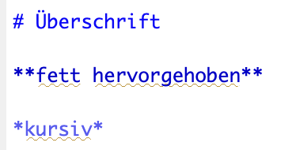{fig-align="center" width="35%"}

Beide Ansichten bearbeiten dieselbe `.qmd`-Datei.

### 🧭 Aufgabe

1.  Wechsle vom **Visual Editor** in den **Source Editor**.

2.  Wechsle wieder zurück.

3.  Schreibe im Visual Editor den Satz: Mein erstes Quarto-Dokument.

4.  Wechsel erneut in den Source Editor.

**Überlege:** Hat sich der Inhalt verändert, oder nur die Darstellung?

:::: {.content-visible when-meta="show_solutions"}
::: {.callout-note collapse="true" title="Lösung"}
Es verändert sich nur die Darstellung. Visual und Source Editor sind zwei verschiedene Ansichten derselben Sache.
:::
::::

## A3 - Das wichtigste Prinzip: Text und Code sind getrennt

Hier liegt ein zentraler Unterschied zu euren bisherigen R-Skripten.

### **In einem `.R`-Skript**

Fast alles wird als R-Code interpretiert. Wenn ihr normalen Text schreiben wollt, verwendet ihr einen Kommentar:

```{r, echo=TRUE, eval=FALSE}
# Jetzt berechnen wir den Mittelwert
werte <- c(2, 4, 6, 8)
mean(werte)
```

### **In einem Quarto-Dokument**

Alles ausserhalb eines Code-Chunks ist zunächst normaler Text. Wir brauchen also kein `#` mehr als Kommentarzeichen.

R-Code gehört dagegen in einen **R-Code-Chunk**.

## A4 - Text verwenden, um ein Dokument zu strukturieren

Quarto erlaubt uns, nicht nur Code auszuführen, sondern den gesamten Workflow verständlich zu gliedern.

Typische Textelemente sind:

-   Überschriften

-   normaler Text

-   **dick hervorgehobener Text**

-   *kursiver Text*

-   Aufzählungen,

-   nummerierte Listen

-   und Links.

Im Visual Editor könnt ihr diese Formatierungen weitgehend über die Oberfläche auswählen.

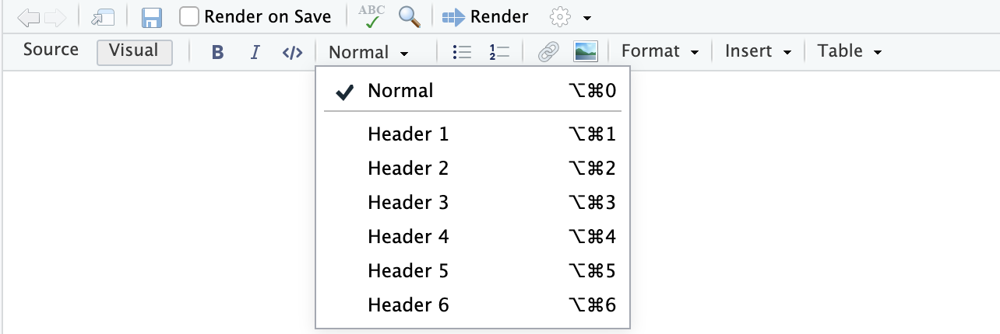{fig-align="center" width="55%"}

### 🧭 Aufgabe: Ein kleines Dokument strukturieren

Erstelle in `quarto_uebung.qmd` folgende Struktur:

**Überschrift Ebene 1**

`Meine Quarto-Übung`

Darunter einen kurzen Satz: In diesem Dokument lerne ich die wichtigsten Bestandteile von Quarto kennen.

**Überschrift Ebene 2**

`Erste Berechnung`

Darunter: Im folgenden Beispiel berechne ich den Mittelwert von vier Zahlen.

Formatiere zusätzlich:

-   ein Wort **fett**

-   und ein Wort *kursiv.*

## A5 - R-Code in Quarto: Code-Chunks

Normaler Text ausserhalb eines Code-Chunks wird in Quarto nicht als R-Code ausgeführt.

Wenn wir R-Code verwenden wollen, schreiben wir ihn in einen **R-Code-Chunk**. Ein Code-Chunk ist also ein eigener Bereich innerhalb des Quarto-Dokuments, in dem R-Befehle ausgeführt werden. Das `{r}` sagt Quarto, dass der Code in diesem Chunk mit R ausgeführt werden soll.

### Einen neuen R-Code-Chunk einfügen

Dafür gibt es mehrere Möglichkeiten:

**Über das Menü:**

`Code → Insert Chunk`

**Über den Visual Editor:**

`Insert → Executable Cell → R`

**Tastenkombination:**

`Option + Command + I` (Mac)

`Ctrl + Alt + I` (Windows/Linux)

📌 **Tipp:** Gewöhne dir Tastenkombinationen an. Im Laufe des Semesters wirst du sehr häufig neue Code-Chunks einfügen.

### 🧭 Aufgabe

Füge unter deiner Überschrift **Erste Berechnung** selbst einen neuen R-Code-Chunk ein.

Verwende dafür entweder die Menüoption oder die Tastenkombination für dein Betriebssystem.

Schreibe anschliessend:

```{r, echo=TRUE, eval=FALSE}
werte <- c(2, 4, 6, 8)
mean(werte)
```

Führe den Chunk aus. Dazu kannst du im Chunk selbst den grünen Pfeil klicken (Run Current Chunk).

**Beobachte**

-   Wird `werte` im Environment erzeugt?

-   Welches Ergebnis liefert `mean(werte)`?

## A6 - Der YAML-Header: Einstellungen für das ganze Dokument

Nun schauen wir uns den Bereich **ganz oben** in unserem Quarto-Dokument an.

Zwischen zwei Linien aus `---` befindet sich der sogenannte **YAML-Header**.

Beispiel:

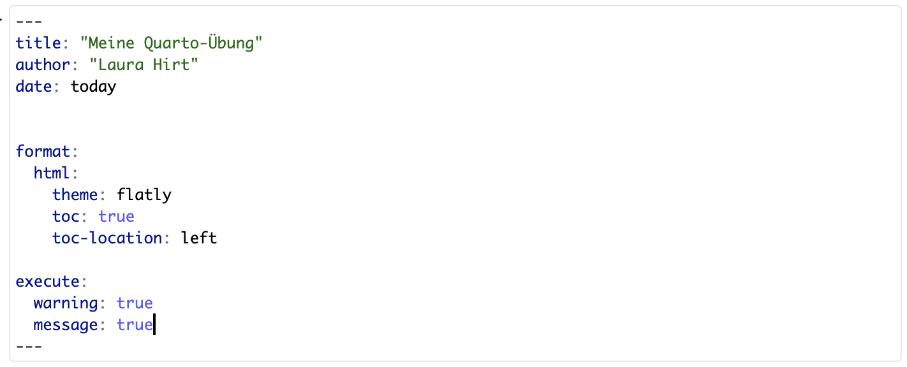{fig-align="center" width="55%"}

### Wofür ist der YAML-Header da?

Der YAML-Header enthält **globale Einstellungen**. Das bedeutet, dass diese Einstellungen das gesamte Dokument betreffen.

### Die wichtigsten Einstellungen für uns

| Einstellung    | Bedeutung                          |
|----------------|------------------------------------|
| `title`        | Titel des Dokuments                |
| `author`       | Autor:in                           |
| `date`         | Datum                              |
| `format`       | Ausgabeformat                      |
| `theme`        | Erscheinungsbild                   |
| `toc`          | Inhaltsverzeichnis anzeigen?       |
| `toc-location` | Position des Inhaltsverzeichnisses |
| `warning`      | Warnmeldungen im Output anzeigen?  |
| `message`      | Meldungen im Output anzeigen?      |

### Ein wichtiger Punkt: Einrückungen

YAML verwendet **Einrückungen**, um zu erkennen, welche Einstellungen zusammengehören.

⚠️ YAML reagiert empfindlich auf falsche Einrückungen. Wenn Quarto bereits beim Rendern den Header beanstandet, überprüft zuerst die Einrückung!

## A7 - Den YAML-Header selbst verändern

### 🧭 Aufgabe

Passe deinen YAML-Header so an, dass:

-   dein eigener Name als Autor:in erschein,

-   das Datum automatisch auf heute gesetzt wird,

-   das Dokument als HTML ausgegeben wird,

-   ein Inhaltsverzeichnis vorhanden ist,

-   das Inhaltsverzeichnis links erscheint,

-   Warnungen angezeigt werden,

-   Meldungen angezeigt werden.

:::: {.content-visible when-meta="show_solutions"}
::: {.callout-note collapse="true" title="Lösung"}
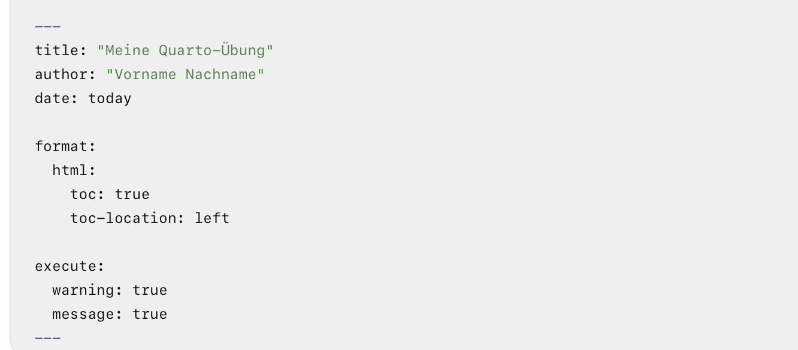{fig-align="center" width="45%"}
:::
::::

💡 **Globale Einstellung = für das gesamte Dokument**

Wenn im YAML-Header etwas steht, gilt diese Einstellung grundsätzlich für alle Code-Chunks im Dokument.

Genau das unterscheidet YAML von den Einstellungen, die wir im nächsten Schritt für einen einzelnen Chunk vornehmen.

## A8 - Einstellungen für einzelne Code-Chunks

Manchmal soll eine Einstellung nicht für das gesamte Dokument gelten, sondern nur für einen bestimmten Code-Chunk.

Dafür gibt es **Chunk-Optionen**.

Beispiel:

{fig-align="center" width="60%"}

Die Zeilen mit `#|` sind keine normalen R-Kommentare, sondern Quarto-Einstellungen für diesen Chunk.

### Die wichtigsten Optionen

| Option    | Frage                                                |
|-----------|------------------------------------------------------|
| `label`   | Wie heisst dieser Chunk?                             |
| `echo`    | Soll der Code im gerenderten Dokument sichtbar sein? |
| `eval`    | Soll der Code überhaupt ausgeführt werden?           |
| `include` | Soll dieser Chunk im Output enthalten sein?          |

📌 **Merke:**

YAML = global

Chunk-Optionen = lokal

## A9 - Inline-Code: R-Ergebnisse direkt im Text

Bisher haben wir zwei Arten von Inhalt kennengelernt:

-   **normalen Text**

-   **R-Code in Code-Chunks**

Quarto erlaubt zusätzlich, kleine R-Ergebnisse direkt inerhalb eines Satzes auszuführen. Das nennt man **Inline-Code**.

Du kannst Inline-Code aktivieren, indem du im Visual Editor das entsprechende Element markierst und dann Command + D (Mac) oder Ctrl + D (Windows/Linux) drückst.

Alternativ kannst du auch oben in der Leiste das `</>`-Symbol (direkt neben dem Kursiv-Symbol) drücken.

### 🧭 Aufgabe

1.  **Zuerst ein Objekt erzeugen**

Erzeuge zunächst in einem normalen R-Code-Chunk:

```{r, eval=TRUE, echo=TRUE}

datum <- Sys.Date()
```

Führe den Chunk aus.

2.  **Inline-Code im Visual Editor einfügen**

Schreibe anschliessend im normalen Text: Dieses Dokument wurde zuletzt am `datum` bearbeitet.

Rendere das Dokument später.

Statt des Codes soll im gerenderten Text das tatsächliche Datum erscheinen.

### Ein zweites Beispiel

Wenn:

```{r, eval=TRUE, echo=TRUE}

werte <- c(2, 4, 6, 8)
mittelwert <- mean(werte)
```

berechnet wurde, könntest du schreiben:

Der Mittelwert beträgt `mittelwert`.

### Warum ist das nützlich?

Wenn sich die Daten ändern, aktualisiert sich beim erneuten Rendern auch automatisch der Wert im Text. Du kannst damit also vermeiden, Ergebnisse manuell aus R in einen Text zu kopieren!

## A10 - Rendern: aus `.qmd` wird ein vollständiges Dokument

Jetzt haben wir genug Bausteine kennengelernt, um zu verstehen, was **Rendern** eigentlich bedeutet.

Beim Rendern verarbeitet Quarto:

1.  den YAML-Header,

2.  den normalen Text,

3.  die Code-Chunks,

4.  die erzeugten Ergebnisse,

5.  Inline-Code

und erstellt daraus das gewünschte Ausgabeformat.

### 🧭 Aufgabe: Dein erstes vollständiges Render

Bevor du renderst:

1.  Speichere `quarto_uebung.qmd`

2.  Kontrolliere deinen YAML-Header

3.  Kontrolliere, dass benötigte Objekte vor ihrer Verwendung erzeugt werden

Dann:

**Render**

## A11 - Rendern als Reproduzierbarkeitsprüfung

Wenn ihr während der Arbeit einzelne Code-Chunks ausführt, kann euer Dokument funktionieren, obwohl wichtige Schritte gar nicht im Dokument enthalten sind.

**Warum?**

Weil im Environment möglicherweise noch Objekte aus früheren Arbeitsschritten liegen.

Stellt euch zum Beispiel vor, dort existiert bereits `dat_full`, weil ihr diesen gestern erzeugt habt. Nun verwendet ihr heute irgendwo in eurem Dokument:

```{r, echo=TRUE, eval=FALSE}
summary(dat_full)
```

Der Code funktioniert - obwohl im Dokument vielleicht nirgendwo steht, wie `dat_full` überhaupt erzeugt wurde oder eingelesen wurde.

Für euch sieht zunächst alles korrekt aus.

Eine andere Person hat dieses Objekt aber nicht im Environment. Und auch ihr selbst habt es nach einem Neustart von R nicht mehr automatisch zur Verfügung.

**Deshalb ist Rendern nicht nur eine Möglichkeit, ein schönes Dokument zu erzeugen. Rendern ist gleichzeitig eine Prüfung, ob euer Workflow wirklich vollständig und reproduzierbar ist.**

Beim Rendern muss Quarto das Dokument in der vorhergesehenen Reihenfolge ausführen können:

**Pakete laden** → **Daten einlesen** → **Objekte erzeugen** → **Daten verarbeiten** → **Ergebnisse berechnen**

Fehlt ein notwendiger Schritt oder steht an der falschen Stelle, kann das Dokument nicht vollständig ausgeführt werden.

## A12 - Andere Ausgabeformate

Quarto kann unterschiedliche Outputformate erzeugen.

Zum Beispiel:

-   html

-   docx

-   pdf

Welches Format verwendet wird, wird grundsätzlich im YAML-Header festgelegt.

Für unser Seminar ist zunächst vor allem **HTML** relevant.

### ⭐ Zusatzaufgabe

Ändere testweise das Format von `html` auf `docx` und rendere dein Übungsdokument als Word-Datei.

Stelle danach wieder auf das für unser Seminar vorgesehene Format zurück.

## A13 - Übertragung auf unser Forschungsprojekt

Jetzt ist die allgemeine Quarto-Einführung abgeschlossen.

Ihr habt in einer ungefährlichen Übungsdatei gelernt:

-   Visual und Source zu unterscheiden,

-   normalen Text zu schreiben,

-   ein Dokument mit Überschriften zu strukturieren,

-   R-Code in Chunks auszuführen,

-   globale Einstellungen im YAML festzulegen,

-   lokale Chunk-Einstellungen zu verwenden,

-   Inline-Code einzubauen,

-   und ein vollständiges Dokument zu rendern.

Jetzt übertragen wir das auf die Dateien, mit denen wir während des Semesters tatsächlich arbeiten.

### 🔄 Wechsel der Arbeitsdatei

Schliesse `quarto_uebung.qmd` und öffne im Forschungsprojekt:

-   `Grinschgl2020/code/processing.qmd`

-   `Grinschgl2020/code/analysis.qmd`

## A14 - Unsere beiden Abgabedokumente vorbereiten

### 🧭 Aufgabe

Öffne beide Dokumente.

Ihr werdet feststellen, dass die Grundstruktur bereits vorbereitet ist.

**Anpassungen vornehmen**

Passe in beiden YAML-Headern an:

`author`: dein Name

`warning: true`

`message: true`

Die übrigen vorbereiteten Einstellungen lässt du bestehen.

Speichere beide Dateien.

## B0 - R-Projekte: ein gemeinsamer Rahmen für unser Forschungsprojekt

Wir haben nun Quarto-Dokumente kennengelernt. Diese Dokumente sollen später aber nicht isoliert irgendwo auf unserem Computer liegen.

Zu unserem Forschungsprojekt gehören viele unterschiedliche Bestandteile:

-   Rohdaten,

-   verarbeitete Daten,

-   `processing.qmd`,

-   `analysis.qmd`,

-   Codebook,

-   Datenanalyseplan,

-   Paper,

-   später auch Ergebnisse und Abbildungen.

Damit RStudio weiss, welche Dateien zusammen zu einem Projekt gehören und von welchem Ausgangspunkt wir arbeiten, verwenden wir ein **R-Projekt**.

### Was ist ein R-Projekt?

Ein R-Projekt wird durch eine Datei mit der Endung `.Rproj` gekennzeichnet.

In unserem Fall: `ryouready.Rproj`

Ihr könnt euch ein R-Projekt wie einen **Container für ein Forschungsprojekt** vorstellen:

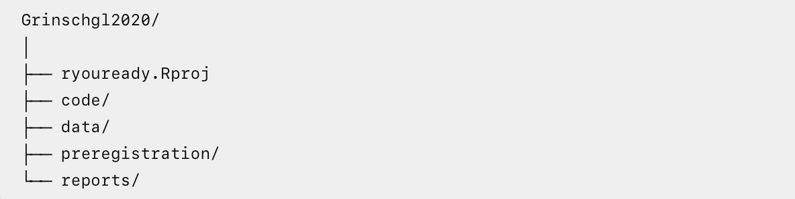{fig-align="center" width="65%"}

Alles innerhalb dieses Projektordners gehört logisch zu derselben Analyse.

📌 **Wichtig:** Die `.Rproj`-Datei enthält nicht eure Daten oder euren Code. Sie sorgt dafür, dass RStudio den gesamten Ordner als zusammengehöriges Projekt behandelt.

### Was passiert, wenn wir ein R-Projekt öffnen?

Wenn ihr `ryouready.Rproj` öffnet, passiert unter anderem Folgendes:

-   **RStudio öffnet den passenden Projektkontext:** Ihr arbeitet nun nicht einfach "irgendwo in RStudio", sondern innerhalb des Projekts `Grinschgl2020`.

-   **Der Projektordner wird zum gemeinsamen Ausgangspunkt:** RStudio setzt das Working Directory auf den Ordner, in dem die `.Rproj`-Datei liegt. Dokumente können also dann direkt von hier aus adressiert werden, sodass nicht der vollständige Pfad auf unserem eigenen Computer angegeben werden muss. Genau diese Idee wird im nächsten Abschnitt bei absoluten und relativen Pfaden wichtig.

-   **Alle Projektbestandteile bleiben logisch zusammen:** Daten, Code und Dokumentation befinden sich innerhalb derselben Projektstruktur. Das erleichtert die Orientierung, Zusammenarbeit, Weitergabe des Projekts und reproduzierbare Analysen.

### Warum ist das sinnvoll?

Ohne einen klaren Projektkontext entstehen schnell typische Probleme:

-   R sucht Dateien im falschen Ordner.

-   Skripte funktionieren nur auf dem eigenen Laptop.

-   Daten und Code liegen an verschiedenen Orten.

-   absolute Dateipfade werden verwendet.

-   andere Personen können den Code bei sich nicht direkt ausführen.

Mit einem R-Projekt gibt es dagegen einen **gemeinsamen Ausgangspunkt**.

## B1 - Unser bereitsgestelltes Projekt öffnen

Für dieses Seminar müsst ihr **kein neues R-Projekt erstellen**.

Das Projekt wurde bereits vorbereitet und befindet sich im Ordner: `R_You_Ready/Grinschgl2020/`.

### 🧭 Aufgabe: Projekt korrekt öffnen

1.  Speichere offene Dateien und schliesse RStudio vollständig.

2.  Navigiere auf deinem Computer zum Ordner `Grinschgl2020`.

3.  Öffne die Datei `ryouready.Rproj`.

4.  Kontrolliere anschliessend in RStudio, ob das richtige Projekt aktiv ist.

Je nach RStudio-Version wird der Projektname beispielsweise oben rechts oder in der Titelleiste angezeigt.

In diesem Screenshot ist noch kein Projekt geöffnet. Wenn ein Projekt aktiv ist, wird dort der entsprechende Projektname angezeigt.

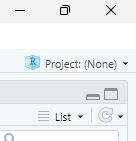

#### 🛠️ Probleme beim Öffnen des Projekts?

::: {.callout-note collapse="true" title="Bei Fehlermeldungen:"}
Achtung! Bei Mac-User:innen kann es zu Problemen mit den Berechtigungen kommen. Falls dir beim Öffnen diese Fehlermeldung angezeigt wird:

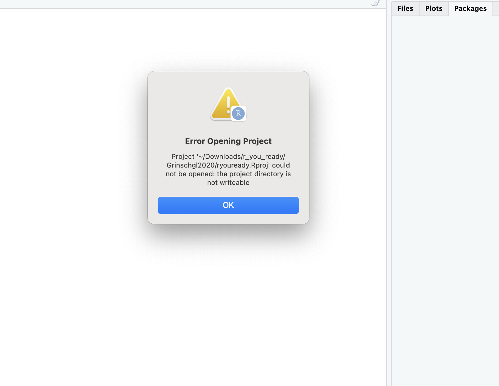

besteht die Lösung darin, die Berechtigungen für den Ordner anzupassen. Dafür gehst du auf den r_you_ready-Ordner und öffnest das Menü mit Get Info.

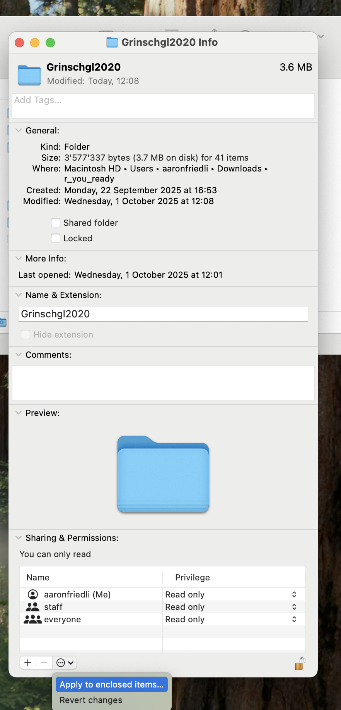

Die Berechtigungen passt du an, indem du auf das Schloss unten rechts klickst, dein Passwort eingibst und bei deinem Account "Read & Write" auswählst. Anschliessend klickst du auf die drei Punkte im Kreis und führst "Apply to enclosed items…" aus. Danach solltest du die vollen Berechtigungen haben.
:::

### 🧭 Aufgabe: Kontrolliere zusätzlich das Working Directory

Führe in der Konsole aus: `getwd()`.

Dieser Befehl bedeutet **get working directory** und zeigt, von welchem Ordner R momentan ausgeht.

### Warum öffnen wir das Projekt immer auf diese Weise?

Gewöhne dir für dieses Seminar folgende Reihenfolge an:

1.  Projekt über `.Rproj` öffnen

2.  dann `processing.qmd` oder `analysis.qmd` öffnen

3.  dann mit den Daten arbeiten

Nicht: RStudio öffnen → irgendwelche Dateien zusammensuchen → Working Directory manuell verändern.

Das schafft jedes Mal denselben Ausgangspunkt.

### ✅ Mini-Checkpoint

Bevor du weiterarbeitest, solltest du beantworten können:

-   Ist `Grinschgl2020` als Projekt geöffnet?

-   Wo liegt die `.Rproj`-Datei?

-   Was zeigt `getwd()`?

-   Warum ist der Projektordner unser gemeinsamer Ausgangspunkt?

Wenn das klar ist, bist du bereit für den nächsten Schritt:

**Wie adressieren wir Dateien innerhalb dieses Projekts?**

## C0 - Dateipfade: Wie findet R unsere Dateien?

Wir haben im vorherigen Abschnitt gesehen, dass unser R-Projekt uns einen gemeinsamen Projektkontext gibt.

Nun stellt sich die nächste Frage:

**Wie sagen wir R, wo innerhalb unseren Computers oder Projekts eine bestimmte Datei liegt?**

Dafür verwenden wir Dateipfade. Ein Pfad beschreibt den Weg zu einer Datei oder einem Ordner.

Dabei unterscheiden wir zwischen:

-   **absoluten Pfaden**

-   **relativen Pfaden**

### Absolute Pfade: der vollständige Weg auf deinem Computer

Ein absoluter Pfad beginnt ganz oben im Dateisystem deines Computers und beschreibt den vollständigen Weg bis zur Datei.

**Beispiel auf macOS**

`/Users/max/Documents/R_You_Ready/Grinschgl2020/data/raw/data_mmq.csv`

**Beispiel auf Windows**

`C:\Users\maxmustermann\Dokumente\r_you_ready\Grinschgl2020\data\raw\Beispieldatei.csv`

Beide Pfade enthalten nicht nur die Struktur unseres Forschungsprojekts, sondern auch Informationen über den jeweiligen Computer:

-   Betriebssystem

-   Benutzername

-   Speicherort des Projekts

-   Ordnerstruktur ausserhalb des Projekts

### Warum ist das problematisch?

Angenommen, Max speichert das Projekt unter:

`/Users/max/Documents/R_You_Ready/`

Anna dagegen unter:

`C:\Users\Anna\Desktop\R_You_Ready\`

Der absolute Pfad von Max exisitert auf Annas Computer nicht.

Ein Skript kann deshalb bei Max funktionieren, bei Anna aber bereits beim Einlesen der ersten Datei scheitern.

Das erschwert die Zusammenarbeit, die Weitergabe von Projekten und die Reproduzierbarkeit.

📌 **Für reproduzierbare Forschungsprojekte vermeiden wir deshalb computerspezifische absolute Pfade.**

### Relative Pfade: vom aktuellen Ausgangspunkt zur Datei

Ein relativer Pfad enthält nicht den vollständigen Speicherort auf einem Computer.

Stattdessen beschreibt er, wie ich von meinem aktuellen Ausgangspunkt zur gewünschten Datei komme.

Wenn unser Ausgangspunkt `Grinschgl2020` ist, lautet der Weg zu `data_mmq.csv`:

`data/raw/data_mmq.csv`

Das bedeutet:

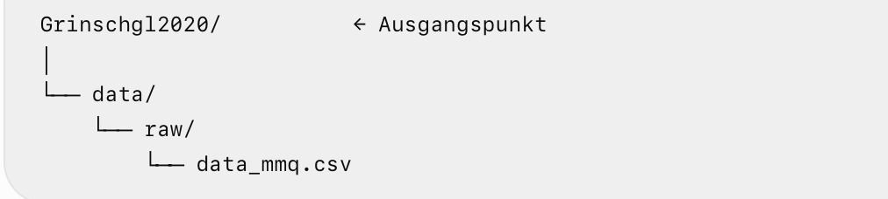{fig-align="center" width="65%"}

Der computerspezifische Teil davor ist nicht mehr Bestandteil unseres Codes.

### Verbindung zum Working Directory

Im vorherigen Abschnitt habt ihr mit `getwd()` kontrolliert, welches **Working Directory** R aktuell verwendet.

Ein relativer Pfad wird von diesem Ausgangspunkt aus interpretiert.

📌 **Merke:** Ein relativer Pfad braucht immer einen gemeinsamen Ausgangspunkt. Das ist genau der Grund, warum R-Projekte und relative Pfade so gut zusammenpassen.

## C1 - Relative Pfade hängen vom Ausgangspunkt ab

Hier kommt eine wichtige Besonderheit:

**Ein relativer Pfad ist immer relativ zum aktuellen Working Directory.**

Der Pfad:

`data/raw/data_mmq.csv`

funktioniert also nur dann direkt, wenn unser Ausgangspunkt hier liegt:

`Grinschgl2020/`

<br>

Aber was passiert, wenn unser Ausgangspunkt stattdessen hier liegt:

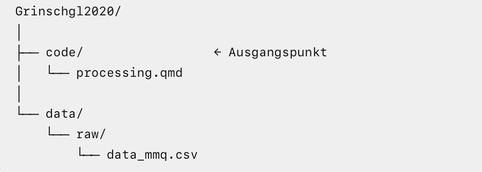{fig-align="center" width="65%"}

Von `code/` aus exisitiert `data/raw/data_mmq.csv` nicht.

R würde innerhalb von `code/` nach einem Unterordner `data/` suchen. Diesen Ordner gibt es aber nicht.

### Warum ist das für Quarto wichtig?

Beim interaktiven Arbeiten nach dem Öffnen unseres R-Projekts zeigt `getwd()` typischerweise auf:

`Grinschgl2020/`

<br>

Unser `processing.qmd` liegt aber hier:

`Grinschgl2020/code/processing.qmd`

<br>

Beim **Rendern** eines Quarto-Dokuments wird Code standardmässig ausgehend vom Verzeichnis der jeweiligen `.qmd`-Datei ausgeführt. Für `processing.qmd` kann der Ausgangspunkt beim Rendern deshalb `code/` sein.

**Das bedeutet:**

Während des interaktiven Arbeites könnte funktionieren:

```{r, eval=FALSE, echo=TRUE}
read_csv("data/raw/data_mmq.csv")
```

weil der Ausgangspunkt gerade `Grinschgl2020/` ist.

Beim Rendern könnte derselbse Pfad scheitern, weil Quarto nun von `Grinschgl2020/code/` ausgeht.

⚠️ **Das ist besonders gefährlich:** Code kann beim Arbeiten funktionieren, aber beim Rendern plötzlich nicht mehr.

Genau das möchten wir vermeiden.

## C2 - Möglichkeit 1: In der Ordnerstruktur nach oben gehen

Relative Pfade können auch angeben, dass wir zunächst eine Ebene **nach oben** wechseln wollen.

Dafür verwenden wir: `..`

`..` bedeutet: Gehe einen Ordner nach oben.

Wenn unser Ausgangspunkt `code/` ist, können wir schreiben:

`../data/raw/data_mmq.csv`

Das bedeutet Schritt für Schritt:

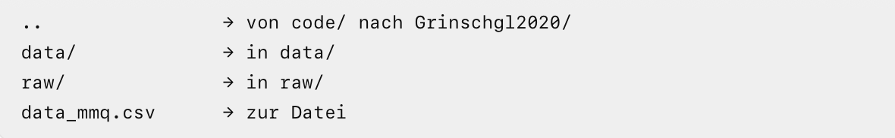{fig-align="center" width="65%"}

### 🧭 Aufgabe: Einen relativen Pfad zusammensetzen

Angenommen, dein aktueller Ausgangspunkt ist:

`Grinschgl2020/code/`

Wie lautet der relative Pfad zu:

`Grinschgl2020/data/raw/data_pct.csv`

:::: {.content-visible when-meta="show_solutions"}
::: {.callout-note collapse="true" title="Lösung"}
`../data/raw/data_pct.csv`
:::
::::

### Aber hier entsteht ein neues Problem

Nun hätten wir abhängig vom aktuellen Ausgangspunkt unterschiedliche Pfade.

**Wenn wir von der Projektwurzel starten:**

`data/raw/data_mmq.csv`

**Wenn wir aus `/code` starten:**

`../data/raw/data_mmq.csv`

<br>

Das funktioniert zwar technisch. Aber jetzt muss unser Code ständig wissen, von welchem Ordner aus er gerade ausgeführt wird.

Gerade bei Quarto-Dokumenten kann das schnell unübersichtlich werden.

Wir möchten deshalb eine robustere Lösung.

## C3 - Möglichkeit 2: `here()`

Genau dafür können wir das Paket `here` verwenden.

Die Grundidee ist sehr einfach: `here()` sucht die Wurzel unseres Projekts und baut den Pfad immer von dort aus auf.

In unserem Projekt erkennt `here()` unter anderem die vorhandene `Rproj`-Datei und kann dadurch `Grinschgl2020` als Projektwurzel bestimmen.

### Einen Pfad mit `here()` erzeugen

Nun können wir von dieser Projektwurzel aus den Weg zur Datei angeben:

```{r, echo=TRUE, eval=FALSE}
here::here(
  "data",
  "raw",
  "data_mmq.csv"
)
```

`here()` kümmert sich darum, wo das Projekt auf dem jeweiligen Computer tatsächlich gespeichert ist.

### Warum ist `here()` für unser Seminar besonders sinnvoll?

Im Gegensatz zu einem relativen Pfad ist diese Version immer relativ zur Projektwurzel. Sie funktioniert also unabhängig davon, ob der Code aus `code/` heraus ausgeführt wird. Sie ist damit also besonders praktisch beim Rendern von Quarto-Dokumenten.

### 🧭 Aufgabe: Pfade mit `here()` bauen

Erzeuge mit `here()` einmal Pfade zu den folgenden beiden Dateien:

-   data_pct.csv

-   data_ratings.xlsx

:::: {.content-visible when-meta="show_solutions"}
::: {.callout-note collapse="true" title="Lösung"}
```{r echo=TRUE, eval=FALSE}
# data_pct.csv
here::here(
  "data",
  "raw",
  "data_pct.csv"
)

# data_ratings.xlsx
here::here(
  "data",
  "raw",
  "data_ratings.xlsx"
)
```
:::
::::

## ✅ Checkpoint - Ende des EH3-Teils

Bis hierhin solltest du:

-   Quarto praktisch verwenden können,

-   `processing.qmd` und `analysis.qmd` vorbereitet haben,

-   das richtige R-Projekt geöffnet haben,

-   wissen, was die Projektwurzel ist,

-   und absolute von relativen Pfaden unterscheiden können.

**Noch wurde kein Rohdatensatz verändert.**

`data/processed/` darf weiterhin leer sein.

## 🚦Ab hier: Inhalte zu EH4

Die folgenden Aufgaben führen zum ersten tatsächlichen Processing-Schritt.

Wenn ihr diesen Hands-on unmittelbar nach EH3 bearbeitet, könnt ihr hier stoppen.

Wenn ihr schneller seid, dürft ihr selbstverständlich weiterarbeiten. Die folgenden Abschnitte enthalten die notwendigen Erklärungen; die zugrunde liegenden Konzepte greifen wir in EH4 zusätzlich gemeinsam auf.

# Teil 2: AUFBEREITEN

Bis hierhin haben wir die Arbeitsumgebung für unser Forschungsprojekt vorbereitet:

-   wir können mit Quarto arbeiten,

-   `processing.qmd` und `analysis.qmd` sind eingerichtet,

-   das richtige R-Projekt ist geöffnet,

-   wir verstehen absolute und relative Pfade,

-   und wir können mit `here()` Dateien zuverlässig relativ zur Projektwurzel adressieren.

Nun beginnen wir zum ersten Mal damit, die **eigentlichen Rohdaten** zu verarbeiten.

Unser Ziel für diesen Teil ist:

**Aus sieben getrennten Rohdatensätzen erzeugen wir reproduzierbar einen gemeinsamen Datensatz `dat_full`.**

Der Weg dorthin:

**Rohdateien** → **Import** → **Kontrolle** → **Merge** → **Validierung** → **Speichern** → **Rendern**

## D0 - Vom File zum R-Objekt

Unsere sieben Rohdatensätze liegen bereits im Projekt:

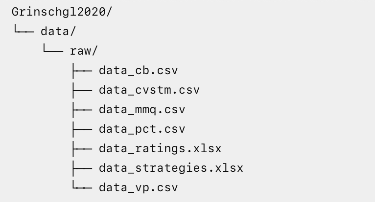{fig-align="center" width="50%"}

Diese Dateien befinden sich zwar auf unserem Computer, R kann mit ihnen aber noch nicht direkt arbeiten.

Damit wir Berechnungen mit ihnen durchführen können, müssen wir sie zuerst **importieren**.

Beim Import passiert vereinfacht: Datei auf der Festlplatte → Import → R-Objekt im Environment

📌 **Wichtig:** Die Datei liegt dauerhaft unter `data/raw/`. Das Objekt entsteht erst, wenn unser Code die Datei in R einliest.

Wenn R neu gestartet wird, verschwindet das Objekt aus dem Environment. Die Datei auf der Festplatte bleibt selbstverständlich erhalten.

Deshalb muss unser Code jederzeit in der Lage sein, die benötigten Objekte erneut aus den Rohdateien zu erzeugen.

## D1 - Wo arbeiten wir ab jetzt?

## 📍Arbeitskontext

**Projekt:** `Grinschgl2020`

**Datei:** `code/processing.qmd`

**Input:** sieben Dateien aus `data/raw/`

**Zwischenergebnis:** sieben R-Objekte im Environment

**Endergebnis dieses Blocks: `data/processed/dat_full.csv`**

Ab jetzt gehören alle notwendigen Schritte, mit denen wir unsere Rohdaten verarbeiten, in `processing.qmd`.

Öffne deshalb: `Grinschgl2020/code/processing.qmd`.

## D2 - `processing.qmd` strukturieren

Auch unser Code soll von Anfang an verständlich aufgebaut sein.

Ergänze in `processing.qmd` folgende Überschriften:

-   Dependencies

-   Import raw data

-   Merge raw data

-   Validate merged data

-   Save processed data

-   Session Info

Unter jeder Überschrift soll später genau die Art von Code stehen, die der Titel beschreibt.

### Warum machen wir das?

Ein Processing-Dokument soll nicht einfach eine lange Liste von R-Befehlen enthalten.

Eine andere Person soll erkennen können: **Was passiert in welchem Abschnitt - und warum?**

### 🧭 Aufgabe

Schreibe unter die Überschrift `Import raw data` zunächst einen kurzen normalen Text, der erklärt, was im folgenden Abschnitt passieren wird.

:::: {.content-visible when-meta="show_solutions"}
::: {.callout-note collapse="true" title="Lösung"}
**Beispiel:**

In diesem Abschnitt werden die sieben unveränderten Rohdatensätze aus `data/raw/` in R eingelesen.
:::
::::

Versuche für die übrigen Abschnitte später ebenfalls kurze Erklärungen in normalem Quarto-Text zu verwenden.

## D3 - Welche Pakete brauchen wir?

Bevor wir Funktionen aus zusätzlichen Paketen verwenden können, müssen wir diese laden.

Für diesen Hands-on benötigen wir:

-   `library(tidyverse)`: enthält unter anderem `readr` zum Einlesen von Textdateun und `dplyr` für Funktionen wie `full_join()`.

-   `library(readxl)`: enthält Funktionen zum Einlesen von Excel-Dateien.

-   `library(here)`: hilft uns, Dateipfade zuverlässig von der Projektwurzel aus aufzubauen.

Füge diesen Code unter `Dependencies` in einen R-Code-Chunk ein.

### Installieren ≠ Laden

Falls ein Paket auf deinem Computer noch nicht installiert ist, musst du es **einmalig** installieren.

Das gehört in die **Konsole**, nicht in das Skript selbst!

Die Installation ist eine einmalige Einrichtung des Computers, das Laden eines bereits installierten Pakets gehört dagegen zu unserem reproduzierbaren Workflow und damit ins Skript.

## D4 - Der erste Datenimport: zunächst über die RStudio-Oberfläche

Bevor wir selbst Import-Code schreiben, schauen wir uns einmal an, was RStudio beim Importieren im Hintergrund macht.

Wir verwenden dafür: `data/raw/data_mmq.csv`

### 🧭 Aufgabe

Gehe im **Environment** zu:

**Import Dataset** → **From Text (readr)** und wähle die Datei `data_mmq.csv` aus `data/raw`.

Schau dir zunächst nur die Vorschau an. Beobachte:

1.  Wie viele Spalten schein RStudio zu erkennen?

2.  Sind die Werte sinnvoll auf mehrere Spalten verteilt?

3.  Welches **Delimiter** ist ausgewählt?

Verändere testweise den Delimiter. Was passiert?

:::: {.content-visible when-meta="show_solutions"}
::: {.callout-note collapse="true" title="Lösung"}
RStudio erkennt zunächst nur eine Spalte. Die Werte sind also nicht sinnvoll über mehrere Spalten verteilt, sondern alle durchmischt in derselben Spalte enthalten. Momentan ist der Delimiter "Comma" ausgewählt. Es ist aber ersichtlich, dass die Daten nicht mit Komma, sondern mit Semikolon getrennt sind. Sobald dieser Delimiter ausgewählt wird, erscheinen die Daten anschaulich auf verschiedene Spalten hinweg verteilt.
:::
::::

## D5 - Was ist ein Delimiter?

CSV steht für: **Comma-Separated Values**

Allerdings werden Textdateien nicht immer tatsächlich mit einem Komma getrennt.

Mögliche Trennzeichen sind beispielsweise:

-   , (Komma)

-   ; (Semikolon)

Ein solches Trennzeichen nennt man **Delimiter**.

Unsere CSV-Rohdateien verwenden Semikolon als Delimiter.

### Warum ist der richtige Delimiter wichtig?

Angenommen, eine Datei enthält:

`code;question1;question2`

`1;4;3`

`2;5;2`

Wenn R weiss, dass Semikolon das Trennzeichen ist, entstehen daraus drei Spalten:

| code | question1 | question2 |
|------|-----------|-----------|
| 1    | 4         | 3         |
| 2    | 5         | 2         |

Wird dagegen ein falscher Delimiter verwendet, kann beispielsweise alles in **einer einzigen Spalte** landen.

📌 Ein erfolgreicher Import bedeutet deshalb nicht nur: R hat keine Fehlermeldung ausgegeben. Wir müssen auch prüfen, ob die Datei richtig interpretiert wurde!

## D6 - Was macht RStudio beim Point-and-Click-Import?

Schau im Importfenster auf den Bereich, in dem RStudio den dazugehörigen Code zeigt.

RStudio importiert die Datei nicht "magisch".

Im Hintergrund wird ebenfalls R-Code erzeugt, beispielsweise mit: `read_delim()`.

Wenn du den Import bestätigst, wird dieser Code ausgeführt.

### Warum reicht das Ausführen über die Oberfläche nicht?

Wenn der Code nur einmal über die Oberfläche bzw. in der Konsole ausgeführt wird:

-   ist der Import nicht dauerhaft in unserem Workflow dokumentiert,

-   eine andere Person weiss später nicht genau, wie die Datei eingelesen wurde,

-   und beim Rendern unseres `processing.qmd` würde der Import fehlen.

**Ein notwendiger Processing-Schritt muss deshalb im `processing.qmd` stehen.**

Die Oberfläche ist für uns hier also vor allem ein Lern- und Kontrollwerkzeug.

## D7 - Vom automatisch erzeugten Code zum reproduzierbaren Import

Kopiere den von RStudio erzeugten Importcode zunächst in einen Code-Chunk im Abschnitt `Import raw data` deines Processing-Skripts.

Schau dir den Code genau an.

### 🧭 Überlege

Welche Bestandteile erkennst du?

Du solltest mindestens finden:

-   den Namen des neuen R-Objekts,

-   eine importfunktion,

-   den Dateipfad,

-   den Delimiter.

## D8 - Den ersten Import kontrollieren

Führe den Importcode aus.

Danach sollte im Environment ein neues Objekt erscheinen: `data_mmq`.

Öffne dieses Dokument (entweder im Environment anklicken oder `View(data_mmq)`).

### 🧭 Kontrollieren

-   Sind die Werte auf mehrere Spalten verteilt?

-   Sehen die Spaltennamen plausibel aus?

-   Gibt es 159 Zeilen?

-   Ist jede Zeile sinnvoll befüllt?

Du kannst zusätzlich ausführen: `dim(data_mmq)`

📌 **Merke:** Importieren und Import kontrollieren gehören zusammen.

## D9 - Dateien per Code importieren

Die Oberfläche war hilfreich, um den Import einmal sichtbar zu machen.

Langfristig möchten wir Daten jedoch **direkt durch dokumentierten Code** einlesen.

Dadurch ist eindeutig festgelegt:

-   welche Datei verwendet wird,

-   mit welcher Funktion sie eingelesen wird,

-   mit welchen Einstellungen sie eingelesen wird,

-   unter welchem Objektnamen sie in R verfügbar ist.

## D10 - Unterschiedliche Dateiformate benötigen passende Funktionen

Unsere sieben Rohdatensätze liegen in zwei Dateiformaten vor.

### CSV-Dateien

Für Textdateien verwenden wir Funktionen aus dem Paket `readr`.

Beispielsweise: `read_delim()`. Hier geben wir das Trennzeichen explizit an: `delim = ";"`

Weitere Funktionen, die euch begegnen können:

`read_csv()`

`read_csv2()`

**Unterschied vereinfacht**

-   `read_csv()`: erwartet Komma als Delimiter

-   `read_csv2()`: erwartet Semikolon als Delimiter

-   `read_delim()`: Delimiter wird explizit angegeben

Für unsere Übung verwenden wir bewusst:

`read_delim(..., delim = ";")`

Damit ist im Code direkt sichtbar, welches Trennzeichen erwartet wird.

### Excel-Dateien

Dateien mit `.xlsx` lesen wir mit dem Paket `readxl` ein.

Die zentrale Funktion lautet: `read_excel()`.

Bei Excel-Dateien benötigen wir keinen Delimiter.

## D11 - Hilfe nutzen statt Syntax auswendig lernen

Ihr müsst euch nicht jede Funktion und jedes Argument auswendig merken.

Wenn du beispielsweise wissen möchtest, welche Argumente `read_delim()` besitzt:

`?read_delim`

oder

`?readr::read_delim`

<br>

Zusätzlich könnt ihr in RStudio die **Tab Completion** verwenden.

Beginne beispielsweise:

`readr::read_delim(`

und drücke die **Tab-Taste**. RStudio zeigt dir mögliche Argumente an.

📌 Ziel ist nicht, jede Syntax auswendig zu lernen. Ziel ist, zu wissen, **welche Funkion ein Problem löst und wie ihr ihre Dokumentation findet**.

## D12 - Die sieben Rohdatensätze importieren

Nun soll `processing.qmd` alle sieben Rohdateien reproduzierbar einlesen.

## 📍Arbeitskontext

**Datei:** `code/processing.qmd`

**Abschnitt:** `Import raw data`

**Ausgangspunkt:** Dateien in `data/raw/`

**Ergebnis:** sieben R-Objekte im Environment

Es wird noch keine neue Datei gespeichert.

### Die sieben Dateien

**CSV**

-   `data_cb.csv`

-   `data_cvstm.csv`

-   `data_mmq.csv`

-   `data_pct.csv`

-   `data_vp.csv`

**Excel**

-   `data_ratings.xlsx`

-   `data_strategies.xlsx`

### 🧭 Aufgabe

Schreibe den Importcode für die sechs noch fehlenden Dateien selbst.

Orientiere dich am bereits vorhandenen Beispiel:

```{r, echo=TRUE, eval=FALSE}

data_mmq <- readr::read_delim(
  here::here("data", "raw", "data_mmq.csv"),
  delim = ";"
)
```

Achte jeweils auf:

1.  richtigen Objektnamen

2.  richtige Importfunktion

3.  richtigen Dateinamen

4.  Pfad mit `here()`

5.  bei CSV: korrekten Delimiter

:::: {.content-visible when-meta="show_solutions"}
::: {.callout-note collapse="true" title="Lösung"}
```{r, echo=TRUE, eval=FALSE}
# data_cb
data_cb <- readr::read_delim(
  here::here("data", "raw", "data_cb.csv"),
  delim = ";"
)

# data_cvstm
data_cvstm <- readr::read_delim(
  here::here("data", "raw", "data_cvstm.csv"),
  delim = ";"
)

# data_mmq
data_mmq <- readr::read_delim(
  here::here("data", "raw", "data_mmq.csv"),
  delim = ";"
)

# data_pct
data_pct <- readr::read_delim(
  here::here("data", "raw", "data_pct.csv"),
  delim = ";"
)

# data_vp
data_vp <- readr::read_delim(
  here::here("data", "raw", "data_vp.csv"),
  delim = ";"
)

# data_ratings
data_ratings <- readxl::read_excel(
  here::here("data", "raw", "data_ratings.xlsx")
)

# data_strategies
data_strategies <- readxl::read_excel(
  here::here("data", "raw", "data_strategies.xlsx")
)
```
:::
::::

## D13 - Müssen wir diese sieben Objekte jetzt speichern?

Nein!

Das ist ein wichtiger Punkt. Wir haben jetzt:

**Auf der Festplatte**

die sieben unveränderten Dateien unter `data/raw`

**Im Environment**

die sieben daraus erzeugten R-Objekte:

`data_cb`, `data_cvstm`, `data_mmq`, `data_pct`, `data_ratings`, `data_strategies` und `data_vp`.

Diese Objekte müssen nicht noch einmal als neue Dateien gespeichert werden. In `processing.qmd` können sie jederzeit wieder aus den ursprünglichen Rohdateien erzeugt werden.

📌 Wir vermeiden unnötige Kopien und speichern erst dann einen neuen Datensatz, wenn durch unsere Verarbeitung tatsächlich ein neues sinnvolles Produkt entstanden ist.

## D14 - Import-Checkpoint: Was haben wir jetzt eigentlich?

Bevor wir die Datensätze verbinden, müssen wir verstehen, **was wir importiert haben**.

Ein Merge sollte niemals blind durchgeführt werden.

### 🧭 Aufgabe

Untersuche für jeden der sieben Datensätze:

-   Anzahl Zeilen,

-   Anzahl Spalten,

-   Namen der Variablen,

-   Name der ID-Variablen.

**Hilfreiche Funktionen**

`dim()`, `nrow()`, `ncol()`, `names()`, `head()` und `glimpse()`.

### Was fällt auf?

Sechs Datensätze verwenden als ID: `code`

Ein Datensatz verwendet dagegen: `code_all`

Diese kleine Inkonsistenz wird beim Zusammenführen wichtig.

## ✅ Checkpoint - Import abgeschlossen

Bevor du weiterarbeitest:

**Im Environment sollten vorhanden sein:**

`data_cb`

`data_cvstm`

`data_mmq`

`data_pct`

`data_ratings`

`data_strategies`

`data_vp`

In `data/raw/` liegen weiterhin die inveränderten sieben Originaldateien.

In `data/processed/` liegt weiterhin noch nichts Neues.

In `processing.qmd` steht der vollständige Code, der alle sieben R-Objekte reproduzierbar erzeugt.

<br>

Wenn das alles stimmt, sind wir bereit für die nächste Frage: **Wie werden aus sieben getrennten Tabellen ein gemeinsamer Datensatz?**

## E0 - Sieben Tabellen, aber eine Studie

Die sieben Rohdatensätze enthalten unterschiedliche Informationen derselben Untersuchung.

Beispielsweise enthalten einzelne Dateien:

-   Angaben zu den Versuchspersonen,

-   Performanzdaten,

-   Ratings,

-   Strategieangaben,

-   Fragebogenwert.

Für unsere spätere Reanalyse benötigen wir jedoch einen gemeinsamen Datensatz, in dem die Informationen einer Person zusammengeführt sind.

### Aber warum ist das überhaupt ein Problem?

Angenommen:

**Datensatz A**

| code | Variable_A |
|------|------------|
| 1    | 10         |
| 2    | 20         |
| 3    | 30         |

**Datensatz B**

| code | Variable_B |
|------|------------|
| 3    | 300        |
| 1    | 100        |
| 2    | 200        |

Beide Tabellen enthalten dieselben Personen.

Aber: **Die Reihenfolge der Personen ist unterschiedlich**.

Wie können wir sicherstellen, dass `Variable_A` und `Variable_B` am Ende zur richtigen Person gehören?

## E1 - Der naive Ansatz: `cbind()`

Eine mögliche Funktion lautet: `cbind()`.

`cbind()` steht vereinfacht für **column bind**.

Die Funktion fügt Tabellen spaltenweise nebeneinander.

Entscheidend ist aber: `cbind()` verbindet anhand der **Zeilenposition**.

Also:

`Zeile 1 + Zeile 1`

`Zeile 2 + Zeile 2`

`Zeile 3 + Zeile 3`

R überprüft dabei nicht automatisch, ob die beiden Zeilen tatsächlich zur selben Person gehören.

### Zentrale Einsicht

`cbind()` verbindet Positionen - wir müssen aber Personen verbinden.

Ein positionsbasierter Merge kann besonders gefährlich sein, weil:

-   der Code ohne Fehlermeldung laufen kann,

-   der resultierende Datensatz auf den ersten Blick plausibel aussieht,

-   die Daten aber inhaltlich falsch zugeordnet sein können.

## E2 - Schlüsselvariablen: Wie identifizieren wir dieselbe Person?

Wir brauchen eine Variable, über die R erkennen kann: Welche Zeile aus Datensatz A gehört zu welcher Zeile aus Datensatz B?

Eine solche Variable nennen wir **Schlüsselvariable**.

In unserer Studie ist dies grundsätzlich: `code`

Der Code identifiziert eine Versuchsperson. Die Reihenfolge der Zeilen ist dann nicht entscheidend!

## E3 - Muss die Schlüsselvariable gleich heissen?

Nicht zwingend.

Wir haben gerade gesehen, dass sie in sechs Dateien `code` heisst, in `data_pct` dagegen `code_all`.

Inhaltlich erfüllen beide dieselbe Funktion: Sie identifizieren die Versuchsperson.

R weiss das aber nicht automatisch. Wir müssen beim Join deswegen ausdrücklich angeben, dass diese beiden Variablen einander entsprechen.

## E4 - `full_join()`: über Schlüssel statt Position verbinden

Für unseren Datensatz verwenden wir: `full_join()` aus dem Paket `dplyr`.

Ein einfaches Beispiel:

```{r, echo=TRUE, eval=FALSE}
dat_full <- dplyr::full_join(
  data_cb,
  data_cvstm,
  by = "code"
)
```

### Was bedeutet dieser Code?

`data_cb`: erster Datensatz

`data_cvstm`: zweiter Datensatz

`by = "code"`: beide Tabellen werden anhand der Variable `code` verbunden.

### Warum `full_join()`?

Ein `full_join()` behält grundsätzlich alle Fälle aus beiden Datensätzen.

Das ist für unseren aktuellen Processing-Schritt hilfreich, weil wir beim Zusammenführen zunächst keine Personen unbemerkt verlieren möchten.

Wenn IDs nicht übereinstimmen, soll das sichtbar werden und später überprüft werden - nicht stillschweigend verschwinden.

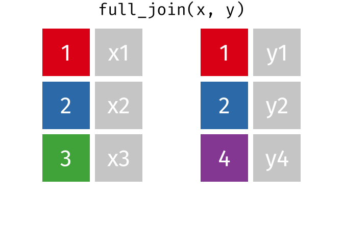{width="307"}

## E5 - Unterschiedliche Schlüsselvariablennamen

Beim Join mit `data_pct` reicht `by = "code"` nicht aus, weil die ID dort anders heisst.

Wenn links unser bisheriger `dat_full` steht und rechts `dat_pct`, schreiben wir:

`by = c("code" = "code_all")`

also:

```{r, echo=TRUE, eval=FALSE}
dat_full <- dplyr::full_join(
  dat_full,
  data_pct,
  by = c("code" = "code_all")
)
```

Das bedeutet: Verwende `code` aus dem linken Datensatz und verbinde ihn mit `code_all` aus dem rechten Datensatz.

⚠️ Die Reihenfolge ist deshalb wichtig.

### 🧭 Kleine Denkaufgabe

Angenommen:

```{r, echo=TRUE, eval=FALSE}
full_join(
  data_pct,
  data_cb,
  by = ?
)
```

Nun steht `data_pct` links. Wie müsste `by` lauten?

:::: {.content-visible when-meta="show_solutions"}
::: {.callout-note collapse="true" title="Lösung"}
```{r, echo=TRUE, eval=FALSE}
full_join(
  data_pct,
  data_cb,
  by = c("code_all" = "code")
)
```
:::
::::

## E6 - Jetzt erzeugen wir `dat_full`

## 📍Arbeitskontext

**Datei:** `code/processing.qmd`

**Abschnitt: `Merge raw data`**

**Input:** sieben importierte R-Objekte

**Output:** ein Objekt `dat_full`

### 🧭 Aufgabe

Füge die sieben Rohdatensätze schrittweise zusammen.

Wir beginnen:

```{r, echo=TRUE, eval=FALSE}
dat_full <- dplyr::full_join(
  data_cb,
  data_cvstm,
  by = "code"
)
```

Anschliessend soll `dat_full` nacheinander erweitert werden um:

`data_vp`,

`data_pct`,

`data_ratings`,

`data_strategies`,

`data_mmq`

**Achte besonders auf:**

-   Welche Schlüsselvariable verwendest du?

-   Bei welchem Datensatz unterscheiden sich die Schlüsselnamen?

-   Welches Objekt steht links und welches rechts?

:::: {.content-visible when-meta="show_solutions"}
::: {.callout-note collapse="true" title="Lösung"}
```{r, echo=TRUE, eval=FALSE}
dat_full <- dplyr::full_join(
  data_cb,
  data_cvstm,
  by = "code"
)

dat_full <- dplyr::full_join(
  dat_full,
  data_vp,
  by = "code"
)

dat_full <- dplyr::full_join(
  dat_full,
  data_pct,
  by = c("code" = "code_all")
)

dat_full <- dplyr::full_join(
  dat_full,
  data_ratings,
  by = "code"
)

dat_full <- dplyr::full_join(
  dat_full,
  data_strategies,
  by = "code"
)

dat_full <- dplyr::full_join(
  dat_full,
  data_mmq,
  by = "code"
)
```
:::
::::

### Warum überschreiben wir schrittweise `dat_full`?

Nach jedem Join enthält `dat_full` die bisher zusammengeführten Informationen.

Wir brauchen deshalb nicht: `dat_full1`, `dat_full2`, ... als dauerhafte Zwischenobjekte.

### ⭐ Vertiefung: mehrere Datensätze kompakter mergen

Verschiedene Datensätze können mithilfe des Pipe-Operators (`|>` oder `%>%`) auch in einem einzigen Schritt zusammengeführt werden.

## F0 - Ist `dat_full` jetzt automatisch korrekt?

Nein.

**Nur weil R keinen Fehler meldet, bedeutet das nicht, dass unser Merge inhaltlich korrekt ist.**

Ein fehlerhafter Merge kann beispielsweise:

-   Personen falsch zuordnen,

-   Fälle vervielfachen,

-   Fälle verlieren,

-   unerwartete Missing Values erzeugen,

-   doppelte Variablen erzeugen.

Solche Fehler würden alle späteren Analysen beeinflussen.

Deshalb gehört zum Mergen immer eine **Valisierung**.

## F1 - Erst Erwartungen formulieren, dann prüfen

Bevor wir Funktionen ausführen, überlegen wir:

**Wie müsste ein korrekt gemergter Datensatz aussehen?**

Aus dem Paper kennen wir die finale Stichprobe: `N = 159`.

Auch unsere Rohdatensätze enthalten jeweils 159 Personen.

Wir erwarten deshalb: `dat_full` sollte 159 Zeilen enthalten.

## F2 - Dimensionen überprüfen

## 📍Arbeitskontext

**Datei: `processing.qmd`**

**Abschnitt: `Validate merged data`**

Füge dort zunächst einen kurzen passenden Text ein.

### 🧭 Aufgabe

Vernwende:

`nrow()`

`ncol()`

`dim()`

Prüfe, ob der Datensatz tatsächlich über 159 Spalten und 36 Spalten verfügt.

### Warum prüfen wir beides?

**Zeilen:** entsprechen hier den Versuchspersonen.

**Spalten:** entsprechen den zusammengeführten Variablen.

Wenn eine dieser Zahlen unerwartet ist, müssen wir den Merge untersuchen, **bevor** wir weiterarbeiten.

## F3 - Sind die IDs weiterhin eindeutig?

159 Zeilen allein reichen noch nicht.

Theoretisch könnten beispielsweise einzelne Personen dopplet enthalten sein und andere fehlen.

Deshalb prüfen wir die Schlüsselvariable selbst.

### 🧭 Aufgabe

Nutze folgende beide Funktionen, um zu prüfen, wie viele verschiedene `code`-Werte enthalten sind:

-   `length(unique())`

-   `anyDuplicated()`

Finde heraus, wie genau du die beiden Funktionen anwenden kannst und welchen Output du jeweils erwartest.

:::: {.content-visible when-meta="show_solutions"}
::: {.callout-note collapse="true" title="Lösung"}
```{r, eval=FALSE, echo=TRUE}
length(unique(dat_full$code))

# Hier erwarten wir einen Wert von 159, weil die Funktion die Anzahl einzigartiger IDs ausgibt

anyDuplicated(dat_full$code)

# Hier erwarten wir einen Wert von 0, da der Datensatz keine duplizierten IDs enthalten solte
```
:::
::::

## F4 - Unerwartete Missing Values

Durch einen fehlerhaften Join könnten neue fehlende Werte entstehen.

Beispielsweise, wenn eine Person in einer Datei keinen passenden Schlüssel findet.

Prüfe deshalb:

```{r, echo=TRUE, eval=FALSE}
sum(is.na(dat_full))
```

Unsere sieben Rohdatensätze enthalten an dieser Stelle keine Missing Values, deshalb erwarten wir auch nach dem korrekten Merge keine neu entstandenen `NA`s.

📌 Später im Semester werden wir Missing Values ausführlicher behandeln. Heute prüfen wir lediglich, ob durch unseren Import oder Merge unerwartete Missings entstanden sind.

## F5 - Variablennamen kontrollieren

Lasse dir alle Variablennamen anzeigen:

```{r, echo=TRUE, eval=FALSE}
names(dat_full)
```

Suche insbesondere nach Namen, die auf `.x` oder `.y` enden.

### Warum wäre das auffällig?

Wenn zwei DAtensätze eine gleich benannte Variable enthalten und R nicht weiss, dass diese Variable als gemeinsamer Schlüssel behandelt werden soll, behält Join unter Umständen beide Versionen und ergänzt solche Endungen.

Das muss nicht immer falsch sein.

Für unseren konkreten Merge wäre es aber ein Hinweis, dass wir genauer prüfen sollten, warum doppelte Variablen entstanden sind.

## F6 - Einen Überblick über `dat_full` gewinnen

Nun verwenden wir einige Funktionen, die ihr bereits aus Hands-on 1 kennt.

**Erste Zeilen**

```{r, echo=TRUE, eval=FALSE}
head(dat_full)
```

**Struktur kompakt darstellen**

```{r, echo=TRUE, eval=FALSE}
glimpse(dat_full)
```

**Baisis-R-Struktur**

```{r, echo=TRUE, eval=FALSE}
str(dat_full)
```

**Zusammenfassung**

```{r, echo=TRUE, eval=FALSE}
summary(dat_full)
```

### 🧭 Aufgabe

Schau dir die Ausgaben an und beantworte:

1.  Wirkt die Struktur grundsätzlich plausibel?

2.  Gibt es ungewöhnliche Variablennamen?

3.  Gibt es Variablen, deren Werte offensichtlich ausserhalb eines plausiblen Bereichs liegen?

## ✅ Checkpoint - `dat_full` ist validiert

Wenn alle Prüfiungen den Erwartungen entsprechen, haben wir jetzt einen validierten Gesamtdatensatz erzeugt.

Noch existiert `dat_full` allerdings nur als **Objekt in R**. Nach einem Neustart wäre dieses Objekt wieder weg.

Deshalb folgt jetzt der nächste logische Schritt: **Wir speichern den erzeugten Datensatz als Datei unter `data/processed/`.**

## G0 - Warum speichern wir `dat_full`?

Unsere sieben Rohdateien liegen dauerhaft unter: `data/raw/`.

`dat_full` dagegen wurde durch unseren eigenen Code erzeugt. Es ist damit **kein Rohdatensatz mehr**.

Der richtige Speicherort ist deshalb: `data/processed/`.

### Warum überhaupt speichern, wenn wir `dat_full` jederzeit neu erzeugen können?

Weil `dat_full` einen sinnvollen Zwischenstand unseres Forschungsprozesses darstellt:

-   die sieben Rohdateien wurden korrekt zusammengeführt,

-   dieser Datensatz bildet die Grundlage für das Codebook,

-   spätere Processing-Schritte können auf diesem dokumentierten Zwischenstand aufbauen,

-   und wir besitzen einen klar definierten Output unseres Merge-Schritts.

## G1 - Dateien aus R speichern

Zum Speichern von Data Frames können unterschiedliche Funktionen verwendet werden.

Beispielsweise Base R: `write.csv()`

Oder aus readr: `write_csv()`

Für unser Projekt verwenden wir:

`readr::write_csv()`

### Warum `write_csv()`?

Die Funktion passt gut zu unserem bisherigen tidyverse-Workflow und speichert den Datensatz ohne zusätzliche Row-Names-Spalte.

Bei `write.csv()` müsste dafür explizit `row.names = FALSE` gesetzt werden.

## G2 - `dat_full` speichern

## 📍Arbeitskontext

**Datei:** `processing.qmd`

**Abschnitt: `Save processed data`**

**Objekt: `dat_full`**

**Zielpfad: `data/processed/dat_full.csv`**

### 🧭 Aufgabe

Überlege zunächst:

Wir benötigen:

1.  eine Funktion zum Speichern,

2.  das zu speichernde Objekt,

3.  einen reproduzierbaren Pfad.

Schreibe den Befehl selbst.

**Hinweis**

Verwende `readr::write_csv()` und `here::here()`.

:::: {.content-visible when-meta="show_solutions"}
::: {.callout-note collapse="true" title="Lösung"}
```{r, eval=FALSE, echo=TRUE}
readr::write_csv(
  dat_full,
  here::here(
    "data",
    "processed",
    "dat_full.csv"
  )
)
```
:::
::::

## G3 - Ist die Datei wirklich entstanden?

Ein Speichervorgang ist erst abgeschlossen, wenn wir das Ergebnis kontrollieren.

Prüfe:

```{r, echo=TRUE, eval=FALSE}
file.exists(
  here::here(
    "data",
    "processed",
    "dat_full.csv"
  )
)
```

Kontrolliere zusätzlich in deiner Ordnerstruktur auf dem Laptop, ob die Datei am erwarteten Ort vorhanden ist.

## G4 - Lässt sich die gespeicherte Datei wieder einlesen?

Als zusätzliche Kontrolle lesen wir die Datei erneut ein:

```{r, echo=TRUE, eval=FALSE}
dat_full_check <- readr::read_csv(
  here::here(
    "data",
    "processed",
    "dat_full.csv"
  )
)
```

Wenn alles stimmt, entfernen wir dieses reine Kontrollobjekt wieder:

```{r, echo=TRUE, eval=FALSE}
rm(dat_full_check)
```

Wir brauchen keine dauerhafte zweite Kopie im Environment.

## G5 - Jetzt kommt die entscheidende Prüfung: Rendern

Bis jetzt haben wir einzelne Code-Chunks während der Bearbeitung ausgeführt.

Dadurch könnten immer noch Objekte im Environment vorhanden sein, die unser Dokument eigentlich gar nicht selbst erzeugt.

Nun überprüfen wir: **Kann `processing.qmd` den gesamten Workflow selbstständig von Anfang bis Ende ausführen?**

## G6 - Vor dem Rendern

Speichere zunächst `processing.qmd`.

Kontrolliere anschliessend die Reihenfolge:

1.  Pakete laden

2.  Rohdaten importieren

3.  Datensätze mergen

4.  dat_full validieren

5.  dat_full speichern

6.  Session Info

Jeder notwendige Schritt muss vor dem Schritt stehen, der ihn benötigt.

### 🧭 Aufgabe: vollständiger Render

Rendere `processing.qmd`.

## ✅ Checkpoint - Unser erster reproduzierbarer Processing-Workflow

Nach einem erfolgreichen Render sollte euer Projekt ungefähr so aussehen:

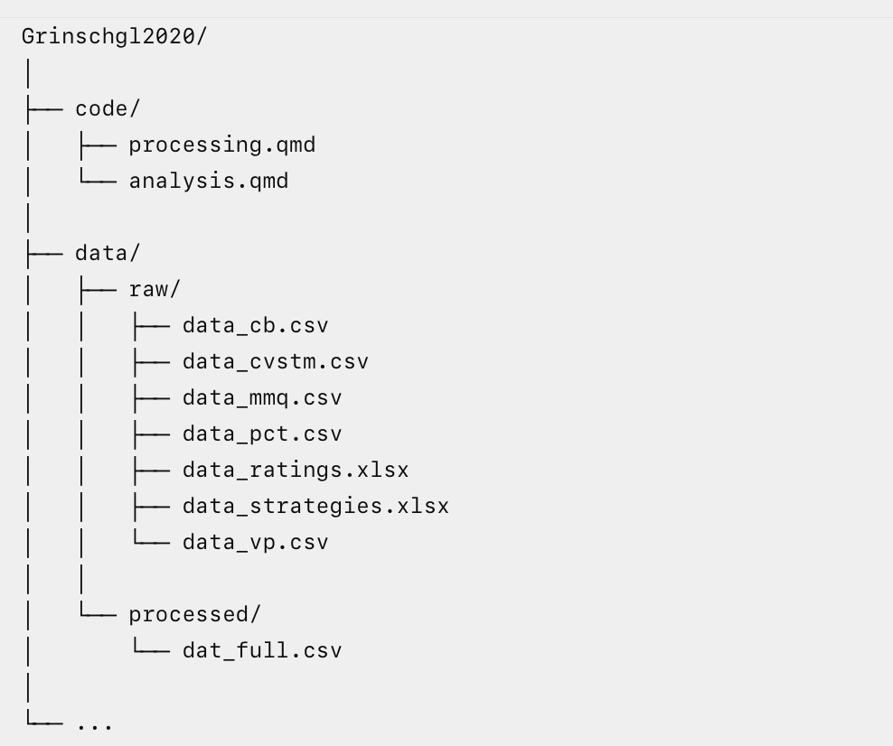{fig-align="center" width="50%"}

## H0 - Von `dat_full` zum Codebook

Wir haben nun endlich den Datensatz erzeugt, für den ihr euer Codebook erstellt: `dat_full`.

Erinnert euch an EH3: Das Codebook übersetzt die technischen Variablen eines Datensatzes in wissenschaftliche Bedeutung.

Nun kennen wir den tatsächlichen Datensatz, auf den sich diese Dokumentation beziehn soll.

## H1 - Das Codebook bleibt nicht für immer unverändert

Mit der Abgabe am 21.10. besitzt ihr eine wichtige Version des Codebooks für den aktuellen `dat_full`.

Im Verlauf des Semesters werden wir den Datensatz aber weiterverarbeiten.

Wenn dabei neue Variablen entstehen oder sich die Bedeutung bzw. Codierung bestehender Variablen verändert, muss auch die Dokumentation angepasst werden.

**Der Datensatz und sein Codebook müssen zusammenpassen!**

# 🎉 Abschluss! Gratulation zum Beenden von Hands-on 2.

✅ Speichere dein Skript ab.
