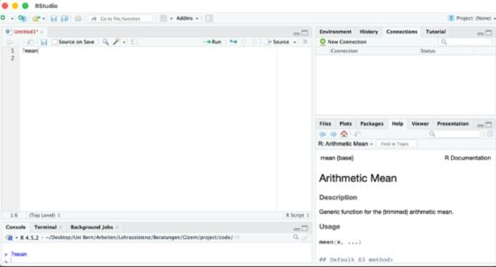
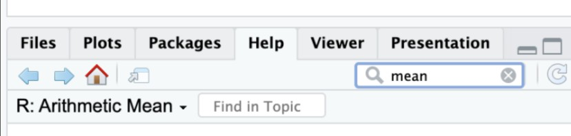
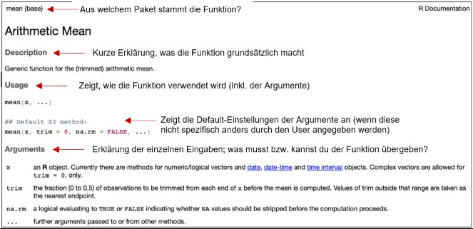
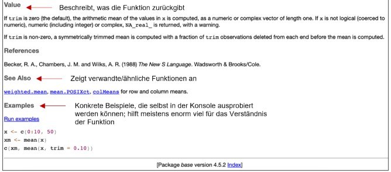

```{r, eval=TRUE, echo=FALSE, message=FALSE, warning=FALSE}
library(tidyverse)
library(palmerpenguins)
library(afex)

penguins <- palmerpenguins::penguins
penguins <- penguins %>%
  tibble::rownames_to_column(var = "id")
penguins_filtered <- penguins |>
  filter(species != "Gentoo")

```

::: callout-note
Unabhängig von konkreten Fragen zu RStudio kann [hier](https://methodenlehre.github.io/einfuehrung-in-R/) noch einmal das Skript zur Einführung in R Studio von Andrew Ellis und Boris Mayer abgerufen werden.
:::

Die Gliederung mit Überschriften dient uns bei der Erstellung als Übersicht. Suche deine Frage am besten mit ctrl + F (MAC: Cmd +F) und dem passendsten Stichwort!

# Daten einlesen

## Was gibt es alles für Funktionen zum Einlesen der Daten und welche davon ist am besten geeignet?

Der einfachste Weg, Daten zu laden, führt über das Environment oben rechts in RStudio. Welche Funktion benötigt wird, hängt vom Dateiformat der zu ladenden Datei ab. Häufig verwendete Dateiformate sind *.xlsx*, *.csv* und *.sav*. Bei *.csv* handelt es sich um eine Textdatei, bei der die Spalten durch Kommas (csv = *comma separated values*) oder Semikolons getrennt sind. *.sav* ist die Dateiendung für SPSS-Dateien und *.xlsx* für Excel-Dateien.

::: callout-note
Weiterführende Informationen und Beispiele können [hier](https://methodenlehre.github.io/einfuehrung-in-R/chapters/03-data_frames.html#daten-importieren) nachgelesen werden.
:::

## Beim Einlesen des Datensatzes entsteht eine leere Zeile ganz links im Datensatz. Wie kann verhindert werden, dass diese entsteht?

Wahrscheinlich wurde beim **Speichern** der Daten mit `write.csv()` das Argument `row.names` nicht gesetzt. Wenn `row.names = FALSE` angegeben wird, entsteht diese zusätzliche Spalte nicht.

```{r, eval=FALSE}

# Vorherige Version
readr::write_csv(data, "data.csv")

# Neue Version
readr::write_csv(data, "data.csv", row.names = FALSE)

```

# automatisiert Daten einlesen

## Könnten wir noch automatisiertes Dateneinlesen behandeln?

Wir werden das automatisierte Einlesen von mehreren Daten im Seminar leider nicht bearbeiten können, da dies zeitlich nicht reicht und auch zu anspruchsvoll wäre. Hier aber einige grundsätzliche Informationen:

Beim automatisierten Einlesen mehrerer Dateien kann grundsätzlich zwischen zwei Varianten unterschieden werden:
  1. Alle Dateien einlesen und in einer gemeinsamen Liste speichern
  2. Jede Datei als separates Objekt im Environment speichern

**Variante 1: Mehrere Dateien automatisiert einlesen und in einer Liste speichern**

Gehen wir davon aus, dass wir einen Ordner namens data haben, welcher mehrere CSV-Dateien beinhaltet. Diese wollen wir nun alle in einem Schritt einlesen und in einer übergeordneten Liste abspeichern:

```{r}
# 1) Alle CSV-Dateien im Ordner "data/" auflisten
#
# list.files() sucht nach Dateien in einem Ordner:
# - path = "data" gibt an, in welchem Ordner gesucht wird.
# - pattern = "\\.csv$" sorgt dafür, dass nur CSV-Dateien gefunden werden.
#   Das Muster kann bei Bedarf entsprechend angepasst werden.
# - full.names = TRUE gibt den vollständigen Dateipfad zurück.
files <- list.files(
  path = "data",
  pattern = "\\.csv$",
  full.names = TRUE
)

# 2) Zur Kontrolle anzeigen, welche Dateien gefunden wurden
#
# Damit kann geprüft werden, ob die richtigen Dateien gefunden wurden.
files

# 3) Alle Dateien einlesen und in einer Liste speichern
#
# lapply() führt dieselbe Funktion für jedes Element eines Vektors aus.
# Hier wird für jede Datei in `files` read.csv() aufgerufen.
# Die eingelesenen Datensätze werden in der Liste `data_list` gespeichert.
data_list <- lapply(files, read.csv)

# 4) Den Listenelementen sinnvolle Namen geben
#
# basename() entfernt den Verzeichnispfad.
# tools::file_path_sans_ext() entfernt anschließend die Dateiendung.
names(data_list) <- tools::file_path_sans_ext(basename(files))

# 5) Liste anzeigen
data_list
```

Es kann dann auf einzelne Datensätze in der Liste zugegriffen werden (z.B. data_list$studie1 oder data_list[[1]]).

```{r}
# 1) Alle CSV-Dateien im Ordner "data/" auflisten, gleiche Logik wie oben
files <- list.files(
  path = "data/",
  pattern = "\\.csv$",
  full.names = TRUE
)

# 2) Objektnamen aus den Dateinamen erzeugen
# Ohne diesen Schritt würden die Elemente nur [[1]], [[2]] usw. heissen.    So erhalten sie sinnvolle Namen.
#
# basename(files) entfernt den Ordnerpfad und lässt nur den Dateinamen      übrig.
# tools::file_path_sans_ext(…) entfernt die Dateiendung .csv
object_names <- tools::file_path_sans_ext(basename(files))

# 3) Jede Datei einlesen und als separates Objekt speichern
#
# Die for-Schleife liest die jeweilige Datei ein und erstellt ein Objekt mit dem Namen, der als Zeichenkette übergeben wird.
# Um mehr über Loops zu erfahren, eignet sich «Kapitel 26: Iterations» in R for Data Science, welches unter den Ressourcen verlinkt ist. 
for (i in seq_along(files)) {
  assign(
    x = object_names[i],
    value = read.csv(files[i]),
    envir = .GlobalEnv
  )
}
```
Es kann danach direkt wie gewohnt mit den einzelnen Datensätzen gearbeitet werden.

# R-internes Hilfesystem

## Wie kann ich mir erklären lassen, wofür ich eine Funktion gebrauchen kann? 

In R gibt es eine eingebaute Hilfsfunktion, mit der du dir zu jeder Funktion eine ausführliche Beschreibung anzeigen lassen kannst.
Dafür gibt es zwei einfache Wege:
  
  1. Über die Konsole: Du kannst in der Konsole ein Fragezeichen vor den       entsprechenden Funktionsnamen setzten und diesen Code ausführen:
```{r}
    ?mean
```
     Dadurch öffnet sich automatisch die passende Hilfeseite im Help-Tab.





  2. Über den Help-Tab: Du kannst auch direkt im Help-Fenster nach einer       Funktion suchen.
  
Wie kannst du die Hilfeseite lesen, die sich anschliessend öffnet?

Die Hilfeseiten sämtlicher Funktionen sind immer sehr ähnlich aufgebaut und enthalten mehrere wichtige Abschnitte:




  
  
# Spezifische Argumente

## Wofür stehen die zusätzlichen Argumente wie `escape_double` oder `trim_ws` beim Einlesen von Dateien?

::: callout-important
Über die Syntax `?Funktionsname()` kann die Dokumentation einer Funktion aufgerufen werden. Dort ist beschrieben, welche Argumente die Funktion erwartet, welche Default-Einstellungen gelten und welche Ausgabe erzeugt wird.
:::

Beim Einlesen von Daten mit `read_delim()` aus dem `readr`-Paket interpretiert das Argument `escape_double = TRUE` doppelte Anführungsstriche als einfache Anführungsstriche (““ = “). Mit dem Argument `trim_ws = TRUE` werden Leerzeichen vor oder nach einer Zeichenkette gelöscht („ Vor dem „V“ befindet sich ein Leerzeichen = „Vor dem „V“ befindet sich ein Leerzeichen). Beide Optionen sind per Default auf TRUE gesetzt. Die folgenden beiden Varianten sind somit identisch:

```{r, eval = FALSE, echo=TRUE}

data <- readr::read_delim("data.csv", delim = ";", escape_double = TRUE, trim_ws = TRUE)

data <- readr::read_delim("data.csv", delim = ";")
```

## Wofür gibt es bei der Funktion `aov_4()` das Argument `(1 | Personenidentifikationscode)`. bzw. das Argument `(Wiederholungsfaktor | Personenidentifikationscode)`?

::: callout-important
Über die Syntax `?Funktionsname()` kann die Dokumentation einer Funktion aufgerufen werden. Dort ist beschrieben, welche Argumente die Funktion erwartet, welche Default-Einstellungen gelten und welche Ausgabe erzeugt wird.
:::

Die Funktion `aov_4()` ist auf ANOVAs mit Messwiederholung ausgelegt und erwartet die zusätzliche Syntax `(x | y)`. Die genaue Formulierung dieses Arguments hängt dann davon ab, ob es **keine Messwiederholung gibt** `(1 | Personenidentifikationscode)` oder ob es **eine Messwiederholung** gibt `(Wiederholungsfaktor | Personenidentifikationscode)`.

```{r}
#| echo: true
#| eval: false

afex::aov_4(value ~ treatment + (1 | Personenidentifikationscode), data = example_data) # Beispiel ohne(!) Messwiederholung

afex::aov_4(value ~ treatment + (time | Personenidentifikationscode), data = example_data) # Beispiel mit(!) Messwiederholung
```

::: callout-note
Für die Funktion `aov_4()` gibt es aus [Statistik-IV von Boris Mayer und Stefan Thoma](https://methodenlehre.github.io/statistik-IV/) noch tiefere und beispielhafte Ausführungen.
:::

## Muss beim rekodieren einer Skala mit ungerader Anzahl an Antwortoptionen auch die mittlere Antwort rekodiert werden?

Nein, die mittlere Antwortoption bleibt bei einer Rekodierung unverändert. Beispielsweise bleibt bei einer 5-Punkte-Likert-Skala die Antwortoption 3 (neutral) auch nach der Rekodierung auf einer umgekehrten Skala weiterhin 3. Nur die Antwortoptionen, die sich auf beiden Seiten der Mitte befinden (1, 2 und 4, 5), werden entsprechend rekodiert (1 wird zu 5, 2 wird zu 4 und umgekehrt). Folgende Codes sind demnach bei gegebener Skala identisch:

```{r, eval=FALSE}
data <- data |> 
  mutate(umgekehrte_variable = case_when(
    variable == 1 ~ 5,
    variable == 2 ~ 4,
    variable == 3 ~ 3,
    variable == 4 ~ 2,
    variable == 5 ~ 1
  ))

data <- data |>
  mutate(umgekehrte_variable = case_when(
    variable == 1 ~ 5,
    variable == 2 ~ 4,
    variable == 4 ~ 2,
    variable == 5 ~ 1
  ))

```

## Was macht das Argument `na.rm = TRUE` in Funktionen wie `mean()` oder `sd()`?

Mittelwerte und Standardabweichungen können nicht korrekt berechnet werden, wenn sich fehlende Werte (`NAs`) in den Daten befinden. R weiss nicht, welchen numerischen Wert es einem `NA` zuweisen soll. Mit `na.rm = TRUE` werden diese fehlenden Werte bei der Berechnung ausgeschlossen. Bevor `NAs` ausgeschlossen werden dürfen muss dies üblicherweise inhaltlich geklärt werden. Im Rahmen des Seminars spielt dies allerdings keine Rolle.

```{r, echo=TRUE}
x <- c(1,2,3,4,5,6,NA)

mean(x)
mean(x, na.rm = TRUE)
```

# Funktionsweise bestimmter einzelner Funktionen

## Wie funktioniert die Funktion `group_by()`?

::: callout-important
Über die Syntax `?Funktionsname()` kann die Dokumentation einer Funktion aufgerufen werden. Dort ist beschrieben, welche Argumente die Funktion erwartet, welche Default-Einstellungen gelten und welche Ausgabe erzeugt wird.
:::

Was das Verständnis für `group_by()` erschwert - die Funktion alleine arbeitet nur im Hintergrund. An der Datenstruktur ändert sich von aussen betrachtet erst einmal nichts. Was passiert? Der Funktion wird mindestens eine kontinuierliche oder kategoriale Variable übergeben, nach welcher der Datensatz im Hintergrund(!) in viele kleine Sub-Datensätze getrennt werden soll. Beispielsweise werden in einem Datensatz mit vielen Personen diese aufgrund ihres BMI aufgeteilt. So können in einem nächsten Schritt, anhand von `summarize()`, Berechnungen wie der Mittelwert pro Gruppe durchgeführt werden.

**Beispiel Kontinuierliche Variable:** Gruppe für jedes Gewicht

```{r}

penguins_summary <- penguins |> 
  group_by(body_mass_g) |> 
  summarize(mean_bill_length = mean(bill_length_mm, na.rm = TRUE))
  
penguins_summary[1:10, 1:2]
```

**Beispiel kategoriale Variable**

```{r}
penguins_summary_2 <- penguins |> 
  group_by(island) |> 
  summarize(mean_bill_length = mean(bill_length_mm, na.rm = TRUE))
  
penguins_summary_2
```

::: callout-note
Visualisierungen finden sich [hier](https://www.andrewheiss.com/blog/2024/04/04/group_by-summarize-ungroup-animations/#mutating-within-groups).
:::

## Was bedeutet die Meldung „summarise() has grouped output by 'group'. You can override using the .groups argument.“ und was muss ich dabei beachten?

Üblicherweise werden deskriptive Werte (auch) für Subgruppen der Gesamtstichprobe angegeben (beispielsweise getrennt für Männer und Frauen, für die Kontrollgruppe oder die Experimentalgruppe etc.). Um entsprechende Änderungen vorzunehmen, wird daher vor der Anwendung von `summarise()` noch die Funktion `group_by()` verwendet. Nach der Berechnung der Deskriptivstatistik wird die Gruppierung nicht aufgehoben. Sie bleibt im Hintergrund, nicht direkt sichtbar, erhalten. Die Warnmeldung weisst genau darauf hin. Soll die Gruppierung aufgehoben werden, kann entweder die Funktion `ungroup()` verwendet werden oder `summarise()` wird um das Argument `summarise(.group = „drop")` ergänzt. Gruppierungen aufzulösen kann für manche Vorgänge, wie beispielsweise das Löschen von noch gruppierten Spalten relevant sein.

## Wie funktioniert der Pipe Operator `|>` bzw. `%>%` und was ist der Unterschied zwischen den beiden?

Der Pipe Operator nimmt das Resultat von oben bzw. links und übergibt dieses Zwischenergebnis nach unten bzw. rechts. Hilfreich ist es, die Syntax zunächst ohne Pipe aufzuschreiben und die Klammern anschliessend schrittweise durch Pipes zu ersetzen. Die folgenden drei Code-Snippets sind äquivalent:

```{r}
#| echo: true
#| eval: false

# Ohne Pipe: verschachtelte Funktionsaufrufe
summarise(
  group_by(
    filter(data, Variable == "A"),
    Gruppe
  ),
  mean = mean(Wert, na.rm = TRUE),
  sd   = sd(Wert, na.rm = TRUE)
)

# Mit magrittr-Pipe (%>%)
data %>%
  filter(Variable == "A") %>%
  group_by(Gruppe) %>%
  summarise(
    mean = mean(Wert, na.rm = TRUE),
    sd   = sd(Wert, na.rm = TRUE)
  )

# Mit Base-R-Pipe (|>)
data |>
  filter(Variable == "A") |>
  group_by(Gruppe) |>
  summarise(
    mean = mean(Wert, na.rm = TRUE),
    sd   = sd(Wert, na.rm = TRUE)
  )

```

::: callout-note
Die Pipe Operatoren unterscheiden sich nur geringfügig und die Unterschiede sind für den Rahmen des Seminars nicht relevant, können jedoch [hier](https://r4ds.hadley.nz/data-transform.html#sec-the-pipe) nachgelesen werden.
:::

## Wie funktioniert die `t.test()`-Funktion?

::: callout-important
Über die Syntax `?Funktionsname()` kann die Dokumentation einer Funktion aufgerufen werden. Dort ist beschrieben, welche Argumente die Funktion erwartet, welche Default-Einstellungen gelten und welche Ausgabe erzeugt wird.
:::

Bei der `t.test()`-Funktion werden die Mittelwerte von Gruppen verglichen. Das Argument `x` ist verpflichtend und erwartet einen nummerischen Vektor (üblicherweise der Wert von Versuchspersonen auf der relevanten Variable). Das Argument `y` ist ein optionaler weiterer nummerischer Vektor, falls es sich um einen Zwei-Stichproben-Tests handelt. Das Argument `alternative` spezifiziert wie der t-Test ausgerichtet ist (≤, ≥ oder ≠). Das Argument `mu` gibt den erwarteten Mittelwert unter H0 an (Default = 0). Das Argument `var.equal` bestimmt, ob der Test unter der Annahme von Varianzhomogenität durch wird. Sprich, ob zwischen den beiden Gruppen die Varianzen gleich sind. Ist diese Annahme erfüllt, so wird ein students t-Test gerechnet. Ansonsten wird ein Welch t-Test gerechnet. Mit `conf.level` kann das Konfidenzintervall beliebig angepasst werden (Default = 0.95). Hier ein Beispiel Code-Snippet:

```{r}
#| echo: true
#| eval: false

t.test(x = data$Wert[data$Gruppe == "A"], 
       y = data$Wert[data$Gruppe == "B"], 
       alternative = "two.sided", # in diesem Fall ist der Test ungerichtet
       mu = 0, # H0: Mittelwertunterschied = 0 (Default)
       var.equal = FALSE, # Ablehnung der Varianzhomogenität (Default) und damit ein Welch`s t-Test
       conf.level = 0.95) # Default
```

# Unterschiede zwischen Funktionen

## Was ist der Unterschied zwischen `cbind()` und den `xy_join()`-Funktionen?

Die Funktion `cbind()` kann man sich wie „Kleber“ vorstellen. Die Datensätze werden ohne Berücksichtigung der Reihenfolgen der Zeilen aneinandergeklebt. Hierdurch könnten im zusammengefügten Datensatz Werte derselben Zeile von verschiedenen Versuchspersonen stammen. Mit der Funktion `xy_join()` wird vor dem Zusammenfügen der beiden Datensätze die Reihenfolge der Zeilen über beide Datensätze hinweg kontrolliert und angeglichen. Hierfür wird jene Spalte verwendet, die im Argument `xy_join(data, by = „…“)` genannt wurde. Damit wird sichergestellt, dass im resultierenden Datensatz Werte derselben Zeile auch von einer einzelnen Versuchsperson stammen.

## Was ist der Unterschied zwischen `inner_join()`, `left_join()`, `right_join()`, `full_join()`?

Die Funktionen unterscheiden sich dahingehend, was von den beiden Datensätzen nach der Zusammenfügung erhalten bleiben soll. `inner_join()` übernimmt nur Zeilen, welche in beiden Datensätzen vorhanden sind. `full_join()` übernimmt alle Zeilen, auch wenn sie nur in einen der beiden Datensätze auftaucht. Der Eintrag in der Spalte des anderen Datensatzes wird einfach mit *NA* ergänzt. Die verbleibenden beiden Funktionen "bevorzugen" sozusagen ihren entsprechenden Datensatz, übernehmen von diesem alle Zeilen und vom anderen Datensatz lediglich die damit übereinstimmenden.

::: callout-note
Eine ausführlichere Beschreibung zu dem Thema findet sich auch noch mal [hier](https://r4ds.hadley.nz/joins.html#how-do-joins-work) unter Kapitel 19.4. [Hier](https://psu-psychology.github.io/r-bootcamp-2019/talks/joins_tutorial_bnj.html#mutating_joins:_inner,_left,_right,_full) sind animierte Abbildungen zu den Funktionsweisen.
:::

## Was ist der Unterschied zwischen `as_factor()` und `as.factor()`?

::: callout-important
Über die Syntax `?Funktionsname()` kann die Dokumentation einer Funktion aufgerufen werden. Dort ist beschrieben, welche Argumente die Funktion erwartet, welche Default-Einstellungen gelten und welche Ausgabe erzeugt wird. Hierüber lassen sich auch Unterschiede zwischen ähnlichen Funktionen feststellen.
:::

Beide Funktionen formatieren Werte einer Spalte hin zu Faktoren. `as.factor()` ist in Base R vorhanden und erstellt die Faktoren anhand des Alphabets. `as_factor()` stammt aus dem Tidyverse, kann bereits in SPSS-Dateien enthaltene Faktorisierungen auslesen und erstellt neue Faktoren anhand der Auftrittsreihenfolge im Vektor.

## Wann verwendet man welche der `xy_join()`-Funktionen und anhand welcher Variable sollen Datensätze zusammengefügt werden?

Welche der `xy_join()`-Funktionen sinnvoll ist, hängt von der Datenstruktur und den geplanten Analyseschritten ab. Ein mit `full_join()` erstellter Datensatz enthält beispielsweise die meisten Einträge (inklusive *NA*s), ist jedoch häufig weniger übersichtlich. Die Entscheidung zwischen `left_join()` und `right_join()` hängt unter anderem davon ab, welcher Datensatz als links bzw. rechts übergeben wird. Insgesamt richtet sich die Wahl der Funktion nach der Fragestellung, der Reihenfolge der Datensätze und deren Struktur. Kurzum: Welche Funktion am passendsten ist hängt von der spezifischen Fragestellung ab und davon, in welcher Reihenfolge die Datensätze betrachtet und der Funktion übergeben werden. Anhand welcher Variable die Zusammenfügung der Datensätze erfolgen soll lässt sich ebenfalls nicht pauschal sagen. Jeder Datensatz kann andere Spaltennamen oder Strukturen aufweisen. In der Psychologie ist es allerdings üblich, dass jeder Versuchsperson über Datenerhebungen hinweg ein individueller Code zugewiesen wird. Dieser wird dann zum Zusammenfügen verwendet. Oft heisst diese Variable *Code* oder *ID* – sie kann aber auch komplett anders heissen. Unabhängig vom konkreten Namen sollte das Codebook anzeigen, ob es eine solche Variable gibt und um welche es sich handelt.

## Was ist der Unterschied zwischen der Funktion `mutate()` und der Funktion `summarize()`? Wie kombiniert man diese Funktionen am besten mit `group_by()`?

::: callout-important
Über die Syntax `?Funktionsname()` kann die Dokumentation einer Funktion aufgerufen werden. Dort ist beschrieben, welche Argumente die Funktion erwartet, welche Default-Einstellungen gelten und welche Ausgabe erzeugt wird.
:::

Mit `mutate()` werden Spalten hinzugefügt oder verändert, wobei alle Zeilen erhalten bleiben. `summarise()` verdichtet hingegen die Zeilen zu Aggregaten – ohne Gruppierung zu **einer Zeile für den gesamten Datensatz** und mit `group_by()` zu **einer Zeile pro Gruppe** – und gibt dabei nur die Gruppenvariablen sowie die neu berechneten Kennwerte zurück.

::: callout-note
Visualisierungen finden sich [hier](https://www.andrewheiss.com/blog/2024/04/04/group_by-summarize-ungroup-animations/#mutating-within-groups).
:::

## Wann wird rowMeans() angewendet, wann mean() und wann beide??

`rowMeans(df)` berechnet Zeilenmittelwerte, also den Mittelwert pro Zeile über alle Spalten hinweg. In einem Wide-Datensatz entspricht dies typischerweise dem Mittelwert pro Person über mehrere Variablen oder Messungen.

`mean(df$V1)` berechnet den Mittelwert einer einzelnen Spalte über alle Zeilen hinweg und entspricht dem Mittelwert einer Variable über alle Personen.

`rowMeans()` eignet sich daher insbesondere zur Berechnung von Skalenwerten, während `mean()` für Durchschnittswerte über das gesamte Sample verwendet wird.


| V1  | V2  | V3  |
|-----|-----|-----|
| 1   | 2   | 3   |
| 4   | 5   | 6   |
| 7   | 8   | 9   |

```{r, echo = TRUE}
df <- data.frame(
  V1 = c(1, 4, 7),
  V2 = c(2, 5, 8),
  V3 = c(3, 6, 9)
)

# Zeilenmittelwerte (Mittelwert pro Zeile über V1–V3)
rowMeans(df)

# Mittelwert über Variable
mean((df$V1))

```

## Was ist der Unterschied zwischen `read.csv()` und `read_delim()`?

`read_csv()` ist im Prinzip das Gleiche wie `read_delim()`, nur dass es standardmässig ein Komma als Trennzeichen verwendet (CSV bedeutet *comma separated values*). Bei `read_delim()` muss das Trennzeichen hingegen explizit angegeben werden, zum Beispiel ein Semikolon.

## Was ist der Unterschied zwischen `write.csv()` und `write.csv2()`?

Der Unterschied zwischen den beiden Funktionen liegt darin, was diese als Trennzeichen zwischen Spalten und als Dezimalzahltrennzeichen verwenden.

-   `write.csv()`\
    verwendet standardmässig
    -   Komma `,` als Feldtrenner
    -   Punkt `.` als Dezimaltrennzeichen
-   `write.csv2()` verwendet standardmässig
    -   Semikolon `;` als Feldtrenner
    -   Komma `,` als Dezimaltrennzeichen

::: callout-caution
Daher sollte unbedingt `write.csv()` verwendet werden. Andernfalls können Dezimalzahlen falsch abgespeichert werden (z.B. 3,14 wird zu 3 in der ersten Spalte und 14 in der zweiten Spalte). Solche Fehler können im ungünstigen Fall auch oberflächliche oder inhaltliche Prüfungen überstehen.
:::

## Was ist der Unterschied zwischen `class()`, `attributes()` und `table()`?

-   **class()** zeigt den Typ eines Objekts

```{r, echo = TRUE, eval = TRUE}

  class(penguins)
  class(penguins$species)
```

-   **table()** zeigt Häufigkeiten

```{r, echo = TRUE, eval = TRUE}

table(penguins$island)

```

-   **attributes()** zeigt die Attribute eines Objekts

    -   bei Data Frames: Variablennamen, rownames, Datentypen

    -   bei Faktoren: Levels und Klasse

```{r, echo = TRUE, eval = TRUE}

attributes(penguins)
attributes(penguins$species)
```

# Working Directory/Pfade/Ordnersystem

## Wie sieht die ideale Ordnerstruktur aus?

Grundsätzlich gilt: Alle **Rohdaten** werden im **raw/**-Ordner gespeichert (und **niemals überschrieben**). Diese Daten werden dann im *processing*-Skript bereinigt und verarbeitet. Die verarbeiteten Datensaetze werden anschliessend mit `write.csv()` im **processed/**-Ordner gespeichert.

Im *analysis*-Skript werden **keine Bereinigungen** mehr vorgenommen, sondern nur noch die eigentlichen Analyseschritte durchgefuehrt (mit Ausnahme kleiner Anpassungen wie das Setzen von Faktoren, da diese Aenderungen nicht gespeichert werden). Die Skripte werden im **code/**-Ordner gespeichert.

Diese Struktur orientiert sich am **PsychDS-Standard**.

## Wie kann ein bereits gesetztes working directory (also den Arbeitsspeicher des Skriptes) verschoben werden, idealerweise sogar von ausserhalb eines Projektes in ein Projekt hinein?

Am einfachsten wird das Skript geschlossen und innerhalb des Ordnersystems in das Projekt verschoben. Anschliessend wird RStudio geöffnet (ohne das Skript direkt zu laden), das Skript über *File – Open File…* geöffnet und erneut gespeichert. Das working directory liegt danach innerhalb des Projekts.

## Wie funktionieren relative Pfade und wie wird sichergestellt, dass diese auch bei fremden Personen funktionieren?

Relative Pfade gehen immer vom working directory (Arbeitsspeicher des Skripts) aus. Beim Laden von Daten muss daher geprüft werden, wo sich – ausgehend vom working directory – die entsprechende Datei befindet.

```{r}
#| echo: true
#| eval: false

data <- readr::read_csv("../data/Datensatz.Dateiendung") # Starte im working directory (deswegen der erste ".") und gehe eine Ordnerebene hoch (deswegen der zweite "."). Von dort aus gehe in den Ordner "data" und wähle dort die Datei "Datensatz" aus, welche dem Format "Dateiendung" entspricht.
```

Wird einer fremden Person nun das gesamte Ordnersystem mit all seinen Inhalten unverändert übergeben, so kann der Dateipfad innerhalb dieses Ordnersystems immer auch den Datensatz einlesen.

## Wann eignet es sich ein Projekt anzulegen?

Das Anlegen eines Projekts ist insbesondere dann sinnvoll, wenn mit mehreren Skripten gearbeitet wird. In diesem Fall muss das working directory nicht in jedem Skript separat gesetzt werden. Wird nur mit einem Skript gearbeitet, ergibt sich daraus kein wesentlicher Vorteil.

## Wie speichert und lädt man R-Projekte richtig, damit nichts verloren oder ungewollt verändert wird?

Am besten werden alle Skripte, welche Teil des Projektes sein, neben oder unter der Projektdatei im Ordnersystem gespeichert. Beim Öffnen des Projektes in RStudio wird automatisch das working directory (Arbeitsspeicher des Skripts) auf den Ordner gesetzt, in welchem sich die Projektdatei befindet. Im Skript selbst sollten dann alle geladenen und abgespeicherten Dateien als relative Pfade zu diesem working directory / Ordner der Projektdatei angegeben werden.

# Long/Wide-Format

## Wieso müssen Daten überhaupt vom wide-Format ins long-Format transformiert werden?

Viele Funktionen in R sind so konzipiert, dass sie mit long-Daten arbeiten. Das long-Format erleichtert vor allem die Handhabung von Messwiederholungen oder anderweitig inhaltlich gruppierten Daten. Wenn jede Zeile eine eigene Messung darstellt, können einfacher zur Messung passende Gruppierungen vorgenommen werden.

## Wie funktioniert die Umwandlung eines wide-Datensatzes hin zu einem long-Datensatz und welche Argumente beinhaltet die hierfür angewendete Funktion `pivot_longer()`?

::: callout-important
Über die Syntax `?Funktionsname()` kann die Dokumentation einer Funktion aufgerufen werden. Dort ist beschrieben, welche Argumente die Funktion erwartet, welche Default-Einstellungen gelten und welche Ausgabe erzeugt wird.
:::

Wie schon in der Frage erwähnt, die passende Funktion zur Umwandlung eines Datensatzes vom wide-Format in das long-Format erfolgt anhand der Funktion `pivot_longer()`. Die Funktion nimmt als die ersten beiden Argumente den Datensatz (`data`) und die Spalten, welche transformiert werden sollen (`cols`). Mit den anderen beiden Argumenten werden die Namen bestimmt, welche die Spalten haben sollen, in welcher die früheren Spaltenüberschriften (`names_to = "name"`) und die Werte (`values_to = "value"`) eingetragen werden.

```{r}
#| echo: true
#| eval: false

data_long <- data_wide |> 
  pivot_longer(
    cols = c(Spalte1, Spalte2, Spalte3), 
    names_to = "Hier kommt der Name der Spalte rein, in welcher die früheren Spaltenüberschriften abgelegt sind", 
    values_to = "Hier kommt der Name der Spalte rein, in welcher die Werte der entsprechenden früheren Spalten abgelegt sind"
  )

```

::: callout-note
Weitere Informationen und Beispiele finden sich [hier](https://methodenlehre.github.io/einfuehrung-in-R/chapters/04-tidyverse.html).
:::

# Visualisierungen/APA

## Was gibt es bei ggplot alles für Visualisierungsmöglichkeiten?

Mit ggplot kann eine ganze Reihe an Visualisierungen manuell festgelegt werden, von der Art des Graphen, mehrdimensionale Darstellungen, Formatierung wie Farben, Grössen uvm. Eine grobe Übersicht gibt es [hier](https://rstudio.github.io/cheatsheets/html/data-visualization.html).

::: callout-note
Beispiele und Übungen finden sich [hier](https://r4ds.hadley.nz/data-visualize.html).
:::

## Wie kann man sicherstellen, dass bei der Visualisierung von Graphen die APA-Guidelines eingehalten werden?

Hierfür gibt es ein extra [theme_apa()](https://rdrr.io/cran/jtools/man/theme_apa.html). Dieses nimmt einem viele der Formatierungen ab. Einzelheiten muss man trotzdem noch prüfen bzw. je nach Abbildung müssen manche Formatierungen auch noch selbst ergänzt werden. Die genaueren APA-Guidelines sind auch noch mal [hier](https://apastyle.apa.org/style-grammar-guidelines/tables-figures/figures) zu finden.

## Wie kann man direkt aus R heraus APA konforme Tabellen erstellen lassen?

Es ist möglich, APA-konforme ANOVA-Tabellen mit dem Paket `apaTables` zu erstellen. Für das Schreiben von APA-konformen Manuskripten kann zusätzlich das Paket [papaja](https://cran.r-project.org/web/packages/papaja/refman/papaja.html) verwendet werden.

**Beispiel**:

```{r, echo = TRUE}

library(apaTables)

model_1 <- aov(bill_length_mm ~ island + sex + species, data = penguins_filtered)

apa.aov.table(
  lm_output = model_1,
  filename  = "anova_table.doc"
)

```

# Syntax-Fragen

## Wann wird ein Element mit und wann wird ein Element ohne Anführungszeichen angesprochen?

Wird ein Objekt aus der Environment angesprochen, dann werden *keine* Anführungszeichen verwendet. Werden numerische Elemente aus einer Spalte angesprochen, dann werden ebenfalls *keine* Anführungszeichen verwendet. Werden Spaltenelemente angesprochen, welche als Faktor oder als Character formatiert sind, dann werden auch Anführungszeichen verwendet.

## Wann wird die Tilde (\~) und das Dollarzeichen `($)` verwendet?

Die Tilde bedeutet, was links von ihr steht, wird von dem, was rechts von ihr steht, vorhergesagt. Beispielsweise wird die Tilde üblicherweise bei Regressionen verwendet: `lm(AV ~ UV).` Das Dollarzeichen dient vor allem, um Spalten anhand ihrer Namen anzusprechen: `data$Spaltenname`. Manche Funktionen arbeiten mit beiden Schreibweisen. Beispielsweise sind die folgenden Schreibweisen äquivalent:

```{r}
#| echo: true
#| eval: false

t.test(data$variable1, data$variable2)
      
t.test(data, formula = variable ~ group)
```

Allerdings müssen bei letzterer Schreibweise die Werte beider Gruppen zwingend im selben Datensatz vorliegen.

## Wann wird die Tilde (\~) verwendet und wann wird ein Komma (`,`) verwendet?

Die Tilde bedeutet, was links von ihr steht, wird von dem, was rechts von ihr steht, vorhergesagt. Beispielsweise wird die Tilde üblicherweise bei Regressionen verwendet: `lm(AV ~ UV)`. Das Komma wird verwendet, um Argumente in einer Funktion zu trennen. Beispiel:

```{r}
#| echo: true
#| eval: false

result <- lm(AV ~ UV, data = datensatz)

result <- t.test(x = datensatz$variable1, y = datensatz$variable2)
```

::: callout-warning
Das Komma sollte **nicht** verwendet werden um Dezimalzahlen zu definieren! Dies führt zu einer Fehlermeldung. Für Dezimalzahlen wird immer der Punkt verwendet (z.B. 3.14).
:::

## Wieso braucht man bei t.test() "\~" und nicht "," bzw. wovon hängt dies ab?

Bei `t.test()` wird das `~` verwendet, wenn der Test in der Formel-Schreibweise durchgeführt wird. Diese Schreibweise trennt die abhängige Variable (links vom `~`) von der Gruppierungsvariable (rechts vom `~`) und ist typisch für viele statistische Funktionen in R. Sie wird vor allem dann genutzt, wenn die Daten in einem Dataframe vorliegen.

Ein Komma wird hingegen verwendet, wenn man die beiden Gruppen direkt als separate Vektoren übergibt. Welche Schreibweise verwendet wird, hängt davon ab, wie die Daten strukturiert sind (Dataframe vs. einzelne Vektoren) und welche Schnittstelle die Funktion anbietet.

**Beispiele mit Formelschreibweise:**

```{r, echo = TRUE}
# Datensatz auf zwei Arten beschränken
penguins_2 <- subset(
  penguins,
  species %in% c("Adelie", "Chinstrap")
)

# t-Test mit Formel-Schreibweise
t.test(flipper_length_mm ~ species, data = penguins_2)

```

**Mit Komma:**

```{r, echo = TRUE}
# Vektoren für die zwei Gruppen
adelie_flipper <- penguins$flipper_length_mm[
  penguins$species == "Adelie"
]

chinstrap_flipper <- penguins$flipper_length_mm[
  penguins$species == "Chinstrap"
]

# t-Test mit Vektoren
t.test(adelie_flipper, chinstrap_flipper)

```

## Wann soll eine neue Variable bzw. ein neuer Datensatz erstellt werden und wann soll die alte Variable bzw. der neue Datensatz überspeichert werden?

Grundsätzlich ist es vorzuziehen neue Variablen oder Datensätze zu erstellen. Zum einen kann so bei Bedarf noch auf die ursprünglichen Variablen oder Datensätze zugegriffen werden. Zum anderen ist die Analyse so für aussenstehende leichter nachzuvollziehen. Ausnahmen sind ästhetische Änderungen oder wiederholte Berechnungen, welche für die weitere Analyse nicht weiter relevant sind.

## Wie funktionieren Verschachtelungen, welche die Funktion across() verwenden?

Funktionen wie `across()` werden verschachtelt, weil sie nur innerhalb von dplyr-Funktionen wie `mutate()` oder `summarise()` arbeiten. Die äussere Funktion bestimmt, was passieren soll (z. B. Spalten verändern). `across()` legt dann fest, **welche Spalten** betroffen sind und **welche Transformation** angewendet wird. Deshalb braucht `across()` Argumente wie `.cols` und `.fns`. Die äussere Funktion gibt den Rahmen vor, `across()` steuert die konkrete Operation.

Beispiel:

`across()` hat zwei wichtige Argumente:

-   **.cols** → *Welche Spalten sollen ausgewählt werden?*\
    Im Beispiel: alle Spalten, die auf **"\_r"** enden. Across geht wert für wert durch diese Spalten

-   **.fns** → *Welche Operation soll auf jeden einzelnen Wert dieser Spalten angewendet werden?*\
    Im Beispiel: Für jeden Wert wird **6 – Wert** berechnet (Umkehrkodierung).

-   Das `.x` steht für den aktuellen Wert durch den across durchgeht. Manchmal wird auch nur ein Punkt ausgeschrieben da beide Schreibweisen funktionieren.

```{r, echo = TRUE, eval=FALSE}

data_reversed <- data_numeric |>
  mutate(
    across(ends_with("_r"), ~ 6 - .x) #~ 6 - . --> Für jede wert der col -6 
  )

```

## Sollten Datensätze vor dem mergen erst aufbereinigt werden?

Einige Schritte der Datenaufbereitung sollten vor dem Mergen durchgeführt werden, da das Zusammenführen der Datensätze sonst unnötig kompliziert werden kann. Beispielsweise können Duplikate oder fehlende Werte (NAs) beim Mergen zu Problemen führen und sollten daher idealerweise bereits vorher behandelt werden. Für viele andere Schritte, wie etwa Rekodierungen, spielt es hingegen keine Rolle, ob sie im einzelnen Datensatz oder erst im gemergten Datensatz durchgeführt werden. Es gibt dabei keine festgelegte Reihenfolge, die zwingend eingehalten werden muss. Ob das Vorgehen korrekt war, lässt sich abschliessend überprüfen, indem der gemergte Datensatz inspiziert und auf Plausibilität geprüft wird.

## Wie kann ich nachhaltige Anpassungen an Variablen im Datensatz vornehmen?

Damit Änderungen im Datensatz festgehalten werden, muss eine Zuweisung mit `<-` vorgenommen werden. Wird ein Befehl ohne Zuweisung ausgeführt, wird das Resultat nicht im Environment abgespeichert.

Dass sich ein Objekt im Environment befindet, bedeutet nicht, dass dieses automatisch z. B. als CSV gespeichert ist. Dafür sollte es mit einer passenden Write-Funktion gesichert werden.

Im Processing-Skript werden alle Aufbereitungsschritte (z. B. Variablen umbenennen) durchgeführt und am Ende der bereinigte Datensatz mit `write.csv()` oder einer ähnlichen Funktion abgespeichert, damit alle Änderungen nachhaltig gesichert sind.

**Beispiel –\> Keine Veränderung am Datensatz weil keine Zuweisung**

```{r, echo = TRUE, eval = FALSE}
penguins |>  
  mutate(mean_bill_length = mean(bill_length_mm, na.rm = TRUE))
```

**Beispiel mit Zuweisung: Gleicher Datensatz wird verändert**

```{r, echo = TRUE, eval = FALSE}
penguins <- penguins |> 
  mutate(mean_bill_length = mean(bill_length_mm, na.rm = TRUE))
```

## Wann müssen Variablen, welche inhaltlich Faktoren sind, auch explizit zu solchen transformiert werden?

Viele Transformationen sind notwendig, weil statistische Funktionen bestimmte Datentypen voraussetzen. Die ANOVA etwa benötigt Faktoren, wenn Gruppen verglichen werden sollen, damit R die Gruppen-Variable als kategorial erkennt. Solche Transformationen sind also Teil der korrekten Vorbereitung der Daten.

Es ist eine gute Faustregel, Variablen in Faktoren umzuwandeln, wenn sie klar kategoriale Gruppen darstellen – zum Beispiel eine Gruppenzugehörigkeit wie “above”, “below” oder “control”.

## Was genau machen die Funktionen aus dem Package `styler`?

Die Funktionen aus dem Package `styler` helfen dabei, den Code einheitlich und lesbar zu formatieren. Sie passen Einrückungen, Leerzeichen, Zeilenumbrüche und andere Formatierungsaspekte an. [Hier](https://styler.r-lib.org/) befindet sich eine Anleitung und Demo zu dem Package.

# Komplexere Berechnungen

## Wie berechnet man das generalisierte η²?

Man erhält das generalisierte η² indem man erst eine ANOVA berechnet, abspeichert und dann über `summary(anova_ergebnis, es = ges)` ausgeben lässt.

```{r}
#| echo: true
#| eval: false

anova_ergebnis <- afex::aov_car(value ~ treatment, data = example_data)

summary(anova_ergebnis, es = ges)
```

## Woher weiss ich, ob eine Funktionen einen data.frame oder einen Vektor erwartet (Objektname oder c("Objektname"))?

Es gibt keine feste Regel, aber die Hilfeseite (`?funktion`) zeigt immer, welcher Datentyp erwartet wird. Grundsätzlich gilt: Funktionen, die Spaltenweise etwas berechnen (z. B. `mean`, `sum`, `skew`), erwarten Vektoren – oft extrahiert man diese mit `$` aus einen Dataframe.\
Funktionen, die Daten transformieren (`summarise`, `mutate`, `filter`, `select`), erwarten dagegen Data Frames, da sie auf mehreren Variablen gleichzeitig arbeiten.

Das **c** bei Vektoren steht für *concatenate* und wird verwendet, wenn wir mit Vektoren arbeiten. Wenn nur ein Element im Vektor vorhanden ist, brauchen wir kein `c()` (Skalar). Sobald mehrere Elemente enthalten sind, benötigen wir `c()`.

## Wie bereitet man die Daten für eine mixed-ANOVA vor?

Eine mixed-ANOVA besteht aus der Varianzerklärung aufgrund unterschiedlicher Gruppenzugehörigkeiten (bspw. Kontrollgruppe und Experimentalgruppe) und einer Messwiederholung (mehrerer Messwerte pro Person, unabhängig von der Gruppenzugehörigkeit). Beides muss auch bereits in den Daten erkennbar sein. Sprich, pro Versuchsperson muss anhand einer Variable codiert sein, zu welcher Gruppe diese Versuchsperson gehört. Darüber hinaus muss es für jede Versuchsperson zu jedem Messzeitpunkt einen Wert geben. Angenommen die Daten liegen ursprünglich im wide-Format vor, dann müssen diese erst ins long-Format übertragen werden (siehe auch Fragen zum long-Format). Erst dann können die entsprechenden ANOVA-Funktionen die Daten entsprechend interpretieren.

::: callout-note
Inhalte zu ANOVAs mit Messwiederholung oder Mixed-ANOVAs können zusätzlich über die Materialien aus [Statistik IV von Boris Mayer und Stefan Thoma](https://methodenlehre.github.io/statistik-IV/) vertieft werden.
:::

# Quarto-Einstellungen

## Wie stellt man ein, dass in Markdown oder Quarto der Output meines Codes unterbunden wird?

Es kann entweder im ersten Chunk des Dokuments als globale Einstellung `knitr::opts_chunk$set(output = FALSE)` oder im entsprechend gewünschten Chunk einzeln die Option `{r, output = FALSE}` gesetzt werden den Output zu unterdrücken. Mittlerweile können solche Optionen auch über die Schreibweise `#|` explizit innerhalb des Chunks geschrieben werden. Ähnliche Befehle existieren auch, wenn man stattdessen oder zusätzlich Warnmeldungen oder den Code unterbinden möchte. Bei der Endabgabe ist sicherzustellen, dass der Code und mögliche Warnmeldungen sichtbar sind!

```{r}
# Hierdurch würde der Code zwar angezeigt, aber nicht mehr durchgeführt werden
# #| eval: FALSE
# Hierdurch würde der Code dann zusätzlich auch nicht mehr angezeigt werden
# #| echo: FALSE
```

## Wie kann ich einstellen, dass Quarto beim Rendern neben der Zieldatei keine weiteren erstellt?

Um zu grosse html-files oder Ladezeiten eines html-files zu vermeiden, weicht Quarto ggf. beim Rendern dazu aus nicht einen einzelnen html-file zu erstellen, sondern einen Ordner mit mehreren Dateien. Der html-file ruft diese dann beim Laden allesamt auf. Ist dies nicht gewünscht, gibt es mindestens zwei Möglichkeiten, Quarto dazu zu zwingen einen einzelnen und unabhängigen html-file zu erstellen. Als erste Variante kann der YAML-Header (der ganz oben im Quarto-file positioniert ist) um die Zeile `embed-resources: true` ergänzt werden:

```{r, eval = FALSE}

# vorher
  format:
    html:

# nachher
  format:
    html:
      embed-resources: true
```

Sollte sich auch damit das Problem nicht lösen, dann kann der Quarto-file auch manuell über das *Terminal* gerendert werden. Das Terminal beachten wir sonst im Seminar nicht, ist hierfür aber ausnahmsweise eine elegante Lösung. Das Terminal befindet sich unten links, wo sich auch die euch bereits vertraute *Console* und beim Rendern das Fenster *Background Jobs* befinden. Ist das Terminal noch nicht vorhanden, kann es über Tools --\> Terminal --\> New Terminal (Alt+ Umschalttaste + R) geöffnet werden. Dort wird dann folgender Befehl eingegeben:

```{r, eval = FALSE}

quarto render meinDokument.qmd --embed-resources
```

Hierbei muss natürlich noch der Dateiname des .qmd-file entsprechend angepasst werden. Weitere Informationen gibt es [hier](https://quarto.org/docs/reference/formats/html.html) (am besten auf der Seite selbst noch nach dem Begriff embed-resources suchen).
