Zu Beginn und am Ende des Semesters führen wir eine kurze Bedarfsanalyse durch. Die erste Erhebung dient dazu, einen Eindruck davon zu gewinnen, mit welchen Vorkenntnissen und Erfahrungen ihr in das Semester startet und in welchen Bereichen ihr euch noch Unterstützung wünscht. Eure Rückmeldungen helfen uns dabei, die Inhalte und Schwerpunkte der Veranstaltung soweit möglich an euren aktuellen Kenntnisstand sowie an eure Wünsche und Bedürfnisse anzupassen.

Die Befragung wird am Ende des Semesters erneut durchgeführt. Dadurch könnt ihr eure Einschätzungen zu Beginn und am Ende des Semesters miteinander vergleichen und nachvollziehen, in welchen Bereichen ihr im Verlauf des Seminars mehr Sicherheit gewonnen, neue Kenntnisse erworben oder euch intensiver mit bestimmten Themen auseinandergesetzt habt.

Die folgenden Ergebnisse geben einen Überblick über den Ausgangspunkt zu Beginn des Semesters. An der Befragung nahmen in der Seminargruppe von **10:15-12:00 Uhr 23 Studierende** und in der Seminargruppe von **16:15-18:00 Uhr 17 Studiernde** teil.

### 1. Bisherige Erfahrung mit R

Zu Beginn des Seminars wollten wir zunächst wissen, welche Erfahrungen ihr bisher mit R gesammelt habt. Dazu habt ihr eure aktuellen R-Kenntnisse eingeschätzt und angegeben, wie häufig und in welchen Kontexten ihr R bisher verwendet habt. Ausserdem haben wir euch gefragt, mit welchen R-Paketen ihr bereits gearbeitet habt.

#### **Wie würdest du aktuell deine R-Kenntnisse einschätzen?**

::::: columns
::: {.column width="50%"}
**10:15**

{width="85%" fig-align="left"}
:::

::: {.column width="50%"}
**16:15**

{width="85%" fig-align="left"}
:::
:::::

{width="65%" fig-align="left"}

#### **Wie häufig hast du R bisher verwendet?**

::::: columns
::: {.column width="50%"}
**10:15**

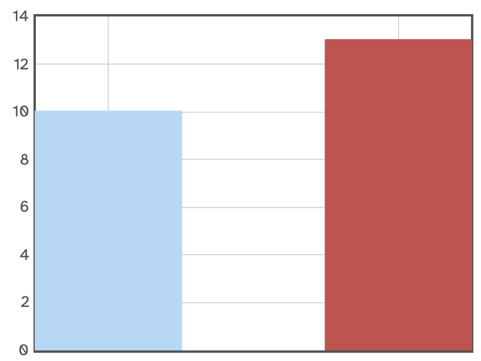{width="85%" fig-align="left"}
:::

::: {.column width="50%"}
**16:15**

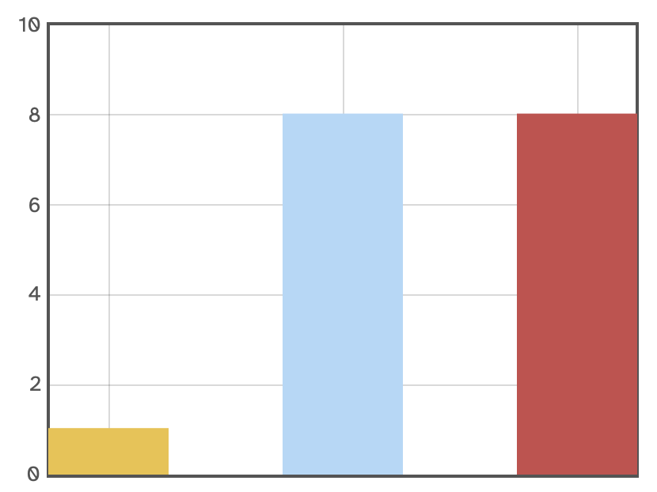{width="85%" fig-align="left"}
:::
:::::

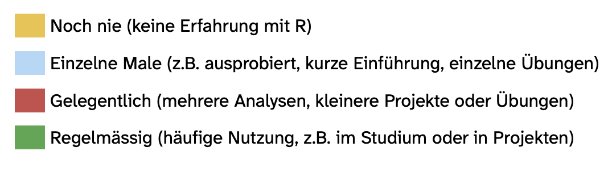{width="55%" fig-align="left"}

#### **In welchen Lehrveranstaltungen hast du R bereits verwendet?**

Die Freitextantworten wurden thematisch zusammengefasst. Mehrere Nennungen innerhalb einer Antwort konnten dabei unterschiedlichen Kategorien zugeordnet werden; pro Kategorie wurde jede Person höchstens einmal gezählt.

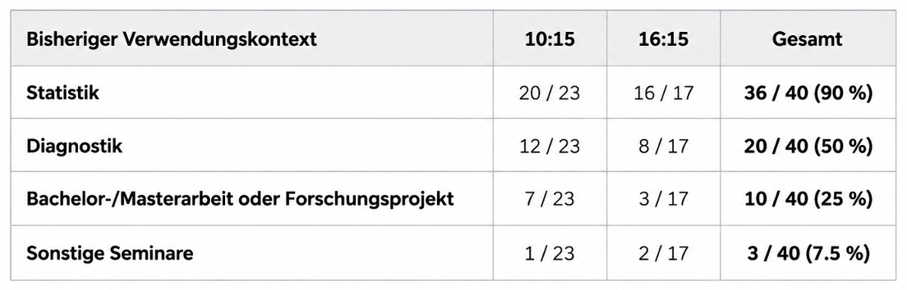{width="65%" fig-align="left"}

#### **Hast du R auch schon ausserhalb von Lehrveranstaltungen verwendet?**

::::: columns
::: {.column width="50%"}
**10:15**

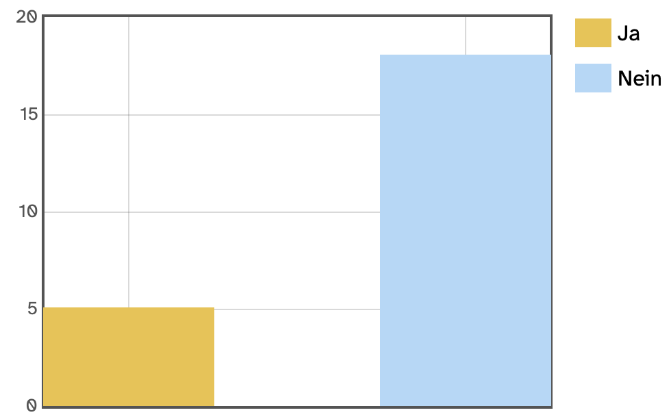{width="85%" fig-align="left"}
:::

::: {.column width="50%"}
**16:15**

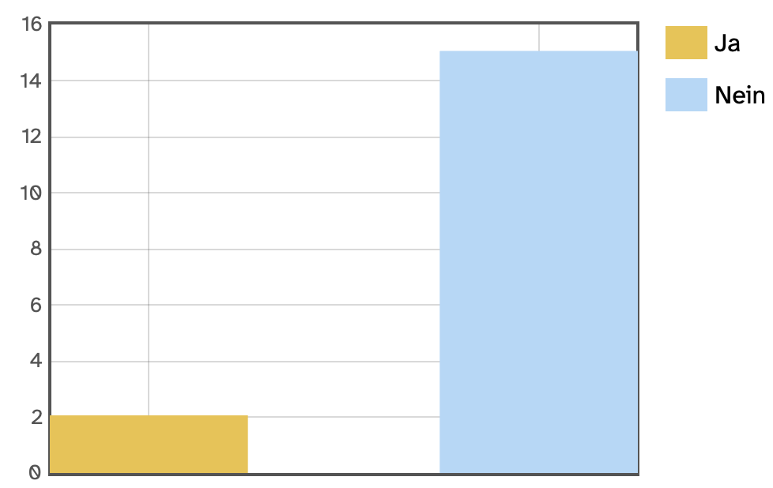{width="85%" fig-align="left"}
:::
:::::

#### **Welche R-Pakete hast du bereits verwendet?**

::::: columns
::: {.column width="50%"}
**10:15**

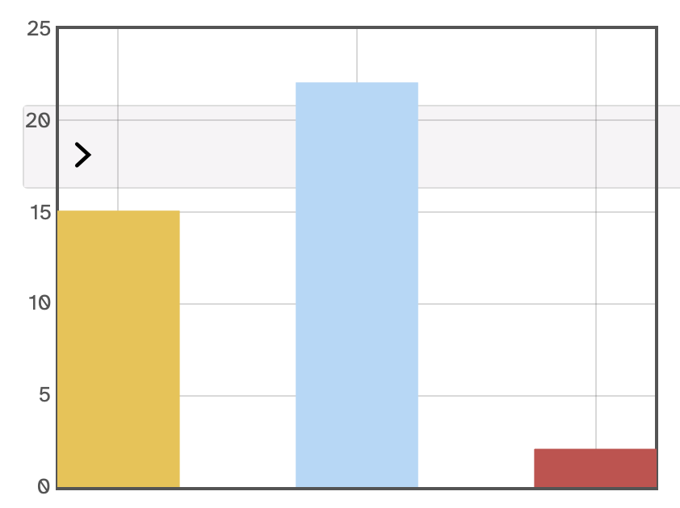{width="85%" fig-align="left"}
:::

::: {.column width="50%"}
**16:15**

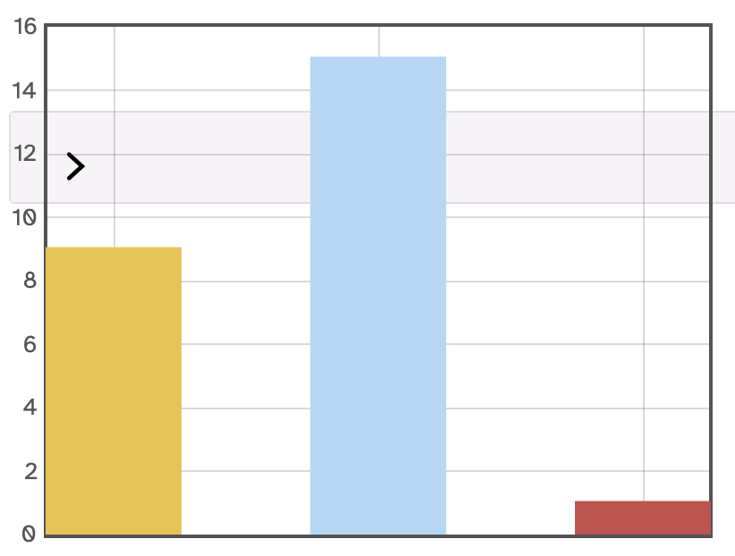{width="85%" fig-align="left"}
:::
:::::

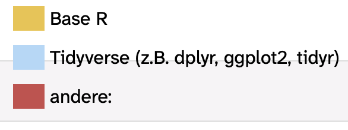{width="35%" fig-align="left"}

Zusätzlich zu den vorgegebenen Antwortoptionen wurden in den Freitextangaben weitere bereits verwendete R-Pakete genannt: `lme4`, `lmerTest`, `sjPlot`, `emmeans`, `naniar` und `patchwork`.

### 2. Sicherheit bei zentralen Arbeitsschritten

#### **Wie sicher fühlst du dich im Umgang mit den folgenden Themen?**

Die Studierenden sollten einschätzen, wie sicher sie sich im Umgang mit verschiedenen Bereichen der Datenaufbereitung und -analyse in R fühlen. Dazu bewerteten sie jeden Themenbereich auf einer Skala von 1 (sehr unsicher) bis 5 (sehr sicher).

::::: columns
::: {.column width="50%"}
**10:15**

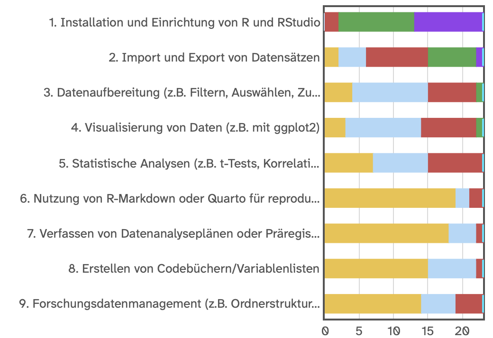{width="85%" fig-align="left"}
:::

::: {.column width="50%"}
**16:15**

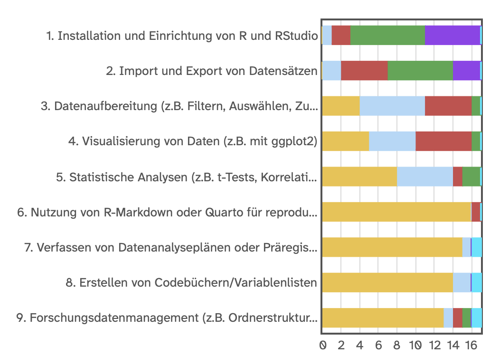{width="85%" fig-align="left"}
:::
:::::

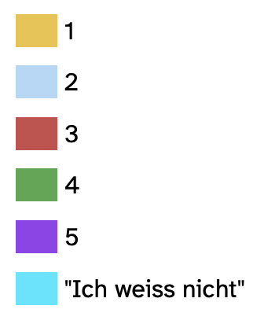{width="12%" fig-align="left"}

#### **Was gelingt bereits gut?**

In einer offenen Frage konnten die Studierenden zusätzlich angeben, bei welchen Schritten sie sich sicher fühlen, wenn sie auch auf bereits vorhandene Unterlagen zurückgreifen können. Besonders häufig wurden grundlegende Arbeitsschritte wie das Einlesen von Daten, einfache Berechnungen und Befehle, einfache statistische Analysen sowie Visualisierungen genannt. Mehrere Antworten zeigen zugleich, dass diese Sicherheit häufig noch an Hilfsmittel wie Unterlagen, Cheatsheets oder vorgegebene Abläufe geknüpft ist.

### 3. Wo liegen aktuell Schwierigkeiten?

#### **Welche weiteren Schritte bereiten dir Schwierigkeiten in R?**

In einer offenen Frage konnten die Studierenden beschreiben, welche Aspekte der Arbeit mit R ihnen aktuell noch Schwierigkeiten bereiten. Die Antworten wurden thematisch zusammengefasst. Eine Antwort konnte dabei mehreren Themenbereichen zugeordnet werden.

| Themenbereich | Wiederkehrende Schwierigkeiten |
|----|----|
| **Selbstständiges Arbeiten** | Ohne konkrete Anleitung beginnen, eigene Lösungswege entwickeln und nach einem gescheiterten Versuch selbstständig weiterarbeiten |
| **Überblick über den Analyseprozess** | Wissen, welche Schritte notwendig sind, in welcher Reihenfolge sie durchgeführt werden und weshalb sie benötigt werden |
| **Datenaufbereitung und -organisation** | Daten einlesen, sinnvoll strukturieren und aufbereiten sowie mit fehlenden Werten, Faktoren, Pfaden und der Ablage von Dateien umgehen |
| **Statistische Analysen** | Eine passende Analyse für eine Fragestellung auswählen und diese anschliessend selbstständig in R umsetzen |
| **Fehlermeldungen und Debugging** | Fehlermeldungen verstehen, deren Ursache systematisch suchen und geeignete Lösungswege finden |
| **R-Code und grundlegendes Verständnis** | Funktionen und Syntax verstehen, längere Befehle nachvollziehen und wissen, was einzelne Schritte im Code bewirken |
| **Visualisierung und Ergebnisdarstellung** | Geeignete Visualisierungen erstellen und einschätzen, wie Grafiken und Ergebnisse sinnvoll dargestellt werden können |

Über beide Seminargruppen hinweg zeigt sich insbesondere, dass viele Schwierigkeiten mit dem **selbstständigen Arbeiten** zusammenhängen. Mehrere Studierende beschreiben, dass sie vorgegebene Schritte, vorhandenen Code oder ausführliche Anleitungen grundsätzlich nachvollziehen können, sich jedoch unsicher fühlen, wenn sie selbst entscheiden müssen, **wie sie eine Aufgabe beginnen, welche Schritte notwendig sind und wie sie bei Problemen weiter vorgehen können**.

::: {.callout-note title="Zentrale Beobachtung"}
Ein wichtiges Anliegen für das Seminar ist damit der Übergang vom Arbeiten nach einer vorgegebenen Anleitung hin zu einem zunehmend selbstständigen Vorgehen: Die Studierenden sollen nicht nur einzelne R-Befehle anwenden können, sondern auch verstehen, **was sie wann und warum tun und wie sie bei Schwierigkeiten eigenständig weiterkommen können**.
:::

### 4. Was wünschen sich die Studierenden vom Seminar und allgemein vom Studium?

Die Studierenden konnten in mehreren offenen Fragen beschreiben, was sie im Methodenseminar lernen möchten, bei welchen Aspekten sie sich Unterstützung wünschen und welche Angebote ihnen auch über das Seminar hinaus helfen würden. Die Freitextantworten wurden thematisch zusammengefasst. Eine Antwort konnte dabei mehreren Themenbereichen zugeordnet werden.

#### **Was würdest du gerne in diesem Methodenseminar lernen?**

Über beide Seminargruppen hinweg zeigt sich ein sehr ähnliches Bild. Im Vordergrund steht weniger der Wunsch nach möglichst vielen einzelnen Funktionen oder statistischen Verfahren, sondern vielmehr danach, R grundlegend zu verstehen und zunehmend selbstständig damit arbeiten zu können.

| Zentrales Lernziel | Was sich die Studierenden wünschen |
|----|----|
| **Mehr Sicherheit im Umgang mit R** | Sich im Programm besser zurechtfinden, weniger unsicher oder überfordert fühlen und R auch bei zukünftigen Projekten sicherer einsetzen können |
| **Grundlagen festigen** | Zentrale Konzepte und Befehle auffrischen, die Funktionsweise von R besser verstehen und ein solides Grundgerüst aufbauen |
| **Den gesamten Analyseprozess verstehen** | Nachvollziehen, welche Schritte von den Rohdaten bis zur fertigen Auswertung notwendig sind, in welcher Reihenfolge sie erfolgen und warum sie durchgeführt werden |
| **Selbstständiger arbeiten** | Auch ohne vorgegebenes „Rezept“ wissen, wie eine Aufgabe begonnen werden kann, welche Schritte notwendig sind und wie bei Problemen weitergearbeitet werden kann |
| **Daten aufbereiten und organisieren** | Daten einlesen, strukturieren, bereinigen und so vorbereiten, dass sie sinnvoll analysiert werden können |
| **Analysen auswählen und durchführen** | Verstehen, welche Analyse zu einer Fragestellung passt, und grundlegende statistische Verfahren selbstständig in R umsetzen können |
| **Ergebnisse darstellen** | Grafiken erstellen, Skripte übersichtlich gestalten und Ergebnisse nachvollziehbar aufbereiten |
| **Vorbereitung auf zukünftige Arbeiten** | Die erworbenen Kenntnisse insbesondere für Bachelor-, Master- oder andere Forschungsarbeiten nutzen können |

Besonders deutlich wird der Wunsch nach einem **zusammenhängenden Verständnis des gesamten Arbeitsprozesses**. Die Studierenden möchten nicht nur lernen, welchen Code sie eingeben müssen, sondern verstehen, was sie tun, warum sie es tun und wie die einzelnen Schritte miteinander zusammenhängen.

#### Bei welchen Aspekte der Datenaufbereitung und -analyse in R wünschst du dir innerhalb dieses Seminars Unterstützung?

Auch bei dieser Frage stehen grundlegende und prozessorientierte Themen im Vordergrund. Unterstützung wird insbesondere bei folgenden Bereichen gewünscht:

-   **Datenaufbereitung:** Daten importieren, strukturieren, bereinigen und zwischen unterschiedlichen Datenformaten arbeiten.
-   **Planung und Ablauf einer Analyse:** Wissen, wie man beginnt, welche Schritte aufeinander folgen und wie man von einer Fragestellung beziehungsweise einem Analyseplan zur konkreten Umsetzung gelangt.
-   **Auswahl und Umsetzung statistischer Analysen:** Passende Verfahren auswählen, Analysen in R durchführen und deren Ergebnisse interpretieren.
-   **Verständnis der einzelnen Schritte:** Nicht nur Code ausführen, sondern nachvollziehen, weshalb bestimmte Entscheidungen getroffen und bestimmte Funktionen verwendet werden.
-   **Fehlermeldungen und Probleme lösen:** Fehler verstehen und geeignete Lösungswege finden.
-   **Visualisierung und Ergebnisdarstellung:** Daten mit `ggplot2` darstellen und Ergebnisse übersichtlich aufbereiten.
-   **Reproduzierbares Arbeiten:** Quarto beziehungsweise R Markdown, Analysepläne oder Präregistrierungen, Codebücher und Forschungsdatenmanagement kennenlernen.
-   **Vorbereitung auf eigene Forschungsprojekte:** Einen Arbeitsablauf kennenlernen, der später auf Bachelor- oder Masterarbeiten übertragen werden kann.

Einzelne Studierende nannten darüber hinaus spezifischere Themen wie Modellvergleiche, komplexere Analyseverfahren oder besondere statistische Methoden. Insgesamt überwiegt jedoch klar der Wunsch, zunächst die Grundlagen und den allgemeinen Analyseprozess sicher zu beherrschen.

::: {.callout-note title="Zentrales Anliegen"}
Viele Antworten lassen sich auf ein gemeinsames Ziel zurückführen: Die Studierenden möchten nicht nur einzelne Befehle oder Analysen kennenlernen, sondern einen **roten Faden für die Arbeit mit Daten in R** entwickeln. Sie möchten wissen, wie sie von einer Fragestellung und einem Datensatz schrittweise zu einer nachvollziehbaren Analyse und Darstellung der Ergebnisse gelangen.
:::

#### Welche Art von Unterstützung wünschst du dir ausserhalb dieses Seminars bei der Datenaufbereitung und -analyse mit R?

Auch über das Seminar hinaus wünschen sich viele Studierende Möglichkeiten, ihr Wissen weiter anzuwenden, aufzufrischen und bei konkreten Problemen Unterstützung zu erhalten. Wiederkehrend genannt wurden insbesondere:

| Gewünschte Unterstützung | Beispiele aus den Antworten |
|----|----|
| **Ansprechpersonen und Beratungsangebote** | Eine leicht zugängliche Stelle, bei der Fragen zu eigenen Analysen oder Forschungsarbeiten besprochen werden können |
| **Leitfäden und Nachschlagewerke** | Kurze Übersichten, verständliche Skripte oder Guides, auf die auch bei späteren Projekten zurückgegriffen werden kann |
| **Mehr praktische Übungsmöglichkeiten** | Konkrete Übungsbeispiele, praktische R-Anwendungen und zusätzliche Materialien zum selbstständigen Üben |
| **Kontinuierliche Anwendung von R** | R stärker und regelmässiger in Lehrveranstaltungen einsetzen, damit erworbene Kenntnisse nicht zwischen einzelnen Kursen wieder verloren gehen |
| **Schrittweise und verständliche Erklärungen** | Genügend Zeit für grundlegende Themen sowie Erklärungen, die nicht nur zeigen, wie etwas gemacht wird, sondern auch warum |
| **Unterstützung bei eigenen Forschungsarbeiten** | Fragen zu Bachelor- oder Masterarbeiten mit erfahrenen Personen besprechen und bei konkreten Analyseproblemen Unterstützung erhalten |
| **Auffrischungs- und Vertiefungsangebote** | Freiwillige Grundlagen- oder Fortgeschrittenenkurse sowie Möglichkeiten, Kenntnisse zu einem späteren Zeitpunkt wieder aufzufrischen |
