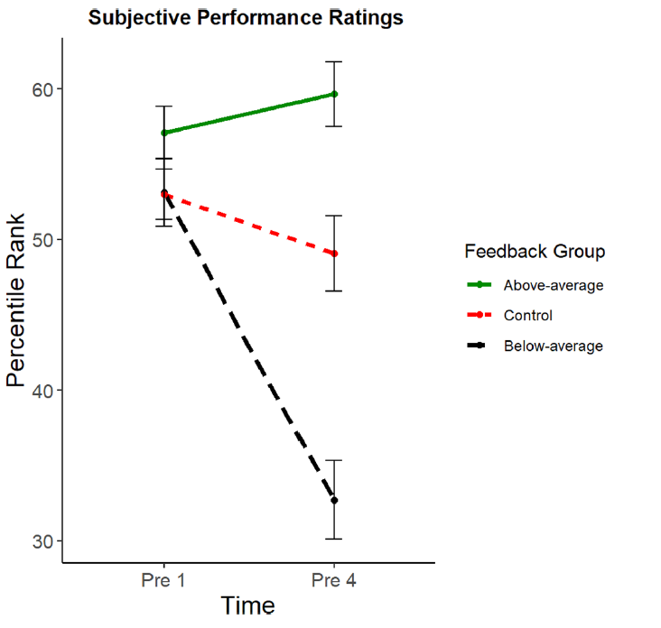
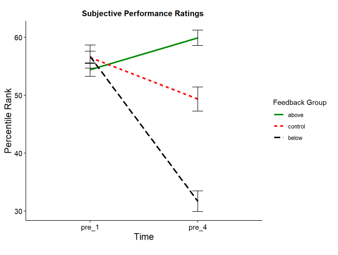
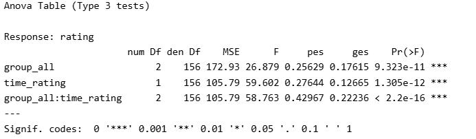
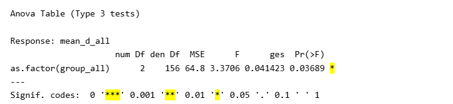
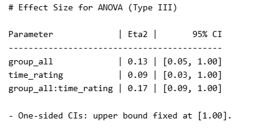
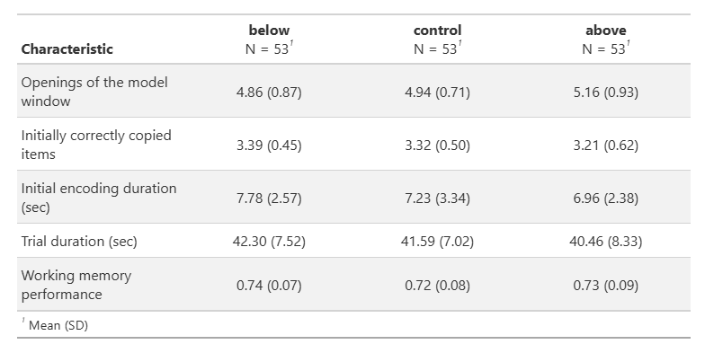
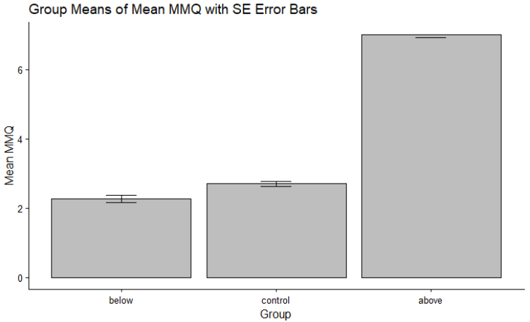

**Abgabe bis 14.06.2026 - 23:55**

**Abgabe als ZIP-File: vorname_nachname_abschlussarbeit.zip**

Für die Abschlussarbeit erhaltet ihr simulierte Daten. Diese werden den Daten des Originalpapers in den meisten Aspekten sehr ähnlich sein. Allerdings müssen einige Teile der Daten zusätzlich bereinigt werden, bevor sie ausgewertet werden können. Die folgende Checkliste soll euch dabei helfen, an alle relevanten Aspekte der Datenbereinigung zu denken.

Die Datensatzaufbereitung erfolgt im *processing*-Skript. Der final aufbereitete Datensatz (*dat_full*) sowie der Long-Datensatz (*dat_long*) werden im Ordner *data/processed* gespeichert.

## **Aspekte, die bei der Bereinigung (`processing`) beachtet werden sollten**

-   Haben alle Versuchspersonen (VPN) die gleiche Anzahl an Beobachtungen?

```         
-   Gibt es VPN mit fehlenden Werten, die ausgeschlossen werden müssen?

-   Gibt es VPN doppelt im Datensatz?
```

-   Gibt es unmögliche Werte in den Daten, z. B. *-999*? Wie können diese Daten ersetzt und z.B. aus anderen Variablen berechnet werden?

-   Gibt es reverse-kodierte Fragebogenvariablen (*var_name_r*)?

-   Gibt es Variablen, die nicht den korrekten Datentyp haben, z. B. numerische Variablen, die als Character angezeigt werden? Schaut euch diese Variablen genau an!\
    (Beispiel: *drei* = 3, *stimme voll und ganz zu* = höchster Wert der Likert-Skala)

## **Weitere vorbereitende Schritte im processed-Datensatz**

-   Mergen der 7 Einzeldatensätze

-   Droppen von redundanten Variablen

-   Umbenennen von Variablen, die nicht im *snake_case*-Format sind

-   Berechnung der *mmq_mean* Variable

-   Erstellung des Long-Datensatzes

-   Speichern der Daten (Wide & Long)!

------------------------------------------------------------------------

## Im Analyseskript (`analysis`) werden

-   Nötige Vorbereitungen gemacht, die nicht zum processing gehören (z.B. Faktoren setzen)

-   Die Analysen aus dem Datenanlyseplan durchgeführt!

    -   Deskriptive Statistik (M & SD) berechnen so wie in Table 1 (siehe Grinschgl et al., 2021)

    -   2x3 mixed ANOVA für subj. Leistungseinschätzungen mit post-hoc t-Tests, inkl.Effektstärken (η2 und Cohen’s d)

    -   One-Way ANOVA für jede Offloading Variable (3x), inkl. Effektstärke (η2)

    -   One-Way ANOVA für Trial Duration in Pattern Copy Task, inkl. Effektstärke (η2)

    -   One-Way ANOVA für MMQ mit post-hoc t-Tests, inkl. Effektstärken (η2 und Cohen’sd)

    -   One-Way ANOVA für Arbeitsgedächtnisleistung im Feature Switch Detection Task,inkl. Effektstärke (η2)

    -   1 Tabelle oder 1 Abbildung nach Wahl erstellen

    -   Optional: Testen der Voraussetzungen bei jeder Analyse – wenn diese gemacht wird, soll es auch im Datenanalyseplan beschrieben werden und die Analysen bei Voraussetzungsverletzungen entsprechend angepasst werden.

**Post-hoc-t-Tests werden nur für die 2x3-ANOVA und die MMQ-ANOVA erwartet. Sollte eine weitere ANOVA zufällig signifikante Werte aufweisen, werden hierfür keine Post-hoc-t-Tests verlangt.**

------------------------------------------------------------------------

## **Dinge, die im Datenanalyseplan angepasst werden müssen:**

-   Data Collection Procedures

-   Missing Data

-   Unit of Analyses/Data Exclusion

## **Dinge, die im Codebook angepasst werden müssen:**

-   Coding of item → reverse-kodierte Items

-   Coding of Missing Data (falls vorhanden)

-   1stes Blatt: Data Collection Procedures → *Simulierte Daten.*

------------------------------------------------------------------------

## **Ordnerstruktur für die Abgabe**

Die (für unser Seminar leicht abgeänderte) Psych-DS-Struktur wird eingehalten. Das bedeutet:

-   Daten im Ordner `data`.

```         
-   Rohdaten in `data/raw` (werden nicht verändert).

-   Aufbereitete Daten (`dat_full`) in `data/processed`
```

-   Analyseskripte (processing und analysis) im Ordner `code`

-   Gerenderte Analyseskripte (html) ebenfalls im Ordner `code`

-   Datenanalyseplan im Ordner `preregistration`

-   Codebook im Ordner `data`

------------------------------------------------------------------------

## **Self-Check: Wie sehen plausible Ergebnisse aus?**

Die grundsätzliche Struktur der Daten sollte sehr ähnlich zu den Originaldaten sein.

-   Beispiel aus einem simulierten Datensatz vs Originaldaten

Die Ergebnisse bewegen sich alle in einem ähnlichen Rahmen wie die Daten aus der Originalstudie.

**Originale Ergebnisse**

{fig-align="center"}

**Simulierter Datensatz**

{fig-align="center"}

Dementsprechend werden auch die Effekte der Analysen ähnlich ausfallen:

{fig-align="center"}

## **Zu erwartende Abweichungen der Ergebnisse von der Originalstudie:**

-   Zufällig signifikante Effekte, die in der Originalstudie nicht signifikant waren, sind möglich. In der Originalstudie zeigte diese Variable keinen signifikanten Effekt. Post-hoc-t-Tests werden hierfür jedoch nicht erwartet.



-   Einzelne Werte werden sich unterscheiden! Deskriptiva, Effektgrössen usw. werden sich unterscheiden! Eta2 sind hier grösser als in der Originalstudie.

{fig-align="center"}

-   Deskriptiva: Unterschiede in den Means und SDs!

{fig-align="center"}

**Unplausible Resultate**

Ergebnisse die ein komplett anderes Gesamtbild hinterlassen sind nicht zu erwarten!

{fig-align="center"}
